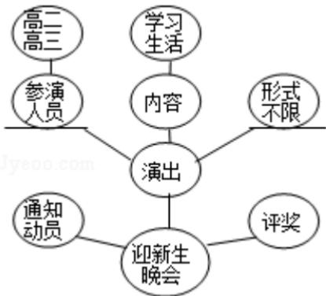

# 2016年全国统一高考语文试卷（新课标Ⅲ）

参考答案与试题解析

## 一、现代文阅读（9分，每小题9分）

1. （9分）阅读下面的文字，完成1～3题。

文学中有历史。当今历史学家大都认为，没有什么文献资料不是史料，不但文学作品，即如佛经、道藏、信札、家谱、账本、碑铭等也无一不是，而且随着史学研究领域的拓展，史料范围还在不断扩大。从“三言二拍”里可以看到晚明市井生活的真实面貌，这对于研究社会史的人几乎是一个常识。陈寅恪以诗证史，也为大家所熟悉。但在“五四”以前，史料范围并非如此宽泛，文学作品在大多数史学家眼里也并非史料，有些文献到底属于文学还是史学，一两千年来都没有一致的看法。神话传说就是如此，其中相当突出的例子是《山海经》。

神话传说是文学，史前时代，无文字可征，只有传说，暂当历史。三皇五帝至今未曾坐实，但“炎皇子孙”已经成为口头语，甚至成为历史共识。新的传说还会不断产生，能否成史颇为可疑，但以神话传说研究历史，却是一种重要的方法。在历史上，《山海经》究竟应归于文学还是史学，曾是死结。王国维《古史新证》说“而疑古之过，乃并尧、舜、禹之人物而变疑之，其于怀疑之态度及批评之精神不无可取，然惜于在于史材料未尝为充分之处理也。”这些古史材料就包括《山海经》《穆天子传》等文献。在《汉书·艺文志》里，《山海经》列于数术类。此后该书在目录学里的角色转换过几次，《隋书·经籍志》将《山海经》列于史部地理类，也就是将它看成史书了。

历史是讲真实的，《山海经》一般被视为荒诞不经，连司马迁写《史记》都不敢采用。虽然《山海经》里平实的山川地理内容应归于史部，但其中大量的神话故事却显然有悖信史，所以清人编《四库全书》，言其“侈谈神怪，百无一真，是直小说之祖耳”，将其改列于子部小说家类。这个死结直到“五四”以后才大致解开。解开的途径有二：一是将《山海经》分而治之，不把它看作一部成于一人一时之书，神话归神话，历史归历史；二是神话中也有历史的成分在，仍可以之证史或补史。分而治之者，以为《山海经》中的《五藏山经》是比较雅正的部分，谭其骧就写了《<五藏山经>的地域范围》一文，分析《山经》写作时的地理知识水平。将历史成分发掘出来的，自然以王国维用《山海经》来印证甲骨文中殷商先王亥为最明显的例子。

上面说的是介于文学与史学之间的文献，至于纯粹的文艺作品，当然也能从中发掘史料。但发掘史料是一回事，把整个作品当成真史就很可虑了。《红楼梦》反映了清代前期的历史现实没有错，可是如果过分坐实到具体历史人物身上，就未免失之穿凿了。戏说之类当然是文学，但读者观众往往误以为是历史。如中俄签订《尼布楚条约》，张诚、徐日昇当时担任与俄国谈判的翻译，工作是以拉丁语作为中介的，而电视剧《康熙王朝》中他们说的却是俄语，观众看到这个情节时被误导也就难以避免了。

(摘编自周振鹤《历史中的文学与文学中的历史》)

（1）下列关于原文内容的表述，不正确的一项是\_C

A． 在当今历史学界，历史学家的研究领域不断地扩展，各种体裁的文学作品都有可能成为他们研究历史的资料  
B． 古代的史学家选取史料的范围比较狭窄，他们并未广泛采用“以诗证史”或将小说用于社会历史研究之类的方法 Y  
C. 王国维在《古今新证》中认为，有些历史学家如果能充分利用史料，就不会“疑古”，怀疑尧、舜、禹等人物的真实性  
D．历史学者对《山海经》有不同认知，《隋书·经籍志》把它列入史部，视为史书，王国维则把它作为古史材料看待

（2）下列理解和分析，不符合原文意思的一项是\_D

A． 很多人认为《山海经》的记载荒唐夸张，与真实的历史差别较大，司马迁也持这种观点，因此《史记》并不采用《山海经》

B．《四库全书》的编者认为，《山海经》所记的神话传说并无真实可言，不宜归入史部，而应列入子部小说家类

C.谭其骧和王国维利用《山海经》研究历史的方法不同，前者是将神话和历史分而治之，后者则从神话中发掘史料

D． 电视剧《康熙王朝》对历史事件和历史人物进行了虚构，其中部分情节与历史事实有出入，不能从这类作品中发掘史料

（3）根据原文内容，下列说法不正确的一项是B  
A. 即使在科学技术如此发达的今天，也会产生新的传说，这些传说将来会不会成为研究这个时代的史料也未可知  
B．“五四”之前，很多涉及历史的神话传说之所以没有成为广泛使用的史料，是因为这些作品在史学和文学归类问题上存在争议  
C. 在历史研究中，当代学者会把文学作品作为史料看待，在他们看来，《三国演义》和《水浒传》的艺术手法差异并不重要  
D. 文学作品能否成为史料，取决于历史学家的眼光，而历史学家对文学与史学关系的认识在一定程度上受制于当时的学术背景。

【考点】49：论述类文本阅读.

【分析】（1）信息判断题。

（2）筛选信息题。

（3）信息判断题。

此三道题都为信息判断题，这就要求考生对原文内容有很深的理解，能够根据原文的信息判断选项的正误。

【解答】（1）C项。根据第二段可进行判断，“而疑古之过，乃并尧、舜、禹之人物而变疑之，其于怀疑之态度及批评之精神不无可取，然惜于在于史材料未尝为充分之处理也。”是对怀疑的态度表示肯定，但同时也表达“需要把发现的史料与古籍记载结合起来以考证古史”的观点。

（2）D项。根据最后一段的文意“上面说的是介于文学与史学之间的文献，至于纯粹的文艺作品，当然也能从中发掘史料。但发掘史料是一回事，把整个作品当成真史就很可虑了。”可知，能从这类作品中发掘史料，但不能把整部作品都当成真史。故D项错误。

（3）B项。“五四”之前，很多涉及历史的神话传说之所以没有成为广泛使用的史料，并不是“因为这些作品在史学和文学归类问题上存在争议”，而是文学一般都不被当作史料看待。

答案：

点评】论述类文章的阅读需要注意作者对论据的利用，以及认真揣摩文章写作结构上，以此更便于读者提取文章的中心思想。

## 2.（19分）文言文阅读

阅读下列文言文，完成问题。

傅珪，字邦瑞，清苑人。成化二十三年进士。改庶吉士。弘治中，授编修，寻兼司经局校书。与修《大明会典》成，迁左中允。武宗立，以东宫恩，进左谕德，充讲官，纂修《孝宗实录》．时词臣不附刘瑾，瑾恶之。谓《会典》成于刘健等多所糜费镌与修者官降珪修撰俄以《实录》成进左中允再迁翰林学士历吏部左右侍郎。正德六年，代费宏为礼部尚书。礼部事视他部为简，自珪数有执争，章奏遂多。帝好佛，自称“大庆法王”。番僧乞田百顷为法王下院，中旨下部，称大庆法王与圣旨并。珪佯不知，执奏：“孰为大庆法王？敢与至尊并书，大不敬。“诏勿问，田亦竟止。珪居闲类木讷者。及当大事，毅然执持，人不能夺，卒以此忤权幸去。教坊司臧贤请易牙牌，制如朝士，又请改铸方印。珪格不行。贤日夜腾谤于诸阉间，冀去珪。流寇扰河南，太监陆訚谋督师，下廷议，莫敢先发。珪厉声曰：“师老民疲，贼日炽，以冒功者多，偾事者漏罚，失将士心。先所遣已无功，可复遣耶？今贼横行郊圻肘腋间，民嚣然思乱，祸旦夕及宗社。吾侪死不偿责，诸公安得首鼠两端。”由是议罢。疏上，竟遣訚，而中官皆憾珪。御史张羽奏云南灾。珪因极言四方灾变可畏。八年五月，复奏四月灾，因言：“春秋二百四十二年，灾变六十九事。今自去秋来，地震天鸣，雹降星殒，龙虎出见，地裂山崩，凡四十有二，而水旱不与焉，灾未有若是甚者。“极陈时弊十事，语多斥权幸，权幸益深嫉之。会户部尚书孙交亦以守正见忤，遂矫旨令二人致仕。两京言官交章请留，不听。珪归三年，御史卢雍称珪在位有古大臣风，家无储蓄，日给为累，乞颁月廪、岁隶，以示优礼。又谓珪刚直忠谠，当起用。吏部请如雍言，不报。

而珪适卒，年五十七。遣命毋请恤典。抚、按以为言，诏廕其子中书舍人。  
嘉靖元年录先朝守正大臣，追赠太子少保，谥文毅。

(节选自《明史·傅珪传》)

（1）下列对文中画波浪线部分的断句，正确的一项是B  
A．谓《会典》成于刘健等/多所糜费/镌与修者/官降珪修撰/俄以《实录》成/进左中允/再迁翰林学士/历吏部左/右侍郎/  
B.谓《会典》成于刘健等/多所糜费/镌与修者官/降珪修撰/俄以《实录》成/进左中允/再迁翰林学士/历吏部左/右侍郎/  
C.谓《会典》成于刘健等/多所糜费/镌与修者官/降珪修撰/俄以《实录》成进左中允再迁翰林学士/历吏部左/右侍郎/  
D． 谓《会典》成于刘健等/多所糜费/镌与修者/官降珪修撰/俄以《实录》成进/左中允再迁翰林学士/历吏部左/右侍郎/（2）下列对文中加点词语的相关内容的解说，不正确的一项是 A  
A． 礼部为六部之一，掌管礼仪、祭祀、土地、户籍等职事，部长官称为礼部尚书。 O  
B． 教坊司是管理宫廷音乐的官署，专管雅乐以外的音乐、歌舞的教习等演出事务。  
C. 致仕本义是将享受的禄位交还给君王，表示官员辞去官职或到规定年龄而离职。  
D． 历史上的“两京”有多种所指，文中则指明代永乐年间迁都以后的南北两处京城。  
（3）下列对原文有关内容的概括和分析，不正确的一顶是C  
A．傅珪进入仕途，参与纂修文献。弘治年间，他兼任司经局校书，参与编修《大明会典》得以升职；武宗继位，他进位左谕德，充讲官，修撰《孝宗实录》。  
B．傅珪任职礼部。劝谏讲究策略。他担任礼部尚书时，由于屡有争端，上奏增多；番僧因帝好佛求地百顷，他佯作不知皇上自称大庆法王，不理会给地的事。  
C. 傅珪守正不阿，反遭诬蔑报复。每遇大事，他都能坚持己见，不肯随意改易，因而触怒许多人；后因得罪权贵被迫退休，虽有言官请留，他仍坚持离职。

D． 傅珪为官清廉，死后受到好评。御史卢雍称赞他在位时有古代大臣风范，归乡后家无积蓄，艰难度日；嘉靖元年，他被列为先朝守正大臣，追谥为文毅。

（4）把文中画横线的句子翻译成现代汉语。

①极陈时弊十事，语多斥权幸，权幸益深嫉之。

②又谓珪刚直忠谠，当起用。吏部请如雍言，不报。

## 【考点】51：文言文阅读.

【分析】任职授官的有：任、授、除、拜、征、辟、荐、举、起、提、拔；提升职务的有：擢、升、拔擢、进、起复、超迁、超擢；调动职务的有：转、移、调、徙、迁（调动官职，一般指升官）、出、陟、补；关于降级免职的有：罢、免、解、黜、夺、放、贬、谪革、褫、左迁.

【解答】（1）珪，中国古代贵族朝聘、祭祀、丧葬时以为礼器．依其大小，以别尊卑．文中意思是降低自己的身份，而不是官位下降，排除A；“俄以《实录》成进左中允再迁翰林学士历吏部左右侍郎”前面“俄以《实录》成”是升官原因，故停顿，“再迁”表示再次升官，故前面应该停顿，排除CD;

（2）礼部长官为礼部尚书．考吉、嘉、军、宾、凶五礼之用；管理全国学校事务及科举考试及藩属和外国之往来事．礼部下设四司，明清皆为：仪制清吏司，掌嘉礼、军礼及管理学务、科举考试事；祠祭清吏司，掌吉礼、凶礼事务；主客清吏司，掌宾礼及接待外宾事务；精膳清吏司，掌筵飨廪饩牲牢事务．不包含选项中的“土地、户籍”；

（3）原文为“会户部尚书孙交亦以守正见忤，遂矫旨令二人致仕，两京言官交章请留，不听．“不听的是“朝廷”，而不是傅珪；

（4）①“权幸”译为“受宠的权贵”，“嫉”译为“痛恨”；

②“忠谠”译为“忠实”，“报”译为“回复”.

答案：

(1)B

(2)A

(3)C

（4）①极力奏陈其时社会弊病十件事，话语多指斥受宠的权贵，权贵愈加痛恨

他．（译出大意给3分，“权幸”“嫉”两处，每译对一处给1分）

②又认为傅珪刚正忠实，敢于直言，应当起用，吏部按照卢雍的话上奏，没有回复（译出大意给3分，“忠谠”“报”两处，每译对一处给1分）

【点评】翻译文言文首先要找出专有名词，即人名、地名、官职等；然后再看有否特殊句式，最后再确定关键字进行翻译，一般为直译．文言文的翻译，最基本的方法就是替换、组词、保留、省略．对古今异义的词语要“替换”；对古今词义大体一致的词语则“组词”；对特殊的地名、人名等要“保留”；对古汉语中的同义反复的词语可以“省略”其中一个，有些虚词不必要或难于恰当翻译出来的也可以“省略”.

## 二、古诗文阅读（36分）

## 3.（11分）古代诗歌阅读

阅读下面的宋诗，完成问题。

## 内宴奉诏作

## 曹翰

三十年前学六韬②，英名常得预时髦③曾因国难披金甲，不为家贫卖宝刀。臂健尚嫌弓力软，眼明犹识阵云高④.庭前昨夜秋风起，羞见盘花旧战袍。

【注】①曹翰（923～992），宋初名将，②六韬：古代兵书。③时髦：指当代俊杰。④阵云：战争中的云气，这里有站阵之意。

（1）诗的颈联又作“臂弱尚嫌弓力软，眼昏犹识阵云高”，你认为哪一种比较好？为什么？请简要分析。

（2）这首诗与辛弃疾的《破阵子（醉里挑灯看剑)》题材相似，但情感基调却有所不同，请指出二者的不同之处。

【考点】52：古诗词阅读.

【分析】（1）此意考查了炼字.

（2）此题考查了比较鉴赏诗歌的思想内容.

【解答】（1）炼字答题模式：（1）肯定“好”或肯定哪一个更好；（2）解释该字在句中的语表义和语里义；（3）展开联想和想像，把这个你认为“好”的字还原句中描摹景象；（4）点出该字表达了什么感情或烘托了怎样的意境．此题两联诗有两个词语不同，不论认可那一联都可以，分析时要联系全篇思想内容加以分析，言之成理即可.

（2）分析情感基调其实就是分析思想情感，辛弃疾的《破阵子（醉里挑灯看剑)》书本学过，应该不难．《内宴奉诏作》的思想内容结合“臂健尚嫌弓力软，眼明犹识阵云高”和“羞见盘花旧战袍”加以分析得出.

答案：

（1）观点一：作“弱”“昏”好

①“臂弱”“眼昏”表明作者承认自己已年老体衰的客观现实，但强调即便如此，也还是能够冲锋陷阵；

②更强烈地表现出作者只要一息尚存，就不忘杀敌报国的刚毅精神.

## 观点二：作“健”“明”好

①“臂健”“眼明”表明作者认为虽然岁月流逝，但身体依然强健，当然还可以冲锋陷阵，为国驱驰；

②表现作者心存随时准备杀敌报国的坚定信念，而忘记自己老之将至.

(2）①曹诗写自己虽已年老，但报国之心犹存，重在表达“老骥伏枥，志在千里”的豪情；

②辛词通过追怀金戈铁马的往事，表达英雄白首，功业未成的悲慨

点评】一首诗的思想内容和作者的观点态度是建立在语言、形象、表达技巧等外在形式上的，因此，把握诗歌的思想内容和作者的观点态度也要注意从一首诗的整体上去考虑，不能忽略语言、形象、表达技巧等诗歌的外在形式而去架空分析．因为只有了解了诗的形式美的内涵，才能深入地去探知诗歌的思想内容和作者的观点态度.

## 4. （6分）名句默写

补写出下列句子中的空缺部分。

（1）《左传·曹刿论战》中记载，鲁庄公十年，齐国入侵，曹刿求见国君献策，但他的乡人质疑道：肉食者谋之，又何间焉

（2）严格地说，浔阳并非绝对没有音乐，只是声音单调繁杂，实在难以入耳。白居易《琵琶行》中岂无山歌与村笛，呕哑嘲哳难为听 两句表达了这样的意思。

（3）在《赤壁赋》的开头，苏轼写自己与朋友泛舟赤壁之上，朗诵《诗经·陈风》中的《月出》篇，即文中所谓诵明月之诗，歌窈窕之章。

## 【考点】39：名篇名句默写.

【分析】此为理解类诗文默写．考生需在理解题目要求的基础上，选择原文中合适的语句进行默写.

【解答】①肉食者谋之，又何间焉 (重点字为“焉”)

②岂无山歌与村笛，呕哑嘲哳难为听 (重点词为“呕哑嘲哳”)

③诵明月之诗，歌窈窕之章 (重点字为“窈窕”)

【点评】“岂无山歌与村笛，呕哑嘲哳难为听”意为“难道连个山歌村笛都没有吗？只有声音杂乱刺耳，难以入耳．“这是白居易在感叹自己被贬后的痛苦遭遇，以此表现琵琶女技艺的高超.

## 三、文学类文本阅读（25分）

5.（25分）阅读下面的文字，完成（1）～（4）题。

玻璃

贾平凹

约好在德巴街路南第十个电杆下会面，去了却没看到他。我决意再等一阵，踅进一家小茶馆里一边吃茶一边盯肴电杆。旁边新盖了一家酒店，玻璃装嵌，还未完工，正有人用白粉写“注意玻璃”的字样。

吃过一壶茶后，我回到了家。妻子说王有福来电话了，反复解释他是病了，不能赴约，能否明日上午在德巴街后边的德比街再见，仍是路南第十个电杆下。第二天我赶到德比街，电杆下果然坐着一个老头，额头上包着一块纱布。我说你是王得贵的爹吗，他立即弯下腰，说：我叫王有福。

我把得贵捎的钱交给他，让给娘好好治病。他看四周没人，就解开裤带将钱装进裤衩上的兜里，说：“我请你去喝烧酒！”

我谢绝了。他转身往街的西头走去，又回过头来给我鞠了个躬。我问他家离这儿远吗，他说不远，就在德巴街紧南的胡同里。我说从这里过去不是更近吗，老头笑了一下，说：“我不走德巴街。”

他不去德巴街，我却要去，昨日那家茶馆不错。走过那家酒店，玻璃墙上却贴出了一张布告- -昨天因装修的玻璃上未作标志，致使一过路人误撞受伤。敬请受伤者速来我店接受我们的歉意并领取赔偿费。

我被酒店此举感动，很快想到王有福是不是撞了玻璃受的伤呢，突然萌生了一个念头：既然肯赔偿，那就是他们理屈，何不去法院上告，趁机索赔更大一笔钱呢？我为我的聪明得意，第二天便给王有福打电话，约他下午到红星饭店边吃边谈。

红星饭店也是玻璃装修，我选择这家饭店，是要证实他是不是真的在酒店挂伤的。他见了我，肿胀的脸上泛了笑容，步履却小心翼翼，到了门口还用手摸，证实是门口了，一倾一倾地摇晃着小脑袋走进来。

“我没请你，你倒请我了！”他说。

“一顿饭算什么！”我给他倒了一杯酒，他赶忙说：“我不敢喝的，我有伤。”

“大伯，你是在德巴街酒店撞伤的吗？”

“你....那酒店怎么啦？”

“这么说，你真的在那儿撞的！”

“这……”

老头瓷在那里，似乎要抵赖，但脸色立即赤红，压低了声音说：“是在那儿撞的。”一下子人蔫了许多，可怜得像个做错事的孩子。

“这就好。”我说。

“我不是故意的。”老头急起来。“我那日感冒，头晕晕的，接到你的电话出来，

经过那里，明明看着没有什么，走过去，咚，便撞上了。”

“你撞伤了，怎么就走了？”

“哗啦一声，我才知道是撞上玻璃了。三个姑娘出来扶我，血流了一脸，把她们倒吓坏了，要给我包扎伤口，我爬起来跑了。我赔不起那玻璃呀！”

“他们到处找你哩。”

“是吗？我已经几天没敢去德巴街了，他们是在街口认人吗？”

“他们贴了布告.…..

老头哭丧下脸来，在腰里掏钱，问我一块玻璃多少钱。

我嘿嘿笑起来。

“不是你给他们赔，是他们要给你赔！”

“赔我？”

“是赔你。“我说，“但你不要接受他们的赔偿，他们能赔多少钱？上法院告他们，索赔的就不是几百元几千元了！”

老头愣在那里，一条线的眼里极力努出那黑珠来盯我，说：“你大伯是有私心，害怕赔偿才溜掉的，可我也经了一辈子世事，再也不受骗了！”

“没骗你，你去看布告嘛！”

“你不骗我，那酒店也骗我哩，我一去那不是投案自首了吗？”

“大伯，你听我说..."

老头从怀里构出一卷软沓沓的钱来，放在桌上：“你要肯认我是大伯，那我求你把这些钱交给人家。不够的话，让得贵补齐。我不是有意的，真是看着什么也没有的，谁知道就有玻璃。你能答应我，这事不要再给外人说，你答应吗？”1

老头眼泪花花的，给我又鞠了下躬，扭身离开了饭桌。

我怎么叫他，他也不回头。

他走到玻璃墙边，看着玻璃上有个门，伸手摸了摸，没有玻璃，走了出去。我坐在那里喝完了一壶酒，一口莱也没吃，从饭馆出来往德巴街去。趁无人理会，我揭下了那张布告：布告继续贴着，只能使他活得不安生。顺街往东走，照相馆的櫥窗下又是一堆碎玻璃，经理在大声骂：谁撞的，眼睛瞎了吗？！

我走出了狭窄的德巴街。

(有删改)

（1）下列对小说相关内容和艺术特色的分析鉴赏，最恰当的两项是 CE

A. “约好在德巴街路南第十个电杆下会面”，是对地下斗争题材影视作品的模仿，为后文悬念丛生的情节作出铺垫。

B． 发现王有福正是受伤的路人后，“我”劝他到法院上告酒店，寻求更多赔偿，因为“我”不仅热心帮助朋友，也有打官司的经验。

C. 王有福不情愿承认自己误撞酒店玻璃受伤，主要是因为妻子有病，家庭生活很困难，害怕酒店追究责任，让他赔偿损失。

D.“我”经过照相馆时，见经理面对碎玻璃大骂，这一细节暗示此地这类纠纷不少，王有福担心的“投案自首”之事是经常发生的。

E．玻璃墙伤人事件的背后，交织着伦理观念、法治观念、诚信意识等不同理念的矛盾、困惑与冲突，是转型期中国社会的一面镜子。

（2）“我”在小说中的主要作用是什么？请简要分析。

（3）小说中的王有福有哪些性格特点？请简要分析。

（4）是否状告酒店，“我”与王有福的态度不同。你更认同谁的态度？请结合全

## 【考点】41：小说阅读.

【分析】高考中小说的命题指向四个关键词：环境、情节、人物、主题，具体来说可以分为以下几方面：把握故事情节；揣摩人物形象；注意环境描写；概括主题内容；品味语言特色；分析写作技巧；针对考点要求，不同的题目要采用不同的方法解决。

【解答】（1）A项“为后文悬念丛生的情节作出铺垫”错误，不能对后面的情节起到铺垫作用；B项“也有打官司的经验。”无中生有，文中未提及；D项“这一细节暗示此地这类纠纷不少，王有福担心的“投案自首”之事是经常发生的。”错，这个情节意在和前面酒店行为形成鲜明对比。

（2）小说中“我”的作用通常有便于抒发情感，进行心理描写；能使读者产生一种真实、亲切的感觉，能切身体会作者情感；从作者方面来说，它更便于直接表达作者自己的思想感情。答题时还要具体一下，带入文章。加上“让我们真实亲切地体会到了作者 - - - - - - 的感情”之类的。

（3）此题考查了鉴赏小说中的人物形象。分析形象要抓住人物的言行举止。这

篇小说王有福的性格主要通过人物语言表现出来的。

（4）此题考查了学生对作品所表现的价值判断和审美取向的评价，属于探究题，两种观点都可以采用，关键是要结合文本和社会现实言之成理。

## 答案：

（1）答E给3分，答C给2分，答D给1分，答A.B不给分。回答三项或三项以上，不给分。

(2)

①讲述故事：小说故事是由“我”讲述出来的，真实可信；

②推进情节：“我”是事件的参与者，由于“我”的提议，情节得以发展变化

③衬托人物：小说主人公王有福的性格，由于“我”的存在而更加鲜明。（每答出一点得2分。意思答对即可。)

## (3)

①性情谦卑，甚至有点窝囊；见了晚辈，也要鞠躬，说话谦和；

②胆小怕事，有点狡黠；撞了玻璃偷偷溜掉，别人问起也不敢承认；

③有点固执，但不失本性善良；怀疑酒店诚意，承认自己责任，不愿借机发财。1

（4）观点一：认同王有福的态度：

①王有福受伤与酒店管理有关，但他是有行为能力的成年人，应负一定责任；

②王有福害怕赔偿溜走，逃避责任在先，索赔理由不够正当充分；

③王有福害怕受骗而拒绝索赔，在当时情况下，未尝不是理性的选择。

观点二：认同“我”的态度：

①酒店失误导致王有福受伤，要求赔偿正当合理；

②王有福放弃索赔是担心上当受骗，说明他缺乏法律常识，更应进行法律启蒙；

③王有福式的宽容是对不良行为的纵容，有害无益。

（答出一点给2分，答出两点给5分，答出三点给8分。意思答对即可。若有其他答案，可根据观点明确、理由充分、论述合理的程度，酌情给分。)

【点评】鉴赏人物形象的几个切入点：

①从人物描写切入。人物的性格特点往往从肖像、神态，典型的动作、行为，个性化的语言，细致入微的心理活动中折射出来，因此，通过分析作者对人物的各种描写，能够发掘人物的性格特征，进而发掘各色人物善恶美丑的精神世界。

②从分析故事情节切入。情节是人物性格形成的历史。要学会在故事情节和矛盾冲突中把握住人物在诸多矛盾冲突中的动作、内心动机，从而更好地理解人物性格。

③从分析环境角度切入。小说的环境描写，分自然环境与社会环境两个方面。自然环境对人物的命运有时也有影响，但真正决定人物命运的往往主要是社会环境。环境是小说存在的背景，为小说提供空间和时间范围，也是小说中人物活描写动的场所。分析环境时，必须注意社会环境中的复合的因素，应透过当事人的言行深入挖掘社会历史内涵。注意人物与环境的辩证关系，善于从人物在社会环境中的走向，解读人物的思想性格。

## 四、实用类文本阅读

6.

## 一代通儒顾炎武

顾炎武从科举制度桎梏中挣脱出来后，便一改旧习，自警“能人不为文人，能讲不为讲师”力倡“君子之为学，以明道也，以救世也”，为了一抒山河壮怀、广交天下贤哲，也为了摆脱纠缠。躲避豪绅叶方恒的陷害，他以游为隐，将家事稍作安排，便只身出游。最初往来于山东、北京、江苏、浙江之间，自康熙元年起，其游踪扩至河北、河南、山西、陕西。以友人所赠二马二骡载书自随，南北往返，风尘仆仆，行万里路，读万卷书，把自己的后半生献给了著述事业。顾炎武每到一处，必考察当地风土人情、山川地理，如与平日所闻不符，便打开书卷验证。旅途中则在鞍上默诵诸经注疏，偶有遗忘，就翻书温习。据他在《书（为顾宁人征天下书籍启）后》回忆，自己曾临泰山，谒十三陵，登恒山，抵太原，“往来曲折二三万里，所览书又得万余卷”。他把所搜集到的地理文献资料一分为二，将有关水利、贡赋、经济、军事部分，编为《天下郡国利病书》，有关地理沿革、建制、山川、名胜部分，则编为《肇城志》。

《日知录》是顾炎武的一部读书札记，最能代表他的严谨笃实与学术创新，也反映了他一贯不愿“速于成书，躁于求名”的治学品格。全书共三十二卷，以“明学术，正人心，拨乱世，以兴太平之事”为宗旨，体现了他的学术、政治思想。康熙九年初刻八卷本刊行后，他又不断增改，至康熙十五年，已得手稿二十余卷。顾炎武在该书的题记中说，他从小读书，“每有所得，辄记之。其有不合，时复改定”。一旦发现前人著述中已有类似论说，一律删去。积三十余年，编成此书。取《论语》子夏之言，命名为《日知录》，供后人研讨。顾炎武把《论语》中的“博学于文”“行己有耻”作为自己的治学宗旨和处世之道，虚怀若谷，严于律己，注重友情。在他看来，为学不日进则日退，独学无友则孤陋难成。交友是益学进道的重要途径，古人学有所得，未尝不求同志之人，所以，寻友交友构成他为学生涯的重要组成部分。在为学交友过程中，他始终推友之长，虚心己待人，以友为师，其高尚品格足为后世楷模。他晚年所撰《广师》，从学术视野、学术贡献、博闻强记、文风雅正、治学态度等方面，对同时代的十位“同学之士”加以称许。其弟子潘未在《日知录》序中，盛赞其师足迹半天下，所至交其天下贤豪长者。天下无贤不肖，皆知先生为通儒。

顾炎武一生，始终关注“国家治乱之源，生民根本之计”，早年奔走国事，中年谋求匡复，即使暮年独居北方，依旧念念不忘“东土饥荒”“江南水旱”，直到逝世前，病魔缠身，他仍然以“救民水火”为己任。他主张，天生豪杰必有所任，“拯斯人于涂炭，为万世开太平”，正是自己的责任。顾炎武对国家民族前途命运的关注，有其特定的原因，今天看来固然有一定的局限性，但是对于一个旧时代的思想家和学者来说，却是难能可贵的。面对明清交替的现实，顾炎武从历史反思中得出结论：“保天下者，匹夫之贱与有责焉。“后世学者将他的这一思想归纳为“天下兴亡，匹夫有责”，成为我们中华民族爱国主义传统的一个重要组成部分，是颇有道理的。

（摘编自陈祖武《顾炎武评传》

## 【相关链接】

①顾炎武（1613-1682），明清之际思想家、学者。初名绛，字宁人，学者称亭林先生。江苏昆山人。......遍游华北，所至访问风俗，搜集材料，学问广博，于国家典制、郡邑掌故、天文仪象、河槽、兵农以及经史百家、音韵训诂之学，都有研究。晚年治经侧重考证，开清代朴学风气。反对空谈“心、理、性、命”，提倡“经世致用”的实际学问。著作有《日知录》《天下郡国利病书》《肇域志》《音学五书》《顾亭林诗文集》等。

（摘自《辞海》第六版）

②我生平最敬慕亭林先生为人...深信他不但是经师，而且是人师。

(梁启超《中国近三百年学术史》)

（1）下列对材料有关内容的分析和概括，最恰当的两项是BD

A．顾炎武之所以不顾家庭，离家出游，固然有躲避豪绅陷害、以游为隐的因素，但更重要的还是为了实现他一抒山河壮怀、广交天下贤哲的理想。

B. 顾炎武以二马二骡载书自随，沿途考察人文地理，验证文献记载，搜集著述材料，把行万里路与读万卷书结合在一起，大大开阔了他的学术视野。

C.顾炎武南北往返，在二三万里的旅途中，览书万余卷，写成《日知录》《天下郡国利病书》《肇域志》《音学五书》等著作，终成一代大家。

D． 顾炎武足迹半天下，广交贤豪长者，又在《广师》中对十位“同学之士”推崇备至。他的弟子潘耒称赞他，天下无贤不肖，无不知道顾炎武为通儒。

E． 顾炎武一生奔走，始终以豪杰自视，虽没有完全实现他“救民水火”“兴太平之事”的雄心壮志，但唯其如此，才成就了他的著述事业。

（2）从《日知录》的成书过程来看，顾炎武治学有什么特点？请结合材料简要的概括。

（3）梁启超生平最敬慕顾炎武的为人，认为他不但是经学大师，而且是世人楷模。这是为什么？请结合材料简要分析。

（4）后人将顾炎武“保天下者，匹夫之贱与有责焉”归纳为“天下兴亡，匹夫有责”。请结合材料及相关知识，谈谈你对这一观点的看法。

【考点】43：传记阅读.

【分析】（1）材料内容分析概括题.

（2）要点概括题.

（3）内容分析理解题.

（4）语言综合运用题.

【解答】（1）

答B给3分，答D给2分，答A给1分，答C、E不给分.

(2)

①坚持独立思考，注重学术创新，从不蹈袭前人；

②积少成多，不断增改，务本求真；

③严谨笃实，勤勉治学，持论公允，留待后人检验．（每答出一点给2分，意思对即可）

(3)

①推重“博学于文”“行己有耻”的古训，谦虚谨慎，严于律己；

②经世致用，学问广博开一代学术风气；

③善于推人之长，以友为师，虚怀若谷，博采众长．（每答出一点给2分，意思对即可） 1人

(4)

①顾炎武具有强烈的家国情怀和忧国忧民意识；

②在顾炎武看来，普通人的命运与国家的命运是紧密联系在一起的；

③“天下兴亡，匹夫有责”是对我国爱国主义传统的自然引申与合理发展；

④这一观点具有积极意义，教育后人要勇于担当，爱国奉献．（每答出一点给2分，意思对即可，如有其它答案，可根据观点明确、理由充分、论述合理的程度酌情给分)

【点评】筛选并整合文中信息类题目的解题方法有这样几点：①根据要求确定提取信息的目标．②通读全文，整体感知．在确定了提取信息的目标之后，要根据目标浏览全文，确定提取信息的区间．③准确寻找，筛选提取.

## 五、语言文字运用（20分）

7.（3分）下列各句中加点成语的使用，全都正确的一项是（）

①这块神奇的土地上，既有浩如烟海的传统文化典籍，也有丰富多彩的民俗文化

和各种流派的现代艺术，这些都深深吸引着前来参现的外国友人。

②今年的元宵晚会上，著名豫剧演员小香玉将《谁说女子不如男》唱得字正腔圆、声情并茂，令观众刮目相看、赞叹不已。

③最近出版的长篇小说《雪莲花开》通过对藏族姑娘卓玛的人生历程的叔述，表现了她鲜明的民族性格和一言九鼎的为人准则。

④经过周密的调查，公安人员终于掌握了在逃人员的行踪，然后兵分三路，按图索骥，一举将他们全都缉拿归案。

⑤这几幅书法作品笔走龙蛇、流畅飘逸，在本次春季拍卖会甫一亮相，就引起了国内外藏家的极大兴趣。

⑥天寒地冻、滴水成冰的季节终于过去，春天在大家的盼望中姗姗而来，到处都涣然冰释，生机勃勃。A.①②④B.①④⑤ C. ②③⑥ D. ③⑤⑥

## 【考点】18：成语.

【分析】成语主要有语意内涵不明、褒贬误用、对象错配、似是而非四种误用方式，成语只能分类记忆，没有什么捷径，如果不知道意思一切方法都失灵，所以要注意平时的积累. ノ小

【解答】浩如烟海，形容典籍、图书等极为丰富。使用正确；

刮目相看，指别人已有进步，不能再用老眼光去看他。不合语境，不存在新老眼光的改变；  
一言九鼎，一句话抵得上九鼎重。比喻说话力量大，能起很大作用。不能用来形容人信守诺言；  
按图索骥，按照画像去寻求好马。比喻墨守成规办事；也比喻按照线索去寻求。使用正确；

笔走龙蛇，形容书法生动而有气势。使用正确；

涣然冰释，形容疑虑、误会、隔阂等完全消除。望文生义，不能理解成冰冻解除故选：B。

【点评】正确理解和使用成语的方法：

1、理解关键词的含义，不可望文生义

2、在理解原意的基础上，把握比喻义  
3、辨清容易混淆的成语  
①形相近而义不同的  
②意义相近而有细微差别的  
③褒贬色彩不同的

4、符合语法规范或逻辑关系.

8.（3分）下列各句中，没有语病的一句是（）A.随着技术的进步和经验的积累，再加上政策的扶持，使得我国自主品牌汽  
车进入快速发展时期，各种创新产品层出不穷。B． 如果有一天科技发展到人们乘宇宙飞船就像今天乘飞机一样方便的时候，  
银河就不再遥远，宇宙也就不再那么神秘了。C. 首届跨境电商论坛近日在北京举行，来自各知名电商的数十名代表齐聚一  
堂，分析了电商企业面临的机遇和挑战。D. 在第40个国际博物馆日到来之际，本市历时三年开展的第一次全国可移  
动文物普查工作，昨日交出了首份答卷。

## 【考点】27：病句辨析修改.

【分析】本题考查病句的辨析与修改能力，要结合常见病句类型来分析语句。常见的病句类型有语序不当、搭配不当、成分残缺或赘余、结构混乱、表意不明、不合逻辑。如果遇到难以确定的选项，可以按病句类型一一衡量，也可以通过划分句子的结构来发现病因。

【解答】A．成分残缺，缺主语，删去“随着”；

B. “如果有一天科技发展到人们乘宇宙飞船就像今天乘飞机一样方便的时候”语序不当，与“今天乘飞机”相吻合，该改成“有一天乘宇宙飞船”，“今天”与“有一天”位置应该相同；  
C. 正确；  
D．语序不当，多层定语语序混乱，改成“本市第一次开展的历时三年的全国可移动文物普查工作”；

故选：C。

【点评】多层定语排列顺序一般是：①表示领属或时间处所的，②指名称或数量的短语，③动词或动词短语，④形容词或形容词短语，⑤名词或名词短语（带“的”的定语要放在不带“的”的定语之前)。

9.（3分）填入下面文段空白处的词语，最恰当的一组是（）

有的人在填报高考志愿时选报热门专业，理由是能学以致用，①是一种误解。学以致用的真正含义是将学到的知识用于实践，②不是看什么东西有用才决定去学。摒弃功利性③使人抱着乐观的态度去学习；④有用才去学习会使人产生心理负担，⑤总要担心以后会不会真的有用。抱着功利之心去挑选专业，在往会牺牲自己真正的兴趣，⑥毕业后谋到了不错的职位，也不一定就工作得很开心。

<table><tr><td rowspan=1 colspan=1></td><td rowspan=1 colspan=1></td><td rowspan=1 colspan=1>2</td><td rowspan=1 colspan=1>③</td><td rowspan=1 colspan=1>4</td><td rowspan=1 colspan=1>5</td><td rowspan=1 colspan=1>6</td></tr><tr><td rowspan=1 colspan=1>A</td><td rowspan=1 colspan=1>其实这</td><td rowspan=1 colspan=1>而</td><td rowspan=1 colspan=1>要</td><td rowspan=1 colspan=1>确定</td><td rowspan=1 colspan=1>所以</td><td rowspan=1 colspan=1>1</td></tr><tr><td rowspan=1 colspan=1>B</td><td rowspan=1 colspan=1>这其实</td><td rowspan=1 colspan=1>1</td><td rowspan=1 colspan=1>71   能</td><td rowspan=1 colspan=1>认为</td><td rowspan=1 colspan=1>因为</td><td rowspan=1 colspan=1>即使</td></tr><tr><td rowspan=1 colspan=1>C</td><td rowspan=1 colspan=1>实际上</td><td rowspan=1 colspan=1>却</td><td rowspan=1 colspan=1>会</td><td rowspan=1 colspan=1></td><td rowspan=1 colspan=1>可能</td><td rowspan=1 colspan=1>就是</td></tr><tr><td rowspan=1 colspan=1>D</td><td rowspan=1 colspan=1>这</td><td rowspan=1 colspan=1>当然</td><td rowspan=1 colspan=1>就是</td><td rowspan=1 colspan=1>如果</td><td rowspan=1 colspan=1></td><td rowspan=1 colspan=1>虽然</td></tr><tr><td rowspan=1 colspan=7>A. A                   B.B                     C. C                        D</td></tr></table>

【考点】13：字义、词义辨析.

【分析】此题考查了语言的连贯，主要是关联词语的运用.

【解答】根据⑤中的前面结果，后面原因的关系可以排除AC;

根据⑥中的假设关系和“也”可以排除D;

故选：B。

【点评】所谓“连贯”，是指表达的观点、角度、风格一致，读起来自然顺畅．具体来说也就是语言的表达要注意句与句之间的组合与逻辑关系，话题统一，句序合理，前后衔接和呼应自然.

10.（5分）在下面一段文字横线处补写恰当的语句，使整段文字语意完整连贯，

内容贴切，選辑严密。每处不超过10个字。

自第一颗人造地球卫星进入太空以来，除了载人航天飞行器会回收以外，其它上天的人造物体陆续被遗弃在太空中，①。太空垃圾已经威胁到人类的航天活动。比如厄瓜多尔的一颗卫星升空后不到一个月，就与太空中的火箭残骸相撞而报废。这种威胁不仅仅发生在太空，甚至地球上的人类生活也会②\_。因此，③，应是人类接下来要解决的一个重要课题。

【考点】2F：表达简明、连贯、得体.

【分析】补全语句需要把握文段中心，联系上下文内容补写句子.

【解答】解析：前面说到人造卫星进入太空后会在太空中留下什么，后一句提到“太空垃圾”，因此空格中为“产生太空垃圾”的相关内容；第二第三句主要讲到太空垃圾带来的影响，根据关键词“甚至”可知是进一步谈到对“人类生活的影响”，因此，此处相关内容；第三处根据原句可知是一个要解决的问题，前面总的来说是谈到产生太空垃圾以及太空垃圾带来的恶劣影响，因此，此处应该是围绕“如何解决太空垃圾这个问题”来讲的.

答案：①都变成了太空垃圾②受到太空垃圾的影响③如何清理太空垃圾

【点评】需根据上下文语意填写合适的句子，句子之间的逻辑关系非常重要.

11.（6分）如图是某高中举办迎新生晚会的构思框架，请把这个构思写成一段话，要求内容完整，表述准确，语言连贯，不超过80个字。

【考点】81：综合读写.

【分析】此题考查了学生图文转换的能力.

【解答】图片最大的圆是“迎新生晚会”，分出三个部分“动员通知”“演出”“评奖”；然后“演出”又分出三个部分“参演人员”“内容”“形式不限”，抓住这些要点作答即可.

答案示例：

此次迎新生晚会主要包括三个阶段：动员通知、演出和评奖．参与演出人员以高二高三同学为主，节目形式要多样，内容必须紧扣高中学习生活.

点评】对图片进行整合与重述，要在对图片整理的基础上，注意题干和图片的联系，把图片中读到的信息进行整合．做到言简意赅，逻辑严密，最后用学科术语表达出来.

## 六、写作（60分）

12.（60分）阅读下面的材料，根据要求写一篇不少于800字的文章。

经历几年试验，小羽在传统工艺的基础上推陈出新，研发出一种新式花茶并获得专利。可是批量生产不久，大量假冒伪劣商品就充斥市场。小羽意识到，与其眼看着刚兴起的产业这么快就走向衰败，不如带领大家一起先把市场做规范。于是，她将工艺流程公之于众，还牵头拟定了地方标准，由当地有关部门发布推行。这些努力逐渐见效，新式花茶产业规模越来越大，小羽则集中精力率领团队不断创新，最终成为众望所归的致富带头人。

要求：综合材料内容及含义，选好角度，确定立意，明确文体，自拟标题，不要套作，不得抄袭。

## 【考点】91：材料作文.

【分析】考生需认真阅读材料，对材料内容进行分析和概括。由“经历几年试验，小羽在传统工艺的基础上推陈出新，研发出一种新式花茶并获得专利。可是批量生产不久，大量假冒伪劣商品就充斥市场。“这句说到了“假冒伪劣产品的危害”，突显知识产权的重要性；“小羽意识到，与其眼看着刚兴起的产业这么快就走向衰败，不如带领大家一起先把市场做规范。于是，她将工艺流程公之于众，还牵头拟定了地方标准，由当地有关部分发布推行。“这里可以看出市场规范的重要性。“这些努力逐渐见效，新式花茶产业规模越来越大，小羽则集中精力率领团队不断创新，最终成为众望所归的致富带头人。“这里展现了市场规范后的成果，可见，出题人对市场规范也是持肯定态度。

仔细分析完材料后，考生可以提炼观点--用法律保护知识产权，规范市场，抵制假冒伪劣商品。

【解答】此作文题要求考生有较强的思辨能力。主于的内容亮点很多，看似枝繁

叶茂：推出花茶新工艺，获得专利，很快被模仿，市面出现假冒伪劣。

公开工艺流程、制定行业标准。

不断创新，最终规范了市场，成为致富带头人。

题目出来之后，网友纷纷表示此题思辨性很强，“太像申论题目了”，对高中生来说有些难度。不过也有勤奋的同学表示，本题可以从如下角度入手：

突破陈规、敢于创新

遵守规则、市场秩序、社会责任

利己与利他、合作与分享

社会主义建设、先富带动后富

舍与得的关系

但考生未必能抓住“主干”，其实市场规范和创新、合作共享、致富是互相促进的关系，只有规范的市场，经济才能良性地发展，经济的发展能推动市场规范标准的推行。

【点评】材料类写作要求考生认真审题，仔细分析材料，把握材料主于，再选取合适的文体进行写作。

资料提供形式：QQ群+百度网盘群（两个群一起，QQ群每日发布更新通知，网盘群分享资料）资料包含内容：

1、1990\~2024年的各科高考真题（新高考、全国甲卷乙卷、各地地方卷等等）

2、2024年6月份到2025年6月份各地名校卷、期中期末试卷、各地联考卷、一二模模拟卷、仿真卷等等（每天都会更新）

3、各科精品资料（高考真题汇编、各个题型的做题方法、作文范文、作文素材（基本每日更新）、答题模板、知识点总结、笔记等等）

4、后续我们也会将高考押题资料放进资料库内（不会额外收费）

5、如果我们资料库内没有大家需要的资料，可以随时联系我们客服，我们会尽力去给大家整理你们需要的资料，比如某个学科的某块知识点总结，某种题型的答题模板，或者某某名校的内部资料等等，并且不会额外收费哦！给大家在这一年里享受最好的服务，

6、后续我们可能还会出填报志愿服务，给大家提供志愿卡成本价渠道！

7、我们付费资料群内的资料基本都是没有水印的，让大家打印或者使用的时候有最佳的观看体验！

进群费用：目前入群特价88元（后续我们会涨价！！）时间期限：资料持续更新到2025年6月高考结束，资料截止更新

购买方式有两种：

第一种(最方便)：关注微信公众号【雪山学社】，留言“VIP”，支付完以后添加学长微信安排后续事宜第二种：添加学长微信XSWK21，添加好友时留言“VIP”

微信搜一搜

雪山学社

  
这个是学长的微信微信号XSWK21需要购买的同学添加时请备注“VIP”

  
低价线上打印仅需5分1页，顺丰包邮！需要的同学可以打开微信扫码！

  
低价正版教辅QQ群群号：928159480平时会发放五年高考三年模拟、试题调研、解题觉醒等等一系列正版教辅的优惠券\~\~