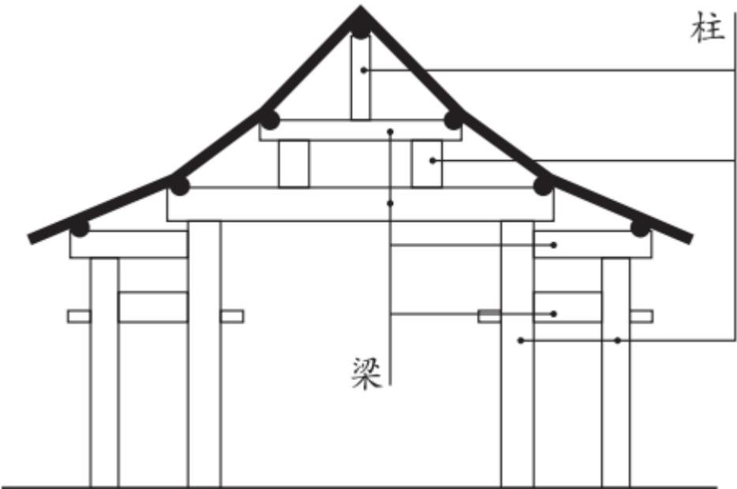

# 2024年普通高等学校招生全国统一考试（全国甲卷）

# 语文

使用地区：四川、宁夏、内蒙古、青海、陕西

本试卷满分150分，考试时间150分钟。

## 一、现代文阅读（36分）

## （一）论述类文本阅读（本题共3小题，9分）

阅读下面的文字，完成下面小题。

2019年4月23日，习近平主席在会见应邀出席中国人民解放军海军成立70周年多国海军活动的外方代表团团长时指出：“海洋对于人类社会生存和发展具有重要意义。海洋孕育了生命、联通了世界、促进了发展。我们人类居住的这个蓝色星球，不是被海洋分割成了各个孤岛，而是被海洋连结成了命运共同体，各国人民安危与共。”作为“人类命运共同体”的重要组成部分，海洋命运共同体的建设目标是打造一个持久和平、普遍安全、共同繁荣、开放包容、清洁美丽的海洋环境。

要实现海洋的持久和平与普遍安全，各国必须摒弃传统的大国争霸思路，充分照顾彼此的安全关切和合理利益，联合起来打击海盗、人口走私、贩毒等海上犯罪行为，在涉及海洋权益争端时通过友好协商的方式来解决问题，短期内无法协商的问题可以考虑搁置争议。共同繁荣、开放包容和清洁美丽的愿景意味着，我们要坚持开放的自由贸易体系，同时共同应对气候变化、海洋环境保护等问题，发挥海洋作为国际贸易大通道的积极作用，关注发展中国家的发展诉求。随着人类技术水平的提升和各国经济发展对资源需求的日益增加，各国都希望开发利用更多的海洋资源。如何才能在更好地利用海洋资源的同时又促进可持续发展、构建海洋命运共同体？习近平总书记提出海洋发展的“四个转变”：“要提高海洋资源开发能力，着力推动海洋经济向质量效益型转变”；“要保护海洋生态环境，着力推动海洋开发方式向循环利用型转变”；“要发展海洋科学技术，着力推动海洋科技向创新引领型转变”；“要维护国家海洋权益，着力推动海洋维权向统筹兼顾型转变”。这为海洋开发利用指明了方向。

具体到全球、地区和双边层面，构建海洋命运共同体应该着眼于不同的路径，这样才更具有可行性。

在全球层面，构建海洋命运共同体主要着眼于涉海全球公共问题的治理，各国应致力于构建更加公正合理、稳定有效的国际法和国际规则体系。目前，发达国家和发展中国家在海洋资源的开发利用方面仍然存在矛盾。发达国家过于强调公海自由原则，希望利用技术上的优势开发更多的公海资源。发展中国家更多强调公海作为人类共同财产的原则。如果公海被确定为人类共同财产，那么它就不得被占有，所有国家共同参加公海管理，积极分享公海开发中获取的利益，并保障公海只用于和平目的。人类共同财产原则更有利于保护公海环境和对海洋资源的可持续开发利用，对于实现持久和平与共同繁荣的愿景来说更为可行。总的来说，全球层面的海洋命运共同体构建，应着眼于建立更加有效的合作制度体系。

在地区和双边层面，由于相关成员在海洋利益方面拥有更多的交集，海洋命运共同体的构建应着眼于以下几个方面：其一，如果某个地区内或者两国间存在海洋权益争端，应该致力于让局势降温，避免引发军事冲突，为海上贸易和人员往来提供安全的环境。地区大国和地区性的安全架构应该在这一方面发挥主要作用。其二，建立高水平的区域经济合作制度，充分发挥海洋作为运输大动脉的作用，提升两国间或者地区内成员国之间的经济交流水平。其三，对两国或者本地区的海洋环境保护开展联合行动，保护海洋资源、打击海上违法犯罪以及联合进行海上搜救等。

(摘编自宋伟《海洋命运共同体构建与新的海洋文明》)

1.下列关于原文内容的理解和分析，不正确的一项是（）  
A.各国之间可能存在或大或小的海洋权益争端，但这不应妨碍争议各方携手参与海洋命运共同体的构建。  
B. 如何在保障人类更好利用海洋资源的同时促进可持续发展，这是构建海洋命运共同体需要应对的挑战。  
C. 在全球层面，既有的国际法和国际规则体系不够完备，效率不高，也没有建立起相应的合作制度体系。  
D. 高水平的区域经济合作制度，有利于发挥海运优势，促进经济交流，是构建海洋命运共同体的一部V  
分。

2. 下列对原文论证的相关分析，正确的一项是（A. 文章着眼于人类社会生存和发展，主要论述了海洋命运共同体的建设目标和愿景。B. 文章用了较大篇幅讨论海洋的发展和生态环保问题，凸显了这些问题的优先性。C. 第四段对比发达国家和发展中国家的不同主张，以证明公海是人类的共同财产D. 文章围绕海洋命运共同体的理念展开，分析问题时注意区分不同的角度和层次。

3. 根据原文内容，下列说法不正确的一项是（）A. 传统的大国争霸思路更多关注本国利益，容易引发海洋地缘纷争，威胁海洋安全。  
B． 构建海洋命运共同体，应当从地区和双边逐步推广至全球，这样才更有可行性。  
C. 人类共同财产的原则并不反对公海资源开发，也不谋求任何国家权益的优先性。  
D. 在海洋命运共同体的构建中，地区大国和地区性的安全架构理应发挥更大的作用。

## （二）实用类文本阅读（本题共3小题，12分）

阅读下面的文字，完成下面小题。

“偷梁换柱”多指以假代真，用欺骗的手段改变事物的性质，然而在古建筑工程领域，“偷梁换柱”却属于一种科学实用的修缮加固方法。

梁是截面形状一般为长方形的木料，且木料的长度尺寸远大于截面尺寸。梁为水平放置，两端的底部有支撑构件。梁主要用于承担建筑上部构件及屋顶的全部重量，并把这些重量向下传给支撑构件。柱为梁的支撑构件。柱子截面形状一般为圆形，长度尺寸远大于截面直径。柱子为竖向放置，主要用于承担上部梁传来的重量，并向下传递给下部的梁或直接传至地面。梁与柱采用榫卯形式连接，形成稳固的大木结构体系。位于屋架内的若干梁在竖向被层层往上“抬”，上下梁之间由短柱支撑，底部的梁由立于地面的立柱支撑。梁、柱均为中国木结构古建筑的核心受力、传力构件，缺一不可。

对于古建筑而言，立于地面的立柱，或因长期承受上部结构传来的重量而产生开裂残损，或因柱底部位长期受到地面潮气影响而出现糟朽残损，这导致木柱强度下降，无法正常支撑梁。此时可采用“偷梁换柱”的加固方法。“偷梁换柱”实际就是“托梁换柱”。其基本做法为：首先将“假柱”（即临时的竖向支撑构件）安装在梁底部、原柱（原有立柱）旁边；再抽去原柱，使梁传来的重量暂时由“假柱”承担；然后安装新柱，新柱的材料、尺寸及安装位置与原有立柱相同；最后将“假柱”移去。

完善的“偷梁换柱”加固方法具有科学性，其原理主要包括三个方面：其一，从梁的角度而言，它是水平受力构件，并把外力向下传给立柱。梁只有保持水平稳定状态，才能保证整个大木结构的稳定。在加固古建筑的过程中，梁始终受到支托，因而能一直保持水平稳定状态。其二，从柱的角度而言，它是竖向支撑构件，并最终把上部构件的重量传给地基。只有立柱具有充足的承载力，且与梁有可靠连接时，才能有效承担梁传来的作用力。加固过程中，技术人员虽然将原柱抽去，但是预先将“假柱”设置于原柱附近，让“假柱”代替原柱发挥支撑作用，因而换柱过程对结构整体的稳定基本无影响。换柱完成后，新柱与原柱有着同样的材料、尺寸，且与梁有着相同的可靠连接方式，它完全能够代替原柱发挥支撑作用。其三，从梁、柱整体结构角度而言，“偷梁换柱”方法对整体结构干扰小，且能达到良好的加固效果：原柱被新柱原位替换，新柱不仅有很好的支撑作用，而且与梁仍有可靠连接；“假柱”仅用于加固过程的临时支撑，且在原柱撤去后新柱安装前，能够与梁临时组成稳定的结构体系。因此，在“偷梁换柱”过程中，梁、柱结构整体始终处于稳定状态。

  
中国古建筑大木构架剖面示意图

(摘编自周乾《故宫建筑细探》)

4. 下列对原文相关内容的理解和分析，不正确的一项是（）  
A.“偷梁换柱”这一成语在现今的使用中多含有贬义的色彩，但在古建筑工程领域，它是指一种修缮加固的科学方法，完全没有贬义。  
比较容易发生糟朽残损的情况。  
C. 结合图文可以发现，屋顶的重量由上层柱承担，然后传给梁，再由梁传递给其下的短柱，依次向下传递，最终由底部的立柱传至地面。  
D.“偷梁换柱”的加固方法包括托梁、抽柱、换柱等步骤，在每一个步骤中梁一直会得到很好的支撑，从而始终能够保持水平稳定状态。

5. 请根据原文内容，在下面文段的横线处补写出恰当的词语。

工程实例：故宫太和殿是我国最大的木构大殿，明清两代帝王即位或节日庆典都在此举行。2004年，技术人员在对太和殿进行勘查时，发现有一根立柱下部三分之一的位置出现了严重糟朽，于是采取了“偷梁换柱”的方法对该立柱进行加固。具体过程如下：先使用“假柱”托住原柱上部的梁。“假柱”为完好的木料，被安装在 附近，用于临时支撑梁。再把柱子底部糟朽部分抽去，以便用 \_代替。原柱糟朽部分去掉后，剩余的部分做成巴掌形，与新柱搭接。新柱与被抽去的糟朽部分同材料、同形状、同尺寸，且顶部亦做成巴掌榫形状。最后再把 拆除，即完成了原有立柱的加固。

6. 清代的古籍中有另一种“偷梁换柱”的记载：当某根立柱损坏需要更换时，为节省工料，工匠只是在原柱旁边设一根新柱，再撤去原柱。为什么第2题“工程实例”中，太和殿修缮没有采用这种更简便的加固

方式呢？请简要分析。

## （三）文学类文本同读（本题共3小题，15分）

阅读下面的文学。完成下面小题。

## 霜降夜

周蓬桦

白露过后，乌乡的风里就已平添了寒意。早晨醒来，阳光刺眼，推开栅门，发现脚下的草叶上布满晶莹的霜，薄簿的一层，把路边的花打蔫，桦树的枝条似乎萧条了些许，树木上的一只只眼睛长出了睫毛，无意间仰头，但见几粒寒星正在向山顶以南的方向悄悄隐逝。镇上某一户人家屋顶上的烟囱，已经开始忙活，突突地冒青烟，烟柱是笔直的，上升到一米多高后遇到了风，才变得凌乱，像一块被抽断的丝绸。

有人说，乌乡的风里，流动着一股特别的味道，也只有亲临现场的人才会知道。这种特别的味道让人难忘，在鼻间萦绕，以至于割舍不下，成了人们再来乌乡的理由。

我提着满满一大铁桶草木灰，把它们倾倒在大路边潮湿的水洼里—这是房东阿姨安排给我的任务。昨天晚上，我约了几个养桑蚕与种植薰衣草的农户，到院子里攀谈，大家吃着草原黄膘烤牛肉，品尝着新摘的巨峰葡萄，黑色的冻梨，喝着自酿的桑葚酒，交谈内容涉猎宽泛，没有明确的主题。基本围绕农事收成，动物保护和挖掘过冬的地窖打转。当然， 我最感兴趣的，是他们讲述过往亲身经历的事件。兴许口吻轻描淡写，但对我十分有用。一些亮点像阵雨打湿心头，渗入静夜植物的根须，我急忙拿出记事本，在马灯的光线下一一做了记录。牛圈在屋后，小牛犊不时制造一点骚动，从那里飘来丝丝淡淡的尿臊气，但这并没影响大家浓厚的谈兴。叶子稀疏的板栗树梢上，始终挑着一弯残月。

聊到10点多钟时，霜降开始了，夜幕陡然拉向纵深，只听得周围的芦苇秆在瑟瑟作响，白桦树枝在轻轻蠕动，我身上很快起了一层细小的鸡皮疙瘩。这时，善良的房东阿姨送来了羊毛毯和羊毛披肩，以抵抗霜降带来的微妙变化。

“天要落露了，大伙儿小心着凉。”她说。

阿姨端来一小筐被冰冻过的无花果，果子个头大，已经在冰柜里冻成了一个个小冰球，阿姨从厨房提来了铁皮桶，点燃了软草和木柴。很快就将冻浆果烤软了，冰渣子化成了水，杂糅着果实的汁液。取一个放在嘴里，觉得冻过后的无花果有一股山柿饼的味道。少顷，桌上又摆满了甜点美食—大列巴面包、哈尔滨红肠、咖啡、奶茶、干果仁，还有烤得香喷喷的草原红糖焙子，吃得大家直打饱嗝。

这是一个特别的霜降夜，让人感觉到生命与节气之间发生了某种密切的联系，有很强烈的体验感，从这个夜晚起始，我正式走进乌乡人的生活，自此与之呼吸同一种空气，吃一锅同样的黑米乌饭，喝新碾的大碴子粥，我并不觉得我与乌乡的人和动物有什么不同。我们是对等的。他们在日子艰辛面前所持有的积极态度，和对幸福目标的追寻姿态，都让我感同身受，嘘唏或喜悦。如果可能，我愿意做乌乡山野中的一株树或一片霜冻的叶子。

我还记下了燃烧时呲呲作响的松油灯，灯下的笑脸，火光中明亮的瞳仁，以及整整一个晚上都在谈论的接地气的话题—如何与枯草丛中的野物们一道，度过暴风雪即将来临的严冬，需要粮食、木柴、胡萝卜和大白菜，需要棉衣棉被，需要一个大火炉。哟，对我这样长年奔波的外乡人来说，这是一个多么难忘的夜晚。

早晨的光线重叠移动，越升越高，把山脉的阴影投射到地面上。我手扶栅栏，将空空的铁皮桶放回到了板栗树下，却见房东阿姨的小儿子背了行囊，走下台阶，似乎要离乡远行。阿姨从灶间走出来，腰间系着粗布白围裙。她搓着手，一边抬手拭泪，脸上难掩担忧和凄惶的表情。

她的小儿子目光淡定，飞快地走出院落，又回过头来朝我们挥手笑笑，然后大步踩过路边的草木灰，在阳光下缩小成一个移动的墨点，在远山的背景下渐渐消失。返回屋内，我以树墩做书案，在稿纸上飞快地记下一句话：“霜降后，一些植物枯萎，一些事物到来，一些人又把双脚踩在了泥泞的路上。”

(有删改)

7. 下列对文本相关内容和艺术特色的分析鉴赏，不正确的一项是（）  
A.文章第一段写乌乡的清晨，作者感受着风与光，视线从脚下草、身边树，推展至天际寒星，再收回到  
农家炊烟，心情和笔触都从容舒缓。  
B. 霜降夜攀谈中，作者感觉到“一些亮点像阵雨打湿心头，渗入静夜植物的根须”，既实写外在景致的变V  
动，又虚写心中灵感的滋生。个年轻人踩过草木灰离家远行，这些点  
滴细节都带有乌乡生活的温度。  
D. 本文不仅记录了作者本人在乌乡小住的感受，还提及不少与当地生活息息相关的话题，如农事收成、  
动物保护等，侧面反映了乡村的发展。 不X

8. 如何理解文章最后作者记下的那句话？

9. 乌乡霜降夜，作者“感觉到生命与节气之间发生了某种密切的联系，有很强烈的体验感”，文章是从哪些方面来抒写这种体验感的？请简要分析。

## 二、古代诗文阅读（34分）

## （一）文言文阅读（本题共4小题，19分）

阅读下面的文言文，完成下面小题。

人才莫盛于三国，亦惟三国之主各能用人，故得众力相扶，以成鼎足之势。而其用人亦各有不同者，大概曹操以权术相驭，刘备以性情相契，孙氏兄弟以意气相投。

刘备为吕布所袭奔于操程昱以备有雄才劝操图之。操曰：“今收揽英雄时，杀一人而失天下之心，不可也。”然此犹非与操有怨者。臧霸先从陶谦，后助吕布，布为操所擒，霸藏匿，操募得之，即以霸为琅邪相。先是操在兖州，以徐翕、毛晖为将，兖州乱，翕、晖皆叛，后操定兖州，翕、晖投霸。至是，操使霸出二人，霸曰：“霸所以能自立者，以不为此也。”操叹其贤。盖操当初起时，方欲藉众力以成事，故以此奔走天下。及其削平群雄，势位已定，则孔融、许攸等，皆以嫌忌杀之。荀彧素为操谋主，亦以其阻九锡而胁之死。然后知其雄猜之性久而自露，而从前之度外用人，特出于矫伪，以济一时之用，所谓以权术相驭也。

至刘备，一起事即为人心所向。观其三顾诸葛，咨以大计，独有傅岩爰立之风。关、张、赵云，自少结契，终身奉以周旋，即羁旅奔逃，无寸土可以立业，而数人者患难相随，别无贰志。此固数人者之忠义，而备亦必有深结其隐微而不可解者矣。至托孤于亮，曰：“嗣子可辅，辅之；不可辅，则君自取之。”千载下犹见其肝膈本怀，岂非真性情之流露？亮第一流人，二国俱不能得，备独能得之，亦可见以诚待人之效矣。

至孙氏兄弟之用人，亦自有不可及者。孙策生擒太史慈，即解其缚曰：“子义青州名士，但所托非人耳。孤是卿知己，勿忧不如意也。”此策之得士也。陆逊镇西陵，权刻印置逊所，每与刘禅、诸葛亮书，常过示逊，有不安者，便令改定，以印封行之。委任如此，臣下有不感知遇而竭心力者乎？陆逊晚年为杨竺等所谮，愤郁而死。权后见其子抗，泣曰：“吾前听谗言，与汝父大义不笃，以此负汝。”以人主而自悔其过，开诚告语如此，其谁不感泣？此孙氏兄弟之用人，所谓以意气相感也。

(节选自赵翼《廿二史札记》卷七)

10. 文中画波浪线的部分有三处需要断句，请用铅笔将答题卡上相应位置的答案标号涂黑。  
刘备为吕布A所袭B奔C于操D程昱E以备F有雄才G劝操H图之。11. 下列对文中加点的词语及相关内容的解说，不正确的一项是A.藉，凭借、借助，与《陈涉世家》中“藉第令毋斩”的“藉”意思相同。  
B.即，即使，与《桃花源记》中“太守即遣人随其往”的“即”意思不同。  
C.固，固然，与《赤壁赋》中“固一世之雄也，而今安在哉”的“固”意思相同。  
D.但，只是，与《记承天寺夜游》中“但少闲人如吾两人者耳”的“但”意思相同。12.下列对原文有关内容的概述，不正确的一项是（）  
A.臧霸曾为吕布效力，曹操擒捉吕布以后，臧霸为避祸藏匿起来；后来他又被曹操捕获，曹操不计前嫌，对他委以重任，任命他为琅邪相。  
B. 曹操初起时为图霸业，能笼络人才，甚至能任用曾与己有怨者；势位已定时则猜忌异己，滥杀无辜。这正是其用人“以权术相驭”的表现。  
C. 刘备以性情结交忠义之士，以诚待人，故能深得人心；刘备创业过程中多次遭遇挫折，但诸葛亮及关、张、赵云等人患难相随，忠贞不渝。  
D.陆逊镇守西陵时，深得孙权信任，孙权给刘禅、诸葛亮写信，常常给陆逊看，有不妥之处就让他改定；到了晚年，陆逊遭到谗害，郁郁而终。

13. 把文中画横线的句子翻译成现代汉语。

（1）操使霸出二人，霸曰：“霸所以能自立者，以不为此也。”

（2）吾前听谗言，与汝父大义不笃，以此负汝。

## （二）古代诗歌阅读（本题共2小题，9分）

阅读下面诗歌，回答后面问题。

## 次韵钱逊叔泛舟虹桥①

宋·吕本中

半篙春涨绿平溪，二月江城草色齐。  
舟比蜉蝣千顷外，□同斥一枝栖②。  
野桥柳线斜风软，曲槛花光夕照低。  
却讶探骊人不至③，清樽画航倩分题④。

[注]①次韵：依次用所和诗中的韵作诗。②本句首字原缺。③探骊：这里指精通写诗作文。④分题：诗人聚会，分题目而赋诗。

14. 下列对这首诗的理解和赏析，不正确的一项是（）A. 诗歌开篇写春水、草色，围绕色彩落笔，营造出一种愉悦的情感氛围。  
B. 春水新涨，水面辽阔宽广，在波间漂浮的船只显得如同蜉蝣一样细小。  
C. 斥鸚见于《庄子·逍遥游》，用来与鹏做对比，因此诗中缺字应是“鹏”。  
D. 诗歌的尾联写到了“分题”，以此收束，与题目中的“次韵”形成照应。

15. 请赏析颈联“野桥柳线斜风软，曲槛花光夕照低”中“软”“低”二字的艺术效果。

## （三）名篇名句默写（本题共1小题，6分）

16. 补写出下列句子中的空缺部分。

（1）王湾《次北固山下》的名句“ 9 ”，描写时序交替中的景物，暗示着时光流逝，蕴含着自然理趣。

（2）小慧为朋友家的农家乐餐厅写宣传横幅，直接使用了陆游《游山西村》里的“”两句诗，朋友看了觉得很贴切。

（3）行至群山深处，见到一挂瀑布飞泻而下，水石激荡，轰鸣作响。于老师回头对学生们说：“这不就是古诗中写的 ’嘛！”

## 三、语言文字运用（20分）

## （一）语言文字运用Ⅰ（本题共4小题，14分）

阅读下面的文字，完成下面小题。

天山可谓家喻户晓，但真正了解它的人恐怕不多。怎样算是真正了解天山呢？不妨做个测试。你闭上眼睛，念出“天山”这个名字，试试看，能不能想象出一幅天山的全景图来？在这幅全景图里，山脉或平行或交错，许多巨大的、汽车要开上很久很久的盆地坐落其间。两座威严的雪峰—托木尔峰和汗腾格里峰巍然耸立，俯视着周边十多座海拔6000米以上的山峰。带着充沛的水汽在伊犁河谷一路长驱直入的暖湿气流造就了一片片麦浪滚滚的田地和水草丰美的牧场。博斯腾湖碧水连天，赛里木湖晶莹澄澈，艾比湖“盐”装素裹，天池静卧在苍翠环绕之中…①如果在你的脑海中，②能包罗万象地浮现出这样一幅全景图，③图上呈现了天山的任何山脉、盆地、雪峰，④还有河流、和湖泊，⑤你就算真正了解天山了。

17.下列句子中的“要”与文中加点的“要”，意义相同的一项是（）A. 描绘“寒风扫高木”的景况，用“木”字要比用“树”字更合适。  
B. 莲花池边有个小酒店，我们走进去，打了半斤酒，还要了些菜。  
C. 台儿沟没有学校，香雪每天上学要到十五里以外的公社去。  
D. 等枣树的叶子落尽，树上的枣子红完，西北风就要起来了。

18. 请将文中画横线的部分改成几个较短的语句。可以改变语序、少量增删词语，但不得改变原意。

19.下列句子中画波浪线的词语与文中画波浪线的“苍翠”，所用的修辞手法相同的一项是（）A. 烟花向上空冲去，下落时便洒散着满天花雨。  
B. 鲁迅先生穿着朴素的长衫，从容地坐在西装领带们旁边。  
C. 夏天的雨是热情洋溢的，喜欢不打招呼就前来拜访。  
D. 微风过处，送来缕缕清香，仿佛远处高楼上渺茫的歌声似的。

20. 文中标序号的部分有两处表述不当，请指出其序号并做修改，使语言准确流畅，逻辑严密。不得改变原意。 猴

## （二）语言文字运用Ⅱ（本题共1小题，6分）

21.下面的文字是一位老奶奶在医院看病时的自述，不够简明扼要，不利于和医生高效沟通。请对这段自述进行缩写。要求：保留必要信息，不超过80个字。

大夫好！今天看病的人太多了，我排了好长时间队才看上。我是你们医院的老病号了，这么多年我的高血压和糖尿病一直是在你们医院看的，好多年前有一次扭伤了脚踝，也是在你们这儿看好的，您可得给我好好看看。是这么回事儿。昨天晚上我老闺女来家里，我们一起吃的晚饭。吃过饭看着电视，我就开始头疼，先是头顶一圈疼，一跳一跳的，后来整个头都疼。我试了很多办法，一会儿躺着，一会儿坐着，大口喘气，戴上帽子捂着，都没有用。闺女要带我来医院，我说天太冷了，明天可能就好了，明天再说吧，然后就睡觉了。今天早上醒了还疼，头也不敢动，一晃就更疼了，就赶紧来医院了。

## 四、作文（60分）

22.阅读下面的材料，根据要求写作。

每个人都要学习与他人相处。有时，我们为避免冲突而不愿表达自己的想法。其实，坦诚交流才有可

能迎来真正的相遇。

这引发了你怎样的联想和思考？请写一篇文章。

要求：选准角度，确定立意，明确文体，自拟标题；不要套作，不得抄袭；不得泄露个人信息；不少于800字。

资料提供形式：QQ群+百度网盘群（两个群一起，QQ群每日发布更新通知，网盘群分享资料）资料包含内容：

1、1990\~2024年的各科高考真题（新高考、全国甲卷乙卷、各地地方卷等等）

2、2024年6月份到2025年6月份各地名校卷、期中期末试卷、各地联考卷、一二模模拟卷、仿真卷等等（每天都会更新）

3、各科精品资料（高考真题汇编、各个题型的做题方法、作文范文、作文素材（基本每日更新）、答题模板、知识点总结、笔记等等）

4、后续我们也会将高考押题资料放进资料库内（不会额外收费）

5、如果我们资料库内没有大家需要的资料，可以随时联系我们客服，我们会尽力去给大家整理你们需要的资料，比如某个学科的某块知识点总结，某种题型的答题模板，或者某某名校的内部资料等等，并且不会额外收费哦！给大家在这一年里享受最好的服务，

6、后续我们可能还会出填报志愿服务，给大家提供志愿卡成本价渠道！

7、我们付费资料群内的资料基本都是没有水印的，让大家打印或者使用的时候有最佳的观看体验！

进群费用：目前入群特价88元（后续我们会涨价！！）时间期限：资料持续更新到2025年6月高考结束，资料截止更新

购买方式有两种：

第一种(最方便)：关注微信公众号【雪山学社】，留言“VIP”，支付完以后添加学长微信安排后续事宜第二种：添加学长微信XSWK21，添加好友时留言“VIP”

微信搜一搜

雪山学社

  
这个是学长的微信微信号XSWK21需要购买的同学添加时请备注“VIP”

  
低价线上打印仅需5分1页，顺丰包邮！需要的同学可以打开微信扫码！

  
低价正版教辅QQ群群号：928159480平时会发放五年高考三年模拟、试题调研、解题觉醒等等一系列正版教辅的优惠券\~\~