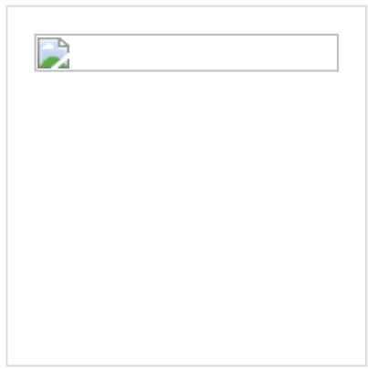
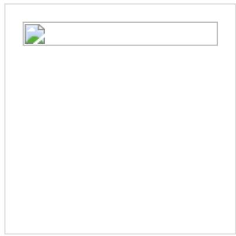

中国教育在线中国教育网加入收藏设为首页

首页|新闻|中小学|高考|考研|国际|教师招聘|学术桥|公服平台|课堂

高考分数线查询

历年院校投档分数线

高考历年一分一段表

## 开学运利「m Macbook Air Beats耳机」

● 全国大学信息查询

• 历年高考分数线查询

● 就业面最宽的十大高考专业盘点

● 罐头社区，英语话题聚集地

高考频道

首页>高考>活动报道>2012年高考试题

2012四川高考语文试题下载（word版）

http://gaokao.eol.cn/来源: 2012-06-12

● 高校自主招生全面详解

● 高考平行志愿全面解读

● 数说高考：数据解读高考

● 2018年高招调查报告

• 各地高考一分一段表

• 各地高考院校投档线

2012年高考四川各科试题及答案汇总
<table><tr><td rowspan=1 colspan=1>科目</td><td rowspan=1 colspan=2>试题答案</td><td rowspan=1 colspan=1>下载</td><td rowspan=1 colspan=1>科目</td><td rowspan=1 colspan=2>试题答案</td><td rowspan=1 colspan=1>下载</td></tr><tr><td rowspan=1 colspan=1>语文（作文)</td><td rowspan=1 colspan=1>查看</td><td rowspan=1 colspan=1>答案</td><td rowspan=1 colspan=1>下载</td><td rowspan=1 colspan=1>英语</td><td rowspan=1 colspan=1>查看</td><td rowspan=1 colspan=1>答案</td><td rowspan=1 colspan=1>下载</td></tr><tr><td rowspan=1 colspan=1>理科数学</td><td rowspan=1 colspan=1>查看</td><td rowspan=1 colspan=1>答案</td><td rowspan=1 colspan=1>下载</td><td rowspan=1 colspan=1>文科数学</td><td rowspan=1 colspan=1>查看</td><td rowspan=1 colspan=1>答案</td><td rowspan=1 colspan=1>下载</td></tr><tr><td rowspan=1 colspan=1>理科综</td><td rowspan=1 colspan=1>查看</td><td rowspan=1 colspan=1>答案</td><td rowspan=1 colspan=1>下载</td><td rowspan=1 colspan=1>文科综</td><td rowspan=1 colspan=1>查看</td><td rowspan=1 colspan=1>答案</td><td rowspan=1 colspan=1>下载</td></tr></table>

中国教育在线讯2012四川高考于6月7日开始，中国教育在线在考试后及时公布高考试题、答案和高考作文，并提供高考试题下载以及高考试题的专家点评。请广大考生家长及时关注，同时祝广大考生在2012高考中发挥出最佳水平，考出好成绩！

<<2012四川高考语文试题点击下载>>
<table><tr><td colspan="8" rowspan="1">2012年高考全国各省市各科试题及答案</td></tr><tr><td colspan="1" rowspan="2">大纲全国卷真题/答案</td><td colspan="1" rowspan="1">语文/答案</td><td colspan="1" rowspan="1">数文/答案</td><td colspan="1" rowspan="1">数理/答案</td><td colspan="1" rowspan="1">新课标全国</td><td colspan="1" rowspan="1">语文/答案</td><td colspan="1" rowspan="1">数文/答案</td><td colspan="1" rowspan="1">数理/答案</td></tr><tr><td colspan="1" rowspan="1">英语/答案</td><td colspan="1" rowspan="1">文综/答案</td><td colspan="1" rowspan="1">理综/答案</td><td colspan="1" rowspan="1">真题/答案</td><td colspan="1" rowspan="1">英语/答案</td><td colspan="1" rowspan="1">文综/答案</td><td colspan="1" rowspan="1">理综/答案</td></tr><tr><td colspan="1" rowspan="2">安徽真题/答案</td><td colspan="1" rowspan="1">语文/答案</td><td colspan="1" rowspan="1">数文/答案</td><td colspan="1" rowspan="1">数理/答案</td><td colspan="1" rowspan="2">北京真题/答案</td><td colspan="1" rowspan="1">语文/答案</td><td colspan="1" rowspan="1">数文/答案</td><td colspan="1" rowspan="1">数理/答案</td></tr><tr><td colspan="1" rowspan="1">英语/答案</td><td colspan="1" rowspan="1">文综/答案</td><td colspan="1" rowspan="1">理综/答案</td><td colspan="1" rowspan="1">英语/答案</td><td colspan="1" rowspan="1">文综/答案</td><td colspan="1" rowspan="1">理综/答案</td></tr><tr><td colspan="1" rowspan="2">四川真题/答案</td><td colspan="1" rowspan="1">语文/答案</td><td colspan="1" rowspan="1">数文/答案</td><td colspan="1" rowspan="1">数理/答案</td><td colspan="1" rowspan="2">湖北真题/答案</td><td colspan="1" rowspan="1">语文A卷B卷答案A卷B卷</td><td colspan="1" rowspan="1">数文A卷B卷答案A卷B卷</td><td colspan="1" rowspan="1">数理A卷B卷答案A卷B卷</td></tr><tr><td colspan="1" rowspan="1">英语/答案</td><td colspan="1" rowspan="1">文综/答案</td><td colspan="1" rowspan="1">理综/答案</td><td colspan="1" rowspan="1">英语A卷B卷答案A卷B卷</td><td colspan="1" rowspan="1">文综A卷B卷答案A卷B卷</td><td colspan="1" rowspan="1">理综A卷B卷答案A卷B卷</td></tr><tr><td colspan="1" rowspan="2">湖南真题/答案</td><td colspan="1" rowspan="1">语文/答案</td><td colspan="1" rowspan="1">数文/答案</td><td colspan="1" rowspan="1">数理/答案</td><td colspan="1" rowspan="2">山东真题/答案</td><td colspan="1" rowspan="1">语文/答案</td><td colspan="1" rowspan="1">数文/答案</td><td colspan="1" rowspan="1">数理/答案</td></tr><tr><td colspan="1" rowspan="1">英语/答案</td><td colspan="1" rowspan="1">文综/答案</td><td colspan="1" rowspan="1">理综/答案</td><td colspan="1" rowspan="1">英语/答案</td><td colspan="1" rowspan="1">文综/答案</td><td colspan="1" rowspan="1">理综/答案</td></tr><tr><td colspan="1" rowspan="2">广东真题/答案</td><td colspan="1" rowspan="1">语文/答案</td><td colspan="1" rowspan="1">数文/答案</td><td colspan="1" rowspan="1">数理/答案</td><td colspan="1" rowspan="1">陕西</td><td colspan="1" rowspan="1">语文/答案</td><td colspan="1" rowspan="1">数文/答案</td><td colspan="1" rowspan="1">数理/答案</td></tr><tr><td colspan="1" rowspan="1">英语/答案</td><td colspan="1" rowspan="1">文综/答案</td><td colspan="1" rowspan="1">理综/答案</td><td colspan="1" rowspan="1">真题/答案</td><td colspan="1" rowspan="1">英语/答案</td><td colspan="1" rowspan="1">文综/答案</td><td colspan="1" rowspan="1">理综/答案</td></tr><tr><td colspan="1" rowspan="2">山西真题/答案</td><td colspan="1" rowspan="1">语文/答案</td><td colspan="1" rowspan="1">数文/答案</td><td colspan="1" rowspan="1">数理/答案</td><td colspan="1" rowspan="2">重庆真题/答案</td><td colspan="1" rowspan="1">语文/答案</td><td colspan="1" rowspan="1">数文/答案</td><td colspan="1" rowspan="1">数理/答案</td></tr><tr><td colspan="1" rowspan="1">英语/答案</td><td colspan="1" rowspan="1">文综/答案</td><td colspan="1" rowspan="1">理综/答案</td><td colspan="1" rowspan="1">英语/答案</td><td colspan="1" rowspan="1">文综/答案</td><td colspan="1" rowspan="1">理综/答案</td></tr><tr><td colspan="1" rowspan="2">天津真题/答案</td><td colspan="1" rowspan="1">语文/答案</td><td colspan="1" rowspan="1">数文/答案</td><td colspan="1" rowspan="1">数理/答案</td><td colspan="1" rowspan="2">福建真题/答案</td><td colspan="1" rowspan="1">语文/答案</td><td colspan="1" rowspan="1">数文/答案</td><td colspan="1" rowspan="1">数理/答案</td></tr><tr><td colspan="1" rowspan="1">英语/答案</td><td colspan="1" rowspan="1">文综/答案</td><td colspan="1" rowspan="1">理综/答案</td><td colspan="1" rowspan="1">英语/答案</td><td colspan="1" rowspan="1">文综/答案</td><td colspan="1" rowspan="1">理综/答案</td></tr><tr><td colspan="1" rowspan="2">辽宁真题/答案</td><td colspan="1" rowspan="1">语文/答案</td><td colspan="1" rowspan="1">数文/答案</td><td colspan="1" rowspan="1">数理/答案</td><td colspan="1" rowspan="2">江西真题/答案</td><td colspan="1" rowspan="1">语文/答案</td><td colspan="1" rowspan="1">数文/答案</td><td colspan="1" rowspan="1">数理/答案</td></tr><tr><td colspan="1" rowspan="1">英语/答案</td><td colspan="1" rowspan="1">文综/答案</td><td colspan="1" rowspan="1">理综/答案</td><td colspan="1" rowspan="1">英语/答案</td><td colspan="1" rowspan="1">文综/答案</td><td colspan="1" rowspan="1">理综/答案</td></tr><tr><td colspan="1" rowspan="2">内蒙古真题/答案</td><td colspan="1" rowspan="1">语文/答案</td><td colspan="1" rowspan="1">数文/答案</td><td colspan="1" rowspan="1">数理/答案</td><td colspan="1" rowspan="2">黑龙江真题/答案</td><td colspan="1" rowspan="1">语文/答案</td><td colspan="1" rowspan="1">数文/答案</td><td colspan="1" rowspan="1">数理/答案</td></tr><tr><td colspan="1" rowspan="1">英语/答案</td><td colspan="1" rowspan="1">文综/答案</td><td colspan="1" rowspan="1">理综/答案</td><td colspan="1" rowspan="1">英语/答案</td><td colspan="1" rowspan="1">文综/答案</td><td colspan="1" rowspan="1">理综/答案</td></tr><tr><td colspan="1" rowspan="2">贵州真题/答案</td><td colspan="1" rowspan="1">语文/答案</td><td colspan="1" rowspan="1">数文/答案</td><td colspan="1" rowspan="1">数理/答案</td><td colspan="1" rowspan="2">广西真题/答案</td><td colspan="1" rowspan="1">语文/答案</td><td colspan="1" rowspan="1">数文/答案</td><td colspan="1" rowspan="1">数理/答案</td></tr><tr><td colspan="1" rowspan="1">英语/答案</td><td colspan="1" rowspan="1">文综/答案</td><td colspan="1" rowspan="1">理综/答案</td><td colspan="1" rowspan="1">英语/答案</td><td colspan="1" rowspan="1">文综/答案</td><td colspan="1" rowspan="1">理综/答案</td></tr><tr><td colspan="1" rowspan="2">云南真题/答案</td><td colspan="1" rowspan="1">语文/答案</td><td colspan="1" rowspan="1">数文/答案</td><td colspan="1" rowspan="1">数理/答案</td><td colspan="1" rowspan="2">甘肃真题/答案</td><td colspan="1" rowspan="1">语文/答案</td><td colspan="1" rowspan="1">数文/答案</td><td colspan="1" rowspan="1">数理/答案</td></tr><tr><td colspan="1" rowspan="1">英语/答案</td><td colspan="1" rowspan="1">文综/答案</td><td colspan="1" rowspan="1">理综/答案</td><td colspan="1" rowspan="1">英语/答案</td><td colspan="1" rowspan="1">文综/答案</td><td colspan="1" rowspan="1">理综/答案</td></tr><tr><td colspan="1" rowspan="2">宁夏真题/答案</td><td colspan="1" rowspan="1">语文/答案</td><td colspan="1" rowspan="1">数文/答案</td><td colspan="1" rowspan="1">数理/答案</td><td colspan="1" rowspan="2">青海真题/答案</td><td colspan="1" rowspan="1">语文/答案</td><td colspan="1" rowspan="1">数文/答案</td><td colspan="1" rowspan="1">数理/答案</td></tr><tr><td colspan="1" rowspan="1">英语/答案</td><td colspan="1" rowspan="1">文综/答案</td><td colspan="1" rowspan="1">理综/答案</td><td colspan="1" rowspan="1">英语/答案</td><td colspan="1" rowspan="1">文综/答案</td><td colspan="1" rowspan="1">理综/答案</td></tr><tr><td colspan="1" rowspan="2">新疆真题/答案</td><td colspan="1" rowspan="1">语文/答案</td><td colspan="1" rowspan="1">数文/答案</td><td colspan="1" rowspan="1">数理/答案</td><td colspan="1" rowspan="1">西藏</td><td colspan="1" rowspan="1">语文/答案</td><td colspan="1" rowspan="1">数文/答案</td><td colspan="1" rowspan="1">数理/答案</td></tr><tr><td colspan="1" rowspan="1">英语/答案</td><td colspan="1" rowspan="1">文综/答案</td><td colspan="1" rowspan="1">理综/答案</td><td colspan="1" rowspan="1">真题/答案</td><td colspan="1" rowspan="1">英语/答案</td><td colspan="1" rowspan="1">文综/答案</td><td colspan="1" rowspan="1">理综/答案</td></tr><tr><td colspan="1" rowspan="2">河北真题/答案</td><td colspan="1" rowspan="1">语文/答案</td><td colspan="1" rowspan="1">数文/答案</td><td colspan="1" rowspan="1">数理/答案</td><td colspan="1" rowspan="2">吉林真题/答案</td><td colspan="1" rowspan="1">语文/答案</td><td colspan="1" rowspan="1">数文/答案</td><td colspan="1" rowspan="1">数理/答案</td></tr><tr><td colspan="1" rowspan="1">英语/答案</td><td colspan="1" rowspan="1">文综/答案</td><td colspan="1" rowspan="1">理综/答案</td><td colspan="1" rowspan="1">英语/答案</td><td colspan="1" rowspan="1">文综/答案</td><td colspan="1" rowspan="1">理综/答案</td></tr><tr><td colspan="1" rowspan="2">河南真题/答案</td><td colspan="1" rowspan="1">语文/答案</td><td colspan="1" rowspan="1">数文/答案</td><td colspan="1" rowspan="1">数理/答案</td><td colspan="1" rowspan="2">浙江真题/答案</td><td colspan="1" rowspan="1">语文/答案</td><td colspan="1" rowspan="1">数文/答案数理/答案</td><td colspan="1" rowspan="1">自选模块答案</td></tr><tr><td colspan="1" rowspan="1">英语/答案</td><td colspan="1" rowspan="1">文综/答案</td><td colspan="1" rowspan="1">理综/答案</td><td colspan="1" rowspan="1">英语/答案</td><td colspan="1" rowspan="1">文综/答案</td><td colspan="1" rowspan="1">理综/答案</td></tr><tr><td colspan="1" rowspan="2">上海真题/答案</td><td colspan="1" rowspan="1">语文/答案</td><td colspan="1" rowspan="1">数文/答案</td><td colspan="1" rowspan="1">数理/答案</td><td colspan="1" rowspan="2">海南真题/答案</td><td colspan="1" rowspan="1">语文/答案</td><td colspan="1" rowspan="1">数文/答案</td><td colspan="1" rowspan="1">数理/答案</td></tr><tr><td colspan="1" rowspan="1">英语/答案地理/答案</td><td colspan="1" rowspan="1">政治/答案物理/答案</td><td colspan="1" rowspan="1">历史/答案化学/答案生物/答案</td><td colspan="1" rowspan="1">英语/答案地理/答案</td><td colspan="1" rowspan="1">政治/答案物理/答案</td><td colspan="1" rowspan="1">历史/答案化学/答案生物/答案</td></tr><tr><td colspan="1" rowspan="2">江苏真题/答案</td><td colspan="1" rowspan="1">语文/答案</td><td colspan="1" rowspan="1">数学/答案</td><td colspan="1" rowspan="1">英语/答案</td><td colspan="4" rowspan="2"></td></tr><tr><td colspan="1" rowspan="1">政治/答案物理/答案</td><td colspan="1" rowspan="1">历史/答案化学/答案</td><td colspan="1" rowspan="1">地理/答案生物/答案</td></tr></table>

推荐给好友  
我要收藏  
我要打印

我要纠错  

  
掌上高招服务号

  
中国教育在线高考订阅号

<table><tr><td colspan="1" rowspan="1">高考估分定位</td><td colspan="1" rowspan="1">志愿填报指南</td><td colspan="1" rowspan="1">模拟志愿填报</td><td colspan="1" rowspan="1">估分选大学</td></tr><tr><td colspan="1" rowspan="1">国家重点学科</td><td colspan="1" rowspan="1">双一流高校</td><td colspan="1" rowspan="1">985大学</td><td colspan="1" rowspan="1">211大学</td></tr><tr><td>历年分数线</td><td>历年一分一段表</td><td>历年投档线</td><td>高考真题</td></tr></table>

## 相关资讯

● 2012四川高考语文试题

● 2012四川高考语文答案

● 2012四川高考试题及答案下载

● 2012四川高考试题及答案汇总

● 2012四川高考理综试题下载（word版）

● 2012四川高考数学理试题下载（word版）

● 2012四川高考英语试题下载（word版）

● 2012四川高考数学文试题下载（word版）

● 2012四川高考理综答案

● 2012四川高考数学理试题及答案

● 2012四川高考理综试题

## “数说高考”一用数据解读高考高考平行志愿解读

● 超1/3高校新增开设这个专业未来年薪50万 高校专业全知道

新高考来临高中生如何选科？【高考百科】最全高考名词解析

● 收入最高的十大本科专业适合女生报考的十大热门高考专业

• 高考志愿重要参考依据：历年高考一分一段表高招调查报告

## “双一流”建设高校及学科名单高校新增及撤销专业

● 历年高考分数线查询|高考志愿填报参考系统|211|985

● 估分选大学|掌上高考APP|高考在线答疑|人气大学排行榜

## 自考含金量自考本科考研注意事项自考热门专业

● 自考报考指南|自考文凭有用吗|报考流程|自考名校排行

● 各地区自考报名|自考真题自考报名时间低门槛读自考

## 更多>>高考试题

·2019322233232333223

·20193222?？？？a？？3g?？？？3？

·20192222?2323232323

·2019？??3??1????？己?？

·20192222?232333333

·20192223223322223223

## 更多>>高考快讯

·??2019???14d???？????1?？14d??？?50...

.?炎?2020？?？？？ay?？??h??？??？??？??p？...

·?炎?2020？??？？?？？？h？？?？？?？...

·?炎?2020????？ay????h???????????p?...

·?12???2019?????y????????7?q???j？???...

·????2019?????y????14d????ρ??????

·??????220192?14d??????2?1/4d??2?40....

.2222222019222323?2y22221/4d?222223？

## 大学信息查询

按属性查询

全部高校 教育部直属高校

“211”高校“985”高校

民办院校| 独立学院 |高职高专

军事院校 | 中外合作办学高校

## 按地区查询

北京 天津 河北 山西  
上海 1 江苏 浙江 |安徽  
福建 江西 山东 |河南  
湖北 湖南 广东 |广西  
海南 重庆 四川 贵州  
云南 1 西藏 陕西 |甘肃  
青海 辽宁 吉林 宁夏  
内蒙古| 黑龙江| 新疆 港澳台

## 按类型查询

综合类 | 理工类  师范类

财经类  政法类  外语类

医科类  农林类  民族类

## 高校排行

● 理工类院校报考热度排行榜

● 师范类院校报考热度排行榜

● 财经类院校报考热度排行榜

● 政法类院校报考热度排行榜

● 语言类院校报考热度排行榜

● 医药类院校报考热度排行榜

## 大学信息查询

## 专业解读

● 高考生最关注专业排行榜

● 高考专业解析第一期之医学类

● 高考专业解析第二期之法学类

● 高考专业解析第三期之经济学

● 高考专业解析第四期之管理学

● 高考专业解析第五期之文学类

● 高考专业解析第六期之工科类

● 高考专业解析第七期之农学类

● 专业分析未来10年有潜力行业

## 本科专业介绍

农学类 | 医学类 | 历史学

哲学类 | 工学类 | 教育学

文学类  法学类  理学类

管理学  经济学

## 高职专业介绍

公安类制造类土建类

旅游类水利类法律类

财经类 | 艺术设计传媒类

交通运输类 | 公共事业类

农林牧渔类  医药卫生类

文化教育类 | 轻纺食品类

电子信息类 资源开发类

材料能源类  生化药品类

环保气象与安全类

## 专业咨询区

文学类 | 法学类 | 理学类

工学类 | 教育类 | 医学类

经济类 | 哲学类 | 农学类

管理学类 | 专科专业咨询区

eol.cn简介|联系方式|网站声明|京ICP证140769号|京ICP备12045350号|京公网安备11010802020236号

版权所有 北京中教双元科技集团有限公司 EOL Corporation

Mail to: webmaster@eol.cn

# 2012年普通高等学校招生全国统一考试(四川卷)

# 语文

## 第一部分（选择题 共30分）

## 一、(12分，每小题3分)

下列词语中加点的字，读音全都正确的一组是 A. 折(zhé)耗 绰(chuò)约 水泵(bèng) 流水淙(cóng)综 B.募(mù)集 缜(zhěn)密 慰藉(jie) 风驰电犁(chè) C.露(lou)面 纤(xiān)细 抚恤（xù） 弦(xuán)外之音 D. 栅(zhà)栏 蜷(juǎn)缩 款识(zh)) 敷衍塞(sè)责

下列词语中，没有错别字的一组是讳疾忌医 微言大义 万事具备，只欠东风B. 磬竹难书 两全其美 言既出，驷马难追C. 掷地有声 曲意逢迎 桃李不言，下自成蹊D. 至高无上 原形必露 失之东隅，收之桑榆

3. 下列各句中，加点词语使用恰当的一句是A. 在施工过程中，因疏忽造成的安全事故如期而至，人员伤亡严重，救援队伍很快赶到现场，克服困难抢救危重人员，并对轻伤者进行了处理。

B. 2011年8月，科幻作家徐浩若受邀到成都举办讲座，几十位科幻创作爱好者聆听了他的报告，

C. 一项对大学毕业生发展状况的调查表明，无论他们在校成绩多么优秀，走上工作岗位后都将面临各种挑战，需要用勤奋、智慧与坚韧去应对。土回系

D. 在维也纳金色大厅，经常有不同肤色、不同语言的人们会聚在这里，他们各具民族风格与艺术特色的优美歌声在大厅内交相辉映，久久回荡。们会家在这生，他们各其民欢风与

4. 下列各句中，没有语病的一句是

B. 近年来世界艺术品拍卖价格屡创新高，许多有眼光的国际大商人纷纷购买、收藏有价值的艺术品，希望以这种投资方式实现资产保值和增值。图

C. 1999-2011年间，我国造林6643.36万公顷，人工林面积位居世界第一，但是土地沙漠化、植被覆盖率和森林病虫害等依然十分严重，令人担忧。

D. 今年5月在北京举行的大学生文艺汇演，展现了新时代大学生的多才多艺与创造活力，具有民族特色的各类歌舞表现了民族团结和热情奔放。其

7. 根据原文提供的信息，以下推断不正确的一项是A. 植物中汞含量与植物所处的地理环境密切相关。B. 不同类型的城市其汞污染的主要来源存在差异C. 直接焚烧含汞的废弃物会把汞排放到大气之中。D. 人类活动较少的北极上空大气中的汞浓度最低。

## 三、(9分，每小题3分)

阅读下面的文言文，完成8-10题。

贺饮，字克恭，世家定海，父孟员，以戎籍隶辽之美州卫：秋少颖敏，习华子业辑都之四：为学止于是耶？”取《近思录》读之，有省。成化二年以进士校户科给事中。因完早上幸极诛，复以言富旷职召灾，自奶求退。会陈献章被征来京师，饮听其论学，叹日：“至性不盟，真理犹莊，世即用我，而教美为用？“即日上疏解官去，执弟子礼事献章别，肖其源事之。其学专读《五经》、《四书》、小学，期于反身实践，主敬以收放心。有来学者，辄辞之日：“已尚未治，何以治人？”既而从游老善众，垂查淬历，成其器业。如是者十余年，暴不出户爽，而达官责人闻风仰德者，莫不躬拜床下。

弘治改元，用阁臣荐，是勇陕西右参议。皇书至而母适病死，乃上疏息辞。正德四年太监划暖括辽东田，东人震恐思乱。义州以守臣赏残交先发，聚众幼掠，顾相成日母惊贺黄门。“钦闻之，驻论日：“若等吾乡人也，今不幸至此，然喜宿为若等忧，镇城兵不即五耶，如何”众初涵涵，生是知悔，罗拜而注呼日：”吾父也，愿教之。“饮口：“惟不杀人，祸可解。守臣激交，民则无辜，能止杀以待命，尚不失为良民也。良民何提？”未几，有言镇城军果至者，众复噪日：“贺黄门无媛话语。“环跳饮里门。饮日：“吾固知有是也。成中扰很至此，镇城焉得不发兵？兵虽至，尔等不杀人，必索尔，无感众数去，乱通定。时又有边将诈请杀力阵获者，上官按之不得实，一见饮即惭试地目：“他人可欺，吾敢欺贺光生耶？美至诚感人如此。

钦处家笃思谊，正伦理，厚烟成，睦宗党。冠婚丧帮一道古礼，不根之言经毫不入于耳，于姓必董陶之以孝弟之义。日改月化，一多人皆兴于善。里俗呼并端，丧葬皆作佛事，岐酒肉，肆为奢惜。饮以身范之。晚更好《易》，完心象数，手不释卷，大臣荐引相属，终不起。少尝隐居医无间山，因以医间自号，人退称为医间先生。

(节选自清光绪五年《镇海县志》春二千一(人物传二·明一))

8. 对下列句子中加点词的解释，不正确的一项是B. 自C. 必宥尔，无恐D.上官按之不得实

9. 下列各句中，加点词意义和用法都相同的一组是A. 钦听其论学 再其无意于人世矣B. 玺书至而母适病死 盖将自其变者面观之C.义州以守臣贪残变光发 但以刘日薄西山D. 时又有边将诈诱杀为阵获者 为国者无使为积威之所动

10.下列对原文关内容的概括和分析，不正确A. 贺饮做官，进德修业，尊师重道，传道授业，都坚持用高标准要求自己www.HuaxiD，贺饮晚年好《易》不愿做官，因年轻时曾隐居学 民购先生

# 第二部分（非选择题 共120分）

## 四、(23分)

11.把第一部分文言文阅读材料中画横线的句子翻译成现代汉语。（10分）(1)世即用我，而成美以为用？(3

(2)既而从游者甚众，磨营淬历，或其器业。(3分)

3)中臣激变，民则无辜，能止杀以待命，尚不夫为良氏也。(4分)  
12.阅读下面这首诗，然后回答问题。(8分）

## 子观

## [元]曾伯店

蜀魄曾为古帝王，千声万血送年方贪夫港听空饭首，远锦水春残花极府：是天梦觉月如霜催归催得谁归去，唯有志那衣事忙。

【注】于概：即征膦，文名题战、更魂、催红，相传方古司王杜审所化。

(1)本诗第二联中的“空“字级富韵味。请结合诗句简要赏析。(3分)

(2)本诗主要表达了怎样的情感？请任选能表现这种情够的两个意象简要分析。13.补写出下列名篇名句中的空缺部分。（两题任选一题：如两题均答，只取言(1) ((元东南飞))

然后践华为域。 灵谊(（过论） 君不闻汉家 以有健妇把轴犁。 (杜甫(兵车行)

(可马迁《史记·屈原要生列传》)

## 五(22分)

阅读下面的文字，完成14-17题。

## 荣禾

## 均亮极

①我们微家时，那燥烧到下一年的设授统，也几于一段术留地装上车，轻到了无兴官村。无好富离谋矿很近，取暖做饭都烧煤，那安乘和图此留下来。

②柴燥是家力的象征。有一大燥乘未的人家，必定有一头壮丝口、一辆好车。当然，还有几个能干的人。这些好东西碰巧凑在一起了就能成大事、出天景尊。可是，这些好东西又很难全减在一起。有的人家有一头壮牛，车却破破烂烂，经常坏在远路上。有的人家置了辆新车，能装几千斤东西、牛即体弱得不行。还有的人家，车、马都配地道了，人却不行——死了，或者老得于不动活。

③我们刚到父条的住处时，家里的手沸还算齐备，只是牛精老了些。柴绿虽然不高，乘禾底子却很厚大排场。不像一般人家的乘禾，小小气气的一堆，都不载叫乘绿。父杀带我们进沙溪拉乘，接着大哥单独起车进沙漠拉染，情着是我、三弟，等到四弟能单独进沙溪拉糜时，我们已另买了头黑带本钻镇也换成断的，乘块更是没有哪家可比，全是梳极染，大棵的，码得跟房一样高，璧一根益就能烧半天

④现在我们再不会烧这些乘禾了。我们把它们当没用的东西乱扔在院子，却又舍不得送人或扔掉。我们想，或许哪一天没有煤了，没有暖气了，还要靠它烧饭取暖。只是到了那时我们已不懂得惠样烧它。劈染的那把斧头几经搬家已扔得不见，家里已没有可以烧柴禾的炉子。即便这样我们也设扔摔那些染禾，再搬一次家还会带上它们。它们是家的一部分。那个墙根就应该码着染禾，那个院角操着草，中间停着车，柱子上拴着牛和驴。在我们心中一个完整的家院就应该是这样的。许多个冬天，那些染禾理在深雪里，尽管从没人去动它们，但我们知道那堆雪中埋着染禾，我们在心里需要它们，它让我们放心度过一个个寒冬。 (00015

⑤那堆梭梭染统这样在院墙根呆了二十年，没有谁去管过它们。有一年扩菜地，往墙角移过一次，比以前轻多了，扔过去使斯成几截，颜色也由原来的铁青变成灰黑。另一年一裸萌芦秩爬到柴堆上，肥大的叶子几乎把柴禾全遮盖住，那诚是它们最凉负的一个夏季了。秋天我们为摘一颗大萌芦走到这个墙角，葫芦卡在横七竖八的柴堆中，搬移柴未时我又一次感觉到它们腐朽的程度，除此之外似于再没有人动过。在那个墙角里它们独自过了许多年，静悄悄自己朽掉了。

⑥最后，它们变成一堆灰时，我可以说，我们没有烧它，它自己变成这样的。我们一直看着它变或了这样。从第一滴雨落到它们身上、第一层青皮在尺中开裂我们看见了。它根部的花头朽掉，像土一样脱落在地时我们看见了。深处的水质开始发黑时我们看见了，全都看见了

⑦当我死的时候，人们一样可以坦然地说，他是自己死掉的。墙说，我们只为他挡风御寒，从没堵他的路。坑说，我没有陷害他，每次他都绕过去。风说，他的背不是我刮弯的，他的验不是我吹旧的。晴不是我欢瞎的。而说，我只淋湿他的头发和衣版，他的心是干燥的，雨下不到他心里。土说，我们理不住达个人，梦中他飞得比所有尘土都高

⑧可是，我不会说。没谁听见一个死掉的人怎么说。

⑨我一样没听见一堆成灰的梭梭柴，最后说了什么。

(有删改)

[注]较模：一种准木或小乔木。

14. 根据全文概括“柴禾”在文中的含义。(5分)

15.第3自然段主要叙述了什么内容？这些内容在全文结物中的作用是什么？(6分)16.第6自然段的画线句子运用了反复的修辞手法。请结合文章内容赏析其表达效果。(5分)17.这篇文章有人认为重在写柴禾，有人认为重在写人，你赞成哪种看法？请说明理由。(6分)六、(15分) B小.8

18.下面是朱光潜《诗论》中的一段文字。请用一句话概括朱光潜对陶渊明的评价，不超过15字。(4分）

自钟嵘推渊明为“隐选诗人之宗”，一般人都着重渊明的隐速一方面；自颜真卿做诗表白渊明春恋晋室的心迹以后，一般人又看重渊明的忠负一方面。渊明是隐士，却不是一般人所想象的孤高自赏不食人间烟火气，像《红楼梦》里妙玉性格的那种隐士；渊明是忠臣，却也不是他自己所景仰的荆柯、张良那种忠臣。润明还有极实际极平常的一方面，他处处都最近人情，保持着一个平常人的家常便饭的风格。

19.补写下列有关节日的两副对联。注意：①内容与节日相关：②可以不考虑平庆(5分）

(1)端午上联：赛龙舟不态楚风余韵