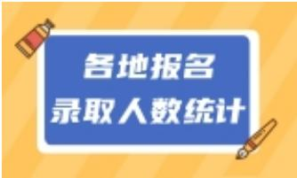
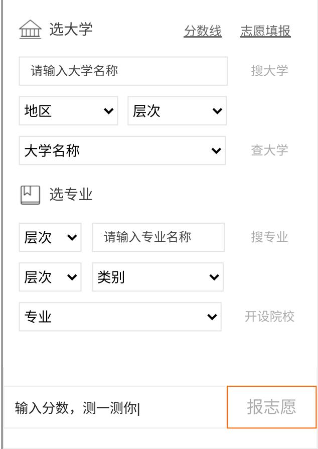

要闻 考试 高考 考研 教师 学术桥 财会

更多

# 掌上高考 掌上考研 学业桥 就业桥 职教网 中小学

B

手机端

掌上高考

掌上考研

学术桥

教育在线

热门服务

考试服务 高招服务 研招服务 人才服务 学业生涯 职教招考 继续教育 就业服务 高教科创 课程思政 教学服务 舆情服务

教育资讯

基础教育 中小学要闻 落实双减 家校共育 总编专栏 校长新声 学校动态良师新语 高等教育 高教要闻 高教政策 高校动态 高校数据 高校科技 高校访谈 高教服务 职业教育 职教要闻 政策法规 思政育人 专业建设 实习实训 校企合作 创业就业 继续教育 最新资讯 政策法规 继教改革 终身学习学术交流 人物专访 专题会议 国际教育 留学快报 政策快讯 国际交流 世界名校 人物连线

合作邮箱：bianji@eol.cn

官方微信ID：eoleoleol

教育在线

国家重点学科

各地高考历年分数线

知分填志愿测一测你能上哪些大学

全国千所大学权威在线答疑

211大学2018各省投档线及位次排名重点大学在各地区录取最低分及位次盘点就业率最高十大热门本科专业双一流高校及学科

内容推荐

最适合女生报考的十大本科热门专业盘点就业面最宽的十大高考专业盘点从C9高校就业报告看未来热门行业低年级学生如何规划自主招生之路？

高考频道

首页 > 高考 > 试题中心> 历年真题

首页 > 高考 > 试题中心> 历年真题

2013四川高考语文试题

2013-06-09

http://gaokao.eol.cn

分享：

关注掌上高考

关注掌上高考

2026年高考招生直播咨询会启动重点大学分数线 中国大学排行榜历年高考真题及答案汇总 加分政策双一流高校 985、 211高校名单历年高考满分作文 各省录取分数线高考志愿填报指南

2013年高考四川各科试题及答案汇总
<table><tr><td rowspan=1 colspan=1>科目</td><td rowspan=1 colspan=2>试题答案</td><td rowspan=1 colspan=1>下载</td><td rowspan=1 colspan=1>科目</td><td rowspan=1 colspan=2>试题答案</td><td rowspan=1 colspan=1>下载</td></tr><tr><td rowspan=1 colspan=1>语文（作文）</td><td rowspan=1 colspan=1>查看</td><td rowspan=1 colspan=1>答案</td><td rowspan=1 colspan=1>下载</td><td rowspan=1 colspan=1>英语</td><td rowspan=1 colspan=1>查看</td><td rowspan=1 colspan=1>答案</td><td rowspan=1 colspan=1>下载</td></tr><tr><td rowspan=1 colspan=1>理科数学</td><td rowspan=1 colspan=1>查看</td><td rowspan=1 colspan=1>答案</td><td rowspan=1 colspan=1>下载</td><td rowspan=1 colspan=1>文科数学</td><td rowspan=1 colspan=1>查看</td><td rowspan=1 colspan=1>答案</td><td rowspan=1 colspan=1>下载</td></tr><tr><td rowspan=1 colspan=1>理科综</td><td rowspan=1 colspan=1>查看</td><td rowspan=1 colspan=1>答案</td><td rowspan=1 colspan=1>下载</td><td rowspan=1 colspan=1>文科综</td><td rowspan=1 colspan=1>查看</td><td rowspan=1 colspan=1>答案</td><td rowspan=1 colspan=1>下载</td></tr></table>

中国教育在线讯 2013四川高考于6月7日开始，中国教育在线在考试后及时公布高考试题、答案和高考作文，并提供高考试题下载以及高考试题的专家点评。请广大考生家长及时关注，同时祝广大考生在2013高考中发挥出最佳水平，考出好成绩！

2013四川高考语文试题答案
<table><tr><td colspan="8" rowspan="1">2013年高考全国各省市各科试题及答案</td></tr><tr><td colspan="1" rowspan="2">大纲全国卷真题/答案</td><td colspan="1" rowspan="1">语文/答案</td><td colspan="1" rowspan="1">数文/答案</td><td colspan="1" rowspan="1">数理/答案</td><td colspan="1" rowspan="1">新课标全国I</td><td colspan="1" rowspan="1">语文/答案</td><td colspan="1" rowspan="1">数文/答案</td><td colspan="1" rowspan="1">数理/答案</td></tr><tr><td colspan="1" rowspan="1">英语/答案</td><td colspan="1" rowspan="1">文综/答案</td><td colspan="1" rowspan="1">理综/答案</td><td colspan="1" rowspan="1">真题/答案</td><td colspan="1" rowspan="1">英语/答案</td><td colspan="1" rowspan="1">文综/答案</td><td colspan="1" rowspan="1">理综/答案</td></tr><tr><td colspan="1" rowspan="2">江苏真题/答案</td><td colspan="1" rowspan="1">语文/答案</td><td colspan="1" rowspan="1">数学/答案</td><td colspan="1" rowspan="1">英语/答案</td><td colspan="1" rowspan="2">新课标全国Ⅱ真题/答案</td><td colspan="1" rowspan="1">语文/答案</td><td colspan="1" rowspan="1">数文/答案</td><td colspan="1" rowspan="1">数理/答案</td></tr><tr><td colspan="1" rowspan="1">政治/答案物理/答案</td><td colspan="1" rowspan="1">历史/答案化学/答案</td><td colspan="1" rowspan="1">地理/答案生物/答案</td><td colspan="1" rowspan="1">英语/答案</td><td colspan="1" rowspan="1">文综/答案</td><td colspan="1" rowspan="1">理综/答案</td></tr><tr><td colspan="1" rowspan="2">安徽真题/答案</td><td colspan="1" rowspan="1">语文/答案</td><td colspan="1" rowspan="1">数文/答案</td><td colspan="1" rowspan="1">数理/答案</td><td colspan="1" rowspan="2">北京真题/答案</td><td colspan="1" rowspan="1">语文/答案</td><td colspan="1" rowspan="1">数文/答案</td><td colspan="1" rowspan="1">数理/答案</td></tr><tr><td colspan="1" rowspan="1">英语/答案</td><td colspan="1" rowspan="1">文综/答案</td><td colspan="1" rowspan="1">理综/答案</td><td colspan="1" rowspan="1">英语/答案</td><td colspan="1" rowspan="1">文综/答案</td><td colspan="1" rowspan="1">理综/答案</td></tr><tr><td colspan="1" rowspan="2">四川真题/答案</td><td colspan="1" rowspan="1">语文/答案</td><td colspan="1" rowspan="1">数文/答案</td><td colspan="1" rowspan="1">数理/答案</td><td colspan="1" rowspan="2">湖北真题/答案</td><td colspan="1" rowspan="1">语文/答案</td><td colspan="1" rowspan="1">数文答案</td><td colspan="1" rowspan="1">数理答案</td></tr><tr><td colspan="1" rowspan="1">英语/答案</td><td colspan="1" rowspan="1">文综/答案</td><td colspan="1" rowspan="1">理综/答案</td><td colspan="1" rowspan="1">英语答案</td><td colspan="1" rowspan="1">文综答案</td><td colspan="1" rowspan="1">理综答案</td></tr><tr><td colspan="1" rowspan="2">湖南真题/答案</td><td colspan="1" rowspan="1">语文/答案</td><td colspan="1" rowspan="1">数文/答案</td><td colspan="1" rowspan="1">数理/答案</td><td colspan="1" rowspan="1">山东</td><td colspan="1" rowspan="1">语文/答案</td><td colspan="1" rowspan="1">数文/答案</td><td colspan="1" rowspan="1">数理/答案</td></tr><tr><td colspan="1" rowspan="1">英语/答案</td><td colspan="1" rowspan="1">文综/答案</td><td colspan="1" rowspan="1">理综/答案</td><td colspan="1" rowspan="1">真题/答案</td><td colspan="1" rowspan="1">英语/答案</td><td colspan="1" rowspan="1">文综/答案</td><td colspan="1" rowspan="1">理综/答案</td></tr><tr><td colspan="1" rowspan="2">广东真题/答案</td><td colspan="1" rowspan="1">语文A/B卷</td><td colspan="1" rowspan="1">数文/答案</td><td colspan="1" rowspan="1">数理/答案</td><td colspan="1" rowspan="2">陕西真题/答案</td><td colspan="1" rowspan="1">语文/答案</td><td colspan="1" rowspan="1">数文/答案</td><td colspan="1" rowspan="1">数理/答案</td></tr><tr><td colspan="1" rowspan="1">A卷/答案</td><td colspan="1" rowspan="1">文综A/答案</td><td colspan="1" rowspan="1">理综A卷/答案</td><td colspan="1" rowspan="1">英语/答案</td><td colspan="1" rowspan="1">文综/答案</td><td colspan="1" rowspan="1">理综/答案</td></tr><tr><td colspan="1" rowspan="2">山西真题/答案</td><td colspan="1" rowspan="1">语文/答案</td><td colspan="1" rowspan="1">数文/答案</td><td colspan="1" rowspan="1">数理/答案</td><td colspan="1" rowspan="2">重庆真题/答案</td><td colspan="1" rowspan="1">语文/答案</td><td colspan="1" rowspan="1">数文/答案</td><td colspan="1" rowspan="1">数理/答案</td></tr><tr><td colspan="1" rowspan="1">英语/答案</td><td colspan="1" rowspan="1">文综/答案</td><td colspan="1" rowspan="1">理综/答案</td><td colspan="1" rowspan="1">英语/答案</td><td colspan="1" rowspan="1">文综/答案</td><td colspan="1" rowspan="1">理综/答案</td></tr><tr><td colspan="1" rowspan="2">天津真题/答案</td><td colspan="1" rowspan="1">语文/答案</td><td colspan="1" rowspan="1">数文/答案</td><td colspan="1" rowspan="1">数理/答案</td><td colspan="1" rowspan="1">福建</td><td colspan="1" rowspan="1">语文/答案</td><td colspan="1" rowspan="1">数文/答案</td><td colspan="1" rowspan="1">数理/答案</td></tr><tr><td colspan="1" rowspan="1">英语/答案</td><td colspan="1" rowspan="1">文综/答案</td><td colspan="1" rowspan="1">理综/答案</td><td colspan="1" rowspan="1">真题/答案</td><td colspan="1" rowspan="1">英语/答案</td><td colspan="1" rowspan="1">文综/答案</td><td colspan="1" rowspan="1">理综/答案</td></tr><tr><td colspan="1" rowspan="2">辽宁真题/答案</td><td colspan="1" rowspan="1">语文/答案</td><td colspan="1" rowspan="1">数文/答案</td><td colspan="1" rowspan="1">数理/答案</td><td colspan="1" rowspan="2">江西真题/答案</td><td colspan="1" rowspan="1">语文/答案</td><td colspan="1" rowspan="1">数文/答案</td><td colspan="1" rowspan="1">数理/答案</td></tr><tr><td colspan="1" rowspan="1">英语/答案</td><td colspan="1" rowspan="1">文综/答案</td><td colspan="1" rowspan="1">理综/答案</td><td colspan="1" rowspan="1">英语/答案</td><td colspan="1" rowspan="1">文综/答案</td><td colspan="1" rowspan="1">理综/答案</td></tr><tr><td colspan="1" rowspan="2">内蒙古真题/答案</td><td colspan="1" rowspan="1">语文/答案</td><td colspan="1" rowspan="1">数文/答案</td><td colspan="1" rowspan="1">数理/答案</td><td colspan="1" rowspan="1">黑龙江</td><td colspan="1" rowspan="1">语文/答案</td><td colspan="1" rowspan="1">数文/答案</td><td colspan="1" rowspan="1">数理/答案</td></tr><tr><td colspan="1" rowspan="1">英语/答案</td><td colspan="1" rowspan="1">文综/答案</td><td colspan="1" rowspan="1">理综/答案</td><td colspan="1" rowspan="1">真题/答案</td><td colspan="1" rowspan="1">英语/答案</td><td colspan="1" rowspan="1">文综/答案</td><td colspan="1" rowspan="1">理综/答案</td></tr><tr><td colspan="1" rowspan="2">贵州真题/答案</td><td colspan="1" rowspan="1">语文/答案</td><td colspan="1" rowspan="1">数文/答案</td><td colspan="1" rowspan="1">数理/答案</td><td colspan="1" rowspan="2">广西真题/答案</td><td colspan="1" rowspan="1">语文/答案</td><td colspan="1" rowspan="1">数文/答案</td><td colspan="1" rowspan="1">数理/答案</td></tr><tr><td colspan="1" rowspan="1">英语/答案</td><td colspan="1" rowspan="1">文综/答案</td><td colspan="1" rowspan="1">理综/答案</td><td colspan="1" rowspan="1">英语/答案</td><td colspan="1" rowspan="1">文综/答案</td><td colspan="1" rowspan="1">理综/答案</td></tr><tr><td colspan="1" rowspan="2">云南真题/答案</td><td colspan="1" rowspan="1">语文/答案</td><td colspan="1" rowspan="1">数文/答案</td><td colspan="1" rowspan="1">数理/答案</td><td colspan="1" rowspan="2">甘肃真题/答案</td><td colspan="1" rowspan="1">语文/答案</td><td colspan="1" rowspan="1">数文/答案</td><td colspan="1" rowspan="1">数理/答案</td></tr><tr><td colspan="1" rowspan="1">英语/答案</td><td colspan="1" rowspan="1">文综/答案</td><td colspan="1" rowspan="1">理综/答案</td><td colspan="1" rowspan="1">英语/答案</td><td colspan="1" rowspan="1">文综/答案</td><td colspan="1" rowspan="1">理综/答案</td></tr><tr><td colspan="1" rowspan="2">宁夏真题/答案</td><td colspan="1" rowspan="1">语文/答案</td><td colspan="1" rowspan="1">数文/答案</td><td colspan="1" rowspan="1">数理/答案</td><td colspan="1" rowspan="2">青海真题/答案</td><td colspan="1" rowspan="1">语文/答案</td><td colspan="1" rowspan="1">数文/答案</td><td colspan="1" rowspan="1">数理/答案</td></tr><tr><td colspan="1" rowspan="1">英语/答案</td><td colspan="1" rowspan="1">文综/答案</td><td colspan="1" rowspan="1">理综/答案</td><td colspan="1" rowspan="1">英语/答案</td><td colspan="1" rowspan="1">文综/答案</td><td colspan="1" rowspan="1">理综/答案</td></tr><tr><td colspan="1" rowspan="2">新疆真题/答案</td><td colspan="1" rowspan="1">语文/答案</td><td colspan="1" rowspan="1">数文/答案</td><td colspan="1" rowspan="1">数理/答案</td><td colspan="1" rowspan="2">西藏真题/答案</td><td colspan="1" rowspan="1">语文/答案</td><td colspan="1" rowspan="1">数文/答案</td><td colspan="1" rowspan="1">数理/答案</td></tr><tr><td colspan="1" rowspan="1">英语/答案</td><td colspan="1" rowspan="1">文综/答案</td><td colspan="1" rowspan="1">理综/答案</td><td colspan="1" rowspan="1">英语/答案</td><td colspan="1" rowspan="1">文综/答案</td><td colspan="1" rowspan="1">理综/答案</td></tr><tr><td colspan="1" rowspan="2">河北真题/答案</td><td colspan="1" rowspan="1">语文/答案</td><td colspan="1" rowspan="1">数文/答案</td><td colspan="1" rowspan="1">数理/答案</td><td colspan="1" rowspan="2">吉林真题/答案</td><td colspan="1" rowspan="1">语文/答案</td><td colspan="1" rowspan="1">数文/答案</td><td colspan="1" rowspan="1">数理/答案</td></tr><tr><td colspan="1" rowspan="1">英语/答案</td><td colspan="1" rowspan="1">文综/答案</td><td colspan="1" rowspan="1">理综/答案</td><td colspan="1" rowspan="1">英语/答案</td><td colspan="1" rowspan="1">文综/答案</td><td colspan="1" rowspan="1">理综/答案</td></tr><tr><td colspan="1" rowspan="2">河南真题/答案</td><td colspan="1" rowspan="1">语文/答案</td><td colspan="1" rowspan="1">数文/答案</td><td colspan="1" rowspan="1">数理/答案</td><td colspan="1" rowspan="2">浙江真题/答案</td><td colspan="1" rowspan="1">语文/答案</td><td colspan="1" rowspan="1">数文/答案数理/答案</td><td colspan="1" rowspan="1">自选模块答案</td></tr><tr><td colspan="1" rowspan="1">英语/答案</td><td colspan="1" rowspan="1">文综/答案</td><td colspan="1" rowspan="1">理综/答案</td><td colspan="1" rowspan="1">英语/答案</td><td colspan="1" rowspan="1">文综/答案</td><td colspan="1" rowspan="1">理综/答案</td></tr><tr><td colspan="1" rowspan="2">上海真题/答案</td><td colspan="1" rowspan="1">语文/答案</td><td colspan="1" rowspan="1">数文/答案</td><td colspan="1" rowspan="1">数理/答案</td><td colspan="1" rowspan="2">海南真题/答案</td><td colspan="1" rowspan="1">语文/答案</td><td colspan="1" rowspan="1">数文/答案</td><td colspan="1" rowspan="1">数理/答案</td></tr><tr><td colspan="1" rowspan="1">英语/答案地理/答案</td><td colspan="1" rowspan="1">政治/答案物理/答案</td><td colspan="1" rowspan="1">历史/答案化学/答案生物/答案</td><td colspan="1" rowspan="1">英语/答案地理/答案</td><td colspan="1" rowspan="1">政治/答案物理/答案</td><td colspan="1" rowspan="1">历史/答案化学/答案生物/答案</td></tr></table>

2013四川高考语文答案  
2013四川高考试题及答案汇总  
2013四川高考数学理答案  
2013四川高考数学文答案  
2013四川高考数学文答案  
2013四川高考英语答案  
2013四川高考理综答案  
2013四川高考文综试题及答案

## 数读高考

2025高校电子招生简章 | 历年高考真题及答案 往期回顾》  
10个新兴专业！首届招生！  
高考生如何选择学校和专业？  
就业前景好的热门专业有哪些？  
这个专业成就业市场“香饽饽”

2025年各地高考时间及科目安排往期回顾》首次招生！师范大学，成立新专业ChatGPT爆火，高中生未来如何选专业？哪些学生具有高考保送资格？全国唯一！本科生可免费加修微专业

## 免责声明：

① 凡本站注明“稿件来源：教育在线”的所有文字、图片和音视频稿件，版权均属本网所有，任何媒体、网站或个人未经本网协议授权不得转载、链接、转贴或以其他方式复制发表。已经本站协议授权的媒体、网站，在下载使用时必须注明“稿件来源：教育在线”，违者本站将依法追究责任。

② 本站注明稿件来源为其他媒体的文/图等稿件均为转载稿，本站转载出于非商业性的教育和科研之目的，并不意味着赞同其观点或证实其内容的真实性。如转载稿涉及版权等问题，请作者在两周内速来电或来函联系。

热门推荐  
热门关注  
大学信息  
985工程大学211工程大学正规大学名单双一流大学专业信息  
国家重点学科高校特色专业热门专业解读专业变更信息参考工具  
高考一分一段高校投档线高考分数线平行志愿解读高考政策  
高考加分政策高校招生章程高考政策解读高考百科全书

精彩推荐先选学校还是先选专业就业率最高的十大专业最适合女生选择的专业高校新增及撤销本科专业提前批有哪些大学和专业自主招生对竞赛成绩要求

相关新闻  
2013四川高考语文答案  
2013-06-09  
2013四川高考试题及答案汇总  
2013-06-08  
2013四川高考数学理答案  
2013-06-09  
2013四川高考数学文答案  
2013-06-09  
eol.cn简介 | 联系方式 | 网站声明 | 京ICP证140769号 | 京ICP备12045350号 | 京公网安备  
11010802020236号  
版权 北京中教双元科技集团有限公司 Corporation  
Mail to:webmaster@eol.cn  
版权所有 教育在线

文进，有出自北宋徐照野速风格的没骨画家孙隆，有笔墨洗练奔放、造型生动的水墨写意画家林良，还有精回租健并存、工笔写意兼具的画家召纪。不过，这些风格面貌大多沿袭宋代花鸟画，并无根本突破。从意境与格调方面看，这时期的花鸟画比宋代院体花鸟画略逊一筹。事实上，明代花鸟画的大突破直到中期以后才出现。

庭，最有代表性的是吴门画派。吴门画派的成就主要在山水画方面，代表人物有茶擅人物、画传统，疏简而不放速；唐寅与仇英主要吸收南宋院体画风，并融入了时代的精神特质，体现了当时的市民趣味。他们的花鸟画在吸收前代大师成果的基础上发展出鲜明的个性特征，在美术史上额有影响。

概越xKcom山水兼撞。他将书法和山水画笔法融入花乌画，运用水墨的于温浓淡和渗说陈浑的文写意花鸟充分表达了笔墨的特性与画面的形式感，那么徐渭的作品则充分发挥了大写意花鸟托物言志的功能，浇胸中块全，抒澎湃激情。在绘画语言风格方面，他吸收宋、元文人画及林良、沈周、陈淳的长处，兼融民间画师的优点，同时将自己擅长的狂草笔法融入为设过拉尿塞渗化效果，表达特殊韵味。他还以泼墨法作花鸟，用笔墨的纵横捭阖表达自身的愤愚情绪。徐渭开创了大写意花鸟的新体派，八大山人、石涛、扬州八怪、海派乃至齐白石都曾受其影响。他的成就超越了早

A. 照宣宗时宫廷画院花鸟画风格面貌多样植意与格调比宋代院体花鸟画略B.“吴门四家”花鸟画在吸收前代大师成果基础上发展出鲜明个性特征，取得重大破。C. 陈淳的大写意花鸟画充分表达了笔墨的特性与画面的形式感，开写涉—代新风D. 徐渭开创了大写意花鸟画的新体派，其成就超越了早于他的陈淳，对后世影响深远

6. 下列对明代花鸟画取得丰硕成果的原因的分析，不恰当的一项是A. 画家们广泛地学习和借鉴院体画家、文人画家及民间画师的优良画风。BW/应人参与花鸟画创作以后，绘画作品更具有生活气息和时代精神特质。C. 家们具有积板参与社会生活的激情和狂怪奇崛、傲视万物的强然收生D. 画家们大胆尝试，或借鉴山水画笔法，或引书法笔法人画，或使用新材料

7. 下列对原文内容的理解与分析，正确的一项是A. 明宣宗在位期间，宫廷画院的花鸟画只是宋代花鸟画的风格面貌，没有取B. 明代中期，吴门画派的花鸟画由于创作风格一开始就标新立异，所以取得学科网首发试卷 www.zxoxk.com/feature/2013ak/

C. 陈淳学习文微明用水墨的干湿浓淡和渗透表现花叶的技法，画风简练放逸又不失法度。

D. 徐渭将狂草笔法、泼墨法融入大写意花鸟画，很好地表达了他的澎湃激情和愤缴情绪。三、(6分，每小题3分)

金履祥字言父，婺之兰溪人。幼而敏睿，父兄稍授之书，即能记诵。比长，益自策励。及是讲贯益密，造诣益速。

时宋之国事已不可为，履祥逆绝意进取。然负其经济之略，亦未忍遽忘斯世也。会襄樊之师日急，宋人坐视而不敢救，履祥因进牵制捣虚之策，请以重兵由海道直趋燕、蓟，则襄樊之师，将不攻而自解。且备叔海舶所经，凡州郡县邑，下至巨洋别岛，难易远近，历历可据以

平居独处，终xc9m%；至与物接，则盘然和怪。的通后学，谆切无倦，而尤筹听w疲。 有故人子坐事，母子分配为隶，不相知者十年，履祥倾赀营购，卒赎以完；其子后责，履祥终不自言，

履祥尝谓司马文正公光作《资治通鉴》，秘书丞刘恕为《外纪》，以记前事，不本于经，而信百家之说，是非谬于圣人，不足以传信。乃以《尚书》为主，下及《诗》《礼》《春秋》，旁采旧

初，履祥既见王柏，首问为学之方，柏告以必先立志，且举先儒之言：居敬以持其志，立志以定其本，志立乎事物之表，敬行乎事物之内，此为学之大方也。及见何基，基谓之曰：“会之屡言贤者之贤，理欲之分，便当自今始。”会之，盖柏宇也。当时议者以为基之清介纯实似

履祥居仁山之下，学者因称为仁山先生。大德中卒。元统初，里人吴师道为国子博士，

(节选自《元史·金履祥传》)

向：崇尚。  
逢：精深。  
勒：镌刻。

9. 下列各句中，加点词意义和用法都相同的一项是A. 然负其经济之略 余嘉其能行古道使工以药淬之C. 且举先儒之言 学科网首发试卷 www.zxxk且戴于楚也013gk/D. 履祥则亲得之二氏 徒慕君之高义也

## 第Ⅱ卷（非单项选择题共123分）

##

##

www.zxk.com轼》)

##

这是每一本地理与上提到过的著名河流：一条河流在哪里出现，从哪里经过，又归置，决不是的事：答里木河的出现，再一次证明作为一条河流的必性和，必归

溪的冰峰雪岭，隔着来自外界的声音。充满面意的需只能在人的天空委响。些今人往的潮音，只能打湿他乡的梦。极度双的需声大空的一次次同，而降两量几乎等于零的天空，又一遍遍让塔支拉现于平的沙读，保生公黄壁基看胸，领天盖地的尘沙装满眼眶。多么需要水，地是生活的金美失意。

一车直的河流，坦荡、刚预而勇取。该扬波的时候必定拓

##

Www

www.zxxk.com

www.zxxk.com