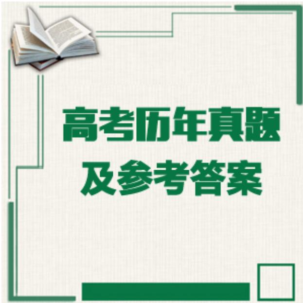

要闻 考试 高考 考研 教师 学术桥 财会

更多

# 掌上高考 掌上考研 学业桥 就业桥 职教网 中小学

B

手机端

掌上高考

掌上考研

学术桥

教育在线

热门服务

考试服务 高招服务 研招服务 人才服务 学业生涯 职教招考 继续教育 就业服务 高教科创 课程思政 教学服务 舆情服务

教育资讯

基础教育 中小学要闻 落实双减 家校共育 总编专栏 校长新声 学校动态良师新语 高等教育 高教要闻 高教政策 高校动态 高校数据 高校科技 高校访谈 高教服务 职业教育 职教要闻 政策法规 思政育人 专业建设 实习实训 校企合作 创业就业 继续教育 最新资讯 政策法规 继教改革 终身学习学术交流 人物专访 专题会议 国际教育 留学快报 政策快讯 国际交流 世界名校 人物连线

合作邮箱：bianji@eol.cn

官方微信ID：eoleoleol

教育在线

国家重点学科

各地高考历年分数线

知分填志愿测一测你能上哪些大学

全国千所大学权威在线答疑

211大学2018各省投档线及位次排名重点大学在各地区录取最低分及位次盘点就业率最高十大热门本科专业双一流高校及学科

内容推荐

最适合女生报考的十大本科热门专业盘点就业面最宽的十大高考专业盘点从C9高校就业报告看未来热门行业低年级学生如何规划自主招生之路？

高考频道

首页 > 高考 > 试题中心> 历年真题

首页 > 高考 > 试题中心> 历年真题

2014四川高考语文试题

2014-06-09

http://gaokao.eol.cn

分享：

关注掌上高考

关注掌上高考

2026年高考招生直播咨询会启动重点大学分数线 中国大学排行榜历年高考真题及答案汇总 加分政策双一流高校 985、 211高校名单历年高考满分作文 各省录取分数线高考志愿填报指南

2014年高考四川各科试题及答案汇总
<table><tr><td rowspan=1 colspan=1>科目</td><td rowspan=1 colspan=2>试题答案</td><td rowspan=1 colspan=1>下载</td><td rowspan=1 colspan=1>科目</td><td rowspan=1 colspan=2>试题答案</td><td rowspan=1 colspan=1>下载</td></tr><tr><td rowspan=1 colspan=1>语文（作文)</td><td rowspan=1 colspan=1>查看</td><td rowspan=1 colspan=1>答案</td><td rowspan=1 colspan=1>下载</td><td rowspan=1 colspan=1>英语</td><td rowspan=1 colspan=1>查看</td><td rowspan=1 colspan=1>答案</td><td rowspan=1 colspan=1>下载</td></tr><tr><td rowspan=1 colspan=1>理科数学</td><td rowspan=1 colspan=1>查看</td><td rowspan=1 colspan=1>答案</td><td rowspan=1 colspan=1>下载</td><td rowspan=1 colspan=1>文科数学</td><td rowspan=1 colspan=1>查看</td><td rowspan=1 colspan=1>答案</td><td rowspan=1 colspan=1>下载</td></tr><tr><td rowspan=1 colspan=1>理科综</td><td rowspan=1 colspan=1>查看</td><td rowspan=1 colspan=1>答案</td><td rowspan=1 colspan=1>下载</td><td rowspan=1 colspan=1>文科综</td><td rowspan=1 colspan=1>查看</td><td rowspan=1 colspan=1>答案</td><td rowspan=1 colspan=1>下载</td></tr></table>

中国教育在线讯 2014四川高考于6月7日开始，中国教育在线在考试后及时公布高考试题、答案和高考作文，并提供高考试题下载以及高考试题的专家点评。请广大考生家长及时关注，同时祝广大考生在2014高考中发挥出最佳水平，考出好成绩！

2014四川高考语文试题答案

特别提醒：考生在所有科目结束后，应当尽快估分。根据估分选校选专业，专家指导平行志愿填报，性格测试找准专业，请点击这里。

<table><tr><td rowspan=1 colspan=11>2014年高考全国各省市各科试题及答案</td></tr><tr><td rowspan=1 colspan=1>新课标ⅠⅡ</td><td rowspan=1 colspan=1>大纲卷</td><td rowspan=1 colspan=1>湖北</td><td rowspan=1 colspan=1>山东</td><td rowspan=1 colspan=1>广东</td><td rowspan=1 colspan=1>四川</td><td rowspan=1 colspan=1>安徽</td><td rowspan=1 colspan=1>山西</td><td rowspan=1 colspan=1>黑龙江</td><td rowspan=1 colspan=1>辽宁</td><td rowspan=1 colspan=1>福建</td></tr><tr><td rowspan=1 colspan=1>河南</td><td rowspan=1 colspan=1>河北</td><td rowspan=1 colspan=1>江苏</td><td rowspan=1 colspan=1>陕西</td><td rowspan=1 colspan=1>湖南</td><td rowspan=1 colspan=1>北京</td><td rowspan=1 colspan=1>吉林</td><td rowspan=1 colspan=1>贵州</td><td rowspan=1 colspan=1>广西</td><td rowspan=1 colspan=1>云南</td><td rowspan=1 colspan=1>新疆</td></tr><tr><td rowspan=1 colspan=1>内蒙古</td><td rowspan=1 colspan=1>甘肃</td><td rowspan=1 colspan=1>浙江</td><td rowspan=1 colspan=1>重庆</td><td rowspan=1 colspan=1>江西</td><td rowspan=1 colspan=1>天津</td><td rowspan=1 colspan=1>上海</td><td rowspan=1 colspan=1>宁夏</td><td rowspan=1 colspan=1>青海</td><td rowspan=1 colspan=1>海南</td><td rowspan=1 colspan=1>西藏</td></tr></table>

2014四川高考语文答案

2014年四川高考语文：甲骨文入题 重在考查探究能力

教育专家评析2014年四川高考试题：贴近时事

2014四川高考语文试题解析：部分考生称不难

2014四川高考语文试题解析：部分考生称不难

2014四川高考试题及答案汇总

2014四川高考文综答案

2014四川高考理综答案

数读高考

2025高校电子招生简章 | 历年高考真题及答案 往期回顾》  
10个新兴专业！首届招生！  
高考生如何选择学校和专业？  
就业前景好的热门专业有哪些？  
这个专业成就业市场“香饽饽”

2025年各地高考时间及科目安排往期回顾》首次招生！师范大学，成立新专业ChatGPT爆火，高中生未来如何选专业？哪些学生具有高考保送资格？全国唯一！本科生可免费加修微专业

## 免责声明：

① 凡本站注明“稿件来源：教育在线”的所有文字、图片和音视频稿件，版权均属本网所有，任何媒体、网站或个人未经本网协议授权不得转载、链接、转贴或以其他方式复制发表。已经本站协议授权的媒体、网站，在下载使用时必须注明“稿件来源：教育在线”，违者本站将依法追究责任。

② 本站注明稿件来源为其他媒体的文/图等稿件均为转载稿，本站转载出于非商业性的教育和科研之目的，并不意味着赞同其观点或证实其内容的真实性。如转载稿涉及版权等问题，请作者在两周内速来电或来函联系。

<table><tr><td colspan="2">选大学</td><td>分数线 志愿填报</td><td>搜大学</td></tr><tr><td colspan="2">请输入大学名称</td><td colspan="2"></td></tr><tr><td colspan="2">地区 V</td><td>层次</td><td colspan="2"></td></tr><tr><td colspan="2">大学名称</td><td>V</td><td>查大学</td></tr><tr><td colspan="2">选专业</td><td></td><td></td></tr><tr><td>层次 √</td><td colspan="2">请输入专业名称</td><td>搜专业</td></tr><tr><td>层次</td><td colspan="2">类别 V</td><td></td></tr><tr><td colspan="2">专业</td><td>V</td><td rowspan="2">开设院校</td></tr><tr><td colspan="2"></td><td></td></tr><tr><td colspan="2">输入分数，测一测你的录取概率</td><td></td><td>报志愿</td></tr></table>

热门推荐  
热门关注  
大学信息  
985工程大学211工程大学正规大学名单双一流大学专业信息  
国家重点学科高校特色专业热门专业解读专业变更信息参考工具  
高考一分一段高校投档线高考分数线平行志愿解读高考政策  
高考加分政策高校招生章程高考政策解读高考百科全书

精彩推荐

高校新增及撤销本科专业提前批有哪些大学和专业自主招生对竞赛成绩要求

相关新闻

2014四川高考语文答案

2014-06-09

2014年四川高考语文：甲骨文入题 重在考...

2014-06-08

教育专家评析2014年四川高考试题：贴近时事

2014-06-09

2014四川高考语文试题解析：部分考生称不难

2014-06-08

eol.cn简介 | 联系方式 | 网站声明 | 京ICP证140769号 | 京ICP备12045350号 | 京公网安备11010802020236号

版权 北京中教双元科技集团有限公司 Corporation

Mail to:webmaster@eol.cn

(www.zxxk.com www.zxxk.com

##

永的初步欣赏者了。

## www.zxxk

下列对文章有关内容的理解和赏析，不正确的两项量者思考人生的意义。

17. 文章第⑧段写“我”在濑户内海旅行，有什么作用m要分析。(6分)

深沉的地方，(郁达夫《故都的秋》)

## 汉字字形演变表

<table><tr><td rowspan=2 colspan=1></td><td rowspan=2 colspan=2>书谐</td><td rowspan=1 colspan=2>鱼</td><td rowspan=1 colspan=2>马</td><td rowspan=1 colspan=2>为</td><td rowspan=1 colspan=2>受</td><td rowspan=1 colspan=1>车</td></tr><tr><td rowspan=1 colspan=2>留</td><td rowspan=1 colspan=2>馬</td><td rowspan=1 colspan=2>為</td><td rowspan=1 colspan=2>受</td><td rowspan=1 colspan=1>車</td></tr><tr><td></td><td rowspan=1 colspan=2></td><td rowspan=1 colspan=2>魚</td><td rowspan=1 colspan=2>馬</td><td rowspan=1 colspan=2>爲</td><td rowspan=1 colspan=2>电</td><td rowspan=1 colspan=1>車</td></tr><tr><td></td><td rowspan=1 colspan=2>2</td><td rowspan=1 colspan=2></td><td rowspan=1 colspan=2></td><td rowspan=1 colspan=2>壓</td><td rowspan=1 colspan=2>EG</td><td></td><td rowspan=1 colspan=1>車</td></tr><tr><td rowspan=1 colspan=2>金</td><td rowspan=1 colspan=2>爱</td><td rowspan=1 colspan=2></td><td rowspan=1 colspan=2>辖</td><td rowspan=1 colspan=2>白</td><td rowspan=1 colspan=2>#</td></tr><tr><td rowspan=1 colspan=2>文E甲</td><td rowspan=1 colspan=2></td><td rowspan=1 colspan=2>涩？</td><td rowspan=1 colspan=2>文</td><td rowspan=1 colspan=2>孚</td><td rowspan=1 colspan=2>长果</td></tr></table>

www.zxxk.com

www.zxxk.com zxxk.com

##

##

##

www.zxxk.com

## 语文试题参考答案

##