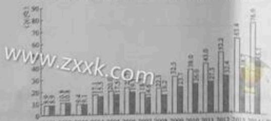

全国III卷试题适用地区：云南、四川、广西、贵州

2017年高考全国卷Ⅲ各科试题及答案汇总
<table><tr><td rowspan=1 colspan=1>科目</td><td rowspan=1 colspan=2>试题答案</td><td rowspan=1 colspan=1>下载</td><td rowspan=1 colspan=1>科目</td><td rowspan=1 colspan=2>试题答案</td><td rowspan=1 colspan=1>下载</td></tr><tr><td rowspan=1 colspan=1>语文</td><td rowspan=1 colspan=1>查看</td><td rowspan=1 colspan=1>答案</td><td rowspan=1 colspan=1>下载</td><td rowspan=1 colspan=1>英语</td><td rowspan=1 colspan=1>查看</td><td rowspan=1 colspan=1>答案</td><td rowspan=1 colspan=1>下载</td></tr><tr><td rowspan=1 colspan=1>理科数学</td><td rowspan=1 colspan=1>查看</td><td rowspan=1 colspan=1>答案</td><td rowspan=1 colspan=1>下载</td><td rowspan=1 colspan=1>文科数学</td><td rowspan=1 colspan=1>查看</td><td rowspan=1 colspan=1>答案</td><td rowspan=1 colspan=1>下载</td></tr><tr><td rowspan=1 colspan=1>理科综合</td><td rowspan=1 colspan=1>查看</td><td rowspan=1 colspan=1>答案</td><td rowspan=1 colspan=1>下载</td><td rowspan=1 colspan=1>文科综合</td><td rowspan=1 colspan=1>查看</td><td rowspan=1 colspan=1>答案</td><td rowspan=1 colspan=1>下载</td></tr></table>

中国教育在线讯2017高考于6月7日开始，中国教育在线在考试后及时公布高考试题、答案和高考作文，并提供高考试题下载以及高考试题的专家点评。请广大考生家长及时关注，同时祝广大考生在2017高考中发挥出最佳水平，考出好成绩！

2017全国卷3高考语文试题
<table><tr><td rowspan=1 colspan=12>2017年高考全国各省市各科试题及答案</td></tr><tr><td rowspan=1 colspan=1>全国卷Ⅰ</td><td rowspan=1 colspan=1>湖北</td><td rowspan=1 colspan=1>福建</td><td rowspan=1 colspan=1>广东</td><td rowspan=1 colspan=1>湖南</td><td rowspan=1 colspan=1>安徽</td><td rowspan=1 colspan=1>山西</td><td rowspan=1 colspan=1>河北</td><td rowspan=1 colspan=1>河南</td><td rowspan=1 colspan=1>江西</td><td rowspan=1 colspan=1></td><td rowspan=1 colspan=1></td></tr><tr><td rowspan=1 colspan=1>全国卷Ⅱ</td><td rowspan=1 colspan=1>甘肃</td><td rowspan=1 colspan=1>青海</td><td rowspan=1 colspan=1>西藏</td><td rowspan=1 colspan=1>黑龙江</td><td rowspan=1 colspan=1>吉林</td><td rowspan=1 colspan=1>辽宁</td><td rowspan=1 colspan=1>宁夏</td><td rowspan=1 colspan=1>新疆</td><td rowspan=1 colspan=1>内蒙古</td><td rowspan=1 colspan=1>陕西</td><td rowspan=1 colspan=1>重庆</td></tr><tr><td rowspan=1 colspan=1>全国卷ⅢⅢ</td><td rowspan=1 colspan=1>云南</td><td rowspan=1 colspan=1>四川</td><td rowspan=1 colspan=1>广西</td><td rowspan=1 colspan=1>贵州</td><td rowspan=1 colspan=1></td><td rowspan=1 colspan=1></td><td rowspan=1 colspan=1></td><td rowspan=1 colspan=1></td><td rowspan=1 colspan=1></td><td rowspan=1 colspan=1></td><td rowspan=1 colspan=1></td></tr><tr><td rowspan=1 colspan=1>自主命题</td><td rowspan=1 colspan=1>北京</td><td rowspan=1 colspan=1>天津</td><td rowspan=1 colspan=1>江苏</td><td rowspan=1 colspan=1>山东</td><td rowspan=1 colspan=1>上海</td><td rowspan=1 colspan=1>海南</td><td rowspan=1 colspan=1>浙江</td><td rowspan=1 colspan=1></td><td rowspan=1 colspan=1></td><td rowspan=1 colspan=1></td><td rowspan=1 colspan=1></td></tr></table>

年间增长了8倍，对于青少年而言，博物馆逐渐成为学校互动性、体验性、趋味性方面发挥着独特的优势。2014年，许（套）藏品，银托送些藏品在历史。文化，考古等领域开展至也非常半富，针对藏品的研究，需要整合学校和研究机构的社会成为一个地区的文史研究中心，同时，博物馆连渐成为开城市文化品牌价值的重要载体，2010年，西安市委，市政府正物惊之城”的战略目标，随后广州，济南等城市也纷给提出建设以此反开本的念牛力、（摘编自刘世锦主编《中国文化遗

## 子网

2008年起，中国文化天物系统的博物馆开始全面免费开藏，北后博物重献逐渐弱化。因此，只能通过博物馆事业增加值来街量博物馆对国氏程济的直接资献。博物综事业增加值即文化文物系统内的博物馆向社会提供产品成及务（如文化创意产品销售，文物巡展，社会文物鉴定及咨询等）而增和的价值总和。2001-2014年全国终物综事业增加值变化情况如下图：

增加值（教造年价格计算）增加值（核200车可试价操计算）  

(撕编自苏析等主编《中国文化遗产事业发展报告（2015\~2016)》）

时期进行西史对比，以成察国民经莎的况辅情况

要真正了解或融入一个城市与国家，最直8  
京每年福待的上亿游客中，相当一作双化的  
开和技神社心的 是情他信对国民经济的间接资

语文试题第5页（共10页）

www.xkicgm，不正硕的年、最高的年份是20与靠一年相比构至现上升态势

C 2001年可比价都计算，十几年间全国博物馆事业增加值大体上保持了较好的

3.套些年价基计集出的增加值与按可比价格计算出的增加值相比，二者差距最大的

科形式可以丰富大众的精神文化生活。

3.博物馆通重或为学校教育的“第二课堂”，它通过独特的学习资源，以适应青少特点的方式，重励青

C.西安。广州等城形越来越重批利用博物馆来展现坡市历史中最有深度和吸引力的元要，进以此构建城市文化

D. 需物理先费开放会使其经济卖献逐渐弱化，因此需要通过博物馆事业增加值来面骨博物惊对国民校济的全部页赋。

三.需物理对能差经济的提动是非常重要的贡献，这也是提升博物馆诸如宣传和教育等其他花能的关键所在。

相4济，根括说喷博物馆在科研方面的作用，(4分）

## xxk.com二、吉代诗文阅录（35分

（一）文言文阅读（本题共4小题，19分）

痴津下面的文言文。完成10\~13题。

许些学冲无。猛州国人，季进士第一。种宗召对，毕集贤校理，同知北院，编修中新之。则伤期体。”进命将诺柜密院词文书，及二

老叹日：“自王浙公后其俗自息，召为兵自《宋史·等》网

10. 下列对文中面波浪线部分的断句，正确的一项是（3分）A. 初/选人调拟/先南普/次考功/综核无法/支得缘文为好选者/又不得诉长吏/将奏婴南曹/骗公舍以待来诉者/士无重难/B. 初选人调拟/先南曹/次考功/综核无法/吏得缘文为好选者/又不得诉长变/将卖婴南曹/群公会以特来诉者/士无留难/C. 初选人调拟/先南曹/次考功/综核无法/更得缘文为奸/选者又不善诉长变/将奏要南曹/辟公会以待来诉者/士无审难/

/土无面难

11下列对文中加点可语的相关内容的解说，不正确的一项是（3分A.状元是我国古代科举制度中一种称号，指在最高级别的级试中获得第一名的人。B.上元是我国传统节日，即农历正月十五日元宵节，是春节后第一个重要节日。C.近待是指接近并随待帝王左右的人，他们不仅职位很高，对帝王的影响也很大。D. 告老本指古代社会官员因年老游去职务、有时也是官员因故那职验一种借口。

学科网首发试者 宋朝割让代州，蓄意执料。他坚决予以反击，使对方未占得便宜而返回B. 许将善兽于沧理，境内牢狱皆空。他在聊州任上，因治理养注、当地没有起法之人，当地士人爱好议论官政，他未加禁止，而是宽检应对、此您告然止息。C.许数任职兵部，熟添兵部事务。他损任兵那待都对上硬提出，给兵之道在于关话道词计西磁到万众犹如一人。神宗问及共马之教，他也助作出回答。

13翻译成现代汉语。（10分）

(1）将曰：“此事，申饬边臣岂不可，何以使为？”禧惭不能对。

(2)章惇为相，与蔡卞同肆罗织，贬请元祐诸臣，奏发司马光墓。

（二）古代诗歌阅读（本题共2小题，11分）

阅读下面这首唐诗，完成14\~15题。

遍集拙诗，成一十五卷，因题卷末，戏赠元九、李二十白居易学科网www.zxtk.c0 每被老元偷格律，苦教短李伏歌行。世间富责应无分，身后文章合有名。莫怪气租言语大，新排十五卷诗成。

[注]①元九、李二十：分指作者的前友元稹、李坤，即诗中的“老元”“短李”。李牌身材矮小。时称“短李”。②长恨：指作者的长诗《长恨歌》，③秦吟：指作者的讽喻组诗《秦中吟》。正声：雅正的诗算。④伏：服气。

14. 以下对本诗的理解和分析，不正确的两项是（5分）A.《长情以4》都是白居易的得意之作，能够作为其诗歌创作的代表。B.元稹常常私下对自居易的诗款进行模仿，这从侧面说明了白铸较高的创作水准。C. 白居易在诗中称呼李缔为“短李”，也隐含着不太认可李绅诗歌创作的意思。D. 作者坚信自己必将因文学成就而名扬后世，因此并不介意在当时是否得到认可。E.在诗的最后两句中，白居易称，自己新编出的诗集可以成为自我炫耀的资本。

15. 请从“戏赠”入手，结合全诗，分析作者表达的情感态度。（6算名本类学科网首发试

16. 补写出下列句子中的空缺部分，(5分）

《1》《苟子·劝学》中强调了积累的重要。以积土成山、积水成渊可以兴风雨、生较龙没喻，引出“ 的观点。

(2)杜用。基星为秋风所破歌》中，狂风签之会星变得墨果，天色马上暗下来，引出下交多遭连夜雨 www.z的境况。

下列各句中加点成语的使用，全都不正确的一项是（3分）行之有效的

②小庄从小就对机器人玩具特则感兴趣，上学后喜欢收集机器人模型，通过各种途径得到的模型已经行牛充栋，整整一同屋都摆满了。

③的输进的学术方法虽比较新颖，但其学术成果得到学术界公认的却不是很多，再加上其速越者

张家界独特的有然学观被列入《世界自然遗产名录》，挑洋其间，译出至所坚幽深，溪流澄碧，让人乐不思勇。

⑤近年来，有关部门采取了一系列接施强化虚假广告的监管，使得温等充数的广告得到了一定程度的通制

⑧丹·罗斯嘉德发明的“雾鑫塔”是一种利用静电吸附空粒原理的环保装置，脏空气滔滔不绝地从塔顶进入后。能在塔中同得到净化。

A. ①③③ B. ①0⑥   
D. ②③⑥

is.wwww.zxxk.com分)A. 今天参观的石窟造像群气势宏伟，内容半富，堪称当时的石刻艺术之冠，被誉为中国古代雕刻艺术的宝库。B. 传统文化中的餐桌礼仪是很受重视的，老人常说，看一个人的吃相，往往会暴露他的性格特点和教养情况。  
C. 在那些父母性格温和。情绪平和的孩子身上，往往笑容更多，幸福感更强，抗  
学科网首发试 挫折能力更突出，看待世界也更加宽容

19. 下列各句中，表达得体的一句是（3分）D. 当于路用单氧，我赶到的定地点的时候，对方早已x www.zxxk.com辑严密，每处不超过16个字。(6分) 产横线处补写恰当的语句，使整段文字语意完整述营，内容贴切，逻夏季阳光强度大而风小， 太阳能与风临①遗常白天阳光强而风小，夜晚光照变得很弱而风力加强；②这种互补性使风光互补发电系统在资源上具有银好的西配性，常见的风光至补发电系统有两套发电设备，夜间和阴天由风力发电装置发统发电更经济。 在既有风义有太阳的情况下，二者同时发挥作用，比单用风力或大阳

21下面交 www.zxxk.com

说明另外两处问题。(5分)“爆竹声声除旧岁”，说的是欢度春节时的传统习俗。春节燃放烟花爆竹虽然喜庆。但食带来空气、噪声等环境污染问题，还可能引发大灾，一三引发大灾，势必造成人身伤亡和财产损失，现在很多城市已经限制燃放，这样就可以避免发生大灾，而且只要限制燃放，就能避免环境污染，让空气断鲜、环境优美。

①火灾不一定会造成人身伤亡。

www.zxxk.com

## 四、写作（60分）

## 22.阅读下面的材料，根据要求写作。(60分)

今年是我国恢复高考40周年、40年未，高考为国选材，推动了教育改革与社会进步，取得了举世 日的或就，4的0年来，高考激扬梦想，硬聚看几代青平的集体记值发试卷的扔点：意今天，饮正点

请以“我看高考”或“我的高考”为副标题，写一员文章，要求选好角度，确定立意明确文体、自拟标题，不要套作，不得抄表：不少于800字

学科网

www.zxxk.com