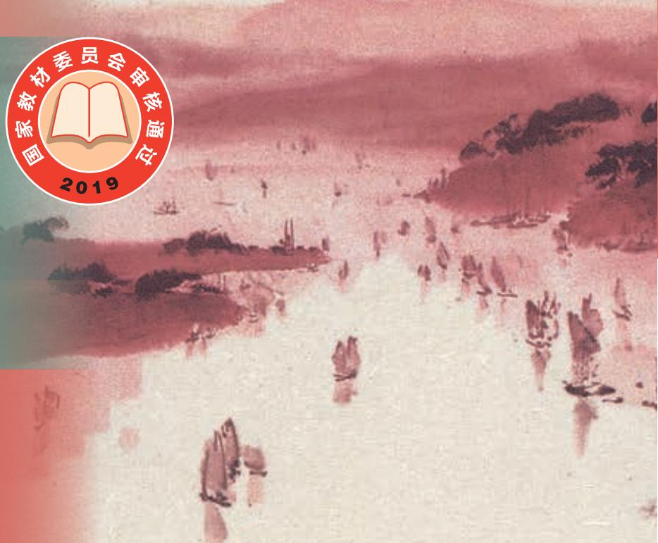

# 语文

必 修

人民教育出版社

上. 册

普通高中教科书

# 语文

必修

上册

教育部组织编写

总主编：温儒敏

本册主编：刘勇强 杨九俊

编写人员：（以姓氏笔画为序）

王岱王栋生朱德勇张克中

胡勤倪文尖常森蔡可

责任编辑：胡晓韩涵

美术编辑：房海莹

普通高中教科书语文必修上册

教育部组织编写

出版人民教育出版社

（北京市海淀区中关村南大街17号院1号楼 邮编：100081)

网址 http://www.pep.com.cn

## 目录

第一单元  
1 沁园春·长沙/毛泽东 2  
2 立在地球边上放号/郭沫若 4  
红烛/闻一多 4  
\*峨日朵雪峰之侧/昌耀 6  
\*致云雀/雪莱 7  
3 百合花/茹志鹃 12  
\*哦，香雪/铁凝 19  
单元学习任务 29  
第二单元 31  
4 喜看稻菽千重浪  
一记首届国家最高科技奖获得者袁隆平/沈英甲 32  
\*心有一团火，温暖众人心/林为民 38  
\*“探界者”钟扬/叶雨婷 43  
5 以工匠精神雕琢时代品质/李斌 51  
6 芣莒/《诗经·周南》 53  
插秧歌/杨万里 53  
单元学习任务 55  
第三单元 7 短歌行/曹操 编 版 57 58  
\*归园田居（其一)/陶渊明 59  
8 梦游天姥吟留别/李白 60  
登高/杜甫 61  
琵琶行并序/白居易 62  
9 念奴娇·赤壁怀古/苏轼 65  
\*永遇乐·京口北固亭怀古/辛弃疾 66  
\*声声慢（寻寻觅觅)/李清照 67  
单元学习任务 69  
第四单元  
家乡文化生活 71  
学习活动  
一 记录家乡的人和物 72  
二 家乡文化生活现状调查 73  
三 参与家乡文化建设 74  
第五单元  
整本书阅读 79  
《乡土中国》 80  
第六单元 83  
10 劝学/《荀子》 84  
\*师说/韩愈 85  
11 反对党八股（节选)/毛泽东 8949  
12 拿来主义/鲁迅  
13\*读书：目的和前提/黑塞  
\*上图书馆/王佐良 100  
单元学习任务 103  
第七单元 105  
14 故都的秋/郁达夫 106  
\*荷塘月色/朱自清 109  
15 我与地坛（节选)/史铁生 112  
16 赤壁赋/苏轼 118  
\*登泰山记/姚鼐 120  
单元学习任务 123  
第八单元  
词语积累与词语解释 125  
学习活动  
丰富词语积累 126  
二 把握古今词义的联系与区别 127  
三 词义的辨析和词语的使用 128  
古诗词诵读 140  
静女/《诗经·邶风》 140  
涉江采芙蓉/《古诗十九首》 141  
虞美人（春花秋月何时了)/李煜 142  
鹊桥仙（纤云弄巧）/秦观 143

统编版