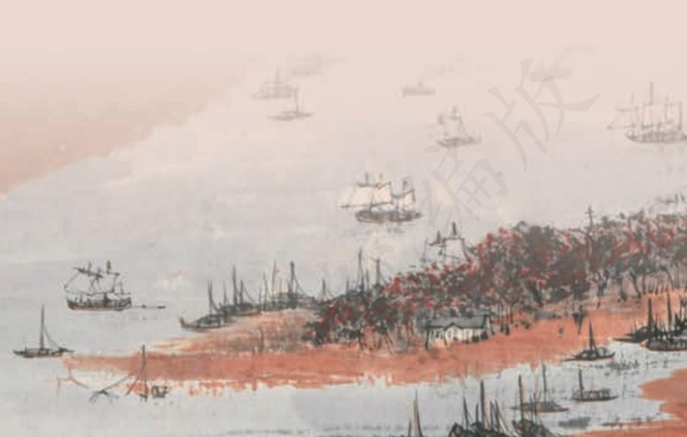
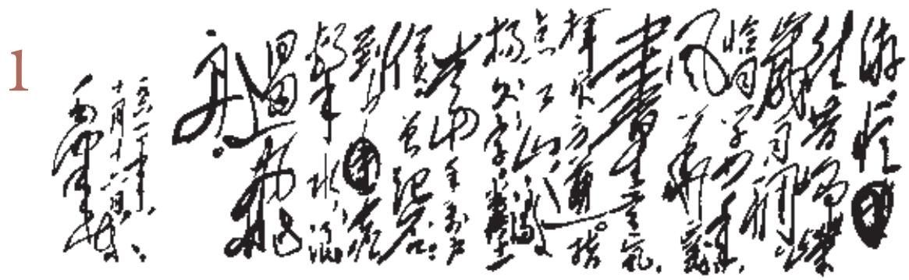
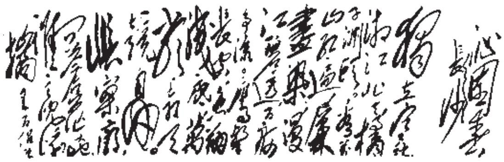

## 第一单元

青春是花样年华。怀着美好的梦想、纯真的感情，带着对自我的认识、对社会的思考和对理想的追求，我们就此迈出人生的重要一步。

本单元的五首诗歌和两篇小说创作于不同的历史时期，都是对青春的吟唱。作者或感时忧国、抒发情怀，或感悟人生、思考未来，让我们体验到各具特色的文学表达，点燃澎湃的青春激情。

学习本单元，可从“青春的价值”角度思考作品的意蕴，并结合自己的体验，敞开心扉，追寻理想，拥抱未来。要理解诗歌运用意象抒发感情的手法，把握小说叙事和抒情的特点，体会诗歌和小说的独特魅力；学习从语言、形象、情感等不同角度欣赏作品，获得审美体验；尝试写作诗歌。

毛泽东手书《沁园春·长沙》

沁园春·长沙a

毛泽东

独立寒秋，   
湘江北去，   
橘子洲 b 头。   
看万山红遍，   
层林尽染 c；   
漫江 d 碧透，   
百舸 e 争流。   
鹰击长空，   
鱼翔浅底 f，   
万类霜天竞自由 g。 怅 h 寥廓 i，   
问苍茫 j 大地，   
谁主 k 沉浮 l ？ 携来百侣a 曾游。   
忆往昔峥嵘岁月稠b。 恰同学少年，   
风华正茂 c；   
书生意气，   
挥斥方遒 d。   
指点江山，   
激扬文字 e，   
粪土当年万户侯f。 曾记否，   
到中流 g 击水 h，   
浪遏i 飞舟？

1925年

## 学习提示

面对“万类霜天竞自由”的壮丽秋景，毛泽东填写了这首词，抒发昂扬向上的青春激情，表达雄视天下的凌云壮志。阅读时注意领略毛泽东以天下为己任的胸怀，品味其中意象的活泼灵动、意境的丰盈深邃。要反复诵读，仔细揣摩，体会这首词炼字选词的精妙之处。老一辈无产阶级革命家的很多诗词都能引发我们对青春的思考，可以课外阅读毛泽东《水调歌头·游泳》、周恩来《赤光的宣言》、朱德《太行春感》、陈毅《赣南游击词》等，感受他们的情怀。

激浊扬清，抨击恶浊，褒扬清明。

f〔粪土当年万户侯〕意思是把当时的军阀官僚看得同粪土一样。粪土，视……如粪土，表鄙视。万户侯，本指食邑万户的封侯者，这里借指大军阀、大官僚。

g〔中流〕江河水流中央。

h〔击水〕指游泳。

i〔遏（è）〕阻止。