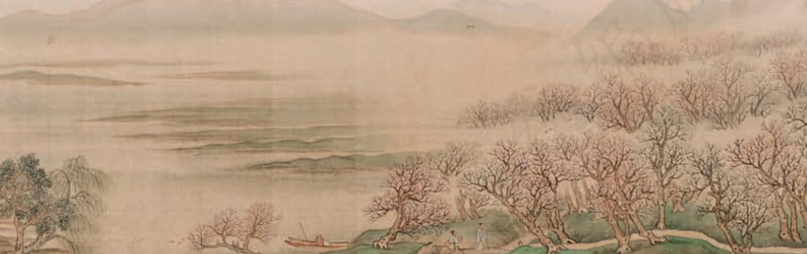

## 第三单元

优美的古诗词是中华传统文化的瑰宝，蕴含着中华儿女代代相传的文化基因。阅读古诗词作品，可以体味古人丰富的情感、深邃的思想、多样的人生，加深对社会的思考，增强对人生的感悟，激发对中华优秀传统文化的热爱之情。

本单元汇集了不同时期、不同体式的诗词名作。曹操对“天下归心”的渴望，陶渊明“复得返自然”的淡泊，展示了两种不同的人生状态；李白驰骋想象的豪迈，杜甫登高望远的悲凉，白居易“同是天涯沦落人”的慨叹，表现出各自的人生境遇和情感世界；苏轼、辛弃疾词的豪放，李清照词的婉约，则展示出宋词不同的审美追求。

学习本单元，要逐步掌握古诗词鉴赏的基本方法，认识古诗词的当代价值，增强对中华优秀传统文化的传承意识。要在诵读和想象中感受诗歌的意境，欣赏其独特的艺术魅力；感受诗人的精神世界，体会诗人对社会的思考与对人生的感悟，提高自身的思想修养和文化品位；尝试写作文学短评。

## 短歌行

曹 操

对酒当歌b，人生几何c ！ 譬如朝露，去日苦多d。   
慨当以慷e，忧思难忘。   
何以解忧？唯有杜康 f。   
青青子衿，悠悠我心g。   
但为君故，沉吟h 至今。   
呦呦鹿鸣，食野之苹。   
我有嘉宾，鼓瑟吹笙i。   
明明如月，何时可掇j ？ 忧从中来，不可断绝。   
越陌度阡 k，枉用相存 l。   
契阔谈讌 m，心念旧恩。   
月明星稀，乌鹊南飞。   
绕树三匝 n，何枝可依？ 山不厌高，海不厌深o。   
周公吐哺 p，天下归心。

a 选自《曹操集·诗集》（中华书局2013年版）。诗的题目是汉乐府旧题。

客的诗，这里用来表达招纳贤才的热情。

j〔掇〕拾取，摘取。一说同“辍”，停止。

k〔越陌度阡〕穿过纵横交错的小路。陌，东西向的田间小路。阡，南北向的田间小路。

l〔枉用相存〕屈驾来访。枉，这里是枉驾的意思。用，以。存，问候、探望。

m〔契阔谈讌（yàn）〕久别重逢，欢饮畅谈。契阔，聚散，这里指久别重逢。讌，同“宴”。

n〔三匝（zā）〕三周。匝，周、圈。

o〔山不厌高，海不厌深〕这里是仿用《管子·形势解》中的话：“海不辞水，故能成其大；山不辞土石，故能成其高；明主不厌人，故能成其众。”意思是表示希望尽可能多地接纳人才。厌，满足。

p〔周公吐哺（bǔ）〕《史记·鲁周公世家》记载，周公广纳贤才，正吃饭时，听到门外有士子求见，来不及咽下嘴里的食物，把食物一吐就赶紧去接见。这里借用这个典故，表示自己像周公一样热切殷勤地接待贤才。吐哺，吐出嘴里的食物。

# 归园田居（其一）

陶渊明

少无适俗b 韵c，性本爱丘山d。

误落尘网e 中，一去三十年f。

羁鸟g 恋旧林，池鱼思故渊。

开荒南野h 际，守拙i 归园田。

方宅十余亩 j，草屋八九间。

榆柳荫后檐，桃李罗堂前。

暧暧k 远人村，依依l 墟里m 烟。

狗吠深巷中，鸡鸣桑树颠n。

户庭o 无尘杂p，虚室q 有余闲r。

久在樊笼 s 里，复得返自然。

## 学习提示

曹操的《短歌行》表达对时光流逝的感慨，以及建功立业的宏愿。陶渊明的《归园田居》抒发对官场生活的厌倦，以及辞官归隐、躬耕田园的自由、喜悦之情。这两首诗均为古体诗，但在语言风格和表达技巧上有很大不同。前者是四言，质朴刚健，运用比兴手法，化用典故或引前人诗句表达心志；后者是五言，平淡舒缓，善用白描，寥寥数笔就勾勒出一幅乡村日常生活的图景。要在诵读中体会两首诗不同的韵律、节奏和表达技巧，结合诗人的身世领悟诗中的思想感情。

背诵《短歌行》。

i〔守拙〕持守愚拙的本性，即不学巧伪，不争名利。

j〔方宅十余亩〕宅子四周有十几亩地。方，四周围绕。

k〔暧（ài）暧〕迷蒙隐约的样子。

l〔依依〕隐约的样子。一说“轻柔的样子”。

m〔墟里〕指村落。

n〔颠〕顶端。

o〔户庭〕门户庭院。

p〔尘杂〕指世俗的繁杂琐事。

q〔虚室〕静室。

r〔余闲〕余暇，空闲。

s〔樊笼〕关鸟兽的笼子。这里指束缚本性的俗世。