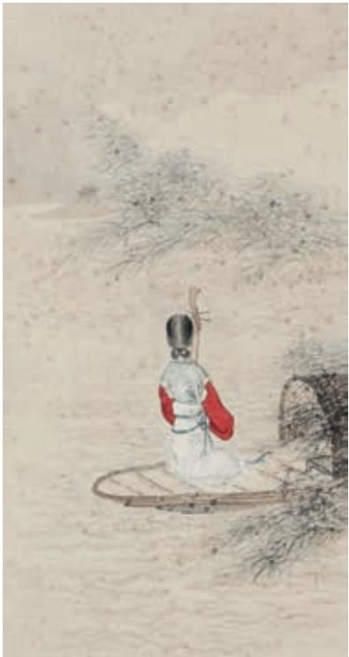

# 梦游天姥吟留别 a

李 白

海客谈瀛洲，烟涛微茫信难求b ；越人c 语天姥，云霞明灭或可睹。天姥连天向天横d，势拔五岳掩赤城e。天台四万八千丈，对此欲倒东南倾 f。

我欲因之g 梦吴越，一夜飞度镜湖h 月。湖月照我影，送我至剡溪i。 谢公j 宿处今尚在，渌k 水荡漾清l 猿啼。脚著谢公屐m，身登青云梯n。 半壁见海日o，空中闻天鸡p。千岩万转路不定，迷花倚石忽已暝q。熊 咆龙吟殷岩泉r，栗深林兮惊层巅s。云青青t 兮欲雨，水澹澹兮生 烟。列缺a 霹雳，丘峦崩摧。洞天石扉，訇然中开b。青冥c 浩荡不 见底，日月照耀金银台d。霓为衣兮风为马，云之君e 兮纷纷而来下。 虎鼓瑟兮鸾回车f，仙之人兮列如麻。忽魂悸g 以魄动，恍h 惊起而长 嗟。惟觉i 时之枕席，失向来之烟霞j。

世间行乐亦如此，古来万事东流水。别君去兮何时还？且放白鹿青崖间，须行即骑访名山k。安能摧眉折腰l 事权贵，使我不得开心颜？

## 登 高 m

杜 甫

风急天高猿啸哀，渚清沙白鸟飞回n。

无边落木o 萧萧p 下，不尽长江滚滚来。

万里q 悲秋常作客，百年r 多病独登台。

艰难苦恨繁霜鬓s，潦倒t 新停u 浊酒杯。

m 选自《杜诗详注》卷二十（中华书局2015年版）。这首诗是唐代宗大历二年（767）杜甫流寓夔州（今重庆奉节）时的作品。

n〔鸟飞回〕鸟（在急风中）飞舞盘旋。

o〔落木〕落叶。

p〔萧萧〕草木摇落的声音。

q〔万里〕指远离故乡。

r〔百年〕这里借指晚年。

s〔艰难苦恨繁霜鬓〕意思是，一生艰难，常常抱恨于志业无成而身已衰老。艰难，指自己生活多艰，又指国家多难。苦恨，极恨。繁霜鬓，像浓霜一样的鬓发。

# 琵琶行并序 a

白居易

元和十年b，予左迁c 九江郡d 司马e。明年秋，送客湓浦口f， 闻舟中夜弹琵琶者，听其音，铮铮然有京都声g。问其人，本长安倡女h， 尝学琵琶于穆、曹二善才i，年长色衰，委身j 为贾人k 妇。遂命酒l， 使快m 弹数曲。曲罢悯然n，自叙少小时欢乐事，今漂沦o 憔悴，转徙 于江湖间。予出官p 二年，恬然q 自安，感斯人言，是夕始觉有迁谪r 意。因为s 长句@0，歌以赠之，凡六百一十六言，命曰《琵琶行》。

浔阳江头@1夜送客，枫叶荻@2花秋瑟瑟@3。主人@4下马客在船，举 酒欲饮无管弦@5。醉不成欢惨将别，别时茫茫江浸月。

忽闻水上琵琶声，主人忘归客不发。寻声暗问@6弹者谁，琵琶声停 欲语迟@7。移船相近邀相见，添酒回灯@8重开宴。千呼万唤始出来，犹抱 琵琶半遮面。转轴拨弦@9三两声，未成曲调先有情。弦弦掩抑#0声声思#1， 似诉平生不得志。低眉信手a 续续b 弹，说尽心中无限事。轻 拢慢捻抹复挑c，初为《霓裳》d 后《六幺》e。大弦f 嘈嘈g 如 急雨，小弦h 切切i 如私语。嘈嘈切切错杂弹，大珠小珠落玉 盘j。间关莺语花底滑k，幽咽泉流冰下难l。冰泉冷涩弦凝 绝m，凝绝不通声暂歇。别有幽愁暗恨生，此时无声胜有声。 银瓶乍破水浆迸，铁骑突出刀枪鸣n。曲终收拨当心画o，四 弦一声p 如裂帛。东船西舫悄无言，唯见江心秋月白。

沉吟放拨插弦中，整顿衣裳起敛容q。自言本是京城女， 家在虾蟆陵r 下住。十三学得琵琶成，名属教坊s 第一部t。曲 罢曾教善才服，妆成每被秋娘u 妒。五陵年少v 争缠头w，一 曲红绡@4不知数。钿头银篦@5击节碎@6，血色罗裙翻酒污@7。 今年欢笑复明年，秋月春风等闲@8度。弟走从军阿姨死，暮去 朝来颜色故@9。门前冷落鞍马稀，老大#0嫁作商人妇。商人重利 轻别离，前月浮梁#1买茶去。去来#2江口守空船，绕船月明 江水寒。夜深忽梦少年事，梦啼妆泪红阑干a。

  
琵琶行  ［清］改琦 作

我闻琵琶已叹息，又闻此语重唧唧b。同是天涯沦落人，相逢何必曾相识！我从去年辞帝京，谪居卧病浔阳城。浔阳地僻无音乐，终岁不闻丝竹声。住近湓江地低湿，黄芦苦竹绕宅生。其间旦暮闻何物？杜鹃啼血c 猿哀鸣。春江花朝秋月夜，往往取酒还独倾d。岂无山歌与村笛，呕哑嘲哳e 难为听。今夜闻君琵琶语，如听仙乐耳暂f明。莫辞更g 坐弹一曲，为君翻作h《琵琶行》。

感我此言良久立，却坐i 促弦j 弦转k 急。凄凄不似向前l 声，满 座重闻皆掩泣m。座中泣下谁最多？江州司马青衫n 湿。

## 学习提示

李白、杜甫和白居易在中国古典诗歌史上具有重要的地位。这里各选入他们的一首经典诗作。这几首诗体式不同，抒发的情感和创作手法也各不相同，诵读时要细加体会。

《梦游天姥吟留别》以浪漫瑰丽的想象，描绘了一个迷离惝恍的梦境。诗作以七言为主，不受诗律限制，笔随兴至，在奇特的梦境中寄寓着深沉的慨叹。学习时要在诵读中发挥想象，品味组成梦境的意象以及梦境所隐含的精神追求。

《登高》写诗人登高远眺，身世之悲与忧国之情齐集心头。这首诗每联对仗，句法谨严，历来为人称赞。学习时注意感受诗歌营造的沉郁悲凉的意境，体会作者圆熟的律诗创作技巧。宋代罗大经曾说“万里悲秋常作客，百年多病独登台”一联含有八层意思（《鹤林玉露》），试就此联作一番品析。

《琵琶行》是一首长篇乐府诗，叙述琵琶女的故事，述说自己的人生遭际。学习时，注意琵琶女与诗人境遇的相通之处，体会诗人抒发的人生感慨。重点欣赏诗中音乐描写和景物描写的精妙。

背诵《梦游天姥吟留别》和《登高》。