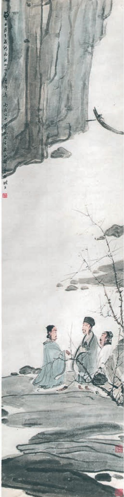

# 念奴娇·赤壁怀古a

苏 轼

大江b 东去，浪淘尽，千古风流人物。故垒c西边，人道是，三国周郎d 赤壁。乱石穿空，惊涛拍岸，卷起千堆雪。江山如画，一时多少豪杰。 遥想公瑾当年，小乔初嫁了，雄姿英发e。羽扇纶巾f，谈笑间，樯橹g 灰飞烟灭。故国h 神游，多情应笑我，早生华发i。人生如梦，一尊j 还酹k 江月。

赤壁图  傅抱石 作

# 永遇乐·京口北固亭怀古

辛弃疾

千古江山，英雄无觅，孙仲谋处。舞榭歌台，风流总被，雨打风吹 去。斜阳草树，寻常巷陌，人道寄奴曾住b。想当年，金戈铁马，气吞 万里如虎c。 元嘉草草d，封狼居胥e，赢得仓皇北顾f。四十三 年g，望中犹记，烽火扬州路h。可堪回首，佛狸祠i 下，一片神鸦j 社鼓k。凭谁问：廉颇老矣，尚能饭否l ？

g〔四十三年〕作者于宋高宗绍兴三十二年（1162）南归，到写这首词时正好四十三年。

h〔烽火扬州路〕扬州一带抗金的烽火。

i〔佛（bì）狸祠〕北魏太武帝拓跋焘（408—452）小名“佛狸”。公元450年，他反击刘宋，兵锋南下，在长江北岸瓜步山上建立行宫，后称“佛狸祠”。

## 声声慢 a

李清照

寻寻觅觅，冷冷清清，凄凄惨惨戚戚b。乍 暖还寒c 时候，最难将息d。三杯两盏淡酒，怎 敌他、晚来风急！雁过也，正伤心，却是旧时 相识。 满地黄花e 堆积，憔悴损f，如今有 谁堪 g 摘？守着窗儿，独自怎生得黑 h ！梧桐更 兼细雨，到黄昏、点点滴滴。这次第i，怎一个 愁字了得j ！

  
李清照像  郑慕康 作

一般认为，豪放和婉约是词的两种典型风格。品读本课的三首宋词，感受其不同的风格特点，体会这些词作是如何表现词人不同的思想情感的。

《念奴娇·赤壁怀古》咏古抒怀，雄浑苍凉，境界宏阔，历来被视为豪放词的代表作品。学习时，要仔细体会词作将写景、咏史、抒情融为一体的写法，品味词的声韵美，思考词中寄托的生命感悟与人生态度。

《永遇乐·京口北固亭怀古》为词人登高凭眺、怀古伤今之作，豪迈悲壮。词作多用典，学习时要注意理解典故的内涵；结句“凭谁问：廉颇老矣，尚能饭否？”是这首词的主旨，应注意领悟。可以拓展阅读辛弃疾的《菩萨蛮·书江西造口壁》，通过对比理解词人的不同情感。

《声声慢》（寻寻觅觅）以朴素清新的口语入词，抒写词人在国破家亡遭受劫难后的忧愁苦闷，通篇写“愁”，徘徊低迷，婉转凄楚。要注意揣摩词人因外物触发的内心波澜，体会词作是如何渲染这种愁绪的。这首词手法独到，起句便用十四个叠字，反复诵读，体会叠字中包孕的情感及其递进层次。

与律诗相比，词的声韵、句式、节奏等有着更多的变化，显得更为自由灵活，诵读时注意体会这一点。

背诵《念奴娇·赤壁怀古》。

词以境界为最上。有境界则自成高格，自有名句。

境非独谓景物也，喜怒哀乐亦人心中之一境界。故能写真景物真感情者，谓之有境界。否则谓之无境界。

古今之成大事业、大学问者，必经过三种之境界：“昨夜西风凋碧树。独上高楼，望尽天涯路”，此第一境也。“衣带渐宽终不悔，为伊消得人憔悴”，此第二境也。“众里寻他千百度，回头蓦见，那人正在灯火阑珊处”，此第三境也。此等语皆非大词人不能道。然遽以此意解释诸词，恐为晏欧诸公所不许也。

——王国维《人间词话》卷上