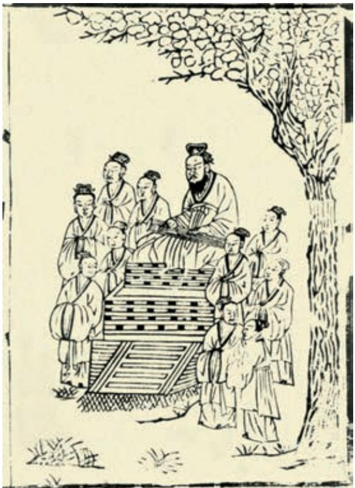

## 第六单元

学习是永恒的话题。从《礼记·学记》中的“玉不琢，不成器”，到当今社会倡导的终身学习和个性化学习，数千年来，人们一直在不懈地探索学习之道，以更好地获取知识，提升能力和自身修养。

本单元的文章从不同角度论述有关学习的问题，或阐述学习的意义，或讨论学习的态度与方法，或描述读书的经历与感受，使我们获得不同的启迪。

学习本单元，以“学习之道”为核心，通过梳理、探究和反思，形成正确的学习观，改进学习方法，提高学习能力。要准确把握作者的观点和态度，关注作者思考问题的角度，学习他们有针对性地表达观点的方法；学会发现问题，从合适的角度以恰当的方式阐述自己的看法。

# 劝  学 a

# 《荀子》

君子 b 曰：学不可以已。

青，取之于蓝c，而青于蓝d ；冰，水为之，而寒于水。木直中绳e， f 以为轮，其曲中规g。虽有槁暴h，不复挺i 者， 使之然也。故木受绳j 则直，金k 就砺l 则利，君子博学而日参省乎己m，则知 n 明而行无过矣。

吾尝终日而思矣，不如须臾之所学也；吾尝跂o 而望矣，不如登高 之博见也。登高而招，臂非加长也，而见者远p ；顺风而呼，声非加 疾q 也，而闻者彰r。假s 舆马t 者，非利足u 也，而致v 千里；假舟楫 者，非能水w 也，而绝x 江河。君子生非异@5也，善假于物@6也。

积土成山，风雨兴焉@7 ；积水成渊，蛟龙生焉；积善成德，而神 明@8自得，圣心@9备焉。故不积跬步#0，无以#1至千里；不积小流，无 以成江海。骐骥a 一跃，不能十步；驽马十驾b，功在不舍c。锲d 而舍 之，朽木不折；锲而不舍，金石可镂e。蚓无爪牙之利，筋骨之强，上 食埃土f，下饮黄泉g，用心一h 也。蟹六跪i 而二螯j，非蛇鳝之穴无 可寄托者，用心躁k 也。

## 师  说 ①

韩 愈

古之学者m 必有师。师者，所以传道受业解惑也n。人非生而知 之o 者，孰能无惑？惑而不从师，其为惑也p，终不解矣。生乎吾前， 其闻q 道也固先乎吾，吾从而师之r ；生乎吾后，其闻道也亦先乎吾， 吾从而师之。吾师道也s，夫庸知其年之先后生于吾乎t ？是故无贵 无贱u，无长无少，道之所存，师之所存也v。

嗟乎！师道w 之不传也久矣！欲人之无惑也难矣！古之圣人，其出 人x 也远矣，犹且y 从师而问焉；今之众人z，其下圣人也亦远矣，而 耻学于师。是故圣益圣，愚益愚@7。圣人之所以为圣，愚人之所以为 愚，其皆出于此乎？爱其子，择师而教之； 于其身a 也，则耻师b 焉，惑c 矣。彼童子d 之师，授之书而习其句读 e 者，非吾所谓传 其道解其惑者也。句读之不知f，惑之不解， 或师焉，或不焉g，小学而大遗h，吾未见其 明也。巫医 i 乐师 j 百工 k 之人，不耻相师 l。 士大夫之族m，曰师曰弟子云者n，则群聚而 笑之。问之，则曰：“彼与彼年相若o 也，道 相似也，位卑则足羞，官盛则近谀 p。”呜 呼！师道之不复，可知矣。巫医乐师百工之 人，君子不齿q，今其智乃r 反不能及，其可 怪也欤 s ！

  
杏坛图（南宋版画）

圣人无常师t。孔子师郯子u、苌弘v、 师襄@3、老聃@4。郯子之徒@5，其贤@6不及孔 子。孔子曰：三人行，则必有我师@7。是故弟 子不必@8不如师，师不必贤@9于弟子，闻道有 先后，术业a 有专攻b，如是而已。

李氏子蟠c，年十七，好古文d，六艺经传e 皆通f 习之，不拘于时g，学于余。余嘉h 其能行古道i，作《师说》以贻j 之。

## 学习提示

《劝学》和《师说》都是我国古代探讨学习问题的名篇。熟读这两篇文章，找出文中谈学习的名句，推敲句子的含义，以此为基础把握两篇文章关于学习的主要观点。

阅读时，要注意联系作者的思想主张和写作背景来理解文章的观点，分析作者提出观点的依据。例如，荀子为何如此强调后天学习的重要性？韩愈是针对怎样的现状倡导师道回归的？这需要分别结合荀子的“性恶论”、韩愈所处时代士大夫“耻学于师”的风气来理解。还可以结合今天的社会生活，说说荀子和韩愈的学习观中，哪些仍然值得借鉴，哪些需要更新并赋予其新的内涵。

“而”是古代汉语中常见的连词，可用于表示并列、承接、递进、转折、修饰等多种语义关系。这两篇文章中的许多语句用了“而”，诵读时注意体会这些“而”字表现的语义关系。

背诵课文《劝学》全篇和《师说》的第1段。

其中《乐》久已失传。传，古代解释经书的著作。

f〔通〕全面。

g〔不拘于时〕不受时俗的限制。时，时俗，指当时士大夫中耻于从师的不良风气。

h〔嘉〕赞许。

i〔古道〕指古人从师之道。

j〔贻（yí）〕赠送。