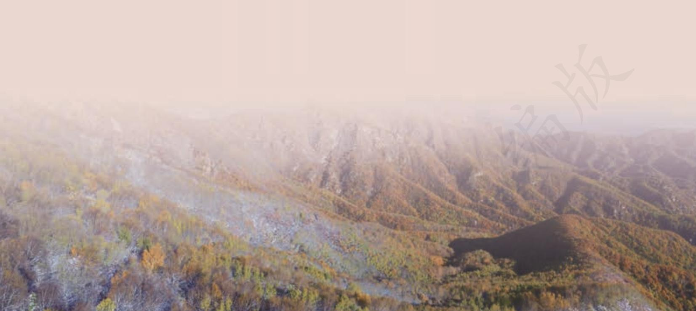

## 第七单元

人们生活在自然之中，而大自然也已深深融入人类的精神世界，成为人类心灵的寄托。通过文学作品对自然的描写反观自然，可以提升对自然美的感悟力，激发对自然和生活的热爱之情。

本单元选取的五篇散文，都是写景抒情的名篇，有对故都“秋味”的吟唱，对荷塘月色的描写；有北京地坛牵出的人生故事；有夜游赤壁的吊古伤今，登临东岳的畅想。在对大地山川、风物美景的描写中徜徉，既可以受到美的熏陶，又能够领会深厚的人文内涵。

学习本单元的写景抒情散文，体会民族审美心理，提升文学欣赏品位，培养对自然的热爱之情。要关注作品中的自然景物描写和人生思考，体会作者观察、欣赏和表现自然景物的角度，分析情景交融、情理结合的手法；还要反复涵泳咀嚼，感受作品的文辞之美。

# 故都的秋a

郁达夫

秋天，无论在什么地方的秋天，总是好的；可是啊，北国的秋，却特别地来得清，来得静，来得悲凉。我的不远千里，要从杭州赶上青岛，更要从青岛赶上北平来的理由，也不过想饱尝一尝这“秋”，这故都的秋味。

江南，秋当然也是有的；但草木凋得慢，空气来得润，天的颜色显得淡，并且又时常多雨而少风；一个人夹在苏州上海杭州，或厦门香港广州的市民中间，混混沌沌地过去，只能感到一点点清凉，秋的味，秋的色，秋的意境与姿态，总看不饱，尝不透，赏玩不到十足。秋并不是名花，也并不是美酒，那一种半开、半醉的状态，在领略秋的过程上，是不合适的。

不逢北国之秋，已将近十年了。在南方每年到了秋天，总要想起陶然亭b 的芦花，钓鱼台c 的柳影，西山d 的虫唱，玉泉e 的夜月，潭柘寺f 的钟声。在北平即使不出门去吧，就是在皇城人海之中，租人家一椽g 破屋来住着，早晨起来，泡一碗浓茶，向院子一坐，你也能看得到很高很高的碧绿的天色，听得到青天下驯鸽的飞声。从槐树叶底，朝东细数着一丝一丝漏下来的日光，或在破壁腰中，静对着像喇叭似的牵牛花（朝荣）的蓝朵，自然而然地也能够感觉到十分的秋意。说到了牵牛花，我以为以蓝色或白色者为佳，紫黑色次之，淡红者最下。最好，还要在牵牛花底，教长着几根疏疏落落的尖细且长的秋草，使作陪衬。

北国的槐树，也是一种能使人联想起秋来的点缀。像花而又不是花的那一种落蕊，早晨起来，会铺得满地。脚踏上去，声音也没有，气味也没有，只能感出一点点极微细极柔软的触觉。扫街的在树影下一阵扫后，灰土上留下来的一条条扫帚的丝纹，看起来既觉得细腻，又觉得清闲，潜意识下并且还觉得有点儿落寞，古人所说的梧桐一叶而天下知秋a 的遥想，大约也就在这些深沉的地方。

秋蝉的衰弱的残声，更是北国的特产；因为北平处处全长着树，屋子又低，所以无论在什么地方，都听得见它们的啼唱。在南方是非要上郊外或山上去才听得到的。这嘶叫的秋蝉，在北平可和蟋蟀耗子一样，简直像是家家户户都养在家里的家虫。

还有秋雨哩，北方的秋雨，也似乎比南方的下得奇，下得有味，下得更像样。

在灰沉沉的天底下，忽而来一阵凉风，便息列索落地下起雨来了。一层雨过，云渐渐地卷向了西去，天又青了，太阳又露出脸来了；着b着很厚的青布单衣或夹袄的都市闲人，咬着烟管，在雨后的斜桥影里，上桥头树底去一立，遇见熟人，便会用了缓慢悠闲的声调，微叹着互答着地说：

“唉，天可真凉了——”（这了字念得很高，拖得很长。）

“可不是吗？一层秋雨一层凉啦！”

北方人念阵字，总老像是层字，平平仄仄 c 起来，这念错的歧韵， 倒来得正好。

北方的果树，到秋来，也是一种奇景。第一是枣子树；屋角，墙头，茅房边上，灶房门口，它都会一株株地长大起来。像橄榄又像鸽蛋似的这枣子颗儿，在小椭圆形的细叶中间，显出淡绿微黄的颜色的时候，正是秋的全盛时期；等枣树叶落，枣子红完，西北风就要起来了，北方便是尘沙灰土的世界，只有这枣子、柿子、葡萄，成熟到八九分的七八月之交，是北国的清秋的佳日，是一年之中最好也没有的 Golden Daysd。

有些批评家说，中国的文人学士，尤其是诗人，都带着很浓厚的颓废色彩，所以中国的诗文里，颂赞秋的文字特别多。但外国的诗人，又何尝不然？我虽则外国诗文念得不多，也不想开出账来，做一篇秋的诗歌散文钞a，但你若去一翻英德法意等诗人的集子，或各国的诗文的Anthologyb 来，总能够看到许多关于秋的歌颂与悲啼。各著名的大诗人的长篇田园诗或四季诗里，也总以关于秋的部分，写得最出色而最有味。足见有感觉的动物，有情趣的人类，对于秋，总是一样地能特别引起深沉、幽远、严厉、萧索的感触来的。不单是诗人，就是被关闭在牢狱里的囚犯，到了秋天，我想也一定会感到一种不能自已的深情；秋之于人，何尝有国别，更何尝有人种阶级的区别呢？不过在中国，文字里有一个“秋士c”的成语，读本里又有着很普遍的欧阳子的《秋声》d 与苏东坡的《赤壁赋》等，就觉得中国的文人，与秋的关系特别深了。可是这秋的深味，尤其是中国的秋的深味，非要在北方，才感受得到底。

南国之秋，当然是也有它的特异的地方的，譬如廿四桥的明月e，钱塘江的秋潮f，普陀山g 的凉雾，荔枝湾h 的残荷，等等，可是色彩不浓，回味不永。比起北国的秋来，正像是黄酒之与白干，稀饭之与馍馍，鲈鱼之与大蟹，黄犬之与骆驼。

秋天，这北国的秋天，若留得住的话，我愿意把寿命的三分之二折去，换得一个三分之一的零头。

1934年8月，在北平

# 荷塘月色 a

朱自清

这几天心里颇不宁静。今晚在院子里坐着乘凉，忽然想起日日走过的荷塘，在这满月b 的光里，总该另有一番样子吧。月亮渐渐地升高了，墙外马路上孩子们的欢笑，已经听不见了；妻在屋里拍着闰儿c，迷迷糊糊地哼着眠歌。我悄悄地披了大衫，带上门出去。

沿着荷塘，是一条曲折的小煤屑路。这是一条幽僻的路；白天也少人走，夜晚更加寂寞。荷塘四面，长着许多树，蓊蓊郁郁d 的。路的一旁，是些杨柳，和一些不知道名字的树。没有月光的晚上，这路上阴森森的，有些怕人。今晚却很好，虽然月光也还是淡淡的。

路上只我一个人，背着手踱着。这一片天地好像是我的；我也像超出了平常的自己，到了另一世界里。我爱热闹，也爱冷静；爱群居，也爱独处。像今晚上，一个人在这苍茫的月下，什么都可以想，什么都可以不想，便觉是个自由的人。白天里一定要做的事，一定要说的话，现在都可不理。这是独处的妙处，我且受用这无边的荷香月色好了。

曲曲折折的荷塘上面，弥望e 的是田田f 的叶子。叶子出水很高，像亭亭的舞女的裙。层层的叶子中间，零星地点缀着些白花，有袅娜g地开着的，有羞涩地打着朵儿的；正如一粒粒的明珠，又如碧天里的星星，又如刚出浴的美人。微风过处，送来缕缕清香，仿佛远处高楼上渺茫的歌声似的。这时候叶子与花也有一丝的颤动，像闪电般，霎时传过荷塘的那边去了。叶子本是肩并肩密密地挨着，这便宛然h 有了一道凝碧的波痕。叶子底下是脉脉i 的流水，遮住了，不能见一些颜色；而叶子却更见风致j 了。

月光如流水一般，静静地泻在这一片叶子和花上。薄薄的青雾浮起在荷塘里。叶子和花仿佛在牛乳中洗过一样，又像笼着轻纱的梦。虽然是满月，天上却有一层淡淡的云，所以不能朗照；但我以为这恰是到了好处——酣眠固不可少，小睡也别有风味的。月光是隔了树照过来的，高处丛生的灌木，落下参差的斑驳的黑影，峭楞楞如鬼一般；弯弯的杨柳的稀疏的倩影，却又像是画在荷叶上。塘中的月色并不均匀；但光与影有着和谐的旋律，如梵婀玲a上奏着的名曲。

荷塘的四面，远远近近，高高低低都是树，而杨柳最多。这些树将一片荷塘重重围住；只在小路一旁，漏着几段空隙，像是特为月光留下的。树色一例b是阴阴的，乍看像一团烟雾；但杨柳的丰姿，便在烟雾里也辨得出。树梢上隐隐约约的是一带远山，只有些大意罢了。树缝里也漏着一两点路灯光，没精打采的，是渴睡人的眼。这时候最热闹的，要数树上的蝉声与水里的蛙声；但热闹是它们的，我什么也没有。

忽然想起采莲的事情来了。采莲是江南的旧俗，似乎很早就有，而六朝时为盛；从诗歌里可以约略知道。采莲的是少年的女子，她们是荡着小船，唱着艳歌c 去的。采莲人不用说很多，还有看采莲的人。那是一个热闹的季节，也是一个风流d 的季节。梁元帝e《采莲赋》里说得好：

于是妖童媛女，荡舟心许f；鹢首徐回，兼传羽杯g；棹将移 而藻挂，船欲动而萍开h。尔其纤腰束素，迁延顾步i ；夏始春 余，叶嫩花初，恐沾裳而浅笑，畏倾船而敛裾j。

可见当时嬉游的光景了。这真是有趣的事，可惜我们现在早已无福消受 k了。

于是又记起《西洲曲》l 里的句子：

采莲南塘秋，莲花过人头；低头弄莲子，莲子清如水。

今晚若有采莲人，这儿的莲花也算得“过人头”了；只不见一些流水的影子，是不行的。这令我到底惦着江南了。——这样想着，猛一抬头，不觉已是自己的门前；轻轻地推门进去，什么声息也没有，妻已睡熟好久了。

1927 年7 月，北京清华园。

## 学习提示

阅读《故都的秋》，要抓住“秋味”这个中心，慢慢读，调动各种感官来体会故都之秋的“清”“静”“悲凉”等特点，看看作品是通过哪些景物的描写巧妙地表现这些特点的。作者没有详细描绘陶然亭、钓鱼台、西山等北平著名景点，而是着重描写牵牛花、槐蕊、秋雨、秋枣一类平凡细小的事物，这是为什么？再想想，悲凉的“秋味”，为什么在郁达夫笔下具有特别的美？作者说中国的文人“与秋的关系特别深”，有什么道理？

阅读《荷塘月色》，应该多朗读，边读边沉浸到月色清淡、荷香缕缕的意境中去，品味那种优雅、朦胧、幽静之美。重点学习作者如何写景，如何在景物描写中自然地融入感情，以及如何通过比喻和通感来激发读者的联想和想象。

学习时要关注两篇写景文章的语言艺术，可以从用词、句式等方面来细细品味。如《故都的秋》开头多用短句，句中多停顿，起到了舒缓节奏和营造氛围的作用；《荷塘月色》善用叠词，语言朴素典雅、准确传神、贮满诗意。阅读时应多加体会。