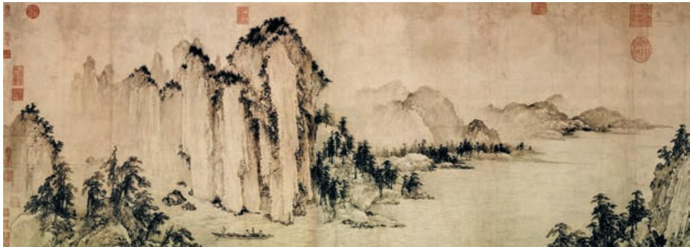
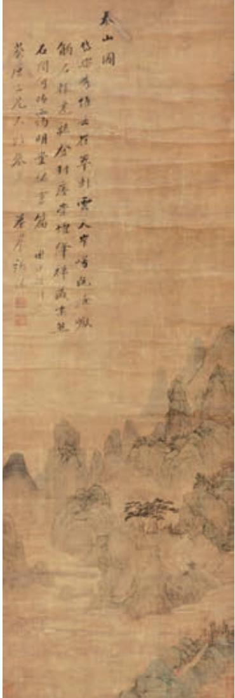

# 赤壁赋 a

苏 轼

壬戌b 之秋，七月既望c，苏子与客泛舟游于赤壁之下。清风徐 来，水波不兴。举酒属客d，诵明月之诗e，歌窈窕之章。少焉f，月 出于东山之上，徘徊于斗牛g 之间。白露h 横江，水光接天。纵一苇之 所如i，凌万顷之茫然j。浩浩乎如冯虚御风k，而不知其所止；飘飘 乎如遗世独立，羽化而登仙 l。

于是饮酒乐甚，扣舷m 而歌之。歌曰：“桂棹兮兰桨n，击空明兮溯 流光o。渺渺兮予怀p，望美人兮天一方q。”客r 有吹洞箫s 者，倚歌t 而和之u。其声呜呜然，如怨如慕，如泣如诉，余音袅袅，不绝如缕v。 舞幽壑之潜蛟，泣孤舟之嫠妇w。

苏子愀然a，正襟危坐b 而问客曰：“何为其然也c ？”客曰：“‘月 明星稀，乌鹊南飞’，此非曹孟德之诗乎？西望夏口d，东望武昌e，山 川相缪，郁乎苍苍f，此g 非孟德之困h 于周郎i 者乎？方j 其破荆 州k，下江陵l，顺流而东也，舳舻m 千里，旌旗蔽空，酾酒临江，横 槊赋诗n，固一世之雄也，而今安在哉？况吾与子渔樵于江渚之上o， 侣鱼虾而友麋鹿，驾一叶之扁舟，举匏樽p 以相属。寄蜉蝣q 于天地， 渺沧海之一粟r。哀吾生之须臾，羡长江之无穷。挟飞仙以遨游，抱明 月而长终。知不可乎骤s 得，托遗响t 于悲风。”

苏子曰：“客亦知夫水与月乎？逝者如斯，而未尝往也；盈虚者如彼，而卒莫消长也u。盖将自其变者而观之，则天地曾不能以一

  
赤壁图　［金］武元直  作

a〔愀（qiǎo）然〕容色改变的样子。

b〔危坐〕端坐。

c〔何为其然也〕（曲调）为什么这样（悲凉）呢？

d〔夏口〕古镇名，在今湖北武昌的西面。

e〔武昌〕今湖北鄂州。

f〔山川相缪（liáo），郁乎苍苍〕山水环绕，一片苍翠。缪，同“缭”，盘绕、围绕。

g〔此〕这地方。

h〔困〕受困。指曹操败于赤壁。

i〔周郎〕周瑜。

j〔方〕当。

k〔破荆州〕建安十三年（208），曹操南击荆州，当时荆州刺史刘表已死，刘表的儿子刘琮（cóng）投降曹操。荆州，在今湖北、湖南一带。

l〔下江陵〕刘琮投降曹操以后，曹操又在当阳的长坂击败刘备，进兵江陵。下，攻占。江陵，当时为荆州重镇，今属湖北。

m〔舳舻（zhúlú）〕船头和船尾的并称，泛指首尾相接 的船只。

n〔酾（shī）酒临江，横槊（shuò）赋诗〕面对大江斟酒，横执长矛吟诗（曹操所吟的诗就是《短歌行》）。酾酒，斟酒。槊，长矛。

o〔渔樵于江渚之上〕在江边捕鱼砍柴。渔樵，捕鱼 砍柴。

p〔匏（páo）樽〕用葫芦做成的酒器。匏，葫芦的一种。

q〔蜉蝣（fúyóu）〕一种小飞虫，夏秋之交生在水边，生存期很短，古人说它朝生暮死。这里用来比喻人生短促。

r〔一粟〕一粒米。

s〔骤〕一下子，很轻易地。

t〔遗响〕余音，指箫声。

u〔逝者如斯，而未尝往也；盈虚者如彼，而卒莫消长也〕流去的（水）像这样（不断地流去永不复返），而并没有流去；（月亮）像那样时圆时缺，却终究没有增减的变化。未尝往，意思是江水虽然在不断地奔流，但前者去后者来，始终滔滔不绝，如同没有流去。盈，满。虚，缺。卒，终究。消长，消减和增长。

瞬a ；自其不变者而观之，则物与我皆无尽b 也，而又何羡乎！且夫天地之间，物各有主，苟非吾之所有，虽一毫而莫取。惟江上之清风，与山间之明月，耳得之而为声，目遇之而成色，取之无禁，用之不竭，是造物者之无尽藏也，而吾与子之所共适c。”

客喜而笑，洗盏更d 酌。肴核e 既尽，杯盘狼籍f。相与枕藉g 乎舟中，不知东方之既白 h。

## 登泰山记

姚 鼐

泰山之阳，汶水j 西流；其阴，济水k 东流。阳谷l 皆入汶，阴谷皆入济。当其南北分者m，古长城n 也。最高日观峰，在长城南十五里。

余以o 乾隆三十九年p 十二月，自京师乘q 风雪，历齐河、长清r， 穿泰山西北谷，越长城之限s，至于泰安。是月丁未t，与知府朱孝纯 子颍u 由南麓登。四十五里，道皆砌石为磴v，其级七千有余。泰山正 南面有三谷。中谷绕泰安城下，郦道元所谓环水a 也。余始 循以入b，道少半c，越中岭d，复循西谷，遂至其巅。古 时登山，循东谷入，道有天门。东谷者，古谓之天门溪水， 余所不至也。今所经中岭及山巅，崖限当道者e，世皆谓之 天门云f。道中迷雾冰滑，磴几g 不可登。及既上，苍山负 雪，明烛天南h。望晚日照城郭i，汶水、徂徕j 如画，而 半山居k 雾若带然。

戊申晦l，五鼓m，与子颍坐日观亭n，待日出。大风 扬积雪击面。亭东自足下皆云漫o。稍p 见云中白若樗蒱q 数十立者，山也。极天r 云一线异色，须臾成五采s。日 上，正赤如丹t，下有红光动摇承之，或曰，此东海u 也。 回视日观以西峰，或得日或否v，绛皓驳色w，而皆若偻x。

亭西有岱祠y，又有碧霞元君z 祠。皇帝行宫@7在碧霞 元君祠东。是日观道中石刻，自唐显庆@8以来；其远古刻 尽漫失@9。僻不当道者，皆不及往。

山多石，少土。石苍黑色，多平方，少圜ホ。少杂树，多松，生石罅，皆平顶。冰雪，无瀑水，无鸟兽音迹。至日观数里内无树，而雪与人膝齐。

桐城姚鼐记。

  
泰山图　［清］张深  作

《赤壁赋》和《登泰山记》都是古代写景抒情的名篇，在读通、读懂的基础上，体会两篇文章中景与情的关系。

《赤壁赋》通过铺陈、排比形成整饬之美，要反复诵读，逐步领会。文章写景充满诗情画意，并采用“主客问答”的说理方式，逐层阐述作者的观点，思想认识逐步深化。阅读时要注意梳理文中情感起伏变化的脉络，抓住文章写景、抒情、说理完美融合的特点，体会作者复杂矛盾的内心世界和旷达乐观的人生态度。

《登泰山记》全文不到五百字，却充分展示了雪后登山的别样情趣。文章善于取舍，将小细节与大印象结合，描写、叙事简洁明快，阅读时要注意体会这些特点。我国古代还有不少写景、记游名篇，如王勃《滕王阁序》、王禹偁《黄冈竹楼记》、徐霞客《游天台山日记》等，可以找来阅读、比较。

我们读古代诗文，有必要了解一些古人记录时间的方法，包括纪年、纪月、纪日和纪时。拿纪年来说，干支纪年和年号纪年是最常见的两种方法，前者如“壬戌之秋”，后者如“乾隆三十九年十二月”。纪日，除了常见的干支纪日（如“是月丁未”），有些日子在古代还有特殊的名称，如农历每月的最后一天称“晦”。有兴趣的同学，可以从这两篇文章或此前学过的课文中，整理一些古人记录时间的方法。

背诵《赤壁赋》。

江馆清秋，晨起看竹，烟光日影露气，皆浮动于疏枝密叶之间。胸中勃勃，遂有画意。其实胸中之竹，并不是眼中之竹也。因而磨墨展纸，落笔倏作变相，手中之竹，又不是胸中之竹也。总之，意在笔先者，定则也；趣在法外者，化机也。独画云乎哉！

——郑燮《题画》