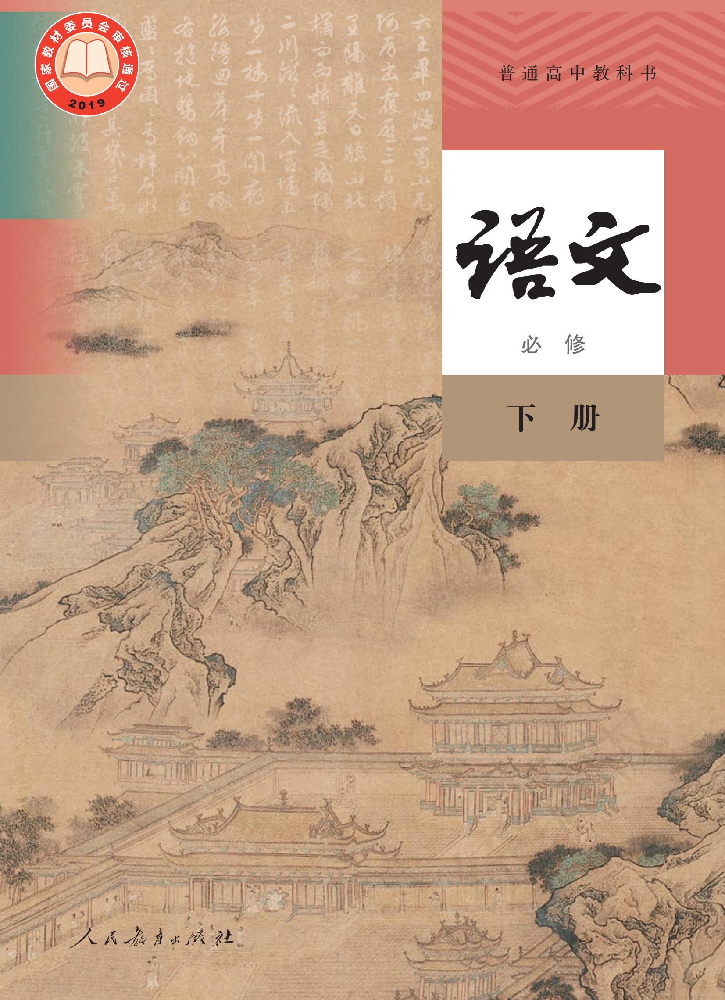

普通高中教科书

# 语文

必 修

下册

教育部组织编写

总主编：温儒敏

本册主编：过常宝 郑桂华

编写人员：(以姓氏笔画为序)尤炜李卫东吴泓邵长思季 丰 周小蓬 胡星亮 褚树荣

责任编辑：尤炜 陈尔杰

美术编辑：房海莹

普通高中教科书 语文 必修 下册

教育部组织编写

出版人民教育出版社(北京市海淀区中关村南大街17号院1号楼 邮编：100081）  
网 址 http://www.pep.com.cn  
重 印 × × × 出版社  
发 行 ×××新华书店  
印刷 ×××印刷厂  
版次年月第版  
印 次年 月第 次印刷  
开 本 890 毫米 × 1 240 毫米 1/16  
印张 10.5  
字 数 232 千字  
印数册  
书 号 ISBN 978-7-107-23906-9  
定价 11.95元  
审图号GS（2019）5085号

版权所有·未经许可不得采用任何方式擅自复制或使用本产品任何部分·违者必究

如发现内容质量问题，请登录中小学教材意见反馈平台：jcyjfk.pep.com.cn

如发现印、装质量问题，影响阅读，请与×××联系调换。电话：×××-××××××××

## 目录

第一单元  
1 子路、曾皙、冉有、公西华侍坐/《论语》 2  
\*齐桓晋文之事/《孟子》 4  
庖丁解牛/《庄子》 8  
2 烛之武退秦师/《左传》 10  
3\*鸿门宴/司马迁 13  
单元学习任务 18  
第二单元 21  
4 窦娥冤（节选)/关汉卿 22  
5 雷雨（节选)/曹禺 26  
6\*哈姆莱特（节选)/莎士比亚 37  
单元学习任务 43  
第三单元 45  
7 青蒿素：人类征服疾病的一小步/屠呦呦 46 50 5 61  
\*一名物理学家的教育历程/加来道雄  
8\*中国建筑的特征/梁思成  
9 说“木叶”/林庚  
单元学习任务  
第四单元 统编版  
信息时代的语文生活 69  
学习活动  
一 认识多媒介 70  
二 善用多媒介 70  
三 辨识媒介信息 71  
第五单元 79  
10 在《人民报》创刊纪念会上的演说/马克思 80  
在马克思墓前的讲话/恩格斯 82  
11 谏逐客书/李斯 85  
\*与妻书/林觉民 87  
单元学习任务 91  
第六单元 93  
12 祝福/鲁迅 94  
13 林教头风雪山神庙/施耐庵 107  
\*装在套子里的人/契诃夫 113  
14 促织/蒲松龄 119  
\*变形记（节选)/卡夫卡 123  
单元学习任务 135  
第七单元  
整本书阅读 137  
《红楼梦》 138  
第八单元 143  
15 谏太宗十思疏/魏征  
答司马谏议书/王安石 统编版 146  
16 阿房宫赋/杜牧 148  
\*六国论/苏洵 150  
单元学习任务 152  
寺词诵读 155  
登岳阳楼/杜甫 155  
桂枝香·金陵怀古/王安石 156  
念奴娇·过洞庭/张孝祥 157  
游园（【皂罗袍】)/汤显祖 158

统编版