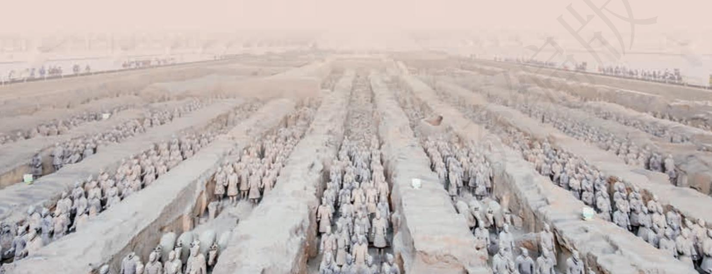
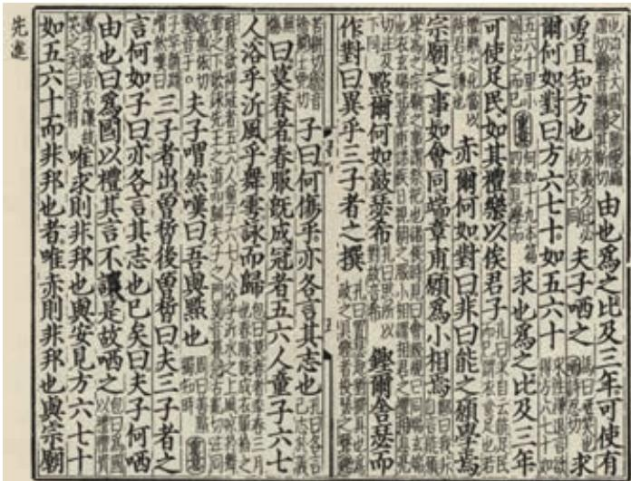

“观今宜鉴古，无古不成今。”（《增广贤文》）流派众多的诸子学说，浩如烟海的古代史籍，都是弥足珍贵的文化遗产。深刻体悟前人的智慧，才能更好地把握当下与未来。

本单元选取了《论语》《孟子》《庄子》中的经典篇章，以及《左传》《史记》的精彩片段。阅读这些文章，有助于我们了解中华文化的一些重要理念，领会其中包含的人文精神，深化对传统文化的认识，增强文化自信。

学习本单元，要在理解文意的基础上，整体把握经典选篇的思想内涵，认识其文化价值，思考其现代意义。初步了解儒家、道家思想的特征，体会相关篇章论事说理的技巧和不同的表达风格。阅读史传文，要关注其叙事曲折有序、写人生动传神的特点，尝试理性评价历史叙述中体现的思想、观念，认识历史人物和历史事件。

# 子路、曾皙、冉有、公西华侍坐

《论语》

子路、曾皙、冉有、公西华侍坐。

子曰：“以吾一日长乎尔，毋吾以也b。居则曰c ：‘不吾知d 也！’如或知尔，则何以哉e ？”

子路率尔f 而对曰：“千乘之国g，摄乎大国之间h，加之以师旅i，因之以饥馑j ；由也为之k，比及l 三年，可使有勇，且知方 m 也。”

夫子哂 n 之。

“求！尔何如？”

对曰：“方六七十，如五六十o，求也为之，比及三年，可使足民p。如其礼乐，以俟君子q。”

“赤！尔何如？”

七十二人。

对曰：“非曰能之，愿学焉a。宗庙之事b，如会同c，端章甫d， 愿为小相e 焉。”

“点！尔何如？”

鼓瑟希f，铿尔g，舍瑟而作h，对曰：“异乎三子者之撰i。”

子曰：“何伤j 乎？亦各言其志也。”

曰：“莫春k 者，春服既成l，冠者m 五六人，童子n 六七人， 浴乎沂o，风乎舞雩p，咏q 而归。”

夫子喟然r 叹曰：“吾与s 点也！”

三子者出，曾皙后。曾皙曰：“夫三子者之言何如？”

子曰：“亦各言其志也已矣t。”

曰：“夫子何哂由也？”

曰：“为国以礼，其言不让 u，是故哂之。”

“唯求则非邦也与v ？”

“安见w 方六七十如五六十而非邦 也者？”

“唯赤则非邦也与？”

“宗庙会同，非诸侯而何x ？赤也 为之小，孰能为之大 y ？”

  
宋刘氏天香书院刻本《论语》书影

# 齐桓晋文之事 a

《孟子》

齐宣王b 问曰：“齐桓、晋文之事可得闻乎？”

孟子对曰：“仲尼之徒无道桓文之事者，是以后世无传焉，臣未之闻也。无以，则王乎 c ？”

曰：“德何如则可以王矣？”

曰：“保民d 而王，莫之能御也。”

曰：“若寡人者，可以保民乎哉？”

曰：“可。”

曰：“何由知吾可也？”

曰：“臣闻之胡龁e 曰：王坐于堂上，有牵牛而过堂下者，王 见之，曰：‘牛何之f ？’对曰：‘将以衅钟g。’王曰：‘舍h 之！ 吾不忍其觳觫i，若无罪而就j 死地。’对曰：‘然则废衅钟与？ 曰：‘何可废也？以羊易之k。’不识有诸l ？”

曰：“有之。”

曰：“是心足以王矣。百姓皆以王为爱m 也，臣固知王之不忍也。”

王曰：“然，诚有百姓者 n。齐国虽褊小 o，吾何爱一牛？即不忍其觳觫，若无罪而就死地，故以羊易之也。”

曰：“王无异 p 于百姓之以王为爱也。以小易大，彼恶知之 q ？ 王若隐r 其无罪而就死地，则牛羊何择焉s ？”

王笑曰：“是诚何心哉？我非爱其财而易之以羊也，宜乎百姓之谓我爱也 a。”

曰：“无伤也，是b乃仁术c也，见牛未见羊也。君子之于禽兽也，见其生，不忍见其死；闻其声，不忍食其肉。是以君子远庖厨d 也。”

王说e，曰：“《诗》云：‘他人有心，予忖度之f。’夫子之谓 也g。夫我乃行之，反而求之，不得吾心h。夫子言之，于我心有 戚戚 i 焉。此心之所以合于王者，何也？”

曰：“有复j 于王者曰：‘吾力足以举百钧k，而不足以举一 羽；明;l 足以察秋毫之末 m，而不见舆薪 n。’则王许 o 之乎？” 曰：“否。”

“今恩足以及禽兽，而功不至于百姓者，独何与p ？然则一羽之不举，为不用力焉；舆薪之不见，为不用明焉；百姓之不见保q，为不用恩焉。故王之不王，不为也，非不能也。”

曰：“不为者与不能者之形r 何以异s ？”

曰：“挟太山以超北海t，语u 人曰：‘我不能。’是诚不能也。为长者折枝v，语人曰：‘我不能。’是不为也，非不能也。故王之不王，非挟太山以超北海之类也；王之不王，是折枝之类也。老吾老，以及人之老；幼吾幼，以及人之幼w：天下可运于掌x。《诗》云：‘刑于寡妻，至于兄弟，以御于家邦y。’言举斯心加诸彼而已a。故推恩足以保四海，不推恩无以保妻子。古之人所以大过人者，无他焉，善推其所为而已矣。今恩足以及禽兽，而功不至于百姓者，独何与？权b，然后知轻重；度c，然后知长短。物皆然，心为甚。王请度之！

“抑d 王兴甲兵，危士臣e，构怨f 于诸侯，然后快于心g 与？”

王曰：“否，吾何快于是？将以求吾所大欲h 也。”

曰：“王之所大欲，可得闻与？”

王笑而不言。

曰：“为肥甘i 不足于口与？轻暖j 不足于体与？抑为采色k不足视于目与？声音l 不足听于耳与？便嬖m 不足使令于前与？王之诸臣皆足以供之，而王岂为是哉？”

曰：“否，吾不为是也。”

曰：“然则王之所大欲可知已：欲辟n 土地，朝秦楚o，莅中国p 而抚四夷也。以若q 所为，求若所欲，犹缘木而求鱼r 也。”

王曰：“若是其甚与？”

曰：“殆s 有甚焉。缘木求鱼，虽不得鱼，无后灾；以若所为，求若所欲，尽心力而为之，后必有灾。”

曰：“可得闻与？”

曰：“邹 t 人与楚人战，则王以为孰胜？”

曰：“楚人胜。”

曰：“然则小固不可以敌大，寡固不可以敌众，弱固不可以敌强。海内之地，方千里者九u，齐集有其一v。以一服八，何以异于邹敌楚哉？盖亦反其本矣w ？今王发政施仁x，使天下仕者皆欲立于王之朝，耕者皆欲耕于王之野，商贾皆欲藏于王之市a，行旅皆欲出于王之涂b，天下之欲疾c 其君者皆欲赴诉d 于王。其若是，孰能御之？”

王曰：“吾惛e，不能进于是f 矣。愿夫子辅吾志g，明以教 我。我虽不敏h，请尝试i 之。”

曰：“无恒产j 而有恒心者，惟士k 为能。若民，则无恒产， 因无恒心。苟无恒心，放辟邪侈，无不为已l。及陷于罪，然后 从而刑之m，是罔民n 也。焉有仁人在位，罔民而可为也？是故明 君制o 民之产，必使仰足以事父母，俯足以畜p 妻子，乐岁q 终身 饱，凶年r 免于死亡；然后驱而之善s，故民之从之也轻t。今也 制民之产，仰不足以事父母，俯不足以畜妻子，乐岁终身苦，凶年 不免于死亡。此惟救死而恐不赡u，奚暇治礼义哉v ？王欲行之， 则盍反其本矣：五亩之宅，树之以桑，五十者可以衣帛w 矣；鸡、 豚、狗、彘x 之畜，无失其时y，七十者可以食肉矣；百亩之田z， 勿夺其时，八口之家可以无饥矣；谨庠序之教@7，申@8之以孝悌@9 之义，颁白者不负戴于道路#0矣。老者衣帛食肉，黎民不饥不寒， 然而不王者，未之有也。”

a〔商贾皆欲藏于王之市〕做生意的人都想（把货物）储存在大王的市场上。

g〔辅吾志〕帮助（实现）我的志愿。

j〔恒产〕可以长久维持生活的固定财产。

k〔士〕这里指有道德操守的读书人。下文的“民”指普通百姓。

l 〔放辟（pì）邪侈，无不为已〕不遵守礼义法度，无所不为。放，放纵。辟，不正。侈，过度。

m〔从而刑之〕接着就处罚他们。刑，处罚。

n〔罔民〕陷害百姓。罔，同“网”，张网捕捉，比喻陷害。

t〔从之也轻〕很容易地跟着国君走。轻，容易。

u〔此惟救死而恐不赡〕这样，只是使自己摆脱死亡还怕不足。惟，只是。赡，足。

v〔奚暇治礼义哉〕哪里还顾得上讲求礼义呢？奚，何。治，讲求。

w〔衣（yì）帛〕穿丝织的衣服。衣，穿。《孟子·尽心上》：“五十非帛不暖，七十非肉不饱。不暖不饱，谓之冻馁。”据说西伯（周文王）“善养老者”，教民“树畜”，使老人可衣帛食肉，不致冻馁。这里所说的冻馁，与无衣无食不同。

x〔彘（zhì）〕猪。

y〔时〕季节。这里指家禽家畜生长繁殖的时节。下文“勿夺其时”的“时”，指适宜种植、收获庄稼的时节。

z〔百亩之田〕相传周代实行井田制，一家可分得耕田一百亩。

@7〔谨庠（xiáng）序之教〕慎重办理学校教育。谨，用作动词。庠序，古代的地方学校，后泛指学校。

@8〔申〕申诫，告诫。

@9〔孝悌（tì）〕善事父母为“孝”，敬爱兄长为“悌”。

#0〔颁白者不负戴于道路〕头发花白的老人不会在路上背着或顶着东西。意思是，年轻人懂得敬老，都来代劳。颁，同“斑”。戴，用头顶着物件。

# 庖丁解牛

《庄子》

庖丁为文惠君b 解牛，手之所触c，肩之所倚，足之所履d， 膝之所踦e，砉然向然f，奏刀 然g，莫不中音h。合于《桑林》 之舞 i，乃中《经首》之会 j。

文惠君曰：“嘻，善哉！技盖k 至此乎？”

庖丁释刀对曰：“臣之所好者道l 也，进乎技矣m。始臣之 解牛之时，所见无非牛者n ；三年之后 ，未尝见全牛也o。方今 之时，臣以神遇而不以目视p，官知止而神欲行q。依乎天理r，批 大郤s，导大窾t，因其固然u，技经肯綮之未尝v，而况大 w 乎！良庖岁更x 刀，割y 也；族庖z 月更刀，折@7也。今臣之 刀十九年矣，所解数千牛矣，而刀刃若新发于硎@8。彼节者有 间a，而刀刃者无厚b ；以无厚入有间，恢恢乎c 其于游刃必有余 地矣！是以十九年而刀刃若新发于硎。虽然，每至于族d，吾 见其难为，怵然e 为戒，视为止，行为迟f，动刀甚微g。謋h 然 已解，如土委i 地。提刀而立，为之四顾，为之踌躇满志j，善k 刀而藏之。”

文惠君曰：“善哉！吾闻庖丁之言，得养生;l 焉。”

## 学习提示

理想的社会是什么样的？人应该以怎样的姿态生存于世？对此，先哲的探寻从未停止过。

孔子和孟子是先秦儒家学派的代表人物，他们的思想一脉相承，又各有特点。《子路、曾皙、冉有、公西华侍坐》记录了孔子和弟子的谈话，学习时要理解四位弟子的人生志向，思考孔子为什么对他们的说法表现出不同的态度。《齐桓晋文之事》是孟子和齐宣王的一场问答，较系统地阐发了孟子的政治主张和社会理想。阅读时要注意把握文中的主要观点，梳理孟子阐述观点的思路。

庄子所代表的道家学派对社会和人生的看法与儒家很不相同。学习《庖丁解牛》，要深入思考“依乎天理”“因其固然”等语句的含义，结合对庖丁解牛过程的描写，理解其高超技艺之中蕴含的“道”，从而全面把握这个故事的寓意。

《论语》是语录体，言简意赅；《孟子》对话精彩，思辨性强，善于取譬设喻，因势利导；《庄子》常用寓言来表达思想，形象生动，富于启发性。阅读三篇文章时要注意体会这些特点。

语气助词是汉语的一个词类，用于句首、句中或句末，表达判断、陈述、疑问、感叹等语气。本课三篇文章中出现的语气助词有“也”“乎”“矣”“哉”“焉”等。阅读文章时，注意体会这些词在不同语境中所表达的不同语气，作一点归纳梳理。

背诵《子路、曾皙、冉有、公西华侍坐》。拓展阅读《季氏将伐颛臾》。