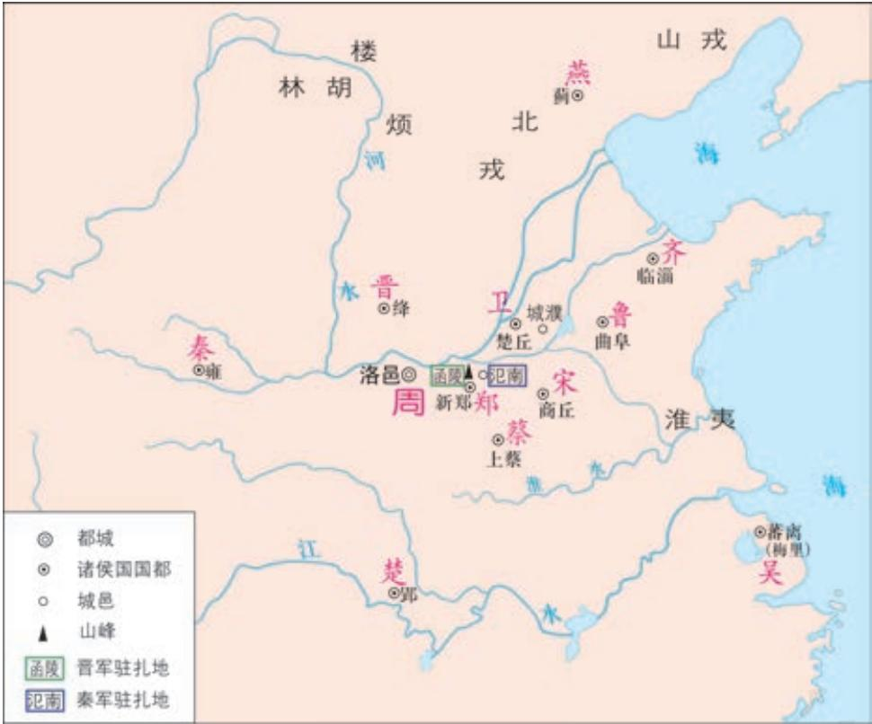

# 烛之武退秦师 a

《左传》

晋侯、秦伯b 围郑，以其无礼于晋c，且贰于楚d 也。晋军函 陵e，秦军氾南f。

佚之狐g 言于郑伯h 曰：“国危矣，若使烛之武见秦君，师必退。”公从之。辞曰：“臣之壮i 也，犹j 不如人；今老矣，无能为也已k。”公曰：“吾不能早用子，今急而求子，是寡人之过也。然郑亡，子亦有不利焉。”许l 之。

  
春秋列国形势简图（前630年）

郑国地名，在今河南新郑北。

f﹝氾（fán）南〕氾水的南面，也属郑地。

g﹝佚（yì）之狐〕郑国大夫。

h﹝郑伯〕指郑文公（？—前628），名捷，郑国国君。

i﹝壮〕壮年。古时男子三十为“壮”。

j﹝犹〕尚且。

夜缒a 而出，见秦伯，曰：“秦、晋围郑，郑既b知亡矣。若亡 郑而有益于君，敢以烦执事c。越国以鄙远d，君知其难也，焉用 亡郑以陪邻e ？邻之厚，君之薄也f。若舍郑以为东道主g，行 李h 之往来，共其乏困i，君亦无所害。且君尝为晋君赐矣j， 许君焦、瑕k，朝济而夕设版焉l，君之所知也。夫晋，何厌之 有？既东封郑m，又欲肆其西封n，若不阙秦o，将焉取之p ？阙 秦以利晋，唯君图之q。”秦伯说，与郑人盟。使杞子、逢孙、杨 孙r 戍之，乃还。

子犯s 请击之。公t 曰：“不可。微夫人之力不及此u。因人之力而敝之，不仁v ；失其所与，不知w ；以乱易整，不武x。吾其还也y。”亦去之。

春秋时期，诸侯争霸，一度形成分别以晋、楚为首的两大阵营。“千乘之国”郑国遭遇秦、晋两强夹攻，看一看历史地图，了解郑国当时的处境。

本文的核心部分是烛之武游说秦穆公的外交辞令。烛之武以一己之力，成功说服秦国撤军，瓦解了秦、晋对郑国的围困。前人说“烛之武一言，贤于十万师”（谢有辉《古文赏音》），并非过誉。要反复诵读，理清思路，揣摩人物情态，体会对话语气，把握烛之武说辞的语言艺术和其中蕴含的智慧。此外，还要注意郑文公、晋文公的话，领会其中体现出来的人物特点。《左传》是编年体史书，以时为经，以事为纬。学习本文时，可关注在烛之武退秦师前后发生的事，更全面、准确地把握文章的内容。

史书以记事为本，在历史叙述中也常透露出一些思想、观念。《左传》重视“礼”。秦、晋围郑是因为其“无礼”，晋文公认为进攻秦军是“不仁”“不知”“不武”的，因而被古人赞为“有礼”。该如何理解这里说的“礼”？秦先与晋联合围郑，后又“与郑人盟”，秦的行为合乎“礼”吗？思考这类问题，对春秋时期军事、外交活动中的行为准则会有更深入的认识。