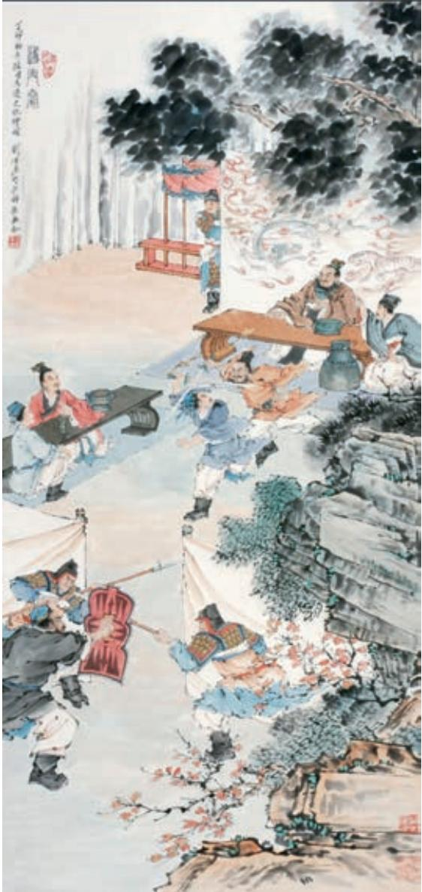

# 鸿门宴 a

司马迁

沛公b 军霸上c，未得与项羽相见。沛公左司马d 曹无伤使人 言于项羽曰：“沛公欲王e 关中f，使子婴g 为相，珍宝尽有之。” 项羽大怒，曰：“旦日飨h 士卒，为击破沛公军！”当是时，项羽兵 四十万，在新丰鸿门；沛公兵十万，在霸上。范增i 说j 项羽曰： “沛公居山东k 时，贪于财货，好美姬。今入关，财物无所取，妇 女无所幸l，此其志不在小。吾令人望其气m，皆为龙虎，成五采， 此天子气也。急击勿失n ！”

楚左尹项伯o 者，项羽季父p 也，素善留侯张良q。张良是时从沛公，项伯乃夜驰之沛公军r，私见张良，具告以事，欲呼张良与俱去，曰：“毋从俱死也。”张良曰：“臣为韩王送沛公s，沛公今事有急，亡去不义，不可不语。”良乃入，具告沛公。沛公大惊，曰：“为之奈何？”张良曰：“谁为大王为此计者？”曰：“鲰生t 说我曰：‘距u 关，毋内诸侯v，秦地可尽王也。’故听之。”良曰：“料大王士卒足以当a 项王乎？”沛公默然，曰：“固不如也。且为之奈何？”张良曰：“请往谓项伯，言沛公不敢背项王也。”沛公曰：“君安与项伯有故b ？”张良曰：“秦时与臣游，项伯杀人，臣活之c。今事有急，故幸d 来告良。”沛公曰：“孰与君少长e ？”良曰：“长于臣。”沛公曰：“君为我呼入，吾得兄事之f。”张良出，要g 项伯。项伯即入见沛公。沛公奉卮酒为寿h，约为婚姻i，曰：“吾入关，秋毫不敢有所近j，籍吏民k，封府库，而待将军l。所以遣将守关者，备他盗之出入与非常m 也。日夜望将军至，岂敢反乎！愿伯具言臣之不敢倍德n 也。”项伯许诺，谓沛公曰：“旦日不可不蚤o 自来谢p 项王。”沛公曰：“诺。”于是项伯复夜去，至军中，具以沛公言报项王。因q 言曰：“沛公不先破关中，公岂敢入乎？今人有大功而击之，不义也。不如因善遇之。”项王许诺。

沛公旦日从百余骑r 来见项王，至鸿门，谢曰：“臣与将军戮力s 而攻秦，将军战河北，臣战河南t，然不自意u 能先入关破秦，得复见将军于此。今者有小人之言，令将军与臣有郤v。”项王曰：“此沛公左司马曹无伤言之。不然，籍何以至此？”项王即日因留沛公与饮。项王、项伯东向坐；亚父w 南向坐，——亚父者，范增也；沛公北向坐；张良西向侍。范增数x 目y 项王，举所佩玉玦z 以示之者三@7，项王默然不应。范增起，出，召项庄@8，谓曰：“君王为人不忍。若入前为寿，寿毕，请以剑舞，因击沛公于坐，杀之。不者，若属@9皆且为所虏！”庄则入为寿。寿毕，曰：“君王

q﹝因〕趁着（机会）。

与沛公饮，军中无以为乐，请以剑舞。”项王曰：“诺。”项庄拔剑起舞。项伯亦拔剑起舞，常以身翼蔽a 沛公，庄不得击。

于是张良至军门见樊哙b。樊哙曰：“今日之事何如？”良曰：“甚急！今者项庄拔剑舞，其意常在沛公也。”哙曰：“此迫矣！臣请入，与之同命c。”哙即带剑拥盾入军门。交戟之卫士d 欲止不内。樊哙侧其盾以撞，卫士仆地。哙遂入，披帷e 西向立，瞋目视项王，头发上指，目眦f 尽裂。项王按剑而跽g 曰：“客何为者？”张良曰：“沛公之参乘h 樊哙者也。”项王曰：“壮士！赐之卮酒。”则与斗卮i 酒。哙拜谢，起，立而饮之。项王曰：“赐之彘肩j。”则与一生彘肩。樊哙覆其盾于地，加彘肩上k，拔剑切而啖l 之。项王曰：“壮士！能复饮乎？”樊哙曰：“臣死且不避，卮酒安足辞！夫秦王有虎狼之心，杀人如不能举，刑人如恐不胜m，天下皆叛之。怀王n与诸将约曰：‘先破秦入咸阳者王之。’今沛公先破秦入咸阳，毫毛不敢有所近，封闭宫室，还军霸上，以待大王来。故遣将守关者，备他盗出入与非常也。劳苦而功高如此，未有封侯之赏，而听细说o，欲诛有功之人，此亡秦之续p耳。窃为大王不取也q ！”项王未有以应，曰：“坐。”樊哙从良坐。坐须臾，沛公起如厕，因招樊哙出。

  
鸿门宴  刘凌沧 作

沛公已出，项王使都尉陈平a 召沛公。沛公曰：“今者出，未辞也，为之奈何？”樊哙曰：“大行不顾细谨，大礼不辞小让b。如今人方为刀俎c，我为鱼肉，何辞为d ？”于是遂去。乃令张良留谢。良问曰：“大王来何操e ？”曰：“我持白璧f 一双，欲献项王，玉斗g 一双，欲与亚父。会其怒，不敢献。公为我献之。”张良曰：“谨诺h。”当是时，项王军在鸿门下，沛公军在霸上，相去四十里。沛公则置i车骑，脱身独骑，与樊哙、夏侯婴、靳强、纪信j等四人持剑盾步走，从郦山k 下，道l 芷阳m 间行n。沛公谓张良曰：“从此道至吾军，不过二十里耳。度o 我至军中，公乃入。”

沛公已去，间至军中。张良入谢，曰：“沛公不胜杯杓p，不能辞。谨使臣良奉白璧一双，再拜q 献大王足下，玉斗一双，再拜奉大将军r 足下。”项王曰：“沛公安在？”良曰：“闻大王有意督过s 之，脱身独去，已至军矣。”项王则受璧，置之坐上。亚父受玉斗，置之地，拔剑撞t 而破之，曰：“唉！竖子u 不足与谋！夺项王天下者必沛公也。吾属今为之虏矣！”

沛公至军，立诛杀曹无伤。

## 学习提示

“力拔山兮气盖世，时不利兮骓不逝！”（项羽《垓下歌》）实力强大的项羽最终败给了一度弱小的刘邦，落得乌江自刎的结局。其原因何在？从《鸿门宴》中，你也许能看出一些端倪。

《史记》是纪传体史书，其中本纪、世家、列传以人物为中心叙述历史，集中展现了司马迁的史识和文学才能。《鸿门宴》的人物描写历来为人称道，正如清人郭嵩焘所说：“鸿门之宴写得子房如龙，樊哙如虎，是史公极得意文字。”

k﹝郦山〕即骊山，在今陕西临潼东南。

l﹝道〕取道。

m﹝芷（zhǐ）阳〕秦代县名，在今陕西西安东。

n﹝间（jiàn）行〕秘密地走。间，秘密地。

o﹝度（duó）〕估计。

p﹝不胜杯杓（sháo）〕禁不起多喝酒。意思是醉了。胜，承受。杯杓，酒器，借指饮酒。

q﹝再拜〕拜两拜，古代一种较重的礼节。

r﹝大将军〕指范增。

s﹝督过〕责备，责罚。

t﹝撞〕敲击。

u﹝竖子〕骂人的话，相当于“小子”。

（《史记札记》）除了主要人物，项伯、范增等人也都个性鲜明。阅读时要关注人物的性格特征，注意人物关系、人物言行与事件发展之间的联系。

《左传》和《史记》都有高超的叙事艺术。《左传》长于记述辞令，叙事简洁；《史记》叙事详备，写人生动，细节传神。阅读《烛之武退秦师》和《鸿门宴》时，要注意体会上述特点，还可以从材料安排、叙事技巧、描写方法等方面作些比较分析。

文中涉及的一些历史文化知识，阅读时也应加以关注，如人物相互间的称呼、鸿门宴会的座次安排等。这既有助于理解文章内容，也有助于提高阅读文言文的能力。