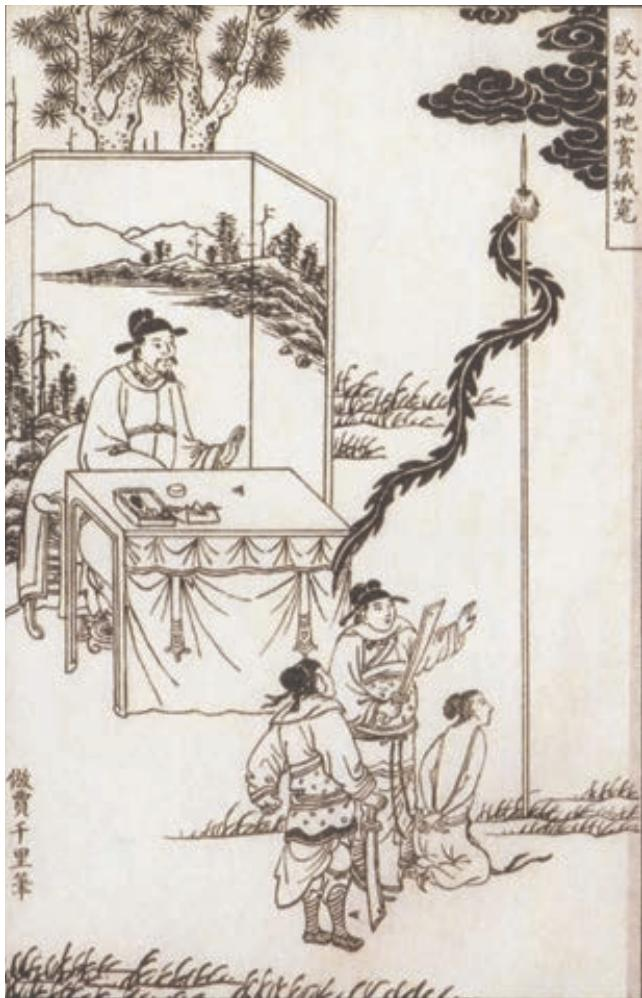

## 第二单元

对他人的不幸抱有同情，心怀悲悯；鄙弃丑恶，追求正义，坚守良知：这些都是人类应该具有的品格

本单元所选三篇戏剧作品，通过剧中人物的悲情遭遇，表现了不同时代、不同民族的剧作家对社会现实的理解，寄托着他们对人生的深切关怀。阅读这些作品，有助于我们更深刻地理解社会人生。

学习本单元，通过阅读鉴赏、编排演出等活动深入理解戏剧作品，把握其悲剧意蕴，激发心中的良知与悲悯情怀。要初步认识传统戏曲和现代戏剧的基本特征；欣赏剧作家设计冲突、安排情节、塑造人物的艺术手法，体会戏剧语言的动作性和个性化；还要理解悲剧作品的风格特征，欣赏作者的独特艺术创造。

# 窦娥冤a（节选）

关汉卿

## 第三折

（外b 扮监斩官上，云）下官监斩官是也。今日处决犯人，着c 做公的d把住巷口，休放往来人闲走。（净e扮公人，鼓三通、锣三下 科f。刽子磨旗g、提刀，押正旦h 带枷上。刽子云）行动些i，行 动些，监斩官去法场上多时了。（正旦唱）

【正宫 j】【端正好 k】没来由犯王法，不提防遭刑宪 l，叫声屈动地惊天。顷刻间游魂先赴森罗殿，怎不将天地也生埋怨m。

【滚绣球】有日月朝暮悬，有鬼神掌着生死权。天地也！只合

a 选自《关汉卿戏剧集》（人民文学出版社1976年版）。关汉卿（约1230—约1300），号已斋叟，大都（今北京）人，元代戏曲作家。代表作有杂剧《窦娥冤》《救风尘》《望江亭》《鲁斋郎》《拜月亭》《调风月》《单刀会》等。《窦娥冤》是元杂剧的代表性作品，共四折，这里选的是第三折。前两折主要情节，窦娥的冤魂向父亲倾诉时有详细交代：“我三岁上亡了母亲，七岁上离了父亲，你将我送与蔡婆婆做儿媳妇。至十七岁与夫配合，才得两年，不幸儿夫亡化，和俺婆婆守寡。这山阳县南门外有个赛卢医，他少俺婆婆二十两银子。俺婆婆去取讨，被他赚到郊外，要将婆婆勒死。不想撞见张驴儿父子两个，救了俺婆婆性命。那张驴儿知道我家有个守寡的媳妇，便道：‘你婆儿媳妇既无丈夫，不若招我父子两个。’俺婆婆初也不肯，那张驴儿道：‘你若不肯，我依旧勒死你。’俺婆婆惧怕，不得已含糊许了。只得将他父子两个领到家中，养他过世。有张驴儿数次调戏你女孩儿，我坚执不从。那一日俺婆婆身子不快，想羊肚儿汤吃，你孩儿安排了汤。适值张驴儿父子两个问病，道：‘将汤来我尝一尝。’说：‘汤便好，只少些盐醋。’赚的我去取盐醋，他就暗地里下了毒药，实指望药杀俺婆婆，要强逼我成亲。不想俺婆婆偶然发呕，不要汤吃，却让与老张吃，随即七窍流血药死了。张驴儿便道：‘窦娥，药死了俺老子，你要官休要私休？我便道：‘怎生是官休？怎生是私休？’他道：‘要官休，告到官司，你与俺老子偿命。若私休，你便与我做老婆。’你孩儿便道：‘好马不鞴（bèi）双鞍，烈女不更二夫，我至死不与你做媳妇，我情愿和你见官去。’他将你孩儿拖到官中，受尽三推六问，吊拷绷扒，便打死孩儿也不肯认。怎当州官见你孩儿不认，便要拷打俺婆婆。我怕婆婆年老，受刑不起，只得屈认了。因此押赴法场，将我典刑……”第四折写窦娥的父亲窦天章新任两淮提刑肃政廉访使，窦娥托梦与父亲，最终得以申冤昭雪。

b﹝外〕“外末”的简称，角色名。意思是正角之外的次要角色。

c﹝着（zhuó）〕命令。

d﹝做公的〕公人，官府里的公差。

e﹝净〕角色名，俗称“花脸”。

f﹝科〕古代戏曲剧本中指示角色动作、表情的用语。

g﹝磨旗〕摇旗。

h﹝正旦〕传统戏曲中的女主角。

i﹝行动些〕走快些。

j﹝正宫〕宫调之一。宫调，我国古代音乐以宫、商、角（jué）、变徵（zhǐ）、徵、羽、变宫为七声，以其中任何一声为主，均可构成一种调式，凡以宫声为主的调式称“宫”，以其他各声为主的称“调”，合称“宫调”。杂剧的每一折，由同一宫调的若干曲牌联成一套曲子。

k﹝端正好〕和下文的“滚绣球”“倘秀才”等都是曲牌名。

l﹝不提防遭刑宪〕没防备触犯刑律。

m﹝怎不将天地也生埋怨〕怎么不把天地呀深深地埋怨。生，甚、深。

把清浊分辨，可怎生糊突了盗跖、颜渊a ？为善的受贫穷更命短，造恶的享富贵又寿延。天地也！做得个怕硬欺软，却原来也这般顺水推船！地也，你不分好歹何为地？天也，你错勘b 贤愚枉做天！哎，只落得两泪涟涟。

（刽子云）快行动些，误了时辰也。（正旦唱）

【倘秀才】则被这枷纽c 的我左侧右偏，人拥的我前合后偃d。我窦娥向哥哥行e 有句言。（刽子云）你有甚么话说？（正旦唱）前街里去心怀恨，后街里去死无冤，休推辞路远。

（刽子云）你如今到法场上面，有甚么亲眷要见的，可教他过来，见你一面也好。（正旦唱）

【叨叨令】可怜我孤身只影无亲眷，则落的吞声忍气空嗟怨。（刽子云）难道你爷娘家也没的？（正旦云）止有个爹爹，十三年前上朝取应f 去了，至今杳无音信。（唱）早已是十年多不睹爹爹面。（刽子云）你适才要我往后街里去，是甚么主意？（正旦唱）怕则怕前街里被我婆婆见。（刽子云）你的性命也顾不得，怕他见怎的？（正旦云）俺婆婆若见我披枷带锁赴法场餐刀g 去呵，（唱）枉将他气杀也么哥h，枉将他气杀也么哥。告哥哥，临危好与人行方便。

（卜儿i 哭上科，云）天那，兀的j 不是我媳妇儿！（刽子云）婆子靠后。（正旦云）既是俺婆婆来了，叫他来，待我嘱咐他几句话咱k。（刽子云）那婆子近前来，你媳妇要嘱咐你话哩。（卜儿云）孩儿，痛杀我也！（正旦云）婆婆，那张驴儿把毒药放在羊肚儿汤里，实指望药死了你，要霸占我为妻。不想婆婆让与他老子吃，倒把他老子药死了。我怕连累婆婆，屈招了药死公公，今日赴法场典刑。婆婆，此后遇着冬时年节，月一十五l，有瀽m 不了的浆水饭，瀽半碗儿与我吃；烧不了的纸钱，与窦娥烧一陌n儿。则是o看你死的孩儿面上！（唱）

【快活三】念窦娥葫芦提当罪愆p，念窦娥身首不完全，念窦娥从前已往干家缘a ；婆婆也，你只看窦娥少爷无娘面。

  
法场上发誓愿（明代版画）

【鲍老儿】念窦娥伏侍婆婆这几年，遇时节将碗凉浆奠；你去那受刑法尸骸上烈b 些纸钱，只当把你亡化的孩儿荐c。（卜儿哭科，云）孩儿放心，这个老身都记得。天那，兀的不痛杀我也！（正旦唱）婆婆也，再也不要啼啼哭哭，烦烦恼恼，怨气冲天。这都是我做窦娥的没时没运，不明不暗d，负屈衔冤。

（刽子做喝科，云）兀那婆子靠后，时辰到了也。（正旦跪科）（刽子开枷科）（正旦云）窦娥告监斩大人，有一事肯依窦娥，便死而无怨。（监斩官云）你有甚么事？你说。（正旦云）要一领净席，等我窦娥站立；又要丈二白练e，挂在旗枪f 上。若是我窦娥委实冤枉，刀过处头落，一腔热血休半点儿沾在地下，都飞在白练上者g。（监斩官云）这个就依你，打甚么不紧h。（刽子做取席站i科，又取白练挂旗上科）（正旦唱）

【耍孩儿】不是我窦娥罚j 下这等无头愿，委实的冤情不浅；若没些儿灵圣与世人传，也不见得湛湛青天k。我不要半星热血红尘洒l，都只在八尺旗枪素练悬。等他四下里皆瞧见，这就是咱苌弘化碧m，望帝啼鹃n。

（刽子云）你还有甚的说话，此时不对监斩大人说，几时说那？（正旦再跪科，云）大人，如今是三伏天道o，若窦娥委实冤枉，身死之后，天降三尺瑞雪，遮掩了窦娥尸首。（监斩官云）这等三伏天道，你便有冲天的怨气，也召不得一片雪来，可不胡说！（正旦唱）

【二煞】你道是暑气暄a，不是那下雪天；岂不闻飞霜六月因邹衍b ？若果有一腔怨气喷如火，定要感的六出冰花c 滚似绵，免着我尸骸现；要甚么素车白马 d，断送出 e 古陌荒阡？

（正旦再跪科，云）大人，我窦娥死的委实冤枉，从今以后，着这楚州 f 亢旱 g 三年！（监斩官云）打嘴！那有这等说话！（正旦唱）

【一煞】你道是天公不可期，人心不可怜，不知皇天也肯从人愿。做甚么三年不见甘霖降？也只为东海曾经孝妇冤h。如今轮到你山阳县。这都是官吏每i 无心正法，使百姓有口难言。

（刽子做磨旗科，云）怎么这一会儿天色阴了也？（内 j 做风科，刽子云）好冷风也！（正旦唱）

【煞尾】浮云为我阴，悲风为我旋，三桩儿誓愿明题k 遍。（做哭科，云）婆婆也，直等待雪飞六月，亢旱三年呵，（唱）那其间才把你个屈死的冤魂这窦娥显。

（刽子做开刀，正旦倒科）（监斩官惊云）呀，真个下雪了，有这等异事！（刽子云）我也道平日杀人，满地都是鲜血，这个窦娥的血都飞在那丈二白练上，并无半点落地，委实奇怪。（监斩官云）这死罪必有冤枉。早两桩儿应验了，不知亢旱三年的说话准也不准，且看后来如何。左右，也不必等待雪晴，便与我抬他尸首，还了那蔡婆婆去罢。（众应科，抬尸下）

## 学习提示

王国维曾说，《窦娥冤》“即列之于世界大悲剧中，亦无愧色”（《宋元戏曲史》）。窦娥悲惨的命运令人同情，造成她悲剧的原因引人深思。阅读本文时要注意体会剧作家在窦娥这个人物身上寄托的思想感情，思考她指斥天地、痛发誓愿的反抗有什么样的意义和价值。

《窦娥冤》属于元杂剧中的“本色派”作品，说白凝练而又生动流畅，唱词优美而又节奏鲜明，深刻地展示了人物的内心世界。要反复诵读，欣赏作品极富表现力的语言。

f﹝楚州〕州名，治所在山阳（今江苏淮安）。

g﹝亢旱〕大旱。亢，极。

h﹝东海曾经孝妇冤〕此事见于《说苑·贵德》《汉书·于定国传》等，记东海孝妇蒙冤被杀，郡中大旱三年。

i﹝每〕表示复数，相当于“们”。

j﹝内〕指后台。

k﹝题〕提。