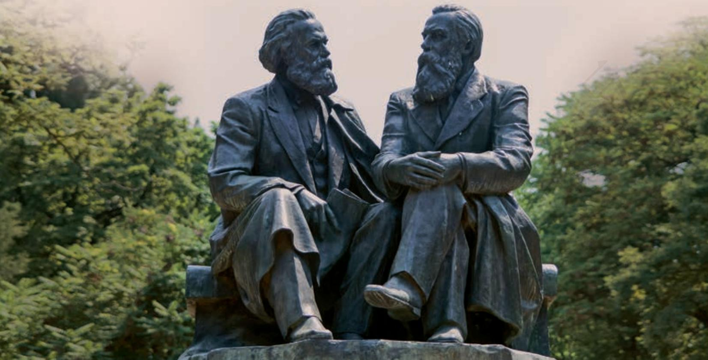
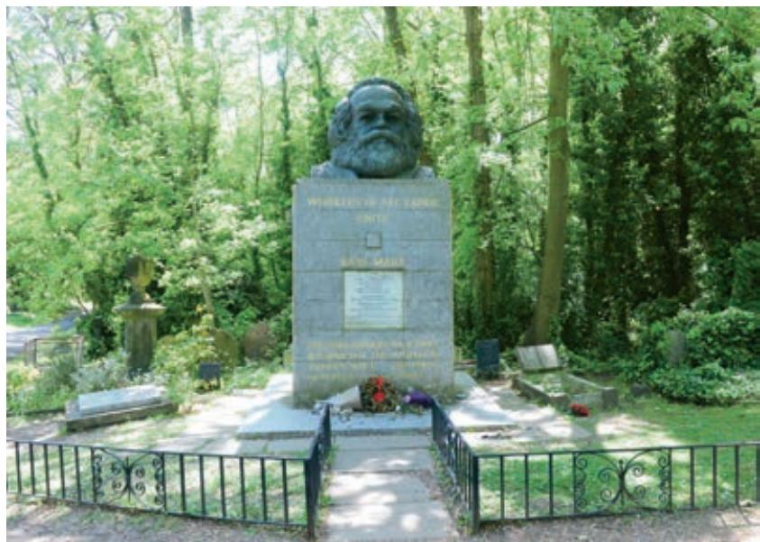

“一代人有一代人的长征，一代人有一代人的担当。”今天，新时代的中国青年应当具有怎样的抱负，承担怎样的使命？这些问题值得我们认真思索。

本单元所选作品，或剖析社会矛盾，宣示历史使命；或概括伟人贡献，致以崇敬之情；或是上书言事，谏阻逐客；或为临终绝笔，直抒心志。这些作品表现出革命导师、有为之士顺应历史潮流，勇于担负时代使命的精神。

学习本单元，要通过专题研讨，加深对“抱负与使命”的认识。要注意这些作品切于实用、关注特定对象、富于针对性的特点；要结合具体作品，学习有理有据地发表意见，阐发主张；要把握书信注重交流、抒写自由的文体特质，体会作者的深挚情感。

# 在《人民报》创刊纪念会上的演说

1856年4月14日在伦敦

马克思

所谓的1848年革命b，只不过是一些微不足道的事件，是欧洲社会干硬外壳上的一些细小的裂口和缝隙。但是它们却暴露出了外壳下面的一个无底深渊。在看来似乎坚硬的外表下面，现出了一片汪洋大海，只要它动荡起来，就能把由坚硬岩石构成的大陆撞得粉碎。那些革命吵吵嚷嚷、模模糊糊地宣布了无产阶级解放这个19世纪的秘密，本世纪革命的秘密。

的确，这个社会革命并不是1848年发明出来的新东西。蒸汽、电力和自动走锭纺纱机甚至是比巴尔贝斯、拉斯拜尔和布朗基c 诸位公民更危险万分的革命家。但是，尽管我们生活在其中的大气把两万磅重的压力加在每一个人身上，你们可感觉得到吗？同样，欧洲社会在1848年以前也没有感觉到从四面八方包围着它、压抑着它的革命气氛。

这里有一件可以作为我们19世纪特征的伟大事实，一件任何政党都不敢否认的事实。一方面产生了以往人类历史上任何一个时代都不能想象的工业和科学的力量；而另一方面却显露出衰颓的征兆，这种衰颓远远超过罗马帝国末期那一切载诸史册的可怕情景。

在我们这个时代，每一种事物好像都包含有自己的反面。我们看到，机器具有减少人类劳动和使劳动更有成效的神奇力量，然而却引起了饥饿和过度的疲劳。财富的新源泉，由于某种奇怪的、不可思议的魔力而变成贫困的源泉。技术的胜利，似乎是以道德的败坏为代价换来的。随着人类愈益控制自然，个人却似乎愈益成为别人的奴隶或自身的卑劣行为的奴隶。甚至科学的纯洁光辉仿佛也只能在愚昧无知的黑暗背景上闪耀。我们的一切发明和进步，似乎结果是使物质力量成为有智慧的生命，而人的生命则化为愚钝的物质力量。现代工业和科学为一方与现代贫困和衰颓为另一方的这种对抗，我们时代的生产力与社会关系之间的这种对抗，是显而易见的、不可避免的和毋庸争辩的事实。有些党派可能为此痛哭流涕；另一些党派可能为了要摆脱现代冲突而希望抛开现代技术；还有一些党派可能以为工业上如此巨大的进步要以政治上同样巨大的倒退来补充。可是我们不会认错那个经常在这一切矛盾中出现的狡狯的精灵a。我们知道，要使社会的新生力量很好地发挥作用，就只能由新生的人来掌握它们，而这些新生的人就是工人。工人也同机器本身一样，是现代的产物。在那些使资产阶级、贵族和可怜的倒退预言家惊慌失措的现象当中，我们认出了我们的勇敢的朋友好人儿罗宾，这个会迅速刨土的老田鼠、光荣的工兵b——革命。英国工人是现代工业的头一个产儿。他们在支援这种工业所引起的社会革命方面肯定是不会落在最后的，这种革命意味着他们的本阶级在全世界的解放，这种革命同资本的统治和雇佣奴隶制具有同样的普遍性质。我知道英国工人阶级从上世纪中叶以来进行了多么英勇的斗争，这些斗争只是因为资产阶级历史学家把它们掩盖起来和隐瞒不说才不为世人所熟悉。为了报复统治阶级的罪行，在中世纪的德国曾有过一种叫作“菲默法庭c”的秘密法庭。如果某一所房子画上了一个红十字，大家就知道，这所房子的主人受到了“菲默法庭”的判决。现在，欧洲所有的房子都画上了神秘的红十字。历史本身就是审判官，而无产阶级就是执刑者。

# 在马克思墓前的讲话

恩格斯

3月14日下午两点三刻，当代最伟大的思想家停止思想了。让他一个人留在房里还不到两分钟，当我们进去的时候，便发现他在安乐椅上安静地睡着了——但已经永远地睡着了。

这个人的逝世，对于欧美战斗的无产阶级，对于历史科学，都是不可估量的损失。这位巨人逝世以后所形成的空白，不久就会使人感觉到。

正像达尔文b 发现有机界的发展规律一样，马克思发现了人类历史的发展规律，即历来为繁芜丛杂的意识形态所掩盖着的一个简单事实：人们首先必须吃、喝、住、穿，然后才能从事政治、科学、艺术、宗教等等；所以，直接的物质的生活资料的生产，从而一个民族或一个时代的一定的经济发展阶段，便构成基础，人们的国家设施、法的观点、艺术以至宗教观念，就是从这个基础上发展起来的，因而，也必须由这个基础来解释，而不是像过去那样做得相反。

不仅如此。马克思还发现了现代资本主义生产方式和它所产生的资产阶级社会的特殊的运动规律。由于剩余价值c 的发现，这里就豁然开朗了，而先前无论资产阶级经济学家或者社会主义批评家所做的一切研究都只是在黑暗中摸索。

一生中能有这样两个发现，该是很够了。即使只能作出一个这样的发现，也已经是幸福的了。但是马克思在他所研究的每一个领域，甚至在数学领域，都有独到的发现，这样的领域是很多的，而且其中任何一个领域他都不是浅尝辄止。

他作为科学家就是这样。但是这在他身上远不是主要的。在马克思看来，科学是一种在历史上起推动作用的、革命的力量。任何一门理论科学中的每一个新发现——它的实际应用也许还根本无法预见——都使马克思感到衷心喜悦，而当他看到那种对工业、对一般历史发展立即产生革命性影响的发现的时候，他的喜悦就非同寻常了。例如，他曾经密切注视电学方面各种发现的进展情况，不久以前，他还密切注视马塞尔·德普勒a 的发现。

因为马克思首先是一个革命家。他毕生的真正使命，就是以这种或那种方式参加推翻资本主义社会及其所建立的国家设施的事业，参加现代无产阶级的解放事业，正是他第一次使现代无产阶级意识到自身的地位和需要，意识到自身解放的条件。斗争是他的生命要素。很少有人像他那样满腔热情、坚韧不拔和卓有成效地进行斗争。最早的《莱茵报》b（1842年），巴黎的《前进报》c

（1844年），《德意志-布鲁塞尔报》d（1847年），《新莱茵报》e（1848—1849年），《纽约 每 日 论 坛 报 》f（1852—1861年），以及许多富有战斗性的小册子，在巴黎、布鲁塞尔和伦敦各组织中的工作，最后，作为全部活动的顶峰，创立伟大的国际工人协会g，——老实说，协会的这位创始人即使没有别的什么建树，单凭这一成果也可以自豪。

正因为这样，所以马克思是当代最遭嫉恨和最受诬

  
位于英国伦敦海格特公墓的马克思墓  曾毅 摄

实际领导编辑部的工作。

e〔《新莱茵报》〕德国无产阶级第一家独立的日报，1848年6月1日至1849年5月19日在科隆出版，主编是马克思。参加编辑部工作的还有恩格斯。

蔑的人。各国政府——无论专制政府或共和政府，都驱逐他a ；资产者——无论保守派或极端民主派，都竞相诽谤他，诅咒他。他对这一切毫不在意，把它们当作蛛丝一样轻轻拂去，只是在万不得已时才给以回敬。现在他逝世了，在整个欧洲和美洲，从西伯利亚矿井到加利福尼亚，千百万革命战友无不对他表示尊敬、爱戴和悼念，而我可以大胆地说：他可能有过许多敌人，但未必有一个私敌。

他的英名和事业将永垂不朽！

## 学习提示

这两篇演讲词是演讲史上的经典之作，为我们诠释了时代使命与个人抱负的要义。

《在〈人民报〉创刊纪念会上的演说》是马克思面对志同道合的革命友人发表的即席演说，以历史唯物主义的观点阐发了蕴含在资本主义社会“干硬外壳”下的深层矛盾，富于前瞻性地向世界宣告无产阶级的历史使命——担当资本主义灭亡的“执刑者”。文章善用比喻和典故，将睿智的思想和深刻的理论表达得鲜活生动，极具鼓动性和感召力。

《在马克思墓前的讲话》是恩格斯为他的亲密战友马克思写的悼词，深切缅怀了马克思的伟大人格和崇高精神，赞颂了马克思的历史功绩和光辉思想。文章逐层深入，全面总结了马克思作为思想家、革命家的伟大成就。“永远地睡着了”“当作蛛丝一样轻轻拂去”等饱含情感的文字，展现出两位革命导师之间的深厚情谊。我们可以从中获得人生启迪，汲取精神力量。

学习演讲词，要从演讲的目的、场合和对象等方面把握其针对性。还可以设想作者演讲时的现场氛围，揣摩演讲者的语气、语调，想象其表情和肢体语言，做简要批注，并尝试自己做一次演讲，学会在公共场合表达意见。