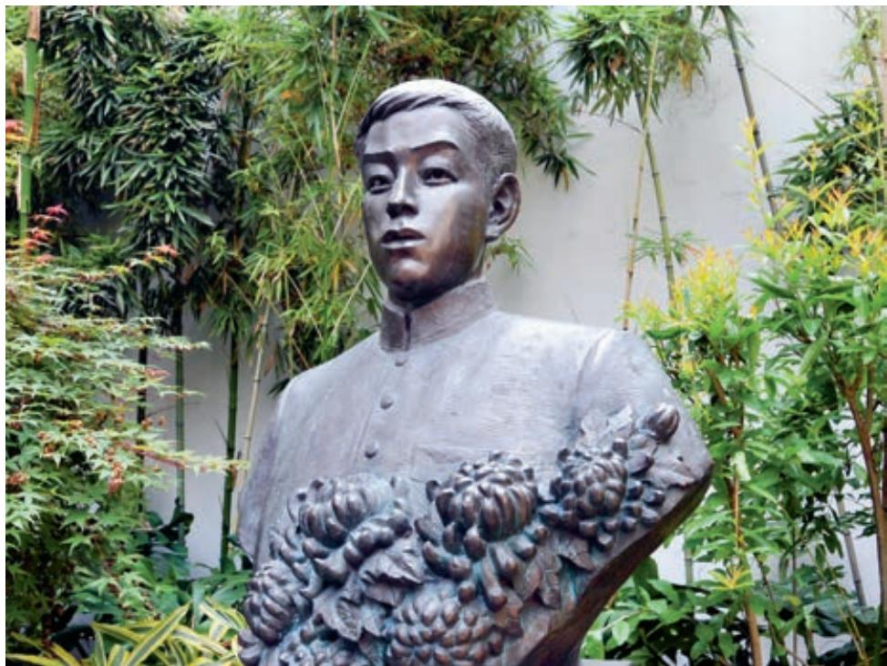

# 谏逐客书 a

李 斯

臣闻吏议逐客，窃以为过矣。昔缪公b 求士，西取由余于 戎c，东得百里奚于宛d，迎蹇叔于宋e，来丕豹、公孙支于晋f。 此五子者，不产于秦，而缪公用之，并g 国二十，遂霸西戎。孝 公用商鞅之法h，移风易俗，民以殷盛i，国以富强，百姓乐用j， 诸侯亲服，获楚、魏之师k，举l 地千里，至今治强m。惠王用张 仪之计n，拔三川之地o，西并巴、蜀p，北收上郡q，南取汉 中r，包九夷s，制鄢、郢t，东据成皋之险u，割膏腴之壤，遂散 六国之从a，使之西面事秦，功施b 到今。昭王得范雎，废穰侯， 逐华阳c，强公室d，杜私门e，蚕食诸侯，使秦成帝业。此四君 者，皆以客之功。由此观之，客何负于秦哉！向使f 四君却客而不 内，疏士而不用，是使国无富利之实而秦无强大之名也。

今陛下致昆山g 之玉，有随、和之宝h，垂明月i 之珠，服太 阿之剑j，乘纤离k 之马，建翠凤之旗l，树灵鼍m 之鼓。此数宝 者，秦不生一焉，而陛下说之，何也？必秦国之所生然后可，则 是夜光之璧不饰朝廷，犀象之器n 不为玩好o，郑、卫之女不充后 宫，而骏良 p 不实外厩，江南金锡不为用，西蜀丹青q 不为 采。所以饰后宫、充下陈r、娱心意、说耳目者，必出于秦然后 可，则是宛珠s 之簪、傅玑之珥t、阿缟u 之衣、锦绣之饰不进于 前，而随俗雅化v 佳冶w 窈窕赵女不立于侧也。夫击瓮叩缶x，弹筝 搏髀y，而歌呼呜呜快耳者，真秦之声也；《郑》《卫》《桑间》z， 《昭》《虞》《武》《象》@7者，异国之乐也。今弃击瓮叩缶而就《郑》 《卫》，退弹筝而取《昭》《虞》，若是者何也？快意当前，适观@8 而已矣。今取人则不然，不问可否，不论曲直，非秦者去，为客者

a〔散六国之从〕拆散六国结成的合纵。当时韩、魏、燕、赵、齐、楚六国联盟抗秦，称为合纵。从，同“纵”。

b〔施（yì）〕延续。

c〔昭王得范雎，废穰（rǎng）侯，逐华阳〕昭王，即秦昭襄王，战国时秦国国君。范雎，战国时魏国人。先被昭王拜为客卿，指出秦昭王母宣太后擅权，权贵用事，将危及昭王的统治。昭王遂下令废宣太后，将穰侯、华阳君等贵戚放逐到关外，并拜范雎为相，封于应（今河南平顶山西），称应侯。穰侯，即魏冉，宣太后异父弟，曾多次任秦相，封于穰（今河南邓州），称穰侯。华阳，即华阳君芈（mǐ）戎，宣太后同母弟，曾任将军等职，与魏冉同掌国政，受封于华阳（今河南新郑北），故称华阳君。

d〔公室〕王室。

e〔杜私门〕抑制豪门贵族的势力。杜，堵塞、封闭。私门，对公室而言，指权贵大臣之家。

f〔向使〕假使。

g〔昆山〕昆仑山，古代以出产美玉而闻名。

h〔随、和之宝〕即随侯珠与和氏璧，传说中春秋时随侯得到的宝珠和楚人卞和所获的美玉。

i〔明月〕宝珠名。

j〔服太阿之剑〕佩带太阿剑。服，佩带。太阿，古代名剑，相传为春秋时著名工匠欧冶子、干将所铸。

k〔纤离〕骏马名。

l〔建翠凤之旗〕树起以翠羽装饰的凤形旗帜。建，树立。

m〔灵鼍（tuó）〕即扬子鳄，古人认为有灵性，皮可蒙鼓。

n〔犀象之器〕用犀牛角和象牙制成的器具。

o〔玩好〕供玩赏的宝物。

p〔 （juétí）〕骏马名。

q〔西蜀丹青〕蜀地出产的丹青颜料。丹，丹砂，可以制成红色颜料。青，青雘（huò），可以制成青黑色颜料。

r〔下陈〕古代殿堂下放置礼品、站列婢妾的地方。

s〔宛珠〕宛地出产的宝珠。

t〔傅玑之珥（ěr）〕镶嵌着珠子的耳饰。傅，附着、加上。玑，不圆的珠子，这里泛指珠子。

u〔阿（ē）缟〕古代齐国东阿所产的细绢。

v〔随俗雅化〕娴雅变化而能随俗。

w〔佳冶〕娇美妖冶。

x〔击瓮叩缶（fǒu）〕敲击瓮、缶来奏乐。这是秦国的风俗。瓮，用来汲水的陶器，口小而腹大。缶，一种瓦制的打击乐器。

y〔搏髀（bì）〕唱歌时拍打大腿以应和节拍。搏，击打、拍打。髀，大腿。

z〔《郑》《卫》《桑间》〕指郑国、卫国一带的乐曲。桑间，原是卫国濮水边的地名，在今河南濮阳南，相传卫国青年男女常在濮水上欢会歌唱。

@7〔《昭》《虞》《武》《象》〕都是传说中的古乐名，这里泛指古乐。《昭》，即《韶》，传说中舜时的乐曲。@8〔适观〕适于观听。

逐。然则是所重者在乎色、乐、珠玉，而所轻者在乎人民a 也。此非所以跨海内、制诸侯之术也。

臣闻地广者粟多，国大者人众，兵强则士勇。是以太山不让 土壤，故能成其大；河海不择b 细流，故能就c 其深；王者不却d 众庶，故能明其德。是以地无四方，民无异国，四时充e 美，鬼神 降福，此五帝三王f 之所以无敌也。今乃弃黔首g 以资h 敌国，却 宾客以业i 诸侯，使天下之士退而不敢西向，裹足不入秦，此所谓 “藉寇兵而赍盗粮j”者也。

夫物不产于秦，可宝者多；士不产于秦，而愿忠者众。今逐客以资敌国，损民以益仇，内自虚而外树怨于诸侯，求国无危，不可得也。

## 与妻书

林觉民

意映卿卿如晤l，吾今以此书与汝永别矣！吾作此书时，尚是世中一人；汝看此书时，吾已成为阴间一鬼。吾作此书，泪珠和笔墨齐下，不能竟m 书而欲搁笔，又恐汝不察吾衷，谓吾忍舍汝而死，谓吾不知汝之不欲吾死也，故遂忍悲为汝言之。

吾至爱汝，即此爱汝一念，使吾勇于就死也。吾自遇汝以来，常愿天下有情人都成眷属；然遍地腥云，满街狼犬，称心快意，几家能彀n ？司马春衫o，吾不能学太上之忘情p 也。语云：仁者“老吾老，以及人之老；幼吾幼，以及人之幼”。吾充a 吾爱汝之心，助天下人爱其所爱，所以敢先汝而死，不顾汝也。汝体吾此心，于啼泣之余，亦以天下人为念，当亦乐牺牲吾身与汝身之福利，为天下人谋永福也。汝其勿悲！

汝忆否？四五年前某夕，吾尝语曰：“与使b 吾先死也，无宁c汝先吾而死。”汝初闻言而怒，后经吾婉解，虽不谓吾言为是，而亦无词相答。吾之意盖谓以汝之弱，必不能禁失吾之悲，吾先死，留苦与汝，吾心不忍，故宁请汝先死，吾担悲也。嗟夫！谁知吾卒先汝而死乎？

吾真真不能忘汝也！回忆后街之屋，入门穿廊，过前后厅，又三四折，有小厅，厅旁一室，为吾与汝双栖之所。初婚三四个月，适冬之望日前后，窗外疏梅筛月影，依稀掩映；吾与并肩携手，低低切切，何事不语？何情不诉？及今思之，空余泪痕。又回忆六七年前，吾之逃家复归也，汝泣告我：“望今后有远行，必以告妾，妾愿随君行。”吾亦既许汝矣。前十余日回家，即欲乘便以此行之事语汝，及与汝相对，又不能启口，且以汝之有身d 也，更恐不胜悲，故惟日日呼酒买醉。嗟夫！当时余心之悲，盖不能以寸管e 形容之。

吾诚愿与汝相守以死，第f 以今日事势观之，天灾可以死，盗贼可以死，瓜分之日可以死，奸官污吏虐民可以死，吾辈处今日之中国，国中无地无时不可以死。到那时使吾眼睁睁看汝死，或使汝眼睁睁看吾死，吾能之乎？抑g 汝能之乎？即可不死，而离散不相见，徒使两地眼成穿而骨化石h，试问古来几曾见破镜能重圆？则较死为苦也，将奈之何？今日吾与汝幸双健。天下人之不当死而死与不愿离而离者，不可数计，钟情如我辈者，能忍之乎？此吾所以敢率性i 就死不顾汝也。吾今死无余憾，国事成不成自有同志者在。依新j 已五岁，转眼成人，汝其善抚之，使之肖k 我。汝腹中之物，吾疑其女也，女必像汝，吾心甚慰。或又是男，则亦教其以父志为志，则吾死后尚有二意洞在也。甚幸，甚幸！吾家后日当甚贫，贫无所苦，清静过日而已。

吾今与汝无言矣。吾居九泉之下遥闻汝哭声，当哭相和也。

a〔充〕扩充。

b〔与使〕与其。

c〔无宁〕不如。

d〔有身〕有身孕。

e〔寸管〕指笔。

f〔第〕只是。

g〔抑〕还是。

h〔骨化石〕古代传说，有一男子外出未归，其妻天天登山远望，日久天长变成了一块石头。后人称之为“望夫石”。

i〔率性〕任性。

j〔依新〕作者的儿子。

k〔肖〕像。

吾平日不信有鬼，今则又望其真有。今人又言心电感应有道，吾亦望其言是实，则吾之死，吾灵尚依依旁a 汝也，汝不必以无侣悲。

吾平生未尝以吾所志语汝，是吾不是处；然语之，又恐汝日日为吾担忧。吾牺牲百死而不辞，而使汝担忧，的的b 非吾所忍。吾爱汝至，所以为汝谋者惟恐未尽。汝幸而偶c 我，又何不幸而生今日之中国！吾幸而得汝，又何不幸而生今日之中国！卒不忍独善其身。嗟夫！巾d 短情长，所未尽者，尚有万千，汝可以模拟e 得之。吾今不能见汝矣！汝不能舍吾，其时时于梦中得我乎？一恸f。辛未g 三月念h 六夜四鼓i，意洞手书。

家中诸母j 皆通文，有不解处，望请其指教，当尽吾意为幸。

  
福州林觉民故居的林觉民烈士塑像

这两篇文章均为“书”，却是不同的文体。一为随事谏诤、议论政务的奏疏，一为传寄亲人、吐露心声的书信。对象不同，目的各异，要反复诵读，认真体会二者在态度、语气、表达方式、语体选择上的差异。

奏疏一类公文，往往针对具体政事阐发观点，务求实效，因而要精心构思，巧妙措辞，选取恰切的立足点和切入点。李斯作《谏逐客书》，针对秦王驱逐客卿的政令发表意见，意在劝说君王收回成命。为了达到这一目的，作者站在“跨海内，制诸侯”的高度看待逐客的利弊得失，历数秦国过去因任用客卿而逐渐富强的史实，切中了秦王一统天下的雄心，最终成功打动秦王。文章铺张扬厉，气势雄浑，颇有战国策士的论辩之风。

亲友之间的书信，往往不事营构，自由抒写，自有一种打动人心的力量。林觉民作《与妻书》，与妻诀别，倾诉衷肠，一面表达对妻子的至爱，或直抒胸臆，或追忆往昔，一面又冲破儿女情长，晓以国家大义，时时作解释和安慰。“吾至爱汝”的深情与“即此爱汝一念，使吾勇于就死”的勇决，宛如两种旋律交错并进，使文章既缠绵悱恻，又充满浩然正气。诵读课文，注意把握感情线索，体会作者写作时的复杂心理和崇高的思想境界。