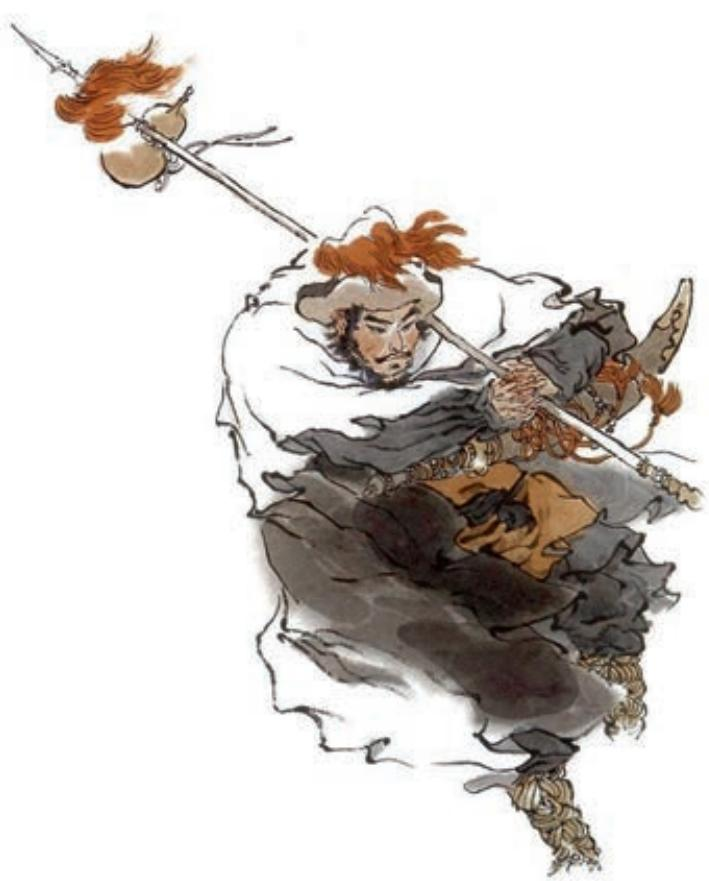
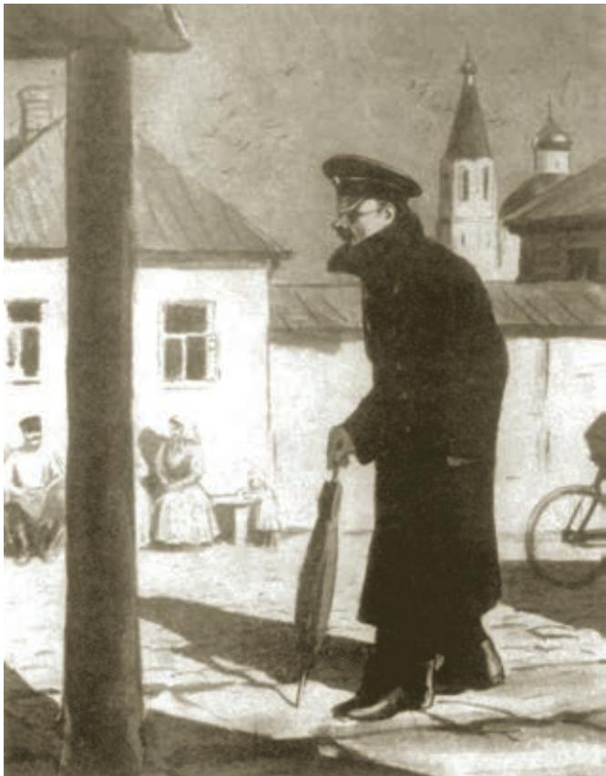
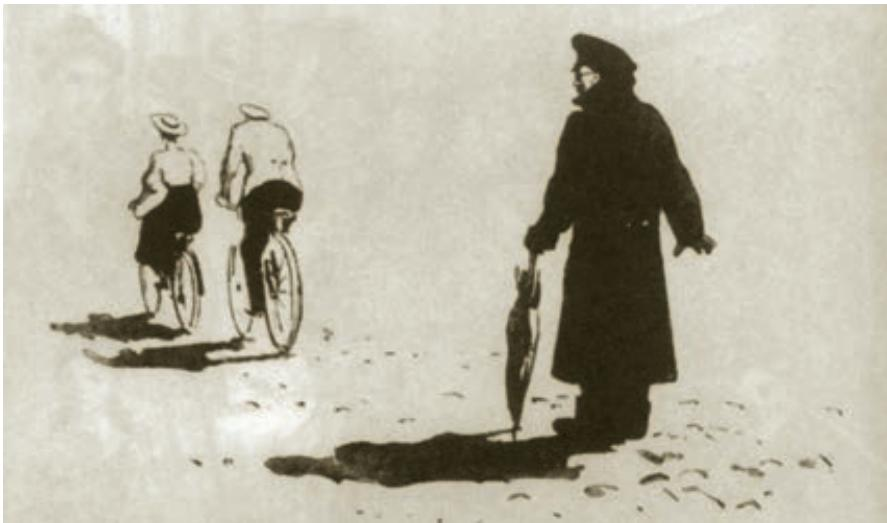

# 林教头风雪山神庙

施耐庵

话说当日林冲正闲走间，忽然背后人叫。回头看时，却认得是酒生儿b 李小二。当初在东京时，多得林冲看顾；后来不合c 偷了店主人家钱财，被捉住了，要送官司问罪，又得林冲主张陪话d，救了他免送官司，又与他赔了些钱财，方得脱免；京中安不得身，又亏林冲赍发e 他盘缠，于路f 投奔人。不想今日却在这里撞见。林冲道：“小二哥！你如何也在这里？”李小二便拜道：“自从得恩人救济，赍发小人，一地里投奔人不着，迤逦g 不想来到沧州，投托一个酒店主人，姓王，留小人在店中做过卖h。因见小人勤谨，安排的好菜蔬，调和的好汁水i，来吃的人都喝采，以此买卖顺当，主人家有个女儿，就招了小人做女婿。如今丈人丈母都死了，只剩得小人夫妻两个，权在营前j 开了个茶酒店。因讨钱过来，遇见恩人。恩人不知为何事在这里？”林冲指着脸上道：“我因恶了高太尉k，生事陷害，受了一场官司，刺配l 到这里。如今叫我管m 天王堂，未知久后如何。不想今日在此见你。”李小二就请林冲到家里坐定，叫妻子出来拜了恩人。两口儿欢喜道：“我夫妻二人正没个亲眷，今日得恩人到来，便是从天降下。”林冲道：“我是罪囚，恐怕玷辱你夫妻两个。”李小二道：“谁不知恩人大名？休恁地n 说。但o 有衣服，便拿来家里浆洗缝补。”当时管待p 林冲酒食，至夜送回天王堂。次日又来相请。自此林冲得店小二家来往，不时间送汤送水来营里与林冲吃。林冲因见他两口儿恭敬孝顺，常

把些银两与他做本钱。

且把闲话休题，只说正话。光阴迅速，却早冬来。林冲的棉衣裙袄都是李小二浑家整治缝补。忽一日，李小二正在门前安排菜蔬下饭，只见一个人闪将进来，酒店里坐下；随后又一人闪入来。看时，前面那个人是军官打扮，后面这个走卒模样，跟着也来坐下。李小二入来问道：“可要吃酒？”只见那个人将出a 一两银子与李小二道：“且收放柜上，取三四瓶好酒来。客到时，果品酒馔b 只顾将来，不必要问。”李小二道：“官人请甚客？”那人道：“烦你与我去营里请管营c、差拨d 两个来说话。问时，你只说：‘有个官人请说话，商议些事务，专等，专等。’”李小二应承了，来到牢城里，先请了差拨；同到管营家里，请了管营，都到酒店里。只见那个官人和管营、差拨两人讲了礼e。管营道：“素不相识，动问官人高姓大名？”那人道：“有书在此，少刻便知。且取酒来。”李小二连忙开了酒，一面铺下菜蔬果品酒馔。那人叫讨副劝盘f 来，把了盏g，相让坐了。小二独自一个撺梭也似伏侍不暇。那跟来的人讨了汤桶h，自行烫酒。约计吃过十数杯，再讨了按酒i 铺放桌上。只见那人说道：“我自有伴当j 烫酒。不叫，你休来。我等自要说话。”

李小二应了，自来门首叫老婆道：“大姐！这两个人来得不尴尬k。”老婆道：“怎么的不尴尬？”小二道：“这两个人，语言声音是东京人，初时又不认得管营，向后我将按酒入去，只听得差拨口里呐l 出一句‘高太尉’三个字来。这人莫不与林教头身上有些干碍 m ？我自在门前理会，你且去阁子背后听说甚么。”老婆道：“你去营中寻林教头来，认他一认。”李小二道：“你不省得n，林教头是个性急的人，摸不着o 便要杀人放火。倘或叫得他来看了，正是前日说的甚么陆虞候，他肯便罢？做出事来，须连累了我和你。你只去听一听，再理会。”老婆道：“说得是。”便入去听了一个时辰，出来说道：“他那三四个交头接耳说话，正不听得说甚么。只见那一个军官模样的人去伴当怀里取出一帕子物事p 递与管营和差拨。帕子里面的莫不是金银？只听差拨口里说道：‘都在我身上，好歹a 要结果b 他性命。’……”正说之时，阁子里叫：“将汤来！”李小二急去里面换汤时，看见管营手里拿着一封书。小二换了汤，添些下饭c。又吃了半个时辰，算还了酒钱。管营、差拨先去了，次后那两个低着头也去了。

转背d 没多时，只见林冲走将入店里来，说道：“小二哥！连日好买卖。”李小二慌忙道：“恩人请坐，小二却待正要寻恩人，有些要紧说话。”林冲问道：“甚么要紧的事？”李小二请林冲到里面坐下，说道：“却才e 有个东京来的尴尬人，在我这里请管营、差拨吃了半日酒。差拨口里呐出‘高太尉’三个字来，小二心下疑惑。又着浑家听了一个时辰，他却交头接耳，说话都不听得。临了，只见差拨口里应道：‘都在我两个身上，好歹要结果了他。’那两个把一包金银递与管营、差拨，又吃一回酒，各自散了。不知甚么样人。小人心疑，只怕在恩人身上有些妨碍。”林冲道：“那人生得甚么模样？”李小二道：“五短身材f，白净面皮，没甚髭须，约有三十余岁。那跟的也不长大，紫棠色g 面皮。”林冲听了，大惊道：“这三十岁的正是陆虞候。那泼贱贼h 敢来这里害我！休要撞着我，只教他骨肉为泥！”李小二道：“只要提防他便了。岂不闻古人言‘吃饭防噎，走路防跌’？”

林冲大怒，离了李小二家，先去街上买把解腕尖刀i，带在身上，前街后巷一地里去寻。李小二夫妻两个捏着两把汗。当晚无事。次日天明起来，洗漱罢，带了刀，又去沧州城里城外、小街夹巷团团j 寻了一日，牢城营里都没动静。林冲又来对李小二道：“今日又无事。”小二道：“恩人，只愿如此。只是自放仔细便了。”林冲自回天王堂，过了一夜。街上寻了三五日，不见消耗k，林冲也自心下慢l 了。

到第六日，只见管营叫唤林冲到点视厅m 上，说道：“你来这里许多时，柴大官人面皮，不曾抬举得你n。此间东门外十五里有座大军草料场a，每月但是纳草纳料的，有些常例钱b 取觅，原是一个老军看管；如今我抬举你，去替那老军来守天王堂，你在那里几贯盘缠c。你可和差拨便去那里交割d。”林冲应道：“小人便去。”当时离了营中，径到李小二家，对他夫妻两个说道：“今日管营拨我去大军草料场管事，却如何？”李小二道：“这个差使又好似e 天王堂，那里收草料时，有些常例钱钞。往常不使钱f 时，不能够得这差使。”林冲道：“却不害我，倒与我好差使，正不知何意？……”李小二道：“恩人，休要疑心。只要没事便好了。只是小人家离得远了，过几时，那工夫g 来望恩人。”就在家里安排几杯酒，请林冲吃了。

话不絮烦，两个相别了。林冲自来天王堂，取了包裹，带了尖刀，拿了条花枪，与差拨一同辞了管营，两个取路投h 草料场来。正是严冬天气，彤云i 密布，朔风渐起，却早纷纷扬扬卷下一天大雪来。林冲和差拨两个在路上，又没买酒吃处，早来到草料场外。看时，一周遭有些黄土墙，两扇大门。推开看里面时，七八间草屋做着仓廒j，四下里都是马草堆，中间两座草厅。到那厅里，只见那老军在里面向火k。差拨说道：“管营差这个林冲来，替你回天王堂看守，你可即便交割。”老军拿了钥匙，引着林冲，分付道：“仓廒内自有官司封记l。这几堆草，一堆堆都有数目。”老军都点见m 了堆数，又引林冲到草厅上。老军收拾行李，临了说道：“火盆、锅子、碗、碟，都借与你。”林冲道：“天王堂内，我也有在那里，你要便拿了去。”老军指壁上挂一个大葫芦，说道：“你若买酒吃时，只出草场投东大路去，三二里便有市井n。”老军自和差拨回营里来。

只说林冲就床上放了包裹被卧o，就坐下生些焰火起来。屋后有一堆柴炭，拿几块来，生在地炉里。仰面看那草屋时，四下里崩坏了，又被朔风吹撼，摇振得动。林冲道：“这屋如何过得一冬？待雪晴了，去城中唤个泥水匠来修理。”向了一回火，觉得身上寒冷，寻思：“却才老军所说，二里路外有那市井，何不去沽些酒来吃？”便去包裹里取些碎银子，把花枪挑了酒葫芦，将火炭盖了，取毡笠子戴上，拿了钥匙，出来，把草厅门拽上；出到大门首，把两扇草场门反拽上锁了；带了钥匙，信步投东，雪地里踏着碎琼乱玉a，迤逦背着北风而行。那雪正下得紧。

行不上半里多路，看见一所古庙，林冲顶礼b 道：“神明庇祐c ！改日来烧纸钱。”又行了一回，望见一簇人家。林冲住脚看时，见篱笆中挑着一个草帚儿d 在露天里。林冲径到店里。主人道：“客人那里来？”林冲道：“你认得这个葫芦么？”主人看了道：“这葫芦是草料场老军的。”林冲道：“原来如此。”店主道：“即是草料场看守大哥，且请少坐；天气寒冷，且酌三杯，权当接风e。”店家切

  
豹子头林冲  戴敦邦 作

一盘熟牛肉，烫一壶热酒，请林冲吃。又自买了些牛肉，又吃了数杯。就又买了一葫芦酒，包了那两块牛肉，留下些碎银子，把花枪挑着酒葫芦，怀内揣了牛肉，叫声“相扰”，便出篱笆门，仍旧迎着朔风回来。看那雪，到晚越下得紧了。

再说林冲踏着那瑞雪，迎着北风，飞也似奔到草场门口，开了锁，入内看时，只叫得苦。原来天理昭然，佑护善人义士，因这场大雪，救了林冲的性命：那两间草厅已被雪压倒了。林冲寻思：“怎地好？”放下花枪、葫芦在雪里；恐怕火盆内有火炭延烧起来，搬开破壁子，探半身入去摸时，火盆内火种都被雪水浸灭了。林冲把手床上摸时，只拽得一条絮被。林冲钻将出来，见天色黑了，寻思：“又没打火处，怎生安排？”想起离了这半里路上有个古庙，可以安身：“我且去那里宿一夜，等到天明，却作理会。”把被卷了，花枪挑着酒葫芦，依旧把门拽上，锁了，望那庙里来。入得庙门，再把门掩上。旁边止有一块大石头，拨将过来靠了门。入得里面看时，殿上塑着一尊金甲山神，两边一个判官，一个小鬼，侧边堆着一堆纸。团团看来，又没邻舍，又无庙主。林冲把枪和酒葫芦放在纸堆上，将那条絮被放开，先取下毡笠子，把身上雪都抖了，把上盖a 白布衫脱将下来，早有五分湿了，和毡笠放供桌上。把被扯来盖了半截下身，却把葫芦冷酒提来，慢慢地吃，就将怀中牛肉下酒。

正吃时，只听得外面必必剥剥地爆响。林冲跳起身来，就壁缝里看时，只见草料场里火起，刮刮杂杂地烧着。当时林冲便拿了花枪，却待开门来救火，只听得外面有人说将话来。林冲就伏门边听时，是三个人脚步响，直奔庙里来；用手推门，却被石头靠住了，再也推不开。三人在庙檐下立地b 看火。数内一个道：“这条计好么？”一个应道：“端的c 亏管营、差拨两位用心！回到京师，禀过太尉，都保你二位做大官。这番张教头没得推故了d ！”一个道：“林冲今番直吃我们对付了e ！高衙内这病必然好了！”又一个道：“张教头那厮，三回五次托人情去说‘你的女婿没了’，张教头越不肯应承，因此衙内病患看看重了。太尉特使俺两个央浼f二位干这件事。不想而今完备了！”又一个道：“小人直爬入墙里去，四下草堆上点了十来个火把，待走那里去！”那一个道：“这早晚烧个八分过了。”又听得一个道：“便逃得性命时，烧了大军草料场也得个死罪！”又一个道：“我们回城里去罢。”一个道：“再看一看，拾得他一两块骨头回京，府里见太尉和衙内时，也道我们也能会干事。”

林冲听那三个人时，一个是差拨，一个是陆虞候，一个是富安。自思道：“天可怜见g 林冲！若不是倒了草厅，我准定被这厮们烧死了！”轻轻把石头掇开，挺着花枪，左手拽开庙门，大喝一声：“泼贼那里去！”三个人都急要走时，惊得呆了，正走不动。林冲举手，胳察的一枪，先搠h 倒差拨。陆虞候叫声：“饶命！”吓得慌了手脚，走不动。那富安走不到十来步，被林冲赶上，后心只一枪，又搠倒了。翻身回来，陆虞候却才行得三四步，林冲喝声道：“奸贼！你待那里去！”劈胸只一提，丢翻在雪地上，把枪搠在地里，用脚踏住胸脯，身边取出那口刀来，便去陆谦脸上阁i着，喝道：“泼贼！我自来又和你无甚么冤仇，你如何这等害我！正是‘杀人可恕，情理难容’！”陆虞候告道：“不干小人事；太尉差遣，不敢不来。”林冲骂道：“奸贼！我与你自幼相交，今日倒来害我！怎不干你事？且吃我一刀！”把陆谦上身衣服扯开，把尖刀向心窝里只一剜a，七窍迸出血来，将心肝提在手里。回头看时，差拨正爬将起来要走，林冲按住喝道：“你这厮原来也恁的歹，且吃我一刀！”又早把头割下来，挑在枪上。回来把富安、陆谦头都割下来，把尖刀插了，将三个人头发结做一处，提入庙里来，都摆在山神面前供桌上。再穿了白布衫，系了搭膊b，把毡笠子带上，将葫芦里冷酒都吃尽了，被与葫芦都丢了不要，提了枪，便出庙门投东去。

# 装在套子里的人

契诃夫

我的同事希腊文教师别里科夫两个月前才在我们城里去世。您一定听说过他。他也真怪，即使在最晴朗的日子，也穿上雨鞋，带着雨伞，而且一定穿着暖和的棉大衣。他总是把雨伞装在套子里，把表放在一个灰色的鹿皮套子里；就连那削铅笔的小刀也是装在一个小套子里的。他的脸也好像蒙着套子，因为他老是把它藏在竖起的衣领里。他戴黑眼镜，穿羊毛衫，用棉花堵住耳朵眼。他一坐上马车，总要叫马车夫支起车篷。总之，这人总想把自己包在壳子里，仿佛要为自己制造一个套子，好隔绝人世，不受外界影响。现实生活刺激他，惊吓他，老是闹得他六神不安。也许为了替自己的胆怯、自己对现实的憎恶辩护吧，他老是歌颂过去，歌颂那些从没存在过的东西；事实上他所教的古代语言，对他来说，也就是雨鞋和雨伞，使他借此躲避现实生活。

别里科夫把他的思想也极力藏在一个套子里。只有政府的告示和报纸上的文章，其中规定着禁止什么，他才觉得一清二楚。看到有个告示禁止中学学生在晚上九点钟以后到街上去，他就觉得又清楚又明白：这种事是禁止的，好，这就行了。但是他觉着在官方的批准或者默许里面，老是包藏着使人怀疑的成分，包藏着隐隐约约、还没充分说出来的成分。每逢经过当局批准，城里开了一个戏剧俱乐部，或者阅览室，或者茶馆，他总要摇摇头，低声说：

“当然，行是行的，这固然很好，可是千万别闹出什么乱子。”

凡是违背法令、脱离常规、不合规矩的事，虽然看来跟他毫不相干，却惹得他闷闷不乐。要是他的一个同事到教堂参加祈祷式去迟了，或者要是他听到流言，说是中学的学生闹出了乱子，他总是心慌得很，一个劲儿地说：“千万别闹出什么乱子。”在教务会议上，他那种慎重，那种多疑，那种纯粹套子式的论调，简直压得我们透不出气。他说什么不管男子中学里也好，女子中学里也好，年轻人都不安分，教室里闹闹吵吵——唉，只求这种事别传到当局的耳朵里去才好，只求不出什么乱子才好。他认为如果把二年级的彼得洛夫和四年级的叶果洛夫开除，那才妥当。您猜怎么着？他凭他那种唉声叹气，他那种垂头丧气，

［苏联］库克雷尼克塞 作

和他那苍白的小脸上的眼镜，降服了我们，我们只好让步，减低彼得洛夫和叶果洛夫的品行分数，把他们禁闭起来，到后来把他俩开除了事。我们教师们都怕他。信不信由您。我们这些教师都是有思想的、很正派的人，受过屠格涅夫和谢德林a 的陶冶，可是这个老穿着雨鞋、拿着雨伞的小人物，却把整个中学辖制了足足十五年！可是光辖制中学算得了什么？全城都受着他辖制呢！我们这儿的太太们到礼拜六不办家庭戏剧晚会，因为怕他听见；教士们当着他的面不敢吃荤，也不敢打牌。在别里科夫这类人的影响下，全城的人战战兢兢地生活了十年到十五年，什么事都怕。他们不敢大声说话，不敢写信，不敢交朋友，不敢看书，不敢周济穷人，不敢教人念书写字……

别里科夫跟我同住在一所房子里。他的卧室挺小，活像一只箱子，床上挂着帐子。他一上床，就拉过被子来蒙上脑袋。房里又热又闷，风推着关紧的门，炉子里嗡嗡地叫，厨房里传来叹息声——不祥的叹息声……他躺在被子底下，战战兢兢，深怕会出什么事，深怕小贼溜进来。他通宵做噩梦，到早晨我们一块儿到学校去的时候，他没精打采，脸色苍白。他所去的那个挤满了人的学校，分明使得他满心害怕和憎恶；跟我并排走路，对他那么一个性情孤僻的人来说，显然也是苦事。

可是，这个装在套子里的人，差点结了婚。有一个新的史地教员，一个原籍乌克兰，名叫密哈益·沙维奇·柯瓦连科的人，派到我们学校里来了。他是带着他姐姐华连卡一起来的。后来，由于校长太太的尽力撮合，华连卡开始对我们的别里科夫明白地表示好感了。在恋爱方面，特别是在婚姻方面，怂恿总要起很大的作用的。人人——他的同事和同事的太太们——开始向别里科夫游说：他应当结婚。况且，华连卡长得不坏，招人喜欢；她是五等文官a 的女儿，有田产；尤其要紧的，她是第一个待他诚恳而亲热的女人。于是他昏了头，决定结婚了。

但是华连卡的弟弟从认识别里科夫的第一天起，就讨厌他。

现在，您听一听后来发生的事吧。有个促狭鬼b 画了一张漫画，画着别里科夫打了雨伞，穿了雨鞋，卷起裤腿，正在走路，臂弯里挽着华连卡；下面缀着一个题名《恋爱中的anthroposc》。您知道，那神态画得像极了。那位画家一定画了不止一夜，因为男子中学和女子中学里的教师们、神学校的教师们、衙门里的官儿，全接到一份。别里科夫也接到一份。这幅漫画弄得他难堪极了。

我们一块儿走出了宿舍。那天是五月一日，礼拜天，学生和教师事先约定在学校里会齐，然后一块儿走到城郊的一个小林子里去。我们动身了，他脸色发青，比乌云还要阴沉。

“天下竟有这么歹毒的坏人！”他说，他的嘴唇发抖了。

我甚至可怜他了。我们走啊走的，忽然间，柯瓦连科骑着自行车来了，他的后面，华连卡也骑着自行车来了，涨红了脸，筋疲力尽，可是快活，兴高采烈。

“我们先走一步！”她嚷道，“多可爱的天气！多可爱，可爱得要命！”

他俩走远，不见了。别里科夫脸色从发青变成发白。他站住，

瞧着我。……

“这是怎么回事？或者，也许我的眼睛骗了我？难道中学教师和小姐骑自行车还成体统吗a ？”

“这有什么不成体统的？”我问，“让他们尽管骑他们的自行车，快快活活地玩一阵好了。”

“可是这怎么行？”他叫起来，看见我平心静气，觉得奇怪， “您在说什么呀？”

他似乎心里乱得很，不肯再往前走，回家去了。

  
［苏联］库克雷尼克塞 作

第二天他老是心神不定地搓手，打哆嗦，从他的脸色分明看得出来他病了。还没到放学的时候，他就走了，这在他还是生平第一回呢。他没吃午饭。将近傍晚，他穿得暖暖和和的，到柯瓦连科家里去了。华连卡不在家，就只碰到她弟弟。

“请坐！”柯瓦连科 冷冷地说，皱起眉头。别

里科夫沉默地坐了十分钟光景，然后开口了：

“我上您这儿来，是为要了却我的一桩心事。我烦恼得很，烦恼得很。有个不怀好意的家伙画了一张荒唐的漫画，画的是我和另一个跟您和我都有密切关系的人。我认为我有责任向您保证我跟这事没一点关系。……我没有做出什么事来该得到这样的讥诮——刚好相反，我的举动素来在各方面都称得起是正人君子。”

柯瓦连科坐在那儿生闷气，一句话也不说。别里科夫等了一会儿，然后压低喉咙，用悲凉的声调接着说：

“另外我有件事情要跟您谈一谈。我在这儿做了多年的事，您最近才来，既然我是一个比您年纪大的同事，我就认为我有责任给您进一个忠告。您骑自行车，这种消遣，对青年的教育者来说，绝对不合宜的！”

“怎么见得？”柯瓦连科问。

“难道这还用解释吗，密哈益·沙维奇？难道这不是理所当然吗？如果教师骑自行车，那还能希望学生做出什么好事来？他们所能做的就只有倒过来，用脑袋走路了！既然政府还没有发出通告，允许做这种事，那就做不得。昨天我吓坏了！我一看见您的姐姐，眼前就变得一片漆黑。一位小姐，或者一个姑娘，却骑自行车——这太可怕了！”

“您到底要怎么样？”

“我所要做的只有一件事，就是忠告您，密哈益·沙维奇。您是青年人，您前途远大，您的举动得十分十分小心才成；您却这么马马虎虎，唉，这么马马虎虎！您穿着绣花衬衫出门，人家经常看见您在大街上拿着书走来走去；现在呢，又骑什么自行车。校长会听说您和您姐姐骑自行车的，然后，这事又会传到督学的耳朵里……这还会有好下场吗？”

“讲到我姐姐和我骑自行车，这可不干别人的事。”柯瓦连科涨红了脸说，“谁要来管我的私事，就叫他滚！”

别里科夫脸色苍白，站起来。

“您用这种口吻跟我讲话，那我不能再讲下去了。”他说，“我请求您在我面前谈到上司的时候不要这样说话；您对上司应当尊敬才对。”

“难道我对上司说了什么不好的话？”柯瓦连科问，生气地瞧着他，“请您躲开我。我是正大光明的人，不愿意跟您这样的先生讲话。我不喜欢那些背地里进谗言的人。”

别里科夫心慌意乱，匆匆忙忙地穿大衣，脸上带着恐怖的神情。这还是他生平第一回听到别人对他说这么不客气的话。

“随您怎么说，都由您好了。”他一面走出门道，到楼梯口去，一面说，“只是我得跟您预先声明一下：说不定有人偷听了我们的谈话了，为了避免我们的谈话被人家误解以致闹出什么乱子起见，我得把我们的谈话内容报告校长——把大意说明一下。我不能不这样做。”

“报告他？去，尽管报告去吧！”

柯瓦连科在他后面一把抓住他的衣领，使劲一推，别里科夫就连同他的雨鞋一齐乒乒乓乓地滚下楼去。楼梯又高又陡，不过他滚到楼下却安然无恙，站起来，摸了摸鼻子，看了看他的眼镜碎了没有。可是，他滚下楼的时候，偏巧华连卡回来了，带着两位女士。她们站在楼下，怔住了。这在别里科夫却比任何事情都可怕。我相信他情愿摔断脖子和两条腿，也不愿意成为别人取笑的对象。是啊，这样一来，全城的人都会知道这件事，还会传到校长耳朵里去，还会传到督学耳朵里去。哎呀，不定会闹出什么乱子！说不定又会有一张漫画，到头来弄得他奉命退休吧。……

等到他站起来，华连卡才认出是他。她瞧着他那滑稽的脸相，他那揉皱的大衣，他那雨鞋，不明白是怎么回事，以为他是一不小心摔下来的，就忍不住纵声大笑，笑声在整个房子里响着：

“哈哈哈！”

这响亮而清脆的“哈哈哈”就此结束了一切事情：结束了预想中的婚事，结束了别里科夫的人间生活。他没听见华连卡说什么话，他什么也没有看见。一到家，他第一件事就是从桌子上撤去华连卡的照片；然后他上了床，从此再也没起过床。

过了一个月，别里科夫死了。我们都去送葬。

我们要老实说：埋葬别里科夫那样的人，是一件大快人心的事。我们从墓园回去的时候，露出忧郁和谦虚的脸相；谁也不肯露出快活的感情。——像那样的感情，我们很久很久以前做小孩子的时候，遇到大人不在家，我们到花园里去跑一两个钟头，享受完全自由的时候，才经历过。

我们高高兴兴地从墓园回家。可是一个礼拜还没有过完，生活又恢复旧样子，跟先前一样郁闷、无聊、乱糟糟了。局面并没有好一点。实在，虽然我们埋葬了别里科夫，可是这种装在套子里的人，却还有许多，将来也还不知道有多少呢！

## 学习提示

林冲本是八十万禁军教头，因高衙内图谋霸占其妻，而被设计陷害。起初，林冲一忍再忍，委曲求全，直到走投无路，忍无可忍，终于迸发出激烈的反抗。小说情节跌宕起伏，张弛有致。阅读时，要理清情节发展的脉络，体会林冲是怎样一步步被“逼上梁山”的。注意小说如何在情节的发展中塑造人物性格，感受和理解自然环境（如风雪）描写渲染气氛、推动情节的作用。窥斑见豹，大致了解《水浒传》的思想艺术成就。

别里科夫因循守旧，畏首畏尾，惧怕变革，极力维护现行秩序，是一只被“套子”箍住了手脚和思想的可怜虫，“套中人”从而成了保守、僵化和奴性的代名词。阅读时要注意把握别里科夫的性格特征，分析其成因，体会这一形象的社会批判意义。还要注意从情节、结构等方面欣赏这篇小说“讲故事”的艺术，体会契诃夫小说幽默讽刺的风格。