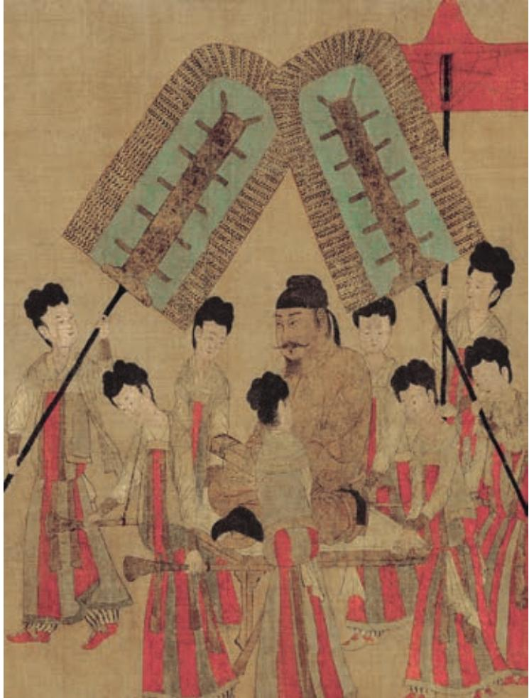

## 第八单元

天下兴亡，匹夫有责。古往今来，众多仁人志士自觉承担匡世济民的责任，积极建言献策，勇于变法图强。他们忧国忧民，心怀天下，坚守道义，敢于担当，令后人崇敬景仰。

本单元作品文体多样，有直言进谏、警示君主的奏疏，有据理辩争、剖白心迹的书信，有立足现实、评说盛衰的辞赋，有借古讽今、以史为鉴的史论。这些作品思路缜密，表达技巧高超，可以激发我们关注现实，深入思考。

本单元学习，围绕“倾听理性的声音”这一核心任务展开。要注意领会作者观点及其现实针对性，把握其解决现实问题的理性思维方式，鉴赏文章的说理艺术，学会在辩证分析与合理推理的基础上进行理性判断，养成大胆质疑、缜密推断的批判性思维习惯。

# 谏太宗十思疏

魏 征

臣闻求木之长b 者，必固其根本；欲流之远者，必浚c 其泉 源；思国之安者，必积其德义d。源不深而望流之远，根不固而求 木之长，德不厚而思国之理，臣虽下愚e，知其不可，而况于明哲f 乎！人君当神器之重g，居域中之大h，将崇极天之峻，永保无疆之 休i。不念居安思危，戒奢以俭j，德不处其厚，情不胜其欲，斯亦 伐根以求木茂，塞源而欲流长者也。

凡百元首k，承天景命l，莫不殷忧m 而道著，功成而德衰。 有善始者实繁，能克终者盖寡n。岂取之易而守之难乎？昔取之而 有余，今守之而不足，何也？夫在殷忧，必竭诚以待下；既得志， 则纵情以傲物o。竭诚则胡越为一体，傲物则骨肉为行路p。虽董 之以严刑q，振r 之以威怒，终苟免而不怀仁s，貌恭而不心服。 怨不在大，可畏惟人t ；载舟覆舟u，所宜深慎v ；奔车朽索，其 可忽乎！

表示推断。

君人者，诚能见可欲a 则思 知足以自戒，将有作b 则思知止 以安人，念高危则思谦冲而自 牧c，惧满溢d 则思江海下百川e， 乐盘游f 则思三驱g 以为度，忧 懈怠则思慎始而敬h 终，虑壅 蔽i 则思虚心以纳下，想谗邪j 则思正身以黜恶，恩所加则思 无因喜以谬赏k，罚所及则思无 因怒而滥刑。总此十思，弘兹九 德l，简能而任之，择善而从之， 则智者尽其谋，勇者竭其力，仁 者播其惠m，信者n 效其忠。文 武争驰，在君无事，可以尽豫游o 之乐，可以养松、乔之寿p，鸣 琴垂拱q，不言而化。何必劳神 苦思，代下司职，役聪明之耳目， 亏无为之大道哉！

  
步辇图（局部）  ［唐］阎立本 作

# 答司马谏议书

王安石

某 b 启：昨日蒙教 c，窃以为与君实游处 d 相好之日久，而议事每e 不合，所操之术f 多异故也。虽欲强聒，终必不蒙见察g，故略上报h，不复一一自辨i。重念j 蒙君实视遇k 厚，于反覆l 不宜卤莽，故今具道所以m，冀君实或见恕也。

盖儒者所争，尤在于名实n，名实已明，而天下之理得矣o。今君实所以见教者，以为侵官、生事、征利、拒谏p，以致天下怨谤也。某则以谓q受命于人主，议法度而修之于朝廷，以授之于有司r，不为s 侵官；举t 先王之政，以兴利除弊，不为生事；为天下理财，不为征利；辟邪说，难壬人u，不为拒谏。至于怨诽之多，则固前v 知其如此也。

人习于苟且w 非一日，士大夫多以不恤x 国事、同俗自媚于众y为善，上乃欲变此，而某不量敌之众寡，欲出力助上以抗之，则众何为而不汹汹然z ？盘庚之迁@7，胥怨@8者民也，非特@9朝廷士大夫而已；盘庚不为怨者故改其度a，度义而后动b，是c 而不见可悔d 故也。如君实责我以在位久，未能助上大有为，以膏泽斯民e，则某知罪矣；如曰今日当一切不事事f，守前所为而已，则非某之所敢知。

无由会晤，不任区区向往之至g ！

## 学习提示

魏征和王安石都是中国古代著名的政治家，一位以敢谏善谏著称，一位以主持变法知名。《谏太宗十思疏》是唐太宗贞观十一年（637）魏征的奏章，劝谏皇帝居安思危、善始虑终。《答司马谏议书》是宋神宗熙宁三年（1070）王安石给司马光的回信，逐一反驳对方所加罪名，表明自己推动变法的决心。两篇文章行文简洁，说理严谨，理足气盛。诵读课文，把握其主要观点，体会作者对国家大事的担当精神，领略文章骈散结合的行文特点，学习其思虑周详的说理艺术。

《谏太宗十思疏》写于唐王朝国力上升的阶段，侧重建议君主如何“守成”。《答司马谏议书》写于北宋王朝积贫积弱的时代，强调臣子如何帮助君主“除弊”。课外搜集相关资料，了解文章写作的背景，从课文的论述出发，与同学探讨“创业与守成”“善始与克终”“墨守成法与因时而变”“同俗媚众与坚持自我”等问题。

古汉语很多实词的义项往往保留在现代汉语的成语或其他词汇中，比如“永保无疆之休”的“休”，与“休戚”的“休”同义；“能克终者盖寡”之“克”，其义项仍保存在成语“克勤克俭”中。联系现代汉语中的相应词语，有时可以帮助理解文言实词的意思。