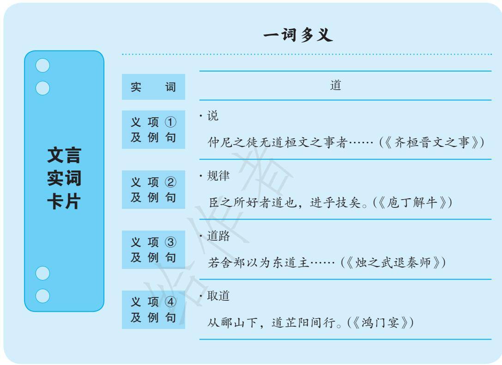

第三部分（第5—7段）写宴后余事。

刘邦在樊哙等人的保护下脱身逃走，张良则以白璧、玉斗入谢。项羽收下礼物，范增则愤恨不已，这与两人在鸿门宴开始时的态度恰好相应。刘邦回营后则立即诛杀了曹无伤。故事以曹无伤告密、项羽决定进攻始，以项羽受璧、曹无伤被诛终，首尾呼应，结构相当严整。

本文情节围绕项羽是否发动进攻、刘邦能否安然逃脱两个疑问逐层展开，跌宕起伏，曲折有致；刘邦、项羽、张良、樊哙、范增等人的形象栩栩如生，生动传神，令人过目难忘。而关于“项羽是否应该在鸿门宴上杀死刘邦”这一话题也一直是众说纷纭，迄无定论。作为《史记》中最为精彩的片段之一，它的魅力是无穷无尽的。

## 关于单元学习任务

一 先秦诸子学说是中国古代思想的第一个高峰，影响深远，值得我们深入理解。阅读诸子的著作要把握他们的主要观点和思路，从中吸取思想养分。学习本单元所选的三篇先秦诸子文章，完成以下任务。

1. 孔子表示“吾与点也”，孟子提倡“保民而王”，庄子重视“依乎天理”。把握这样一些观点的内涵，有助于我们深入理解相关文章，也能帮助我们更好地了解中国传统思想文化。从这三篇文章中任选一篇，找出并分析文中的重要观点，进而深入理解全文。把自己的思考写出来，与同学讨论。

2. 《子路、曾皙、冉有、公西华侍坐》和《齐桓晋文之事》展现了儒家对人生价值和理想社会的追求。阅读这两篇文章，思考这些追求的意义，同学之间展开交流。

要传承优秀传统文化，首先要深刻认识传统文化。传统文化的核心，体现的是价值观念、思维方式、行为准则等，如刘梦溪先生所说：

我们面对一尊青铜器、一组编钟、一座古建筑或一个古村落, 人们有时也说看到了中国文化的传统, 其实这样说并不准确，实际上看到的是传统的遗存物，这些遗存物所蕴含的规则、理念、秩序和信仰，才是传统。（《百年中国：文化传统的流失与重建》）

想要深入理解这些“规则、理念、秩序和信仰”，最简便也最重要的方式，就是阅读先秦诸子的著作，把握其观点，理解其思路。教材设计这一学习任务，用意就是引导学生从先秦诸子（尤其是对后代影响最大的儒道两家）的论说中“吸取思想养分”，以“更好地了解中国传统思想文化”。虽然学习内容只涉及三篇诸子文，但抓住了“中华文明之光”的核心与要义。

从语文教学的角度来看，想要展开真实情境下的任务式、项目式学习，就必须对选文中的观点和思路有准确、清楚的理解，否则就容易出现空洞、浮泛的问题。这一单元学习任务从把握观点、思路入手，有强调学习要“落实”的意思。

任务1围绕三篇选文整体设计，从三篇文章中各选一个重要观点为例，教师应充分了解所举观点的特点及在相关文章中的作用，并指导学生学习找出和分析观点的方法。列简表如下：

<table><tr><td rowspan=1 colspan=1>观点</td><td rowspan=1 colspan=1>观点内涵</td><td rowspan=1 colspan=1>表达方式</td><td rowspan=1 colspan=1>与其他观点的关系</td></tr><tr><td rowspan=1 colspan=1>吾与点也</td><td rowspan=1 colspan=1>向往太平盛世民生和乐，感慨道之不行（后世解说甚多）</td><td rowspan=1 colspan=1>态度明确，内涵表达较为含蓄</td><td rowspan=1 colspan=1>与子路、冉有、公西华的观点既有差异，又不无相通之处</td></tr><tr><td rowspan=1 colspan=1>保民而王</td><td rowspan=1 colspan=1>国之本在民，只有让人民衣食无忧，才谈得上守礼知义，也才会天下归心</td><td rowspan=1 colspan=1>直接、明确</td><td rowspan=1 colspan=1>中心观点，全文的思路由此出发，又归结于此</td></tr><tr><td rowspan=1 colspan=1>依乎天理</td><td rowspan=1 colspan=1>存身、做事、处世都应该顺乎自然，不可强为（后世解说甚多）</td><td rowspan=1 colspan=1>以寓言方式表达</td><td rowspan=1 colspan=1>是对“解牛”过程的解说，暗合寓意，文中少有明确的观点</td></tr></table>

《子路、曾皙、冉有、公西华侍坐》中四位弟子的“言志”都是观点，而从孔子或含蓄或直率的“点评”中，也能看出孔子的观点（具体参见“课文解说”）。这些观点之间本没有特别密切的联系，但也有着某种可以寻绎的“思路”，清人张履祥说：

四子侍坐，固各言其志，然于治道亦有次第。祸乱戡定，而后可施政教。初时师旅饥馑，子路之使有勇知方，所以戡定祸乱也。乱之既定，则宜阜俗，冉有之足民，所以阜俗也。俗之既阜，则宜继以教化，子华之宗庙会同，所以化民成俗也。化行俗美，民生和乐，熙熙然游于唐虞三代之世矣，曾皙之春风沂水，有其象矣。夫子志乎三代之矣，能不喟然兴叹！（《备忘录》）

后代学者多认为此说“非常牵强但很有趣”，对学生理解文章还是有帮助的。

《齐桓晋文之事》中的观点比较明确，且有着比较明确的思路，在“编写意图”“课文解说”中均有解说，此处不再重复。《庖丁解牛》则比较特殊，严格说来，庖丁的话中并没有特别明确的观点，所谓“依乎天理”，原本属于对解牛过程的描述，只是因为能比较好地体现庖丁话中的寓意，也能承接《养生主》开头处的“缘督以为经”，才被借来作为文章的观点。但从另外一个意义上讲，本文丰富的寓意，又多从此四字而来。

为了深入理解选文中的观点，在教学中可以采用对读参证的方法。如《子路、曾皙、冉有、公西华侍坐》，不妨与《论语·公冶长》篇中记载的孔子与颜渊、子路“论志”对读，也可以与《韩诗外传》中记录的孔子师生游景山、游戎山“论志”对读，以深化对文中观点的理解。又如《齐桓晋文之事》，可以与《寡人之于国也》及《孟子·尽心下》关于如何征税的论述对读，以见出孟子观点的一致性，并丰富对课文的理解，或用《孟子·尽心上》关于“西伯善养老者”的论述参证本文，比较准确地理解“五十衣帛”“七十食肉”的含义，把握孟子心中理想社会的特点。再如读《庖丁解牛》，可以参考《庄子·养生主》开头的“总论”文字，以更好地理解故事的本意，也可与“秦失吊老聃”的故事对读，比较其寓意的异同。对这三篇文章，自古以来积累有大量的注释评析，教师在教学中可以审慎选择，精心组织，恰当使用，形成对文中观点的丰富阐释，帮助学生理解文章，活跃思维。

任务2在任务1的基础上，引导学生关注儒家的社会理想和治国理念，可以说是任务1的深化和集中。儒家思想在中国传统文化中影响最大，其社会理想和治国理念深入人心（实际政治中是否实行是另一回事），这样的任务设计，仍是在引导学生“更好地了解中国传统思想文化”。

关于《子路、曾皙、冉有、公西华侍坐》《齐桓晋文之事》中的社会理想、治国理念，孔孟观点的相通之处和不同之处，“课文解说”“编写意图”中均加以说明。由于学生已经比较了解两篇文章中的观点，在教学中不妨以比较孔子（及其弟子）和孟子在社会理想、治国理念方面的异同为重点。同时，还可以联系孔孟所处的历史时代去理解其社会理想、治国理念，联系“文景”“开元”等中国历史上的著名“盛世”，客观看待儒家治国理念的价值。

二 阅读史传作品，了解了史实之后，还要进行深入思考，甚至对史书的记载提出质疑。本单元所选的两篇史传中就有不少值得探究的问题，例如：烛之武游说成功，除了辞令巧妙外，还有什么深层次的原因？项羽不杀刘邦仅仅是因为“为人不忍”吗？司马迁对鸿门宴的记述有没有“不合常理”的地方？细读课文，探究上述问题（也可自己设计问题），写出自己的看法。

在初中阶段，古代史传的学习重点是了解历史事件的发展过程、欣赏历史人物形象、赏析作者的写作手法，从某种意义上说，是把史传当作文学作品来读的。高中教材中的这一学习任务试图凸显史传阅读中历史阅读、思辨阅读的属性（当然不是完全拒绝文学性阅读）。从思维类型看，学习任务包含“深入思考”与“质疑问难”两种思维路径，前者要求透过现象看本质，后者要求切入“断点”问真伪。

学习任务中的三个问题，“课文解说”“资料链接”中有所涉及，略加补充如下，并非“标准答案”，仅提供一些思路而已。

烛之武能说动秦穆公，究其实质在于敏锐地抓住了秦国对晋国的“隐忧”。秦晋两国在晋惠公时期有过战争，惠公被俘，在秦穆公助重耳为晋文公后，秦晋关系密切，此间没有发生过战争。但在秦晋围郑前两年（前632），晋文公在践土之盟上受周天子册命，成为霸主，当年的秦强晋弱之势已然改变。对于晋国的强大，亲历了惠公到文公这段历史的秦穆公不会没有想法。因此，烛之武的高明之处在于看出了表面上亲密的秦晋两国之间存在的隐而未发的矛盾（这种矛盾并非由“秦师先去”引发），他所说的“邻之厚，君之薄”，所描述的晋国的贪欲，对秦强晋弱时期的秦穆公或许不过是泛泛之辞，对处于“大国争霸敏感期”的秦穆公则是直接击中了其内心深处的疑虑。能“当局者清”，看出大国关系的本质并加以利用，是烛之武的真正高明之处，并不只在设辞巧而口舌利。秦晋围郑后三年（前627），大国矛盾爆发，秦晋之间发生崤之战，可见烛之武的眼光是很锐利的。

关于鸿门宴上项羽不杀刘邦的原因，前人时贤皆多有评说。有人认为这是因为项羽存在比较严重的性格缺陷，一方面残暴倨傲，逞匹夫之勇，一方面又优柔寡断，好沽名钓誉。有人认为这是因为项羽虽然勇冠三军，在政治上却颇为幼稚，先后被刘邦、樊哙的话迷惑，于是放走刘邦，铸下大错。也有人从正面分析这一问题，认为项羽不愿杀害只带了“百余骑”的刘邦，是“贵族精神”“大将风度”的体现，只愿光明正大一决雌雄，不愿做“当宴杀人”这样的事。还有一些论者则将视野投向历史事实本身，认为项羽不杀刘邦一是不必，二是不能。一方面，刘邦已经示弱输诚，并已表示将让出占领的地盘，且项羽虽然兵力占优，但刘邦也有十万之众，相攻必有损失，因此“不必杀”；另一方面，项羽的大军是“联军”，如果杀掉“道义”上占据优势的刘邦（毕竟刘邦的行为合乎“怀王之约”），其他诸侯会有何反应很难预料，对自己的名声也很不利，因此“不能杀”。更有论者着眼于项羽的政治理念，指出他的理想并非统一天下，而是要做诸侯的霸主，因此当刘邦表示服从于他时，他就不会杀掉刘邦，最多会将其作为一个需要防范的诸侯。上述说法，各有其“理路”，可供教学中参考。

司马迁关于鸿门宴的记述，前人多有质疑，这些质疑有的就是从“常理”角度出发的，“其中不无见解，有时则不免多事”（郭预衡语），但对启发学生自主思考颇有价值。姑以项伯“夜报项王”和刘邦“逃宴而去”两事，举古人之质疑供参考：

项伯之招子房，非奉羽之命也，何以言“报”？且私良会沛，伯负漏师之重罪，尚敢告羽乎？使羽诘曰：“公安与沛公语？”则伯将奚对？史果可尽信哉？（梁玉绳《史记志疑》）

当时鸿门之宴必有禁卫之士诃讯出入，沛公恐不能辄自逃酒。且疾走二十里亦已移时，沛公、良、哙三人俱出良久，羽在内何为竟不一问？而在外竟无一人为羽之耳目者！矧范增欲击沛公，唯恐失之，岂容在外良久而不亟召之耶？此皆可疑。（泷川资言《史记会注考证》引董份语）

除上述问题外，教师还可以引导学生思考其他一些问题，如，烛之武起先的“推脱”是否仅仅是为了“发泄”不受重用的郁闷？鸿门宴对楚汉相争这段历史有何影响？项伯是“纯粹叛变”还是有别的考虑？《鸿门宴》中对刘邦、项羽的称呼与其当时实际地位多有不符，是记述有误还是别有用意？刘邦为什么要问“君安与项伯有故”？等等。

古人有“评史”“论史”“疑史”的传统，不仅积累了众多具体的成果，也形成了独有的方法论，如所谓“引而伸之”“浚而求之”“博而证之”“协而一之”（王夫之《读通鉴论》）等，对此，教师可适当了解，指导学生效仿、运用。

三 古代文化经典包含着先贤对社会、人生、历史的深刻思考，至今还能给我们很多启发。阅读这些经典时，既要充分理解先贤的思想，也要立足现实，自主思考。从以下两个话题中任选其一，写一篇不少于800字的议论文，阐述你的观点。

话题1 ：孟子劝说齐宣王“发政施仁”，认为“推恩足以保四海”。他对实现理想社会的设想，在今天看来有什么可资借鉴之处？又有哪些不足？

话题2 ：经典寓言的寓意是丰富的。有人认为《庖丁解牛》表达了庄子“顺应自然”的思想，有人则认为主要是强调人要“保全天性”……你怎么理解这则寓言的寓意？

本单元写作教学的重点是学习“阐述自己的观点”，这一单元学习任务即围绕此重点设计，特别重视贯彻统编高中语文教材读写融合的理念，呈现的其实是一个包含阅读、思考、写作在内的综合性语文实践活动。从思维的角度来看，本学习任务涉及了批判性思维和发散性思维两个类型，给学生提供了不同的选择，方便学生发挥自己的特长。教师可以在学生“运思”之前，提示他们注意这两个不同思维类型的任务应关注的要点（具体的写作技巧，可以参考教材中的知识短文）。

关于孟子治国理念的价值，“课文解说”和“资料链接”中均有论及，可以参考。从《齐桓晋文之事》来看，这种理念可以概括为四点：“君为中枢”“宽政爱民”“制民之产”“崇礼重教”。这样的理念在今天自然还有相当的借鉴价值，但将治好国家的期望完全寄托在君主的观念转变和善性自觉上，期待贤君明主推己及人，在当时固为无可奈何，不得不如此，在今天看来，就与现代的国家治理理念相去甚远了。在此，教师要提示学生，进行批判性思考不等于进行批判，要重视前人思想的历史成因，“把问题提到一定的历史范围之内”（列宁《论民族自决权》），考虑其历史价值，客观看待其合理成分及不足。

关于《庖丁解牛》的寓意，除学习任务中提到的两种外，“课文解说”和“资料链接”中均有论及，可以参考。明人袁中道说“庖丁之所以养刀者，以听牛之自然而不以刀与牛争耳，今人养生奔名骛利，将一具宝刀，使向大 肯綮上”（《导庄·养生主》）。明末清初方以智引薛更生语说“庖丁之语，当作三句看。所见无非牛是俗眼，全牛是智眼，有间是道眼”（《药地炮庄》）。清人王先谦说“牛虽多，不以伤刃；物虽杂，不以累心”（《庄子集解》）。当代学者庞朴引用唐代青原惟信禅师“见山是山，见水是水”“见山不是山，见水不是水”“见山只是山，见水只是水”的语录，以认识论和“知行合一”诠释庖丁解牛故事（见《解牛之解》），别开生面，亦可参考。教师要提示学生，在多元解读故事寓意时，既要自由思考，又要注意两个限制条件，不能随意发挥，信马由缰：其一，语言文字意义上的“文意”；其二，《养生主》的“总论”与作为“例证”的《庖丁解牛》之间的关系。关于后一点，下面的论述可供参考：

庖丁解牛，以神遇而官知止，即不以有涯之生，随无涯之知也。依天理，因固然，游刃于有间，即不为善与恶，而惟“缘督以为经也”。是以牛解数千，年经十九，而刀刃若新，即保身、全生、尽年之义，而深合于养生之道者也。然全段要义，则在证明“缘督以为经”一句。（刘武《庄子集解内篇补正》）

除了教材中的两个话题外，师生也可以一起寻找其他有较强思辨性的话题来思考、写作，还可以把大作文与随阅读展开的、以整理思维为目的的小作文结合起来，在教学的全过程展开读、思、写一体的语文学习活动。

四 学习文言文，需要多诵读，有意识地积累一些词语和语法知识，逐步形成文言语感。如文言中一些常见的实词，义项较多，可用卡片记录下来，梳理总结不同义项及相关例句，并根据学习情况随时增补新的内容。仿照示例，为本单元的一些义项较多的实词制作卡片。

这是一个梳理文言词语的学习任务，主要目的是梳理文言词语在不同上下文中的词义和用法。可以说，它是必修上册第八单元“词语积累与词语解释”中“把握古今词义的联系与区别”这一活动的延续，学习要求也基本一致。教师可以指导学生从本单元课文中选择有较多义项的实词，利用工具书，对其词义进行梳理。在学生熟悉词义后，师生可以将全班选择、梳理的实词加以归结，一起选择课文以外的文言语句或语段，尝试在新的语境中辨析词义并理解句意、段意。

由于文言阅读量有限，学生可能还缺乏从整段、整篇文章中挑选有较大整理价值的实词的能力，教师可以多加指导，让学生多诵读文章，从中寻找常见的、有助于自主阅读文言文的实词加以整理。市面上有一些关于文言常用实词的词典、论著，教师也可以参考这些资料，指导学生选词整理。

与“把握古今词义的联系与区别”的学习要求一样，在梳理义项的同时，教师还可以要求学生关注义项之间的联系。虽然高中生不必像学者那样穷究语源，也不必把词义的引申发展过程捋得清清楚楚（事实上很多实词的词义引申发展过程并不很清楚），但适当了解词语义项的内在关系还是必要的。学力一般的学生，作些梳理即可，有兴趣的学生不妨适当作点深入探究。以“君安与项伯有故”中的“故”为例，示例如下：

本句中的“故”意思是“旧交”，与之有关的义项还有“旧的事物”“旧典、成例”“陈旧的”“古代”“祖先”“死亡”等（采《汉语大词典》义项），这些义项的共同点在于都有“过去”的意思，《说文解字》说“古，故也”，王力先生认为“故”“古”是同源字，与时间上的往昔、过去有关（见《同源字典》）。

“故”更常见的义项（在本单元课文中出现甚多）是“原因”“因而”，与“事情”“祭祀等重大事情”“意外事变”“事理”等义项关系紧密，《说文解字》说“故，使为之也”，段玉裁《说文解字注》解释为“今俗云原故是也，凡为之必有使之者，使之而为之则成故事矣”，这样就把“事”与“因”的关系说清楚了。

在《现代汉语词典》中，“故”的义项即按古汉语中的两个意义序列分为两组，这就能看出古今汉语的联系。至于这两个意义序列内部的词义引申发展关系，可以参考《同源字典》《汉字源流精解字典》等辞书，及《汉字源流》《汉语词汇的流变》等专著。

这样的梳理活动不仅能深化学生对文言实词的理解，还能训练思维，激发对汉语、汉字的兴趣，可谓一举三得。

## 单元教学设计举例

## 教学设计一：“传统文化的‘表’与‘里’”单元教学设计

## 核心任务：

围绕“深入理解传统文化”的主题，通过诵读理解、独立反思、讨论交流等方式，加深对传统文化中一些重要思想观念的理解，深入思考历史记录背后的思想观念，探究历史事件的内在逻辑。通过本单元的学习，深化对中华传统文化的理性认识。

## 基本问题：

1. 课文中孔子（及其弟子）、孟子、庄子的处世观念、人生志愿、社会理想、治国理念各是什么？反映了中国先贤们对哪些共性问题的不同解答？

2. 从课文中看，儒道思想有哪些不一样的地方？在儒家内部，孔子（及其弟子）和孟子在社会理想、治国理念两方面各有什么异同？

3. 课文中的这些思想观念对后代有什么影响？在今天看来有什么价值？

4. 秦师先行离开，刘邦安然返营，其原因究竟何在？是否真是因为烛之武精彩的辞令和樊 哙的奋力一搏？怎样读出历史事件背后的东西？

5. 两篇史传文的历史记述中潜藏着哪些思想观念？应该如何发掘，如何理解？

## 学习过程：

1. 情境设置。

先秦诸子的思想至今还受到广泛重视，有些甚至已经成为中国人思想的底色，成为中国人世界观、价值观的独特印记。古代的历史仍在被不断解读评说，成为当代中国人重要的智慧源泉和行为方式的重要参考。教师可以从这些真实的现象出发，设置勾连古今的学习情境，引发学生的学习兴趣，将其带入富于思考意味的课堂氛围中。

## 2. 梳理与比较。

学生需借助注释和工具书，反复诵读课文，对文章有足够的理解，然后借助下面的表格梳理课文中的观点。有些可以直接“找到”，有些则需要理解（甚至稍作推断）后自行概括。

<table><tr><td rowspan=1 colspan=1>观点文章</td><td rowspan=1 colspan=1>处世观念</td><td rowspan=1 colspan=1>人生志愿</td><td rowspan=1 colspan=1>社会理想</td><td rowspan=1 colspan=1>治国理念</td></tr><tr><td rowspan=1 colspan=1>《子路、曾皙、冉有、公西华侍坐》</td><td rowspan=1 colspan=1></td><td rowspan=1 colspan=1></td><td rowspan=1 colspan=1></td><td rowspan=1 colspan=1></td></tr><tr><td rowspan=1 colspan=1>《齐桓晋文之事》</td><td rowspan=1 colspan=1></td><td rowspan=1 colspan=1></td><td rowspan=1 colspan=1></td><td rowspan=1 colspan=1></td></tr><tr><td rowspan=1 colspan=1>《庖丁解牛》</td><td rowspan=1 colspan=1></td><td rowspan=1 colspan=1></td><td rowspan=1 colspan=1></td><td rowspan=1 colspan=1></td></tr></table>

在梳理观点的过程中，学生一般会自然而然地进行初步比较。在比较时，教师可以利用下面的表格帮助学生深化认识：差别较大的儒道思想其实都是在思考人与社会的关系问题，都在反思人应当以怎样的姿态生存于世；同属儒家的孔孟，在社会理想和治国理念上大体相同，但也不无细微的差别。

<table><tr><td rowspan=1 colspan=1></td><td rowspan=1 colspan=1>异中之同</td><td rowspan=1 colspan=1>同中之异</td></tr><tr><td rowspan=1 colspan=1>儒道对比</td><td rowspan=1 colspan=1></td><td rowspan=1 colspan=1></td></tr><tr><td rowspan=1 colspan=1>孔孟对比</td><td rowspan=1 colspan=1></td><td rowspan=1 colspan=1></td></tr></table>

## 3. 印证与反思。

儒家和道家在中国思想文化史上影响最大，在学生已经初步了解儒道两家对人生和社会问题的看法之后，教师可引导学生通过“事实印证”（结合历史事实和了解的历史人物来作印证）的方法，具体了解这种影响，并站在当下立场，对这些思想作些反思。如果学生有兴趣，对“儒道互补”的说法，也不妨作些实证性的举例和理性反思。

<table><tr><td rowspan=1 colspan=1></td><td rowspan=1 colspan=1>事实印证</td><td rowspan=1 colspan=1>当代反思</td></tr><tr><td rowspan=1 colspan=1>孔孟之说</td><td rowspan=1 colspan=1></td><td rowspan=1 colspan=1></td></tr><tr><td rowspan=1 colspan=1>庄子之说</td><td rowspan=1 colspan=1></td><td rowspan=1 colspan=1></td></tr><tr><td rowspan=1 colspan=1>儒道互补</td><td rowspan=1 colspan=1></td><td rowspan=1 colspan=1></td></tr></table>

当然，通过这几篇文章（包括初中阶段学习的诸子作品）是不可能真正全面理解儒道思想的，教师可以根据学生的学习情况，适当推荐进一步阅读的书目或篇目，展开探究性学习。

## 4. 剖析与总结。

在学生对两篇史传文所记述的史实、人物已经有充分了解后，教师可以引导学生思考秦师先行离开和刘邦安然返营背后的原因。教师可以提示学生自行搜集相关资料，如秦晋围郑前后的重要历史事件，秦、晋之间的关系变化，鸿门会面前后发生的历史事件，刘邦、项羽、范增、张良等人的具体情况，等等。借助参考资料，从“个人因素”和“历史形势因素”这两个角度，综合思考课文中历史事件的复杂成因。

教师可以在学生讨论、思考告一段落后，与学生一起总结由表及里探究历史事件内在逻辑的方法，例如，从长时段的角度看待具体历史事件，与其他史料参考比对，用常理去推理，等等。也可以提供一些课文以外的史传文，让学生运用已经习得的方法阅读、探究。

## 5. 提炼与整合。

教师可以指导学生关注历史叙事中的两种思想观念，一种是带有时代特征的“一般观念”，一种是个人特点比较突出的“个人观点”。《烛之武退秦师》中体现了春秋时期对“礼”的重视（以及利用），《鸿门宴》中的人物描写则暗含着作者的喜恶。对于前者，教师可以和学生一起，结合参考资料，提炼课文中“礼”的体现，探究“礼”在当时的含义与价值，并由此出发，进一步探究孔子所说的“为国以礼”的本质。对于后者，教师可以提示学生在细读过程中体会司马迁对《鸿门宴》中人物潜在的褒贬，并结合《史记》中的其他传记（主要是各个人物自己的传记）进行补充和整合，由此探究司马迁在评骘历史人物时所持的价值观。

## 学习资源：

1. 经子解读：

李零《丧家狗：我读〈论语〉》、牟钟鉴、王志民《〈孟子〉公开课》、陈鼓应《老庄新论》

2. 文史要义：

苏渊雷《读史举要》、梁漱溟《中国文化要义》

3. 综论纵观：

吕思勉《先秦学术概论》、冯友兰《中国哲学简史》

## 教学设计二：“无尽的思索——我读经典”分课教学设计

## 核心任务：

基于选文的经典性，围绕“细读、博观、精思、明辨”的核心任务，以单篇选文的思辨性、探究性学习为主，相机进行适当的选文间的联系。通过细读选文，引入资料，形成相对比较具体的思辨情境，不断引发学生的深层思考，激活其思维，深化其对文化经典的认识。

## 基本问题：

本单元选文中可供思考、探究之点甚多，这里分篇举一些例子，供教学时参考选用。

<table><tr><td colspan="1" rowspan="1">篇目</td><td colspan="1" rowspan="1">思考、探究点</td></tr><tr><td colspan="1" rowspan="1">《子路、曾皙、冉有、公西华侍坐》</td><td colspan="1" rowspan="1">1. 本文中的一些具体词句（如“毋吾以也”“浴乎沂，风乎舞雩”)，历来有不同的解释，可引入有关资料，进行探究。2. 许多学者对孔子所赞同的“曾点之志”都有自己的理解，可引入课堂，帮助学生探究“曾点之志”的实质。3. 孔子为什么对曾皙的说法喟然而叹？他对其他三子的说法持什么态度?4. 文中四位弟子的说法之间有什么样的关系？</td></tr><tr><td colspan="1" rowspan="1">《齐桓晋文之事》</td><td colspan="1" rowspan="1">1.“保民而王”与文中其他观点有什么关系？2. 本文的思路是怎样的？是否有逻辑上的问题？3. 结合《孟子》中的其他篇章，补充本文中的内容，完成对孟子心目中理想社会的描述。</td></tr><tr><td colspan="1" rowspan="1">《庖丁解牛》</td><td colspan="1" rowspan="1">1.“庖丁解牛”故事与《养生主》中的“缘督以为经”有什么关系？2. 探究“庖丁解牛”故事的整体的多元意蕴。3.探究庖丁解牛时一些具体状态（如“目无全牛”“游刃有余”“视为止，行为迟”）的寓意。4. 探究“庖丁解牛”故事与《养生主》中其他故事的关系。</td></tr><tr><td colspan="1" rowspan="1">《烛之武退秦师》</td><td colspan="1" rowspan="1">1.如何理解晋文公所说的“仁”“知”“武”？了解课文中“礼”的具体表现。2. 探究春秋时期“礼”的意义，思考孔子为什么强调“为国以礼”。3. 从课文出发，梳理春秋时期士人的著名故事，理解他们的品质与智慧。</td></tr><tr><td colspan="1" rowspan="1">《鸿门宴》</td><td colspan="1" rowspan="1">1. 文中对项羽、刘邦的称呼似乎有些问题，应如何理解？是史书记述有误还是有意为之?2. 鸿门宴会的座次反映了项羽什么样的个性?3. 项伯是不是一个“纯粹”的叛徒？如何评价他的“夜告张良”“劝解项王”和“翼蔽沛公”？4. 项羽一方设鸿门宴是早有预谋还是临时为之？有什么证据?5. 项羽不杀刘邦，是不是真的只是“为人不忍”或缺乏政治远见？6.“沛公起如厕”到“张良入谢”这一段记录，似乎有悖常理，应如何看待?</td></tr></table>

## 学习过程：

## 1. 情境设置。

教师可以在学生基本了解每篇选文的内容后，从文中举一两个具体的、比较“小”的值得反思或多元解读的例子，或给出一两则能拓宽视野、调动学生思考的资料，或提出一两个有探究性的问题，以引发学生的兴趣，将其带入细读深思的状态中。

## 2. 重返文本，细读深思。

对三篇诸子文作探究，教师要注意三点：第一，要在对文本反复、不断深化的理解中进行探究，不能脱离文本；第二，要从前人的注释、评说中获取灵感，不要引导学生空想；第三，要让学生自主活动，教师不要过多地“断以己意”，避免限制学生的思维。除此之外，要提醒学生注意“内证法”的使用。如孔子对子路的“哂”，有人认为是嘲笑子路说大话，但如果注意到《公冶长》篇中“子曰：‘由也，千乘之国，可使治其赋也。’”的话，就会发现这一“哂”其实颇有探究的余地。

## 3. 依托文本，拓展探究。

以《烛之武退秦师》为基础讨论“礼”的问题，需要适当引入一些有关“礼”的资料，考虑到搜集起来有一定难度，在下面表格中给出几则以供参考。至于探究春秋时期士人（宽泛意义上的）的事迹与精神，不妨以《屈完及诸侯盟》《曹刿论战》《展喜犒师》《弦高犒师》《申包胥哭秦庭》等《左传》名篇的阅读为基础，拓宽视野，展开较为复杂的语文学习活动。

## 关于“礼”的几则材料

礼，经国家，定社稷，序民人，利后嗣者也。（《左传·隐公十一年》）

夫名以制义，义以出礼，礼以体政，政以正民，是以政成而民听，易则生乱。（《左传·桓公二年》）

子大叔见赵简子，简子问揖让、周旋之礼焉。对曰：“是仪也，非礼也。”简子曰：“敢问何谓礼？”对曰：“吉也闻诸先大夫子产曰：‘夫礼，天之经也，地之义也，民之行也。’……”（《左传·昭公二十五年》）

夫礼，死生存亡之体也。将左右周旋，进退俯仰，于是乎取之。朝、祀、丧、戎，于是 乎观之。（《左传·定公十五年》）

凡人之所以贵于禽兽者，以有礼也。故《诗》曰：“人而无礼，胡不遄死？”礼，不可无也。（《晏子春秋·谏上二》）

乐也者，情之不可变者也。礼也者，理之不可易者也。乐统同，礼辨异。礼乐之说，管乎人情矣。（《礼记·乐记》）

如春秋时犹尊礼重信，而七国则绝不言礼与信矣。春秋时犹宗周王，而七国则绝不言王矣。春秋时犹严祭祀，重聘享，而七国则无其事矣。春秋时犹论宗姓氏族，而七国则无言及之矣。春秋时犹宴会赋诗，而七国则不闻矣。春秋时犹有赴告策书，而七国则无有矣。（顾炎武《日知录》卷十三）

4. 辨读文本，自圆其说。

古来评析《史记》者甚多，有不少都涉及历史记录中的“似是而非”“似非而是”之处，或从历史记录的“断点”入手展开思考。教师可以和学生一起发现问题，利用前人的思考成果展开自主探究。需要注意的是，无论是质疑旧说还是自创新说，都要合乎逻辑和常识，能自圆其说。学生在初期的尝试中，容易出现“无疑”“多疑”“过度求新”的情况，这些都需要教师加以指导，在学习过程中进行调整。

## 学习资源：

1. 众说集纂：

程树德《论语集释》、赵杏根《孟子讲读》、方勇《庄子讲读》

2. 史评汇编：

王维堤《左传选评》、韩兆琦《史记选注汇评》

## 资料链接

## 一、文言文参考译文

1. 《子路、曾皙、冉有、公西华侍坐》

子路、曾皙、冉有、公西华坐在孔子近旁侍奉。

孔子说：“因为我年纪比你们大些，人家不用我了。（你们）平日说：‘没有人了解我啊！假如有人了解你们，那么（你们）打算怎么做呢？”

子路不假思索地回答说：“一个拥有千辆兵车的（中等）诸侯国，夹在（几个）大国的中间，有（别国）军队来攻打它，接下来（国内）又有饥荒；如果让我治理这个国家，等到三年，就可以使人人都有勇气，而且知道义理。”

孔子对他示以微笑。

“冉有，你怎么样？”

（冉有）回答说：“一个纵横六七十里或者五六十里（的小国），如果让我去治理，等到三年，可以使人民富足。至于礼乐教化，（自己的能力是不够的，）要等待君子（来推行了）。”

“公西华，你怎么样？”

（公西华）回答说：“不敢说我能胜任，但是愿意在这方面学习。祭祀祖先的事，或者诸侯朝见天子，我愿意穿着礼服，戴着礼帽，做一个小司仪。”

“曾皙，你怎么样？”

（曾皙）弹奏瑟的声音渐渐稀疏，铿的一声，把瑟放下，站起来，回答说：“我和他们三人为政的才能不一样。”

孔子说：“那有什么关系呢？不过是各自谈谈自己的志向。”

（曾皙）说：“暮春时节，春天的衣服已经穿好了。成年人五六个，少年六七个，到沂水去洗洗澡，在舞雩台上吹吹风，唱着歌回家。”

孔子长叹一声说：“我赞成曾皙啊！”

子路、冉有、公西华都出去了，曾皙最后走。曾皙问（孔子）：“他们三位的话怎么样？”

孔子说：“也不过是各自谈谈自己的志向罢了！”

（曾皙）说：“您为什么笑仲由呢？”

（孔子）说：“治国要用礼，（可是）他（子路）的话毫不谦让，所以笑笑他。”

“难道冉有讲的不是国家的事吗？”

“怎么见得纵横六七十里或五六十里就不是国家呢？”

“难道公西华讲的不是国家的事吗？”

“宗庙祭祀、朝见天子，不是诸侯国（的事）又是什么呢？如果公西华只能（替诸侯）做一

个小司仪，那么谁能做大司仪呢？”

2. 《齐桓晋文之事》

齐宣王问（孟子）说：“齐桓公、晋文公称霸的事，您可以讲给我听吗？”

孟子回答说：“孔子这些人中没有讲述齐桓公、晋文公的事的人，因此后世没有流传，我没有听说过这些事。如果一定要说一说，那么还是说说行王道的事吧！”

（齐宣王）说：“要有什么样的德行，才可以称王于天下呢？”

（孟子）说：“安养民众才能称王于天下，没有人可以抵御他。”

（齐宣王）说：“像我这样的人，可以安养百姓吗？”

（孟子）说：“可以。”

（齐宣王）说：“从哪儿知道我可以呢？”

（孟子）说：“我听胡龁说：您坐在大殿上，有个牵牛从殿下走过的人，您看见他，问道：牛牵到哪里去？’那人回答说：‘准备用它的血涂钟行祭。’您说：‘放了它！我不忍心看到它恐惧战栗的样子，没有罪过却走向死地。’（那人问）道：‘既然这样，那么需要废弃涂钟行祭的仪式吗？’您说：‘怎么可以废除呢？用羊来换它吧。’不知道有没有这件事？”

（齐宣王）说：“有这件事。”

（孟子）说：“这样的心就足以称王于天下了。百姓都认为大王吝惜（一头牛），而我确实知道您是（出于）于心不忍。”

齐宣王说：“是的。的确有这样（对我有误解）的百姓。齐国虽然土地狭小，我又何至于吝惜一头牛？就是因为不忍看它那恐惧战栗的样子，没有罪过却要走向死地，因此用羊去换它。”

（孟子）说：“您不要对百姓认为您吝啬感到奇怪。以小的动物换下大的动物，（您的用心）他们怎么知道呢？您如果哀怜它没有罪过却要走向死地，那么牛和羊有什么区别呢？”

齐宣王笑着说：“这究竟是一种什么想法呢？我不是因为吝惜钱财才用羊换掉牛的，（您这么一说）老百姓说我吝啬是理所应当的啊。”

（孟子）说：“没有关系，这就是仁道！（原因在于您）看到了牛而没看到羊。君子对于飞禽走兽，看见它活着，便不忍心看它死；听到它的声音，便不忍心吃它的肉。因此君子把厨房设在远离自己的地方。”

齐宣王高兴了，说：“《诗》说：‘别人有什么心思，我能够揣测到。’（这话）说的就是先生（您这样的人）啊。我这样做了，回头再去想它，想不出是为什么。先生您说这些，对于我的心真是有所触动啊！这种心思之所以符合王道的原因，是什么呢？”

（孟子）说：“（假如）有人向大王报告说：‘我的力气足以举起三千斤，却不能够举起一根羽毛；眼力足以看清鸟兽秋天生的纤细羽毛的尖端，却看不到整车的柴草。’那么，大王您认可这话吗？”

（齐宣王）说：“不。”

（孟子说）“如今您的恩德足以推及禽兽，而功效达不到百姓身上，却是为什么呢？这样看来，举不起一根羽毛，是不用力气的缘故；看不见整车的柴草，是不用目力的缘故；老百姓没有受到爱护，是不肯布施恩德的缘故。所以，大王您不能以王道统一天下，是不肯做，而不是做不到。”

（齐宣王）说：“不肯做与做不到的表现有什么区别？”

（孟子）说：“挟着泰山越过北海，告诉别人说：‘我做不到。’这确实做不到。为长者按摩肢体，告诉别人说：‘我做不到。’这是不肯做，而不是做不到。所以说大王不能以王道统一天下，不属于挟泰山越过北海这一类的事；大王不能以王道统一天下，属于为长者按摩肢体一类的事。敬爱自家的老人，从而推广到（敬爱）别人家的老人；爱护自家的小孩，从而推广到（爱护）别人家的小孩：（照这样去做）天下可以在手掌上转动。《诗》说：‘给自己的妻子做榜样，推广到兄弟，进而治理好一家一国。’这是说拿这样的心加到别人身上罢了。所以，推广恩德足以安定天下，不推广恩德连妻子儿女都安抚不了；古代圣人大大超过别人的原因，没有别的，善于推广他们的好行为罢了。如今（您的）恩德足以推及禽兽，而功效达不到百姓身上，却是为什么呢？称了，才能知道轻重；量了，才能知道长短。任何事物都是如此，人心更是这样。请您考虑一下吧！

“还是说（大王）您发动战争，使军士臣下受到危害，与各诸侯国结怨，然后才心里痛快吗？”

齐宣王说：“不是的，我怎么会这样做才痛快呢？我是打算用这样的方式求得我最想要的东西。”

（孟子）说：“您最想要的东西是什么，（我）可以听听吗？”

齐宣王只是笑却不说话。

（孟子）说：“是因为美味的食物不够吃？又轻又暖的衣服不够穿？还是因为绚丽的颜色不够看？美妙的音乐不够听？左右受宠爱的人不够使唤？（这些）您的大臣们都能充分地提供给您，难道您是为了这些吗？”

（齐宣王）说：“不是的，我不是为了这些。”

（孟子）说：“那么，大王所最想要的东西就可知道了：是想开拓疆土，使秦、楚来朝拜，统治中原地区，安抚四方的少数民族。（但是）以这样的做法，去谋求这些想要的东西，就像爬到树上去找鱼。”

齐宣王说：“真的像（您说的）这么严重吗？”

（孟子）说：“恐怕比这还严重。爬到树上去找鱼，虽然找不到鱼，却没有什么后祸；假使以这样的做法，去谋求这些想要的东西，又尽心尽力地去做，此后必然有灾祸。”

（齐宣王）说：“可以让我听听吗？”

（孟子）说：“（如果）邹国人和楚国人打仗，那大王认为谁会胜呢？”

（齐宣王）说：“楚国人会胜。”

（孟子）说：“那么（可见）小国本来不可以与大国为敌，人少的国家本来不可以与人多的国家为敌，弱国本来不可以与强国为敌。天下的土地，纵横各一千多里的国家有九个，齐国的土地总算起来也只有其中的一份；以一份力量去降服八份，这与邹国和楚国打仗有什么不同呢？为什么不回到根本上来呢？（如果）您现在发布政令施行仁政，使得天下当官的都想到您的朝廷来做官，种田的都想到您的田野来耕作，做生意的都想（把货物）储存在您的市场上，旅行的人都想在大王的道路上行走，各国那些憎恨他们君主的人都想跑来向您诉说。如果像这样，谁还能抵挡呢？”

齐宣王说：“我糊涂，不能达到这一步。希望先生您帮助（实现）我的志愿，明白地指教我。

我虽然愚钝，请让我试一试。”

（孟子）说：“没有可以长久维持生活的固定财产却有长久不变的善心，只有有道德操守的读书人才能做到，至于普通百姓，没有固定的产业，因而就没有长久不变的心。如果没有长久不变的心，就会不遵守礼义法度，无所不为。等到犯了罪，然后接着就加以处罚，这样做是陷害百姓。哪有仁爱的人在位，却可以做这种陷害百姓的事呢？所以英明的君主规定百姓的产业，一定使他们上能赡养父母，下能养活妻子儿女；丰年能够温饱，荒年也不至于饿死。然后驱使他们向善，所以老百姓很容易地跟着国君走。如今，规定人民的产业，上不足以赡养父母，下不能养活妻子儿女，丰年也总是生活在困苦之中，荒年免不了要饿死。这样，只是使自己摆脱死亡还不足以做到，哪里还顾得上讲求礼义呢？大王真想施行仁政，为什么不回到根本上来呢：（给每家）五亩地的住宅，种上桑树，五十岁的人就可以穿丝织的衣服了；鸡、小猪、狗、大猪这些家畜，不错过（喂养繁殖的）时节，七十岁的人就可以吃上肉了；一百亩的田地，不耽误农时，八口人的家庭就可以不挨饿了；重视学校教育，反复地用孝顺父母、尊重兄长的道理开导他们，头发斑白的老人便不会再背着、顶着东西在路上走了。老年人能穿丝帛、吃上肉，老百姓不挨饿受冻，如果这样还不能以王道统一天下，是没有的事情。”

## 3. 《庖丁解牛》

庖丁给梁惠王宰牛。手接触的地方，肩膀倚靠的地方，脚踩的地方，膝盖抵住的地方，砉砉作响，进刀时发出“ ”的声音，没有不合乎音律的。（既）合乎《桑林》舞乐的节拍，又合乎《经首》乐曲的节奏。

梁惠王说：“嘻，好啊！（你解牛的）技术怎么竟会高超到这种程度啊？”

庖丁放下刀回答说：“我追求的是天道，超过技术了。起初我宰牛的时候，眼里看到没有不是（完整的）牛的；三年以后，未曾看到完整的牛了。现在，我只用精神去和牛接触，而不用眼睛去看，视觉停止了，而精神在活动。依照牛体的自然结构，击入大的缝隙，顺着（骨节之间的）空处进刀，依照牛体本来的结构，脉络相连和筋骨相结合的地方，不曾拿刀去尝试，更何况大骨呢！技术好的厨师每年更换一把刀，是因为用刀割断筋肉；技术一般的厨师每月就得更换一把刀，是因为用刀砍断骨头。如今我的刀用了十九年，所宰的牛有几千头了，但刀刃就像刚从磨刀石上磨出来。那牛的骨节有空隙，而刀刃很薄；用很薄的刀刃插入有空隙的骨节，十分宽绰，那么刀刃的运转必然是有余地的啊！因此十九年了刀刃还像刚从磨刀石上磨出来。虽然是这样，每当碰到筋骨交错聚结的地方，我看到那里很难下刀，就戒惧地提高警惕，眼睛因为筋骨交错聚结之处而凝视不动，动作也因此缓慢下来，动起刀来非常轻， 的一声，牛的骨和肉一下子就解开了，就像泥土堆积在地上一样。我提着刀站立起来，为此四处张望，为此悠然自得，心满意足，然后把刀揩拭干净，收藏起来。”

梁惠王说：“好啊！我听了庖丁的话，懂得了养生的道理了。”

## 4. 《烛之武退秦师》

晋文公和秦穆公围攻郑国，因为郑国曾对晋文公无礼，而且依附于晋的同时又亲附于楚。晋军驻扎在函陵，秦军驻扎在氾水的南面。

佚之狐对郑文公说：“国家危险了，如果派烛之武去见秦穆公，秦国的军队一定会撤退。”郑文公同意了。烛之武推辞说：“我年轻的时候，尚且不如别人；现在老了，不能干什么了。”郑文公说：“我没能及早重用您，现在由于情况危急因而求您，这是我的过错。然而郑国灭亡了，对您也不利啊！”烛之武就答应了这件事。

在夜晚（有人）用绳子拴着烛之武从城楼上放下去，见到秦穆公，烛之武说：“秦、晋两国围攻郑国，郑国已经知道要灭亡了。如果灭掉郑国对您有好处，那就冒昧地用这件事情来麻烦您。然而越过别国把远方的郑国作为秦国的东部边邑，您知道这是困难的，哪里用得着灭掉郑国而给邻国增加土地呢？邻国的势力雄厚了，您秦国的势力就相对削弱了。如果您放弃围攻郑国而把它作为东方道路上（招待过客）的主人，外交使者来来往往，郑国可以随时供给他们缺少的资粮，对您也没有什么害处。而且您曾经给予晋惠公恩惠，他答应给您焦、瑕这两个地方。然而他早上渡过黄河回国，晚上就修筑防御工事，这是您所知道的。晋国，怎么会有满足的时候呢？在东边使郑国成为它的边境之后，又想扩大西边的疆界，如果不使秦国土地减少，将从哪里取得它所贪求的土地呢？削弱秦国来使晋国得利，希望您考虑这件事。”秦伯很高兴，与郑国签订了盟约。派遣杞子、逢孙、杨孙戍守郑国，就回国了。

晋国大夫子犯请求出兵攻击秦军。晋文公说：“不行。假如没有那个人的力量，就没有我的今天。依靠别人的力量，又反过来损害他，这是不仁义的；失掉自己的同盟者，这是不明智的；用混乱相攻取代和谐一致，是不符合武德的。我们还是回去吧。”晋军也就离开了郑国。

5. 《鸿门宴》

刘邦驻军霸上，还没有能和项羽相见。刘邦的左司马曹无伤派人对项羽说：“刘邦想要在关中称王，让子婴做丞相，珍宝全都占有了。”项羽大怒，说：“明天犒劳士兵，给我打败刘邦的军队！”这时候，项羽的军队四十万，驻扎在新丰鸿门；刘邦的军队十万，驻扎在霸上。范增劝告项羽说：“沛公在崤山以东的时候，贪恋财物，喜欢美女。现在进了函谷关，不掠取财物，不迷恋女色，这说明他的志向不在小处。我叫人观望他的云气，都是龙虎的形状，呈现五彩的颜色，这是天子的云气啊。赶快攻打，不要失去时机！”

楚国的左尹项伯，是项羽的叔父，一向同留侯张良交好。张良这时正跟随着刘邦，项伯就连夜骑马跑到刘邦的军营，私下会见张良，把事情详细地告诉了他，想叫张良和他一起离开，说：“不要和（刘邦）一起死了。”张良说：“我替韩王扈从沛公，现在沛公遇到危急的事，逃走是不守信义的，不能不告诉他。”于是张良进去，（把情况）详细地告诉了刘邦。刘邦大惊，说：“这件事怎么办？”张良说：“是谁给大王出的这条计策？”刘邦说：“浅陋无知的小人劝我说：‘把守住函谷关，不要放诸侯进来，秦国的土地可以全部占领而（以此）称王。’所以就听了他的话。”张良说：“估计大王的军队足以抵挡项王吗？”刘邦沉默了一会儿，说：“当然不如啊。要怎么办呢？”张良说：“请您亲自去告诉项伯，说您不敢背叛项王。”刘邦说：“你怎么和项伯有交情？”张良说：“秦朝时，他和我交往，他杀了人，我救了他；现在事情危急，幸亏他来告诉我。”刘邦说：“他和你年龄谁大谁小？”张良说：“他比我大。”刘邦说：“你替我请他进来，我要用侍奉兄长的礼节对待他。”张良出去，邀请项伯。项伯就进去见刘邦。刘邦奉上一杯酒，祝项伯健康，和项伯约定结为儿女亲家，说：“我进入关中，财物丝毫不敢据为己有，造册登记官吏、百姓，封闭了贮藏财物、兵甲的处所，等待将军到来。之所以派遣将领把守函谷关，是为了防备其他盗贼进来和意外的变故。我日夜盼望将军到来，怎么敢反叛呢！希望您详细地告诉项王我不敢背叛（项王的）恩德。”项伯答应了，告诉刘邦说：“明天早晨不能不早些亲自来向项王道歉。”刘邦说：“好。”于是项伯又连夜离去，回到军营里，详细地把刘邦的话告诉了项羽。趁机说：“沛公不先攻破关中，您怎么敢进关来呢？现在人家有了大功，却要攻打他，这是不讲信义。不如趁机好好对待他。”项王答应了。

刘邦第二天早晨带着一百多人马来见项王，到了鸿门，向项王道歉说：“我和将军合力攻打秦国，将军在黄河以北作战，我在黄河以南作战，但是我自己没有料想到能先进入关中，灭掉秦朝，能够在这里又见到将军。现在有小人的谣言，使将军和我有了隔阂。”项王说：“这是沛公的左司马曹无伤说的。如果不是这样，我怎么会这么生气？”项王当天就留下刘邦，和他饮酒。项王、项伯朝东坐；亚父朝南坐——亚父就是范增；刘邦朝北坐；张良朝西陪侍。范增多次向项王递眼色，多次举起他佩戴的玉玦暗示项王，项王沉默着没有反应。范增起身，出去召来项庄，说：“大王为人心地不狠。你进去上前为他敬酒，敬酒完毕，请求舞剑，趁机把沛公杀死在座位上。否则，你们这些人都将被他俘虏！”项庄就进去敬酒。敬完酒，说：“大王与沛公饮酒，军营里没有什么可以拿来作为娱乐的，请让我舞剑吧。”项王说：“好。”项庄拔剑起舞。项伯也拔剑起舞，时时用身体遮护刘邦，项庄无法刺杀。

这时张良到军营门口找樊哙。樊哙问：“今天的事情怎么样？”张良说：“很危急！现在项庄拔剑起舞，他的意图总在沛公身上啊。”樊哙说：“这太危急了，请让我进去，跟他同生死。”于是樊哙就拿着剑持着盾牌冲入军门。用戟交叉着守卫军门的兵士想阻止他不放他进去，樊哙侧过盾牌撞去，卫士跌倒在地上。樊哙就进去了，掀开帷幕朝西站着，瞪着眼睛看着项王，头发直竖起来，眼眶都裂开了。项王按着剑，跪直身子问：“来客是干什么的？”张良说：“是沛公的参乘樊哙。”项王说：“壮士！赏他一杯酒。”左右就递给他一大杯酒，樊哙拜谢后，起身，站着把酒喝了。项王又说：“赏他一条猪前腿。”左右就给了他一条生的猪前腿。樊哙把他的盾牌扣在地上，把猪腿放（在盾）上，拔出剑来切着吃。项王说：“壮士！还能喝酒吗？”樊哙说：“我死尚且不怕，一杯酒有什么可推辞的！秦王有虎狼一样的心肠，杀人像是怕不能杀尽，给人用刑像是怕不能用尽，天下人都背叛他。怀王与诸将约定：‘先打败秦军进入咸阳的人在关中为王。’现在沛公先打败秦军进了咸阳，一点儿财物都不敢据为己有，封闭了宫室，军队退回到霸上，等待大王到来。特意派遣将领把守函谷关的原因，是为了防备其他盗贼的进入和意外的变故。这样劳苦功高，没有得到封侯的赏赐，反而听信小人的谗言，想杀有功的人，这只是已亡的秦朝的后继者罢了。私意认为大王不采取这种做法（为好）。”项王没有话回答，说：“坐。”樊哙挨着张良坐下。坐了一会儿，刘邦起身上厕所，趁机把樊哙叫了出来。

刘邦出去后，项王派都尉陈平去叫刘邦。刘邦说：“现在出来，还没有告辞，怎么办？”樊哙说：“做大事不必注意细枝末节，行大礼不必讲究小的辞让。现在人家正好比是刀和砧板，我们则好比是鱼和肉，何必告辞呢？”于是就决定离开。（刘邦离开前）就让张良留下来道歉。张良问：“大王来时带了什么东西？”刘邦说：“我带了一对玉璧，想献给项王；一双玉斗，想送给亚父。正碰上他们发怒，不敢献。您替我把它们献上吧。”张良说：“遵命。”这时候，项王的军队驻扎在鸿门，刘邦的军队驻扎在霸上，相距四十里。刘邦就留下车辆和随从人马，独自骑马脱身，让樊哙、夏侯婴、靳强、纪信四人拿着剑和盾牌徒步跟随，从郦山脚下，取道芷阳，从小路走。刘邦对张良说：“从这条路到我们军营，不过二十里罢了，估计我回到军营里，您再进去。”

刘邦离开后，从小路回到军营里。张良进去道歉，说：“沛公不胜酒力，不能当面告辞。让我奉上白璧一双，拜两拜敬献给大王；玉斗一双，拜两拜进献给大将军。”项王说：“沛公在哪里？”张良说：“听说大王有意要责备他，脱身独自离开，已经回到军营了。”项王就接受了玉璧，把它放在座位上。亚父接过玉斗，放在地上，拔出剑来敲碎了它，说：“唉！这小子不值得和他共谋大事！（将来）夺取项王天下的人一定是刘邦。我们都要被他俘虏了！”

刘邦回到军中，立刻杀掉了曹无伤。

## 二、《子路、曾皙、冉有、公西华侍坐》赏析（齐治平）

孔子是我国春秋时期最伟大的思想家和教育家。他首开私家讲学之风，学而不厌，诲人不倦，造就了一大批有为有守的人才。他们的言行主要记载于《论语》一书中。班固《汉书·艺文志》说：“《论语》者，孔子应答弟子时人及弟子相与言而接闻于夫子之语也。当时弟子各有所记，夫子既卒，门人相与辑而论纂，故谓之《论语》。”这部书以记言为主，为后来宋、明理学家“语录”体之祖，历来被奉为儒家的经典。

今传《论语》共二十篇，每篇又分为若干章。前十篇为上《论》，后十篇为下《论》，两者间的差别相当大。上《论》言简意赅，极为精练；下《论》每章较长，却显得有些驳杂。但从文学角度来看，则下《论》的叙述较为具体生动，有些章节对人物的神情语气还有所渲染，结构层次也井然有序，如《子路、曾皙、冉有、公西华侍坐》就是如此。

这章写孔子和四个学生的问答，启发他们各言己志。据清人林春溥考证，认为此事当在鲁哀公十一年孔子返鲁之后。孔子返鲁时年七十岁，子路（姓仲名由）六十岁，冉有（名求）四十岁，公西华（名赤）二十七岁，曾皙（名点）年无考，似与孔子相近。（一般则以为此章按年龄排列顺序，曾皙小于子路。）“古者大夫七十而致仕，是时鲁不能用孔子，孔子亦不求仕，而汲汲济时之心，不能不望于吾党。”（《开卷偶得》卷六）这是四子言志的时间及背景。这虽只是推测，但颇合乎当日情事，足供参考。

这章因句读、解释不同，历来颇多歧解，如开头几句：

子曰：“以吾一日长乎尔，毋吾以也。居则曰：“不吾知也!如或知尔，则何以哉？”

这是以“乎尔”连读，意思是：“我虽年少长于汝，然汝勿以我长而难言。”（朱熹《论语集注》）

另一种读法是在“乎”字处断句，武亿《经读考异》说：“考此‘乎’字宜断为句，‘尔’字属下连读。当时师弟情事，皆以‘吾’与‘尔’为词；又‘乎’字为句，此正诱之尽言，神理如见。何氏《集解》，孔曰：‘言我问汝，汝毋以我长故难对。’玩注‘汝毋以我长’句，明是尔’字属下读。”近人黄侃手批白文《十三经》即如此断句。这种读法是根据注疏来的。

以上两种读法，看来差别不大，只是“尔”字属上句或下句的问题。但“尔毋吾以也”，由于有“尔”作主语，这句话不可能作别的解释，只能认为是孔子的谦辞，意为“汝毋以我长故难对（或“而难言”）；而“乎尔”连读，则“毋吾以也”却可以理解为另外一种意思。东汉王符说：“‘以吾一日长乎尔’，长，老也。毋吾以也，以，用也。孔子言老矣不能用也，而付用于四子也。”（杨慎《丹铅录》引）清人刘宝楠也说：“‘毋吾以’者，‘毋’与‘无’同，皇本作‘无’。以，用也。言此身既差长，已衰老，无人用我也。”（《论语正义》）他们都是把“以”解为“用”，“毋吾以”就是“无人用我”。这种讲法和“勿以我长而难言”就完全两样了。

以上两种讲法都讲得通，但把“毋吾以也”讲成“汝勿以我长而难言”有添字解经之嫌，因为“而难言”的意思是注者凭自己的体会而加进去的。而把“以”解为“用”则较为直截了当，并且有孔子的话“虽不吾以”（《论语·子路》）可以作为旁证。因此我们觉得这样解释更恰当些，也更切合孔子当时自觉衰老，不见用于世的心情。

但由此又引出一个新的问题，即下句“居则曰：‘不吾知也’”的主语是谁。旧注一直认为是指子路、曾皙等人，没有分歧的意见。但如武亿所说，这章写“当时师弟情事，皆以‘吾’与“尔’为词”，“吾”指孔子，“尔”指弟子，则此“不吾知也”亦当系孔子自谓，而非孔子假托弟子等自谓。再则从《论语》全书来看，没有记载过弟子们有“不吾知”的牢骚，而只有孔子发过“莫我知也夫”的慨叹，以及在击磬时流露过“莫己知也”的心声（均见《宪问》）。而且就当时在座的四个学生来看：子路光明磊落，不忮不求；曾皙怡然自得，无意于为邦；冉求方为季氏宰（亦据林春溥说）；公西华较为年轻，都不应有怀才不遇、急于求知的念头和表现。孔子如果说他们“汝等常居之日，则皆自云无知吾者”，岂非无的放矢？因此我们认为这里的“居则曰：‘不吾知也’”与上句的“毋吾以也”紧连，都是孔子表示自己年老，“明王不兴，终不见用，已无当世之志”（王闿运《论语训》）的意思。把这段话译为现代汉语，不必再添出主语（汝等），更显得文从字顺：

孔子说：“因为我年纪比你们大了一些，没有人用我了，所以我平时就说过：‘人家是不了解我的。’如果有人了解你们，那你们将怎么办呢？”

以上是孔子发问。当时是老师和学生五个人坐在一起，好像开一个小型的座谈会。按照当时的礼貌，“侍于君子，不顾望而对，非礼也”（《礼记·曲礼》）。但是子路心直口快，一见孔子发问，便不假思索，抢先回答道：“一个具有一千辆兵车的国家，夹处于大国之间，外有敌军来犯，内有灾荒待救，如果由我来治理，等到三年光景，可使人人勇敢，而且懂得道理。”

孔子听了，微微一笑，没说什么。然后又问冉求。冉求性格谦逊，见子路被哂笑，便更加小心地答道：“一个周围六七十里或五六十里的小国，由我去治理，等到三年光景，可使人民富足；至于修明礼乐，那就只有等待贤人君子去做了。”

孔子接着又问公西华。公西华在四人中最年轻，他本有志于礼乐，但因冉有刚说过“如其礼乐，以俟君子”的话，他如果径直说出自己的抱负，便有以君子自居之嫌，于是便委婉地答道：“并不是说我有那样的才能，我只是想学着去做。比如宗庙祭祀之事，或者盟会之际，我愿意穿着礼服，戴着礼帽，去做一个司仪的小傧相。”

最后，孔子问到曾皙。这时曾皙弹瑟正近尾声，他铿然一声把瑟放下，站起来答道：“我的志向和他们三位所讲的不同。”

孔子见他有些为难的样子，便鼓励他说：“那有什么妨碍呢？正是要各人谈谈自己的志向啊!”于是曾皙便道：“暮春三月，春天的衣服都已穿好了。我偕同五六个成年人，六七个小孩子，在沂水旁边洗洗澡，在舞雩台上吹吹风，然后大家一起唱着歌儿，一路走回来。”

孔子听了，长叹一声道：“我同意曾点的志趣呀!”

大家都谈过自己的志愿以后，子路、冉有、公西华都退出了，曾皙故意留在后面。他不大理解孔子的意思，特别是对孔子赞许自己，哂笑子路，对其他二人不置可否，觉得跟孔子平时教人行道救世的积极态度大不相同，心下纳闷，于是便问：“夫三子者之言何如？”又问：“夫子何哂由也？”

最后孔子答道：

为国以礼，其言不让，是故哂之。唯求则非邦也与？安见方六七十如五六十而非邦也者？唯赤则非邦也与？宗庙会同，非诸侯而何？赤也为之小，孰能为之大？

孔子讲这段话，是说明他之所以笑子路只是由于“其言不让”，而不是笑其“为国”之志。接下去又自问自答，指出冉有、公西华也是志在“为邦”，不过他们的态度非常谦逊，自己也就没有笑他们。这也就是向曾皙表明，子路和其他两人一样，他们的志向都值得肯定，并无轩轾之意。

对于这一段话，也有不同的标点和理解。以上是根据皇侃《论语疏》的说法；朱熹《集注》则认为“唯求则非邦也与”和“唯赤则非邦也与”都是曾皙问，下面的话则是孔子答。其说虽也可通，但似乎不很合理。因为曾皙如果一听到孔子赞许自己便得意起来，看到哂笑子路便认为孔子鄙薄事功，对由、求、赤三人“为邦”之志都不赞成，而且一问再问，还不明白孔子的意思，那不是“举一隅而不以三隅反”，过于愚了吗？因此我们不从朱注之说。

细读此章，我们可以看到孔子这位大教育家的风度。他对待学生如朋友，又如家人子弟，非常亲切。他教育学生，不说汝等立志当如何如何，讲一些空洞的道理，而是置身于他们之中，启发他们各言己志。在这一章里，他假设“如或知尔”，使子路等四人各自谈谈“则何以哉”，以探询他们的抱负。在另一章里，他也曾让颜渊、子路“曷各言尔志”，都是为着了解他们，从而因材施教，把他们培养成人才。

孔子对子路等三人言“志”都予以肯定，这也是由于对他们的才能知之有素。他曾对别人谈过三人的特长是：“由也，千乘之国，可使治其赋（兵役等军政工作）也”；“求也，千室之邑，百乘之家，可使为之宰（县长或总管）也”；“赤也，束带立于朝，可使与宾客言（外交辞令）也”。（《论语·公冶长》）孔子对子路、冉有、公西华的评论，和这里三人所谈自己的抱负完全符合，可见孔子对每个学生的才能都是了如指掌的。

四子言志，孔子哂由与点，哂由之故，因曾皙一问，孔子已作了解答，而“吾与点也”却没说出原因，这是此章最令人费解的地方。后来学者纷纷探索，各有所见，我们联系当时情事和孔子的心境，认为李惇的说法最为合理，他说：“三子承‘知尔’之问，兵、农、礼乐，言志之正也。点之志却是别调，夫子独许之者，亦以见眼前真乐，在己者可凭；事业功名，在人者难必；喟然一叹，正不胜身世之感也。”（《群经识小》）

那么，什么是孔子的“身世之感”呢？林春溥说得更为具体，他以为：“子路、冉有、公西华之言志，用之则行也，其言在夫子之意中；曾皙之言志，舍之则藏也，其言出夫子之意外。汲汲济时之心，转而增蹙蹙靡骋之感，喟然一叹，与在陈‘归欤’之叹同。‘吾与点也’，殆亦惟我与尔有是夫’之意。”（《开卷偶得》）

孔子身处春秋变乱纷争之世，极想拨乱反正，行道救民，但周游列国，终不得志，而他又不肯放弃自己的理想和主张，以求取功名利禄，所谓“不义而富且贵，于我如浮云”（《论语·述而》）。他立身行事是有原则的。他曾对他最得意的学生颜渊说过：“用之则行，舍之则藏，惟我与尔有是夫！”（《论语·述而》）也就是说，只有颜渊在用舍行藏各方面都能合乎原则，和他自己一致。曾皙在孔门没有什么突出的表现，德才都远不及颜渊。但他能够“即其所居之位，乐其日用之常”；又恰值孔子感慨身世、自伤不遇之际，忽然听到他说出沂水春风、眼前乐事，正与自己“舍之则藏”的志趣相合，而且比颜渊那样陋巷箪瓢、安贫乐道，更为动人，所以不觉喟然兴叹，引为同调了。

这章不过二百多字，描写了五个人物，各人有各人的性格和修养，通过生动的描述展现出来。开头老师提出问题，态度从容而亲切。接着子路“率尔而对”，不但他那“兼人”“好勇”的性格跃然纸上，同时也使场面顿然活跃起来。接下去便是冉有、公西华依次回答，语气一个比一个谦逊，也各具特色。但最为出色的是写曾皙答话的情景，先是“鼓瑟希”，渲染出一种音乐艺术气氛；接着是“铿尔”一声，推瑟而起，尤为传神；再往后是“异乎三子者之撰”，这句话在这个时候才说出，和子路的“率尔而对”形成鲜明的对照，只这么一句，曾皙当时踌躇不安的神态便充分表露出来了。然而“山重水复疑无路，柳暗花明又一村”，接着展现的却是一幅春风和煦，阳光融融，一群活泼的青少年散步河边，载歌载舞的游春图，使人恍如置身其间，也跟着他们心旷神怡起来。无怪乎当日孔子对曾点特别赞叹，就连我们今天读到这里也还是为之神往的。

以文而论，南北朝时丘迟《与陈伯之书》有“暮春三月，江南草长，杂花生树，群莺乱飞”数句，千古传诵，与此章“莫春者”一段有异曲同工之妙。那篇文章本是军中檄文一类，在摆事实讲道理之际，忽然插写江南春景，由景生情，以感染增强说服的效果。清人宋湘有诗赞之云：“文章绝妙有丘迟，一纸书中百首诗。正在将军旗鼓处，忽然花杂草长时。”（《红杏山房诗钞》）而《论语》这章，则是在子路诸人讲论兵农礼乐、治国安邦的抱负时，忽然有“曾点旷达之言，泠然人耳”（袁枚语），别开生面，令人情移神往。但丘迟还是有意为文，而此章则是随手记录，自然成文。因此对于它的剪裁布置之妙，更应细心体会。

（选自《历代名篇赏析集成·先秦两汉卷》，高等教育出版社2009 年版）

## 三、《齐桓晋文之事》赏析（卢元）

这是《孟子》七篇中少数千字以上的长文之一。虽然形式上全属对话，实际上却是一篇论点鲜明、论据充分、论证严密的政论文。它全面、集中地反映了孟子的王道思想，即行仁政、“保民而王”的政治主张，也充分体现了孟子善辩、善譬的语言艺术和纵横捭阖的文章气势，是《孟

子》的代表作品之一。兹举其要者予以鉴赏。

## 1. 高屋建瓴，片言居要。

战国时代，列强纷争，以征伐为能事，都想以武力兼并别国，于是就出现“争地以战，杀人盈野，争城以战，杀人盈城”（《孟子·离娄上》）的惨烈局面，给人民带来严重的灾难。而齐国在东方诸侯中又号称强国，齐宣王之父威王曾两次大败魏军（一为前353，于桂陵；一为前341，于马陵），并以善于纳谏著称，有“战胜于朝廷”之誉（《邹忌讽齐王纳谏》）。宣王本人也曾攻破燕国都城（前314），威震诸侯；并且继承其父威王遗业，在稷下（齐都城临淄稷门附近地区）扩置学宫，招揽文学、游说之士数千人，任其讲学议论。孟子这时也正以客卿身份在齐宣王身边供职。宣王野心勃勃，很想凭武力称霸中原，所以劈头就问孟子“齐桓晋文”之事，其用心至为明显。但是孟子是极端鄙视霸道的，曾说“五霸者，三王之罪人也”（《孟子·告子下》）。他从维护统治阶级的根本利益和长远利益出发，高瞻远瞩，独倡王道，意在反对暴政，反对战争，提倡仁爱，提倡礼义，借以缓和矛盾，发展生产，从而达到天下统一、长治久安的目的。这是符合当时人民的愿望的，也表现出孟子对在死亡线上挣扎的人民的深切同情。现在面对宣王的问题，该如何回答呢？桓文之事，孟子并非真的不知（在《论语》和《孟子》两书的其他篇章中都有所评价），而是不愿讲，不屑讲；可是如果直接这样回答，那么谈话就无法再进行下去，而孟子要想说服宣王行王道的意图更是无法实现。于是孟子一方面保持他的“说大人则藐之，勿视其巍巍然”（《孟子·尽心下》）的豪迈气概，另一方面又巧妙地采用“求同”的战术，设法把对方引入自己所要劝说的范围之内。他用“仲尼之徒无道桓文之事者，是以后世无传焉，臣未之闻也”的话，就轻轻把宣王的问题推掉；接着又用“无以，则王乎”一语，把问题拉到自己铺设的轨道上来：真有一种高屋建瓴之势。尽管宣王对王道并不热心，可是他有“辟土地，朝秦楚，莅中国而抚四夷”的大欲，也就是说，希图能够统一天下，而行王道可以不战而统一天下，这“统一天下”，正是孟子所要“求”的“同”；宣王也想听听，于是又有“德何如则可以王矣”的再问。孟子及时抓住这个机会，用极其明确、斩钉截铁的语言提出自己的政治观点——“保民而王，莫之能御也”，并以此作为全篇立论的总纲，真乃“立片言而居要，乃一篇之警策”（陆机《文赋》）。孟子的这一观点，正是他的“民贵君轻”“得民心斯得天下”的民本思想的体现，是具有一定的进步意义的。

## 2. 因势利导，层层紧逼。

孟子是很善于根据对方心理，因势利导地进行说理的。孟子深知宣王虽然颇有兴趣地问“若寡人者，可以保民乎哉”，可是实际上宣王非但没有“保民”的行动，甚至连“保民”的念头过去也根本没有动过。因此，如果在这时就直接向宣王宣传“保民”的做法，是根本没有基础的。在论辩上就不能求速胜（欲速则不达），而应采用因势利导、由近及远、由小及大，欲擒故纵、步步紧逼、穷追不舍的方法，以求全胜。请看文中四大论辩回合的表现。

首先，帮助宣王树立起“保民而王”的信心。谁都知道，善于发掘对方的长处，也就容易讨得对方的欢心。在这一回合中，孟子抓住“以羊易牛”这件小事，抓住宣王说过“吾不忍其觳觫”这句话，大做其文章，先肯定宣王有不忍之心，而此心正是能“保民而王”的基础。但孟子并不满足于自己来下结论，于是又借“百姓皆以王为爱（吝惜）”这一误解，并特意强调“以小易大”，让宣王陷入窘境。这时“王笑曰”的“笑”，乃是一种无可奈何、自我解嘲的笑。接着孟子代为辩解，帮他摆脱困境，肯定“是乃仁术”，并且说不光你宣王是这样，君子也都是这样。这就使得宣王十分高兴，把孟子看成是“深知我心”的人。经过这样一擒一纵，孟子不仅向宣王宣传了有了“不忍之心”就可以“保民而王”的道理，而且博得了宣王的欢心，大大缩短了彼此的思想距离，取得了第一回合的胜利。

其次，解决宣王主观上“为”与“不为”的思想矛盾。宣王被孟子说动了，但还是不明白为什么不忍之心“合于王”的道理，说明他的思想基础仍很薄弱，他的思想矛盾还是没有解决。如果这时就直接告以“老吾老”“幼吾幼”的推恩方法，那只能是一种生硬的灌输，效果肯定不佳。必须首先解决他思想上的矛盾，使他明确意识到自己完全能够做到“保民而王”，目前之所以未能做到，“是不为也，非不能也”。于是孟子连续用了三个贴切生动的比喻，由小及大，由此及彼，让宣王自己开动脑筋，既作出了否定判断，又提出了问题；然后亮出主旨：“百姓之不见保，为不用恩”，即不能“推恩”。因为按照儒家说法，仁爱是有等级的，先“亲亲”，后“仁民”，最后才是“爱物”。现在宣王既能“爱物”，那理应能够“仁民”了。这样，就打消了宣王的畏难情绪，调动了他行王道的勇气。在这基础上再正面说理，应该如何推恩，推恩的好处，不推恩的害处，并以古人为榜样，鼓励宣王效法古人，语重心长地请宣王深思猛省。至此，宣王除了默认之外，已无话可说，孟子又取得第二回合的胜利。

再次，排除宣王“保民而王”的巨大障碍。孟子深知此时的宣王，虽然理性上已不得不承认王道学说是有道理的。但是他的灵魂深处还存在以战图霸、凭武力统一天下的幻想，而这是行王道的巨大障碍。“不破不立，不塞不流”，因此，孟子主动挑起第三回合的论辩，以便把问题讲深讲透，将障碍排除。这里，孟子又采用了欲擒故纵的迂回战术，避免一上来就正面强攻，直接点穿。他故作不知，反复设问，旁敲侧击，先逼出宣王自己说“将以求吾所大欲”，再逼出宣王自己说“吾不为是也”，在这基础上，才以排山倒海、不容申辩的气势，连用“辟土地，朝秦楚”等四个排比短语，揭示了宣王“大欲”的实质；紧跟着，用“缘木求鱼”作喻，点出图霸根本不可能实现，让宣王死了这条心。但宣王还是不死心，认为孟子言过其实。孟子干脆乘胜追击，强调指出“缘木求鱼”，只是徒劳无功，而以武力图霸，将招惹灾祸。为使宣王心服，再用“邹与楚战”作喻，点明胜负、强弱之理。至此，宣王也不得不承认孟子所说是完全正确的。破了以后就得立，最后孟子又用一连串排比句从正面为宣王描绘了一幅“发政施仁”以后的美好图景，与上文形成鲜明对比。这正打中了宣王好大喜功之心，宣王不得不为之心折，说了一番诚恳请教的话，表示愿意试行“王道”。通过第三回合的论辩，孟子才完全取得胜利。

最后，向宣王阐述“保民而王”的施政纲领。在宣王虚心求教、愿意试行的基础上，孟子这才拿出他的一整套施政纲领来。这个纲领的要点有二：一是“制（规定）民之产”（富民），二是“谨庠序之教”（教民）。先使民“仰事俯畜”无虞（即达到温饱水平），这是“王道之始”；再使民懂得礼义，这是“王道之成”。在孟子看来，除士之外，一般百姓没有“恒产”就没有“恒心”，也就没法讲求仁义（与管子《牧民》所说“仓廪实则知礼节，衣食足则知荣辱”之意有相近之处）。这里虽然存在着封建士大夫鄙视劳动人民的不正确成分，但是这一看法，已初步接触到社会存在与社会意识的关系问题，具有朴素的唯物主义成分，在当时应该说是一种进步的观点。

当然，孟子的“王道”主张，最终还是寄托在封建统治者肯发善心并懂得推恩的基础上，在战国列强纷争的情况下，这只能是一种不切实际的幻想。正因为如此，所以孟子虽能言善辩，说得齐宣王口服心服，但事后宣王并没有真正采纳孟子的主张并付诸实施。孟子在齐国待了几年，也曾多次企图说服宣王行王道，但始终不得志，结果只能悻悻离去。

但从论辩的角度说，孟子确实不愧为大手笔。本文先后有序，环环相扣：王天下的关键在乎保民；保民的前提是要有不忍之心；不忍之心要不断发扬推广，即善于推恩；推恩的具体表现是摈弃武力征战，重视富民、教民。真好比一路斩关夺隘，最终直捣黄龙，值得认真体会学习。

## 3. 比喻精当，气势磅礴。

在先秦诸子的著作中，多数善于运用寓言、比喻来阐明抽象、深奥的道理，而孟子的文章尤为突出。汉代赵岐在《孟子题辞》中说孟子的文章“长于比喻，辞不迫切，而意以独至”，是颇有道理的。

本文多处运用比喻来说理，在第2部分的论述中已有涉及，现再举几例。如“不为者与不能者之形何以异”，这个问题要想正面回答是很困难的，但孟子用“挟太山以超北海”“为长者折枝”这两个夸张性比喻，就把“不为”与“不能”的区别一下子端在对方面前。又如用“天下可运于掌”比喻懂得推恩，天下就很容易治理，真是简练鲜明之至！再如，用武力争霸天下的困难与危害，是个很复杂的问题，但孟子用了“缘木求鱼”“邹与楚战”两喻，就把道理说得十分清楚；更妙的是“邹与楚战”一喻，让宣王自己先得出“楚人胜”的结论，这样，宣王企图“以一服八”的谬误也就不言自明了。

全文采用层层推进的方法来论辩、说理，就如长江大河，一泻千里，浩浩荡荡，势不可当。特别是文中多次使用了排比句，极尽铺排之能事，读来气势磅礴，音调铿锵，具有很强的说服力与感染力。此外，如“今恩足以及禽兽，而功不至于百姓者，独何与”的反复逼问（前一问偏于疑，偏于责，后一问则偏于启发与期望），“盖亦反其本矣”“则盍反其本矣”的两次呼告，都如见其色，如闻其声，语意关切，令人心动。唐代古文运动倡导者韩愈曾说：“气盛则言之短长与声之高下者皆宜。”（《答李翊书》）欣赏孟子的文章，对韩愈这句话，就会体会得具体而深刻了。

（选自《古文鉴赏辞典》上册，上海辞书出版社2014 年版）

## 四、从宰牛之举重若轻到养生之顺道无为——读《庖丁解牛》 （孙绍振）

## 1

在春秋时代，《老子》《孙子》那样全靠抽象概念的系统推演，连例子也不举的著作，是带着奇迹的性质的。即使在古希腊，晚于孔子一百年的柏拉图也只有对话录，其师苏格拉底的思想，只存在于他的对话录中。在古希腊以抽象逻辑归纳和演绎为文，要积累一个世纪，到亚里士多德才有长篇巨著。在中国春秋时代，一般人大都还没有作文章的意图，故流传至今的经典，包括《诗经》，连标题都没有。最为典型的是《论语》，就是师生现场自由对话，当时并不在意，多年之后，后学者觉得非同小可，乃作追记。故此时的文章皆为结论，很少有推理的过程，所讲道理往往借助感性事例。事例之功能为类比，以感性具体说明抽象，但其局限在单一，难成论证。与亚里士多德差不多同时期，墨子、商鞅的系统论述文章开始流行，稍后的荀子、韩非子的文章在抽象演绎上有了长足进展，推理成为主要手段，长篇大论甚至系统的著作多了起来。

孟子游说国君，与国君辩论（对话），着重于推理的一贯性，自诩为浩然之气。晚年和其弟子万章之徒编辑了《孟子》，其对话逻辑相对严密。现场对话，说服人君，光讲抽象逻辑效果不彰，故孟子多讲故事，以增感性，如揠苗助长、齐人乞墦之类。此后其他诸子著作乃至西汉的论文、著作，主要靠逻辑推理，仍然常用具体故事说明抽象道理。《韩非子》有守株待兔，《战国策》有鹬蚌相争、三人成虎，《吕氏春秋》有刻舟求剑，《淮南子》有塞翁失马，《庄子》有邯郸学步、朝三暮四。故事本为具体论点的附庸，但是日后成为成语，便具有了相对独立性，故事加结论就有了寓言的性质。

## 2

战国时期的《庄子·养生主》中之《庖丁解牛》，与一般寓言不同，不像诸子那样，一味在形而下的现实中说明道理，而是在形而上的境界中作形象的展示。

《养生主》本来是讲养生之道的，这种“道”不是一般的避免疾疫、保全躯体之道，而是生命与外部世界的关系之“道”（本文所论述的“道”，仅仅限于本篇之寓意，并不全面涉及庄子思想体系中的“道”。那个“道”是形而上的，超越时间空间的，绝对的，又是超验的）：对于外部世界不能有太强的主观性（有为），一味将人为的手段强加于对象，就不可能得心应手。生命之正道乃是“因其固然”“依乎天理”，进入无心作为的境界，才能“游刃有余”，获得绝对的自由。

这个“道”与墨子、孟子、荀子、韩非子等所讲的现实性很强的“道”（道德、为政之道）相比，是有点玄妙的，抽象度很高，“无为无形”“可得而不可见”，带着某种程度的“超验性”。

以无为达到无所不为的“道”，这个形而上的命题是从老子那里继承来的，老子并没有在逻辑上作充足理由的论证。庄子把这个道理用到具体的人生哲学上来，作为养生之道，说的是不费心力比费尽心力更有利，过分着意尽力可能是枉费心力。庄子不是墨子，他一般不作逻辑论证（除了偶尔与惠施辩论），他的天才乃是运用超现实的寓言作形象的感性极强的展示。

庖丁解牛的故事，并非始自庄子，大概民间早有传说。《淮南鸿烈》中有：“非巧冶不能以治金，屠牛吐（按：人名，齐国之著名屠户，一作“坦”）一朝解九牛，而刀以剃毛。庖丁用刀十九年，而刀如新剖硎，何则？游乎众虚之间。”《吕氏春秋》中有：“宋之庖丁好解牛。所见无非死牛者。三年而不见生牛，用刀十九年，刃若新磨研。”《管子》中有：“屠牛坦，朝解九牛而刀可以莫铁，则刃游间也。”诸子用之作为长篇大论中许多例证中的一个，阐明自己的道理。《淮南鸿烈》用来说明“非巧冶不能以治金”，《吕氏春秋》用来说明“顺其理，诚乎牛也”，管子用来说明用兵之道。虽然各有千秋，但是情节和语言都比较简陋。而庄子用来阐释其养生之道，在想象力和语言上都大大地艺术化了。

庄子的创造给名为丁的厨师（庖）设置了难题：以一人之力，解剖一牛，这本来是很难做到的，因为牛是活的，是要反抗的，就是杀牛、放血、剔骨、取肉、剥皮，也往往非一人所能胜任，何况是要将牛的皮、骨、肉、腱、肌理作系统的、干净利落的解剖。

文章的第一层次就在艰巨的劳作和神奇的效果之间展开：“手之所触，肩之所倚，足之所履，膝之所踦……”任务之艰在于：用手控，用肩托，用脚踩，用膝盖撑，四肢躯体各个部位协同，使尽全力。庖丁却如探囊取物：“砉然向然，奏刀 然，莫不中音。合于《桑林》之舞，乃中《经首》之会。”与任务之艰巨相反，效果举重若轻，轻松愉快：第一，解其骨肉、皮筋，干脆利落，毫不拖泥带水；第二，除一把刀外，别无他物；第三，游刃有余，毫无殚神劳形之态。这显然很精彩，完成得很圆满、很艺术：刀子进入牛身，对于人和牛来说，是生死的搏斗，本该是十分凶险的，但在庄子笔下，有音乐的节奏，有舞蹈的形态，有经典乐曲的神韵。牛在骨肉分离的时候，没有喊叫，连血都没有流出来，一点血腥气都没有，一点痛苦都没有。

庄子寓言的神秘就体现在这里了，人兽搏斗，变成了双方心照不宣的合作表演，这是玄虚的、魔幻的，以墨子、韩非子的标准来看，完全是不可思议的。

这就怪不得文惠君要提出问题：“技盖至此乎？”文惠君提出的问题是“技”——在技术上怎么可能达到这样的效果呢？庄子用庖丁的话回答：“庖丁释刀对曰：‘臣之所好者道也，进乎技矣。’”文惠君所问是个伪问题，这不是形而下的技术问题，而是属于形而上的“道”的范畴。

“道”，蕴含着庄子的核心思想。“道”，是超越“技”的。那么“道”和“技”是一种什么关系呢？“臣以神遇而不以目视”，“技”是可以目视的，是感官所感的，而“道”则不能目视，只能神遇。目视，是感官的，现实的；神遇，是超越五官感知的。怎么超越呢？主要是在功能上：“官知止而神欲行。”在四肢躯体所掌握的“技”不能不停止的地方，而“神”却径自运行。这就是说，不可感知的“神”，其能量大大超越了感官。也许按今天的理解，可能是某种潜意识在驱动，当然这种观念是庄子没有想到的，但是这不妨碍他感觉到有一种潜在的能量（“神”），大大超过了意识层次的“技”，迫使意识层次的“技”服从于“神”。这种“神”的力量从何而来呢？“依乎天理”：“天理”的“天”就是自然，“理”就是对象的奥秘。这种奥秘在意识层次不可感知，而凭着潜意识是可以悟之于心的。这就是“神遇”。

不可见的，比可见的更强大、更精妙。正因为这样，庖丁的刀才能“批大郤，导大窾”，在筋与骨、骨与骼细微的空隙中运行。这两处（筋骨相连处，骨骼间的空隙）不可目击，却可“神遇”。为什么呢？“因其固然”。因为“神”领悟了这种客观的“天理”，所以“技经肯綮之未尝”，连那些盘根错节的经络、复杂的筋肉聚结点都不曾触及。这就是目不击而神遇的效果，也就是庄子理想达到的自由境界。

寓言的结构是故事加结论，故事讲完了，最后的结论由文惠君讲了出来：“善哉，吾闻庖丁之言，得养生焉。”解牛的特点是：第一，目不击，用今天的话来说，就好像是闭着眼睛；第二，神视，用今天的话来说，就是心里有数。为什么会心里有数呢？因为心能“因其固然”“依乎天理”。从目不击来说，好像是无所作为，亦即无为，但是，“依乎天理”，“因其固然”，心（“神”）就有所为了，就能驾驭刀的动作了。无为转化为有为。

庄子告诉我们，这种无为的境界并非原生的、天然的，而是经历了三年的提升（实践）的

过程。

庖丁的第一阶段是，“始臣之解牛之时，所见无非牛者”。这是目击的特点：表面上一览无遗，对事物获得了全面的信息，可这种目击有表面性和遮蔽性的缺陷。从外部信息来看，似乎看到了全部，但并不是内外一体的全牛。

庖丁的第二阶段是，三年之后“未尝见全牛也”。目不能击了，外部的全牛消失了，遮蔽的也消失了。内在的“神”就能“遇”（洞察）到对象的“天理”，亦即结构的稳定性（固然）。目击之物似全，似有利于有为（有利于以刀解牛），却遮蔽了内在的神明，使得心灵的神不能与天理合一。而看不见全牛，似不利于有为，却不能遮蔽内在的神明。目不能击，神却把握了全牛的内在天理（机理），目（外部感官）之无为，有助于内在的神“依乎天理”，达到有为。这就是庄子从无为到有为的境界。有学者论断，老子讲无为无不为，而庄子则退步为无为。由此文来看似乎不完全符合。

《庄子·天道》中说：“无为也，则用天下而有余；有为也，则为天下而不足。”郭象在注《庄子·在宥》时说：“无为者，非拱默之谓也，直各任其自为，则性命安矣。”道家的无为，并不是一些西方翻译家所译的“没有行动”，而是“避免反自然的行为，即避免拂逆事物之天性”。

光看这则寓言，一般读者很难感到这与题目中的“养生”有什么关系，把这则寓言前后文联系起来就比较容易理解了。前面的是：“吾生也有涯，而知也无涯。以有涯随无涯，殆已。”意为追求知识也要适可而止，以有限求无限是艰险的。知道了这样的限制，就可以“缘督以为经，可以保身，可以全生，可以养亲，可以尽年”。所谓督脉即身背之中脉，具有总督诸阳经之作用；缘督就是顺从自然之中道的含意。无涯是知识的无限性，有涯是生命的有限性，人生不应该违反客观的限制，而应该顺从它，这样才可以“保身”“全生”“尽年”。这在“依乎天理”“因其固然”这一原则上与庖丁解牛是一样的。但是，这里的意思似乎是绝对的无为，与庖丁解牛有所不同。庖丁解牛之得心应手，是经历了三年的实践提升才获得了自由。看来庄子思想的矛盾不可回避。学者论断其绝对无为，虽不全面，却也不无根据。接下去的故事就明显了。

公文轩见右师而惊曰：“是何人也？恶乎介也？天与，其人与？”曰：“天也，非人也。天之生是使独也，人之貌有与也。以是知其天也，非人也。”

泽雉十步一啄，百步一饮，不蕲畜乎樊中。神虽王，不善也。

人残废了，跛脚了，也是老天决定的，不是人为的，应该心安理得，野鸡走上十步才能啄到一口食物，走上百步才能喝到一口水，可是丝毫也不向往笼子里那样安逸的生活。老天注定它这样，它就心安理得，自由自在。接下去就更极端了，老子死了，朋友秦失吊丧，哭几声就足够了，太悲伤都没有必要。人受命于天，应时而生，顺依而死。安于天理和常分，生死之大限是必然，死亡有如解除倒悬之苦。这种逆来顺受是不是太消极了？庄子的妻子死了，他鼓盆而歌，为什么呢？因为顺其自然：“察其始而本无生，非徒无生也，而本无形，非徒无形也，而本无气。杂乎芒芴之间，变而有气，气变而有形，形变而有生，今又变而之死，是相与为春秋冬夏四时行也。”（《至乐》）如果“噭噭然随而哭之”，就是“不通乎命”。在遵循自然之道这一点上，庄子是不无道理的，但不能不说又是很极端的。如果与传说中的“大禹治水”，与差不多同时的《列子》中的“愚公移山”相比，庄子的无为是不是太消极了？这种消极，可能就是道家演化为道教的思想根源。

## 3

庄子的寓言故事的因果关系是神秘的，玄虚的，超越逻辑的，但是作为论述的辅助手段，也并不排除逻辑的运用。具体到刀的动作：

彼节者有间，而刀刃者无厚；以无厚入有间，恢恢乎其于游刃必有余地矣！

一方面是关节间有空隙，另一方面则是刀刃没有厚度（因为刀刃有“神”的抽象属性），因而不管那空隙多么微细，刀刃也是可以通过的。这是货真价实的逻辑证明。

说到这里，从方法来看，只是正面说明，如果在孔子时代，这样就相当可以了，但是庄子时代对论述要求全面得多。不但要从正面说明，还要从反面排除：

良庖岁更刀，割也；族庖月更刀，折也。今臣之刀十九年矣，所解数千牛矣，而刀刃若新发于硎。

这可以说是一个补笔。技术好的厨师，每年更换一把刀，而自己的刀十九年来还像是新磨的一样。从方法上来说仍然是从效果上反衬。

在庄子时代，理论的推演已经成为论者常用的手段，长篇大论的文章和著作比比皆是。庄子本人的著作，就是以论述为主的。当时运用寓言以明理，是共同的取向。然而，与《墨子》《韩非子》《荀子》等以现实的逻辑进行推演不同，《庄子》的寓言常常是在幻想的、神秘的、超现实的境界中进行，其想象汪洋恣肆、天马行空，大而至于北冥鲲鹏，翼若垂天之云，水击三千里（《逍遥游》），小而至于蜗角两国争地而战，伏尸数万（《则阳》），这样的想象，不但在中国，就连在世界文学史上，都是有开辟鸿蒙之功的。诸子笔下的寓言情节以朴素的叙述为主，庄子对于超现实境界的寓言在语言上却极尽渲染之能事：“手之所触，肩之所倚，足之所履，膝之所踦”，一连四句形成排比；“砉然向然，奏刀 然”，“合于《桑林》之舞，乃中《经首》之会”，句式齐整。庄子好像是信笔写来，汪洋恣肆的语言和神秘玄妙的想象展示了超越现实的境界，读者明知玄虚，仍然陶醉，进入了一种叔本华所说的“自失”境界，获得想象上的审美享受。这种写法在当时是很少见的。不论是孟子还是韩非子的寓言，都是写实性的叙述动作，不事描写。

庄子的描写又并不完全是排比，有时取参差句法，显得很丰富：

虽然，每至于族，吾见其难为，怵然为戒，视为止，行为迟，动刀甚微。 然已解，如土委地。提刀而立，为之四顾，为之踌躇满志，善刀而藏之。

句法上皆为短句，参差错落，与开头之排比形成张力，句法的变换和意脉的起伏相得益彰。（选自《语文建设》2019 年第7期，有删改）

## 五、《烛之武退秦师》赏析（周振甫）

这篇是春秋时代的说辞，属于刘勰《文心雕龙·论说》篇的“说”。

刘勰在文章中即以本篇为例，认为好的说辞或纵或擒，要看情势的需要。他还说，“凡说之枢要，必使时利而义贞”，“披肝胆以献主，飞文敏以济辞”，即认为说辞的关键，要对当时有利，意义正确，忠于为君，敏于成事。这些话，对烛之武的劝秦穆公退兵，完全是切合的。

先看这篇的叙事。“晋侯、秦伯围郑，以其无礼于晋，且贰于楚也。”这就指出，出兵围郑，是以晋文公为主。围郑的原因：一是郑文公得罪了晋文公；二是晋文公打败楚国称霸主，郑文公还是暗通楚国。这两个原因，都是跟晋文公有关，跟秦穆公无关。这样的叙述，就同烛之武的劝秦穆公的退兵有关。这个叙述有这样的含意。接着点明：“晋军函陵，秦军氾南。”这是说明秦晋两军分驻两地，所以烛之武去说秦穆公，晋军不会知道，无从拦阻。

接下来写郑文公派烛之武去见秦穆公，烛之武推辞，郑文公说：“然郑亡，子亦有不利焉。”这里说明，烛之武去说秦穆公，不仅是忠于君，更是忠于国，是正义的，是符合刘勰讲说辞的要求的。记下“夜缒而出”，暗示在秦军的包围下，形势紧急，不敢开城门出去。

再看烛之武的说秦穆公。先退一步，说：“秦、晋围郑，郑既知亡矣。”肯定秦晋围城的一定胜利。然后反过来说，用了四层转折：一层是郑亡以后，秦国得不到郑国，对秦国无利，所谓“越国以鄙远，君知其难也。”二层是灭亡了郑国有利于晋国，即“亡郑以陪邻”。三层是加强了晋国就削弱了秦国，即“邻之厚，君之薄也”。这三转就说明了灭亡郑国对秦国的不利。四层是放过郑国，对秦国有利，即“若舍郑以为东道主，行李之往来，共其乏困”，这是就当前的情势说的，用的是一纵一擒，一放一收。一放是肯定秦晋围城一定成功；一收是收到灭亡郑国对秦国无利，不仅无利而且有害，再收到放开郑国的好处。说到这里好像话已说完了。但烛之武还要进一步说。因为以上讲的灭亡郑国以后，对秦国无利而有害，都是推测，推测的话还没有得到证明，所以还得举出事实来做证，证明这种推测是正确的。

烛之武再引过去的事实做证。说秦穆公曾经帮助晋惠公，送他回国即位。晋惠公愿把焦、瑕两邑送给秦穆公作酬报，可是他早上渡过黄河，晚上就筑防御工事拒绝秦国，说明晋君是背恩的。从而证明秦军帮晋军灭亡郑国以后，晋国也会背恩抛弃秦国，使秦国不利。因此再作进一步推论，晋国占领了郑国，又会向西侵占秦国。说到此，才算把秦穆公说服了。这就是刘勰说的“言资悦怿”，“动言中务，顺情入机”。

这篇说辞的技巧，就在于处处装出替对方着想，分清利害，怎样跟对方不利，怎样跟对方有利。在替对方考虑时，分别轻重缓急，重的急的就在替对方考虑当前不利的方面，有什么不利，再归结到怎样才有利，再举事实来做证。烛之武还善于推进一步说，如从对秦国不利，推到有害，如说晋的背恩，从背恩推到损害秦国，一层紧一层。前面讲“亡郑以陪邻”，后面讲“阙秦以利晋”，两两相对，从无利转到有害，使论证极为有力，不容秦穆公不信。

这篇里也写出三个人物来，写郑文公，肯听佚之狐的话，相信烛之武能退秦军，是有见识的。他向烛之武道歉，提出“郑亡，子亦有不利”，激发烛之武的爱国心，见得郑文公还是有见识的。写烛之武虽不满于郑文公不看重他，但为了救国，还是用尽他的智慧去说服秦穆公，说明他是忠于国而富有智慧，善于说辞的。对秦穆公，写他背弃晋国，贪图小利，终于遭致失败，也写了晋文公不忘秦穆公对他的好处，不肯攻击盟国，是有霸主的风度的。

（选自《中国散文鉴赏文库·古代卷》，百花文艺出版社2001 年版）

## 六、《鸿门宴》赏论（赖汉屏）

“鸿门宴”是《史记·项羽本纪》中记述项羽、刘邦之间面对面斗争的一个片段。评赏这段文章，得先了解其时代背景。战国末期，楚怀王被秦昭王诓骗赴秦索地，客死于秦，秦楚之怨极深。秦二世元年，陈涉在大泽乡起兵反秦，被秦国灭亡的六国后裔，纷纷叛秦自立。楚人项梁偕其侄项羽在吴地举兵，听谋士范增之言，从民间觅得牧羊儿——楚怀王之孙心，立为怀王，以“后楚”相号召。项梁战死，羽继起领楚军与秦战。刘邦也是楚地人，他的义军也以复楚相号召，邦与羽名义上同受楚怀王节制，两人结为兄弟，互相声援。怀王曾与两人约，先入函谷关破秦者为关中之王。关中地处天下上游，是秦国经营多年的基地，物产丰足，人民富强，地势险要；谁一旦为关中王，就有了统一天下的坚实基业。项羽的祖父项燕被秦将王翦所杀，叔父项梁又在定陶之战中死于秦将章邯之手，因此他领楚兵渡河击秦救赵，既为了灭秦复楚，也为了给祖父、叔父报仇。正当项羽与秦主力军在河北决战，刘邦却以偏师乘秦之虚，从南面迂回进击，破秦都咸阳，秦王子婴出降，秦朝彻底灭亡。显然，击溃秦军主力的是项羽，坐收渔人之利的是刘邦，刘邦从此获得“王关中”的资格。这样就构成了刘、项之间的尖锐矛盾。鸿门宴的故事正发生在这焦点时刻。

“鸿门宴”标志反秦义军中两个首领刘邦、项羽由联合破秦到互争天下的转捩点。在一千五百来字中，司马迁生动地记述了两家的明争暗斗。宴会之上，觥筹交错，刀光剑影；出场人物，个个形象鲜明，既保持了历史的真实，又“诙诡几类平话”（吕思勉《秦汉史》），是两千多年来脍炙人口的散文名篇。

这段文字之所以脍炙人口，成功的艺术经验非只一端。要而言之，情节跌宕、波澜起伏和形象生动、个性鲜明两个方面是主要特色。

试看文章入手，先用百十来字，写了三件事：一写项羽领诸侯军入秦，函谷闭关。这位曾在钜鹿之战中击破秦军主力章邯而成为诸侯反秦军统帅的霸王遭此冷遇，已自怒火填膺。次写刘邦部下曹无伤的反间之言，越发火上加油。三写范增一番议论，项羽更深刻认识了刘邦是自己的隐患，油火添上一股阴风。文章层层作势，紧张的空气仿佛划一根火柴就可以点燃，旦日灭刘，箭在弦上。不料陡然接上项伯夜访故人张良，沛公约为婚姻一节，一场风火顿然化作满天凉雨，情节忽趋平缓。接下去刘邦鸿门谢罪，一席话赚得项羽推心留饮，前嫌顿释，文势再作一跌。又不意酒宴之上，范增“数目”于前，项庄舞剑于后，平地再起波澜。幸而有项伯拔剑翼蔽沛公，暂趋缓解；但范增杀刘之心未死，危机依然四伏。在这紧急关头，樊哙闯帐，使斗争变得更加复杂。项羽之为人，屠阮残灭；钜鹿之战中诸侯见了他“无不膝行而前，莫敢仰视”，现在樊哙居然“ 目视项王，头发上指，目眦尽裂”，岂不是披其逆鳞，存心挑起刚刚平息的怒火吗？情势至此，又趋紧张，流血五步，事迫眉睫。谁料这位“喑呜叱咤，千人皆废”的项王，竟然被樊哙粗犷忠勇的气质所动，呼为“壮士”，赐之卮酒，益以彘肩，任其慷慨陈词，被他数落得“未有以应”。这段文字，如鹰扬鹘下，直起直落，尽翻腾跌宕之能事。

项王赐“樊哙从良坐”，形势似乎愈趋平缓。但沛公、张良、樊哙三人都像坐在火药桶上；风定云凝，酝酿着一场更大的暴风雨。文字至此再作一转：“沛公起如厕”，间道逃归。但问题仍未解决，还剩下张良。他如何向项王交代，项王将如何处理，仍是悬念。于是，又有献璧、受璧、碎斗一节，去后余波，荡漾无际。纵观全文情节，凡五起五落，一千五百多字，几乎全是惊涛骇浪，又都化为涟漪层层，令我们读之魂悸魄动，目眩神摇，时笑时颦，不能自已。

但是，任何文学作品，如果一味追求情节惊险离奇，都必坠入魔道。情节必须为展开人物性格服务，让人物性格发展推动情节的起伏波澜；只有进入这种境界，才能使作品具有艺术魅力。《鸿门宴》正是在情节发展中展开人物性格的。在这个片段中，司马迁写了四对人物——雄主项羽、刘邦，谋臣范增、张良，武士项庄、樊哙，内奸项伯、曹无伤（曹虽未出场，影子同在）。这些人物互相映衬，个性各有不同。这里重点分析项羽和樊哙。

鸿门宴是项羽人格展开的重要场合，在宴会中，其个性品质得到一次充分展示。项羽的个性是丰富复杂的，主要特点是以勇自恃，以义自许，憨厚暴烈，自信自负。其自信自负既体现为豪爽直率，胸无城府；又发展为近乎愚昧的个人英雄主义。他少时便想学“万人敌”，以为可以力征天下；直到垓下被围，山穷水尽，还以为失败是“天之亡我，非战之罪也”。这种贯串人物始终的鲜明个性，在“鸿门宴”这个片段中，司马迁作了深刻的、多侧面的展示。

项羽挟胜利之余威，领诸侯兵进至函谷关，紧闭的关门严重地损伤了他的自尊心，因而他遣将击关。曹无伤说：“沛公欲王关中，使子婴为相，珍宝尽有之。”范增说：“沛公……今入关，财物无所取，妇女无所幸，此其志不在小。”一个说“珍宝尽有之”，一个说“财物无所取”，两人的话显然矛盾，本不难觉察曹无伤送来的是假情报。但项羽听进去的只是“欲王关中”“此其志不在小”十个字。正是这十个字，损伤了他的权力欲望，刺痛了他唯我能霸王关中的自负自尊之心，于是悍然下令“旦日飨士卒，为击破沛公军”（明天一早打牙祭，给我消灭沛公的部队）。在他看来，以他的楚军和诸侯军四十万去对付沛公的十万部队，可以在一个早晨结束战争。这正是他盲目自负、自尊性格的充分展示。

项伯在项羽面前为沛公说情，打动项王的是一句话——“今人有大功而击之，不义也”。这里提出了一个普遍的道德标准——义。义和勇一样，都是项羽精神领域中的最高追求。他不是临死还要把自己的头颅赠给追杀他的“故人”吕马童吗？那是为了显示他重义气。鸿门宴上，他不理范增“举所佩玉玦以示之者三”的示意，不肯下令杀刘邦，也因为，他与刘邦奉怀王令破秦，现在刘邦先入，他若杀了刘邦，是大不义。而且，他认为，杀刘邦无此必要。区区沛公，安足为我敌！更何况，人家赤手空拳来我军帐谢罪，毫无抵抗力量，杀之不武，徒损我一世英名。

沛公前一天晚上对项伯说的话，和鸿门宴上沛公、樊哙对项羽说的话，三者如出一辙，显然都是张良事先替他们准备好的台词。项羽为什么听不出，反而为这些言语所动？原因就在于这些话迎合了他自信自负的心态。沛公说：“秋毫不敢有所近。”用“不敢”而不用“不曾”，多么恭顺！“籍吏民，封府库，而待将军”，“待”得多么虔诚！“日夜望将军至”，“望”得多么迫切！

对樊哙一席话，项羽“未有以应”，理屈乃至词穷。他这个禀性直率重义的人，编不出为自己护短的词儿来。当刘邦向他说：“今者有小人之言，令将军与臣有 ”，他张口就说：“此沛公左司马曹无伤言之。”自作聪明者以为项羽此言最愚蠢，怎能把自己埋伏在敌营的暗线暴露给敌人呢？殊不知，这正是司马迁刻画项羽性格的神来之笔！襟怀磊落，直来直去，这种个性，对于争天下，也许是缺点；对于为人，却是最高贵的品质。司马迁有意将项羽与刘邦对比，在本文结尾处又补了一笔：“沛公至军，立诛杀曹无伤”，褒贬立见，文外无穷。

樊哙这个人物也写得极为成功。他在最紧急的关头挺身而出，开口就说“臣请入，与之同命”，誓与刘邦共生死。作者先写他进入项羽军门，“侧其盾以撞，卫士仆地，哙遂入”表现出他的一腔义愤和英武。进入军门，“披帷西向立， 目视项王，头发上指，目眦尽裂”，仿佛是一尊愤怒的天神，一团熊熊燃烧着的烈火，照亮了这阴谋四伏的军帐。司马迁在这里更以其绵针密线，写出了宴会上一场暗地里进行的斗争，大大丰富了樊哙的英雄形象。项羽以英雄爱英雄之心，吩咐左右“赐之卮酒”，捧上来的却是“斗卮酒”；吩咐左右“赐之彘肩”，捧上来的却是“生彘肩”。一字之增，风云暗起。“斗”是大杯。这一大杯烈酒，看你如何对付？“生彘肩”即生猪腿。这一条生猪腿，看你如何下咽？不饮不吃，岂非不礼貌，厚负项王，而且露了胆怯？如果喝下去，吃下去，说不定当场醉倒，呕吐狼藉，那场面多么狼狈！这分明是项王左右在范增导演下存心作弄樊哙的恶作剧。不料樊哙一一挫败了对手的阴谋。那大杯烈酒，他“拜谢，起，立而饮之”。那条生猪腿，他“覆其盾于地，加彘肩上，拔剑切而啖之”。“拜、起、立、饮”四个动词，斩截有声，显示出他对项王多么有礼，对捉弄他的群小多么无畏！那“覆、加、拔、切、啖”五字，写得意气飞动，形象鲜明，仿佛他切的、吃的不是生猪腿，而是敌人的肉！他咬碎钢牙，把生肉和仇恨一起吞下。这一场暗斗妙在当着项王的面，捉弄项王赏识的客人，项王却被蒙在鼓里。司马迁仅仅增加了“斗、生”二字，细处传神，把紧张的暗斗、项羽的直率、范增的阴险、樊哙的无畏，全部表现出来了。两字增华，一篇生色，写活了一个场面，展示了几个人的性格，司马迁手中真有一支生花妙笔！

读这段文章的人，往往责备项羽不杀刘邦是极大的失策，是“妇人女子之仁”。这说法未免厚诬英雄。这里要辨明两个问题：项羽为什么不杀刘邦？他应不应该杀刘邦？

细味“鸿门宴”这段文字，事前项羽、范增一定密商过在酒宴上加害刘邦这个问题。不然如此大事，范增怎能擅作主张召项庄舞剑，“因击沛公于坐，杀之”？要是事先与项羽没有约定，范增“举所佩玉玦以示之者三”，示意项羽下决心（玦、决同音），又怎能期望项羽理解他的暗示？范增对项庄说过“君王为人不忍”的话，“不忍”，分明说事先虽约定杀刘，临事又不忍下手。凡此种种，都说明项羽原有杀刘之心，只是临事又犹豫不决，改变了初衷。究竟是什么原因使他改变初衷的呢？这得从当时的形势和项羽的个性两方面寻找答案。

刘邦先入咸阳破秦，项羽旋至，他带来四十万大军，不可能都是楚军，一定有六国诸侯的军将。诸侯军将随行，必然怀有两种心情：一方面，共庆灭秦大业的最后胜利；二方面，要看看刘邦、项羽这两位盟主如何分配胜利的果实，以确定自己今后的去就打算。项羽鸿门设宴，他们不可能预知有什么密谋，但刘、项已因谁主关中而产生矛盾，他们绝不可能毫无所知；项羽遣当阳君等击关的军事行动，他们目睹耳闻，更是清清楚楚。刘、项之中必有一人主天下。诸侯军将对于刘邦，并无恶感；对于项羽，他们是十分畏惧的。在钜鹿之战胜利后，他们谒见项羽，“无不膝行而前，莫敢仰视”，便是明证。现在刘、项既有矛盾，这件事情的结局，诸侯必然十分关心。因为，将来二人谁主天下，直接关系到他们的利益。偏偏刘邦一到鸿门，对项羽那样谦虚有礼，如果项羽贸然诛杀这位既有破秦大功，又谦虚到“籍吏民，封府库，而待将军”的刘邦，刘邦十万大军殊死击楚不用说，六国诸侯也将会责备项羽不顾信义，反复无常，眼看刘邦的今天，不能不想到自己的明天。在这种形势下，势必纷纷叛项羽，使他陷入最大的孤立，对他的霸王之业有极大的负面影响，对此他不能不充分考虑，因考虑而游移，因游移而改变初衷。特别是樊哙几句话，对项羽的决策有重大影响。他说：“……欲诛有功之人，此亡秦之续耳。”“亡秦之续”即继续走亡秦的道路，其结果是“天下皆叛之”。项羽必自忖：他能建立一个超过强秦的霸业吗？强秦尚有今日之败亡，自己又何能幸免？想到这一点，他越发不能轻杀刘邦了。

当然，项羽不杀刘邦，也还有性格上、感情上的因素。项羽是个重义气，富感情，吃硬不欺软，虽粗犷暴烈而不失憨厚的人。他和刘邦在楚军中共同作战多年，刘邦先入秦，也是百战余生，现在又如此恭顺老实，杀了他，不但大义上不当如此，感情上也不忍如此。

项羽该不该在鸿门宴上诛杀刘邦，后人有许多评说。丘濬《拟古乐府》说：

霸王百行扫地空，不杀一端差可取。

天命由来归有德，不在沛公生与死。

他认为项羽不杀刘邦是可取的。清汪绍 说：

乌江耻学鸿门遁，亭长无劳劝渡河。（《项王》）

诗意说：后来项羽兵败，在乌江宁死不肯渡河，是知耻近乎勇；反之，刘邦在鸿门宴上逃席保命，便是不知羞耻了。杜牧却说：

胜败兵家事不期（不期，不可逆料），包羞忍耻是男儿。（《题乌江亭》）

他对项羽宁死不渡江深表遗憾，认为项羽应该“包羞忍耻”以期卷土重来。其实，事势不同，二者原不可比较。至于那位“好奇计”的范增，在项羽放走刘邦后大骂“竖子不足与谋”（这小子不值得与之共谋大事），其实他自己谋大事往往出馊主意。王安石《范增二首》之二说：

人（范为 人）七十谩多奇，为汉驱民了不知。

谁合军中称亚父？直须推让外黄儿！

指责范增身为项羽的谋士，被羽尊之为“亚父”，对项羽“为汉驱民”（把民心驱赶到刘邦那边去）的许多举措，不加劝阻，他的识见还不如外黄地方那个十三岁的小孩。项羽攻外黄，先遭顽强抵抗，后来外黄投降，项羽准备把城内十五岁以上的男子全部坑杀（活埋）。有个十三岁的小孩向羽进言：如果您坑杀已降，百姓必不会归心，梁地十余城必然死战不肯投降。项羽接受了他的意见，果然获得不战而下多城的胜利。范增自以为“多奇计”，亲见项羽所过坑杀残灭而不加谏阻，以致人心向刘不向项，亚父之名岂不应该让给十三岁的外黄小儿吗？王安石是政治家，他认为得天下必先得民心，项羽之败在于失民心，作为谋臣的范增对此有不可推卸的责任。如果让王安石来评判项羽在鸿门宴上应不应用范增之谋诛杀刘邦，他肯定会投一张反对票。

（选自《知了斋诗文赏论辑存》，中国文联出版社2003 年版）

## 七、鸿门宴上的座次（张必锟）

《史记·项羽本纪》记刘邦往见项羽于鸿门，有许多生动的史实细节十分引人入胜，但也有一处常为读者所忽视，这就是宴会上的座次安排。原文如下：

项王、项伯东向坐；亚父南向坐，——亚父者，范增也；沛公北向坐；张良西向待。

为什么作者要不厌其详地一一写出与宴人的坐向？在讨论这个问题之前，我们不妨先看看刘向《新序》里的一段故事：

秦欲伐楚，因楚有卞和之璧和隋侯之珠这两件宝物，便以“观宝”为名派使者去楚国探听虚实。楚国的昭奚恤识破了秦的真正意图，在都城西门内筑了六个坛：北面四个，东、西各一。秦使者一到，就请他坐在西边，又让令尹子西、太宗子敖、叶公子高和司马子反四人并排坐在北面，他本人则坐在东边。坐定后他对秦使说：“贵客想看楚的宝器，楚的宝器就是贤臣。”接着就一一介绍子西等四人和他本人的才干。秦使无言以对，回国后向秦王作了汇报，秦王不得不放弃进攻楚国的计划。

从这件事可以看出昭奚恤对敌斗争的技巧很高明，办事又很得体。按当时礼节，宴会上的座次以西方为上座，其次北，其次南，东为末座。秦使尽管是不怀好意而来，但名义上是“观宝”，昭奚恤仍把他当作贵宾对待，请他坐了上座。昭奚恤本人因为是宴会的主人，所以自居末座。至于子西等四位贤臣，则全被安排在仅次于贵宾的尊贵座位上，用以显示他们在楚国政局中的重要作用。这样安排座次既合乎礼数，又表明了楚的大臣们同心同德、勠力王室的意愿，所以后来秦不敢犯。

再回到鸿门宴的座次安排上来。拿上面说的例子来对照，就可以看出它明显地有悖于礼。刘邦和项羽俱受命于楚怀王攻秦，刘邦封沛公，项羽封鲁公，两人在政治地位上是完全平等的；项羽有击破秦军主力的大功，刘邦首先破关入咸阳，降秦王子婴，功亦不小。在这种情况下，刘邦来鸿门做客，理当坐在西边（即“东向坐”）；范增亦受命于楚怀王为末将，年又最长，可以留在原位；张良其时辅佐刘邦，但就其名分来说为韩王申徒，也应作为客人对待，以坐在南边（即“北向坐”）为宜；至于项羽、项伯作为宴会的主人，理当效法昭奚恤，居于末座。然而实际情况却是颠倒错乱纷出，真可以说是“宴无好宴”了。

史家写人物是不用“闲笔”的。宴会上的座次看起来似属小事，然而一旦出现颠倒错乱的情况，那就是大问题了。司马迁抓住项羽以主人身份而自居上座这一点，从侧面表现了他自矜功伐的性格——这种性格不仅对他眼前的事业起着很坏的影响，而且最终导致了他的失败。这是英雄的悲剧。附带说说，西方宾位、东为主位还表现在入席方式上。《史记·魏公子列传》记信陵君破秦存赵后，赵王设宴欢迎他，拟献五城，信陵君却自己“降等”入席，不走西阶而坚持自东阶上，以示无功于赵，使赵王直到宴会末了“口不忍献五城”。诸如此类的地方，也可以算作史文中的“微言大义”吧！

（选自《中学生阅读》）