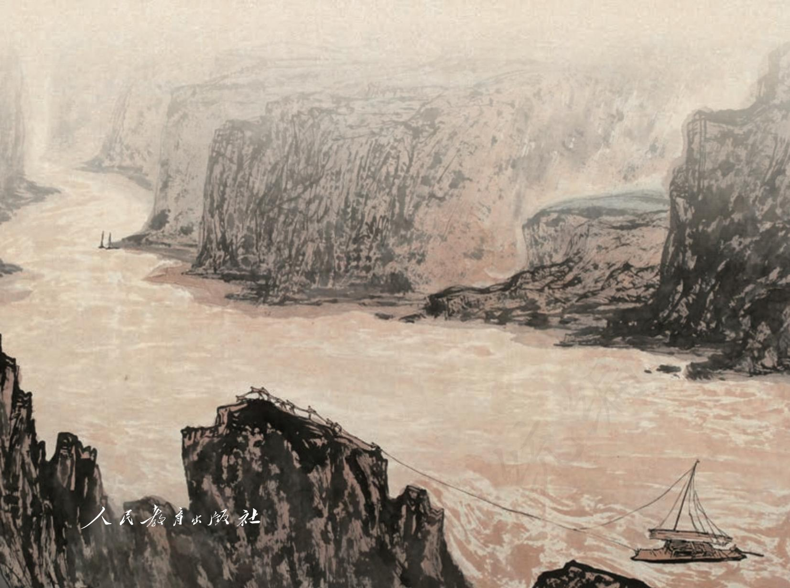

# 语文

# 选择性必修

上册

普通高中教科书

# 语文

# 选择性必修

上 册

教育部组织编写

总主编：温儒敏

本册主编：柯汉琳王荣生

编写人员：(以姓氏笔画为序)

何杰何郁张克中胡晓

夏德元顾之川徐飞梁捷

责任编辑：陈恒舒

美术编辑：房海莹

普通高中教科书语文选择性必修上册

教育部组织编写

出版人民教育出版社

（北京市海淀区中关村南大街17号院1号楼 邮编：100081）

网址 http://www.pep.com.cn

## 目录

第一单元  
1 中国人民站起来了/毛泽东 2  
2 长征胜利万岁/杨成武 6  
\*大战中的插曲/聂荣臻 11  
3 别了，“不列颠尼亚”/周婷 杨兴 16  
\*县委书记的榜样——焦裕禄/穆青 冯健 周原 18  
4 在民族复兴的历史丰碑上  
-2020中国抗疫记/钟华论 29  
单元研习任务 41  
第二单元 43  
5 《论语》十二章 44  
大学之道/《礼记》 45  
\*人皆有不忍人之心/《孟子》 4648  
6 《老子》四章  
\*五石之瓠/《庄子》 49  
7\*兼爱/《墨子》 51  
单元研习任务 53  
第三单元 5  
8 大卫·科波菲尔（节选)/狄更斯 充编版 56  
9 复活（节选)/列夫·托尔斯泰 67  
10\*老人与海（节选)/海明威 73  
11\*百年孤独（节选)/加西亚·马尔克斯 84  
单元研习任务 91  
第四单元  
逻辑的力量 93  
学习活动  
发现潜藏的逻辑谬误 94  
运用有效的推理形式 95  
三 采用合理的论证方法 97  
古诗词诵读 102  
无衣/《诗经·秦风》 102  
春江花月夜/张若虚 103  
将进酒/李白 105  
江城子·乙卯正月二十日夜记梦/苏轼 106