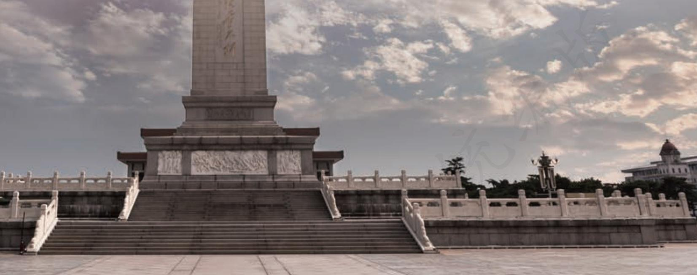
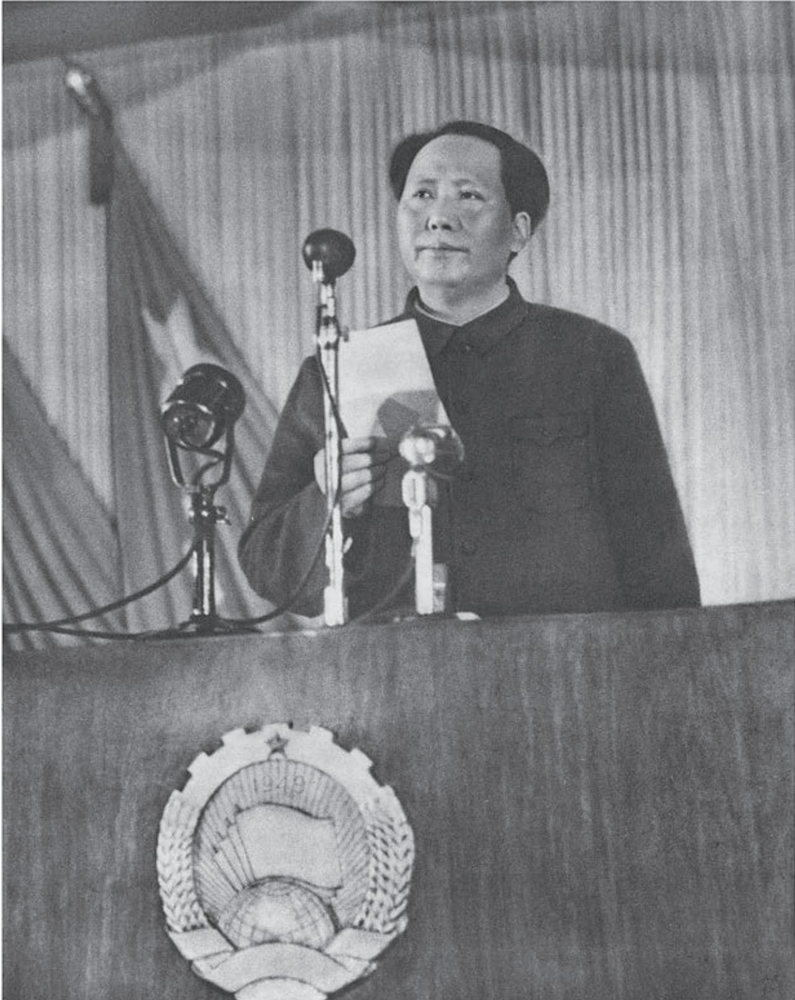

## 第一单元

一百年来，中国共产党领导全国人民不断朝着中华民族伟大复兴的目标挺进。在这一光辉历程中，逐渐形成的内涵丰厚的革命文化和社会主义先进文化，成为中华民族不断奋进的精神力量。

本单元所选作品，有的回顾历史，展望未来，抒发中国人民当家作主的自豪之情；有的讲述革命斗争中的具体事件，反映革命者的战斗激情和革命人道主义精神；有的表现社会主义建设时期党员干部的光辉事迹和祖国统一大业不可阻挡的趋势，表达中华民族伟大复兴必将实现的坚定信念；还有的表现党领导全国人民抗击新冠肺炎疫情，取得重大战略成果的伟大斗争，诠释了伟大抗疫精神。

学习本单元，要结合历史背景研读作品，理解作品内涵，感受作品中洋溢的革命豪情和建设热情，获得崇高的体验；把握不同体式作品的风格特点，学习其写作技巧，欣赏富有时代特征的表达艺术。

# 中国人民站起来了

（一九四九年九月二十一日）

毛泽东

诸位代表先生们，全国人民所渴望的政治协商会议现在开幕了。

我们的会议包括六百多位代表，代表着全中国所有的民主党派，人民团体，人民解放军，各地区，各民族和国外华侨。这就指明，我们的会议是一个全国人民大团结的会议。

这种全国人民大团结之所以能够成功，是因为我们战胜了美国帝国主义所援助的国民党反动政府。在三年多的时间内，英勇的世界上少有的中国人民解放军，战胜了美国援助的国民党反动政府所有的数百万军队的进攻，并使自己转入反攻和进攻。现在，数百万人民解放军的野战军已经打到接近台湾，广东，广西，贵州，四川和新疆的地区去了，中国人民的大多数已经获得了解放。在三年多的时间内，全国人民团结起来，援助人民解放军，反对了自己的敌人，取得了基本的胜利。在这个基础上，召开了今天的人民政治协商会议。

我们的会议之所以称为政治协商会议，是因为三年以前我们曾和蒋介石国民党一道开过一次政治协商会议。那次会议的结果是被蒋介石国民党及其帮凶们破坏了，但是已在人民中留下了不可磨灭的印象。那次会议证明，和帝国主义的走狗蒋介石国民党及其帮凶们一道，是不能解决任何有利于人民的任务的。即使勉强地做了决议也是无益的，一待时机成熟他们就要撕毁一切决议，并以残酷的战争反对人民。那次会议的唯一收获是给了人民以深刻的教育，使人民懂得：和帝国主义的走狗蒋介石国民党及其帮凶们决无妥协的余地，或者是推翻这些敌人，或者是被这些敌人所屠杀和压迫，二者必居其一，其他的道路是没有的。中国人民在中国共产党的领导之下，在三年多的时间内，很快地觉悟起来，并且把自己组织起来，形成了全国规模的反对帝国主义、封建主义、官僚资本主义及其集中的代表者国民党反动政府的统一战线，援助人民解放战争，基本上打倒了国民党反动政府，推翻了帝国主义在中国的统治，恢复了政治协商会议。

现在的中国人民政治协商会议是在完全新的基础之上召开的，它具有代表全国人民的性质，它获得全国人民的信任和拥护。因此，中国人民政治协商会议宣布自己执行全国人民代表大会的职权。中国人民政治协商会议在自己的议程中将要制定中国人民政治协商会议的组织法，制定中华人民共和国中央人民政府的组织法，制定中国人民政治协商会议的共同纲领，选举中国人民政治协商会议的全国委员会，选举中华人民共和国中央人民政府委员会，制定中华人民共和国的国旗和国徽，决定中华人民共和国国都的所在地以及采取和世界大多数国家一样的年号。

  
毛泽东在中国人民政治协商会议第一届全体会议上致开幕词

诸位代表先生们，我们有一个共同的感觉，这就是我们的工作将写在人类的历史上，它将表明：占人类总数四分之一的中国人从此站立起来了。中国人从来就是一个伟大的勇敢的勤劳的民族，只是在近代是落伍了。这种落伍，完全是被外国帝国主义和本国反动政府所压迫和剥削的结果。一百多年以来，我们的先人以不屈不挠的斗争反对内外压迫者，从来没有停止过，其中包括伟大的中国革命先行者孙中山先生所领导的辛亥革命在内。我们的先人指示我们，叫我们完成他们的遗志。我们现在是这样做了。我们团结起来，以人民解放战争和人民大革命打倒了内外压迫者，宣布中华人民共和国的成立了。我们的民族将从此列入爱好和平自由的世界各民族的大家庭，以勇敢而勤劳的姿态工作着，创造自己的文明和幸福，同时也促进世界的和平和自由。我们的民族将再也不是一个被人侮辱的民族了，我们已经站起来了。我们的革命已经获得全世界广大人民的同情和欢呼，我们的朋友遍于全世界。

我们的革命工作还没有完结，人民解放战争和人民革命运动还在向前发展，我们还要继续努力。帝国主义者和国内反动派决不甘心于他们的失败，他们还要作最后的挣扎。在全国平定以后，他们也还会以各种方式从事破坏和捣乱，他们将每日每时企图在中国复辟。这是必然的，毫无疑义的，我们务必不要松懈自己的警惕性。

我们的人民民主专政的国家制度是保障人民革命的胜利成果和反对内外敌人的复辟阴谋的有力的武器，我们必须牢牢地掌握这个武器。在国际上，我们必须和一切爱好和平自由的国家和人民团结在一起，首先是和苏联及各新民主国家团结在一起，使我们的保障人民革命胜利成果和反对内外敌人复辟阴谋的斗争不致处于孤立地位。只要我们坚持人民民主专政和团结国际友人，我们就会是永远胜利的。

人民民主专政和团结国际友人，将使我们的建设工作获得迅速的成功。全国规模的经济建设工作业已摆在我们面前。我们的极好条件是有四万万七千五百万的人口和九百六十万平方公里的国土。我们面前的困难是有的，而且是很多的，但是我们确信：一切困难都将被全国人民的英勇奋斗所战胜。中国人民已经具有战胜困难的极其丰富的经验。如果我们的先人和我们自己能够渡过长期的极端艰难的岁月，战胜了强大的内外反动派，为什么不能在胜利以后建设一个繁荣昌盛的国家呢？只要我们仍然保持艰苦奋斗的作风，只要我们团结一致，只要我们坚持人民民主专政和团结国际友人，我们就能在经济战线上迅速地获得胜利。

随着经济建设的高潮的到来，不可避免地将要出现一个文化建设的高潮。中国人被人认为不文明的时代已经过去了，我们将以一个具有高度文化的民族出现于世界。

我们的国防将获得巩固，不允许任何帝国主义者再来侵略我们的国土。在英勇的经过了考验的人民解放军的基础上，我们的人民武装力量必须保存和发展起来。我们将不但有一个强大的陆军，而且有一个强大的空军和一个强大的海军。

让那些内外反动派在我们面前发抖罢，让他们去说我们这也不行那也不行罢，中国人民的不屈不挠的努力必将稳步地达到自己的目的。

在人民解放战争和人民革命中牺牲的人民英雄们永垂不朽！

庆贺人民解放战争和人民革命的胜利！

庆贺中华人民共和国的成立！

庆贺中国人民政治协商会议的成功！

## 学习提示

1949年9月，中国人民政治协商会议第一届全体会议在北平召开。这次会议是在中国人民解放战争已经基本取得胜利、中华人民共和国即将成立的背景下召开的。毛泽东在会上发表了这篇著名的讲话，向全世界庄严宣告：“中国人民站起来了！”阅读本文，要注意结合中国近代以来的历史，特别是中国共产党领导中国人民推翻“三座大山”的革命历程，理解中国革命取得胜利的历史意义，体会毛泽东这一宣告的深刻含义，感受其中蕴含的中国人民当家作主的自豪之情。

毛泽东在改天换地的伟大时刻，回顾过去，论证了革命胜利的历史必然性；立足当下，对国家的发展大计作出规划；展望未来，描绘出中华民族振兴的壮丽蓝图。学习时，注意分析作者围绕“中国人民站起来了”阐述了哪些具体内容，各部分之间有怎样的关联。