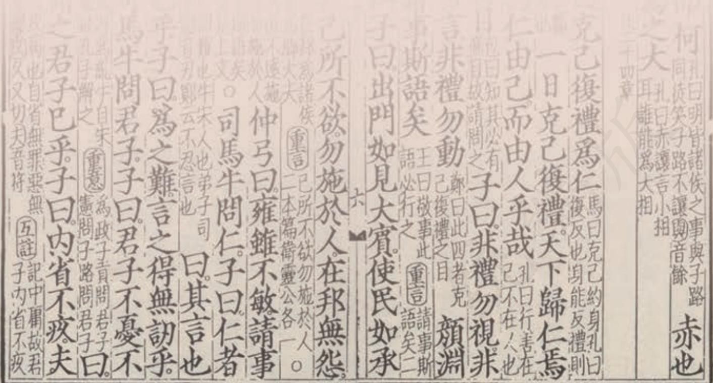
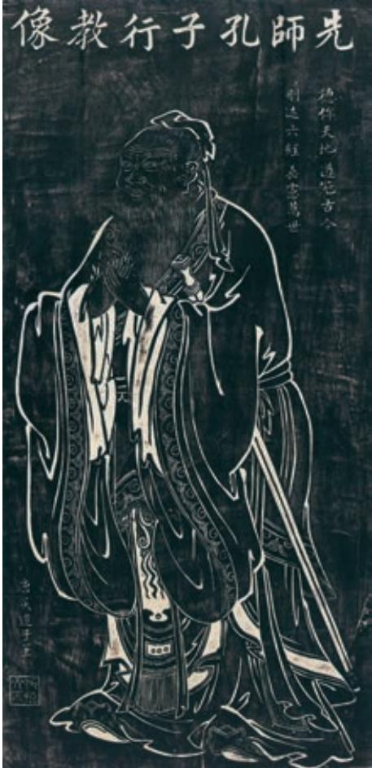

## 第二单元

如果说传统文化是一株枝繁叶茂的大树，那先秦诸子就是这株大树的根。先秦诸子，百家争鸣，百花齐放，铸就了中华思想文化史上的一段辉煌。

本单元选择了先秦诸子的一些经典论说，包括儒家的《论语》十二章、《大学》一章、《孟子》一章，道家的《老子》四章、《庄子》一章，以及墨家的《墨子·兼爱》篇。可结合以前读过的孔子、孟子、庄子等人的语录或作品，感受先秦时期百家争鸣的盛况。

本单元集中学习先秦诸子散文，以加深对传统文化之根的理解。要注意领会先秦诸子对社会人生的洞察，思考其思想学说对立德树人、修身养性的现实意义；感受先秦诸子或雍容或犀利或雄奇或朴拙的论说风格，理解各家论说的方法，领悟其妙处。

5

  
先师孔子行教像（拓本）

## 《论语》十二章 a

子曰：“君子食无求饱，居无求安，敏b 于事而慎于言，就有道而正焉c，可谓好学也已。”（《学而》）

子曰：“人而d 不仁，如礼何e ？人而不仁，如乐何？”（《八佾》）

子曰：“朝闻道，夕死可矣。”（《里仁》）

子曰：“君子喻f 于义，小人喻于利。”（《里仁》）

子曰：“见贤思齐焉，见不贤而内自省也。”（《里仁》）

子曰：“质胜文则野g，文胜质则史h。文质彬彬i，然后君子。”（《雍也》）

曾子曰：“士不可以不弘毅j，任重而道远。仁以为己任，不亦重乎？死而后已，不亦远乎？”（《泰伯》）

子曰：“譬如为山，未成一篑 k，止，吾止也 l。譬如平地 m，虽覆一篑，进，吾往也。”（《子罕》）

h 〔史〕虚饰，浮夸。

i 〔文质彬彬〕文质兼备、配合适当的样子。

j 〔弘毅〕志向远大，意志坚强。弘，广、大，这里指志向远大。

k 〔未成一篑（kuì）〕只差一筐土没有成功。篑，盛土的竹筐。

l 〔止，吾止也〕停下来，是我自己停下来的。

m 〔平地〕填平洼地。

子曰：“知a 者不惑，仁者不忧，勇者不惧。”（《子罕》）

颜渊问仁。子曰：“克己复礼b 为仁。一日c 克己复礼，天下归d仁焉。为仁由己，而由人乎哉？”颜渊曰：“请问其目e。”子曰：“非礼勿视，非礼勿听，非礼勿言，非礼勿动。”颜渊曰：“回虽不敏，请事f斯语矣。”（《颜渊》）

子贡问曰：“有一言 g 而可以终身行之者乎？”子曰：“其‘恕乎！己所不欲，勿施于人。”（《卫灵公》）

子曰：“小子h何莫学夫i《诗》？《诗》可以兴j，可以观k，可以群l，可以怨m。迩n 之事父，远之事君。多识于鸟兽草木之名。”（《阳货》）

大学之道

《礼记》

大学之道，在明明德p，在亲民q，在止于至善r。知止而后有定s，定而后能静t，静而后能安u，安而后能虑v，虑而后能得w。物有本末，事有终始，知所先后，则近道矣。

o 节选自《礼记·大学》（《礼记正义》，上海古籍出版社2008年版）。题目是编者加的。大学之道，指穷理、正心、修身、治人的根本原则。

p〔明明德〕彰明美德。前一个“明”是动词，彰明。明德，美好的德行。

q〔亲民〕亲近爱抚民众。一说“亲”当作“新”，“新民”即使天下人去旧立新，去恶向善。

r〔止于至善〕达到道德修养的最高境界。

s〔知止而后有定〕知道要达到的“至善”境界，则志向坚定不移。

t〔静〕心不妄动。

u〔安〕性情安和。

v〔虑〕思虑精详。

w〔得〕处事合宜。

古之欲明明德于天下者，先治其国。欲治其国者，先齐其家a。欲齐其家者，先修其身。欲修其身者，先正其心。欲正其心者，先诚其意。欲诚其意者，先致其知b。致知在格物c。物格而后知至d，知至而后意诚，意诚而后心正，心正而后身修，身修而后家齐，家齐而后国治，国治而后天下平。自天子以至于庶人，壹是e 皆以修身为本。

# 人皆有不忍人之心

《孟子》

孟子曰：“人皆有不忍人之心。先王有不忍人之心，斯有不忍人之 政矣；以不忍人之心行不忍人之政，治天下可运g 之掌上。所以谓人皆 有不忍人之心者：今人乍见孺子将入于井，皆有怵惕h 恻隐i 之心；非 所以内交j 于孺子之父母也，非所以要誉k 于乡党l 朋友也，非恶其声 而然m 也。由是观之，无恻隐之心，非人也；无羞恶n 之心，非人也； 无辞让o 之心，非人也；无是非之心，非人也。恻隐之心，仁之端p 也； 羞恶之心，义之端也；辞让之心，礼之端也；是非之心，智之端也。人 之有是四端也，犹其有四体q 也。有是四端而自谓不能者，自贼r 者 也；谓其君不能者，贼其君者也。凡有四端于我者，知皆扩而充之矣， 若火之始然s，泉之始达t。苟能充之，足以保u 四海；苟不充之，不 足以事父母。”

先秦儒家所讲的大都是人生的基本道理，今天看来仍有一定的启发意义。

本课所选《论语》十二章，焦点在立身处世的规范性原则，深入浅出，要言不烦，精辟隽永。学习时要在理解仁、义、礼等儒家思想核心概念的基础上，重点分析孔子关于“君子”之德及修身养性的基本观点。

《大学之道》强调“修身为本”，提纲挈领地论说“三纲”“八目”的体系。“三纲”即“明明德”“亲民”“止于至善”，“八目”即“格物”“致知”“诚意”“正心”“修身”“齐家”“治国”“平天下”。学习时要结合《大学》中的相关论述，理解“三纲”“八目”的具体所指及其内部关联。

《人皆有不忍人之心》以人突然看见小孩子将要掉入井里时的反应为依据，论证“人皆有不忍人之心”，由此提出人都有“四端”，进而论述“四端”对为人处世、治理天下的重要性。学习时注意结合自身经验和现实生活，探究孟子这些论断是否有充分的合理性。

研习中，注意这些经典篇章在论述道理方面的巧妙之处，如善用譬喻、对比，思路简洁明晰等；结合自己所了解的历史文化知识，思考先秦儒家的思想智慧对塑造中华民族精神的作用；联系日常生活，思考这些经典对自己有哪些启示。

背诵《〈论语〉十二章》和《大学之道》。拓展阅读《孟子·公孙丑上》“敢问夫子恶乎长……则不能也”。