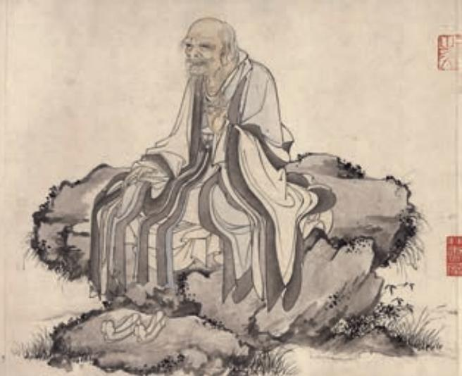

# 《老子》四章

三十辐共一毂b，当其无，有车之用c。埏埴d 以为器，当其无，有器之用。凿户牖e 以为室，当其无，有室之用。故有之以为利，无之以为用f。（第十一章）

企者不立g，跨者不行h，自见者不明i，自是者不彰j，自伐k 者 无功，自矜者不长l。其在道也，曰余食赘行，物或恶之m，故有道者 不处n。（第二十四章）

知人者智，自知者明。胜人者有力，自胜者强。知足者富，强行者

大 其 景

老子像  ［元］华祖立 作

a 选自《老子道德经注校释》（中华书局2008年版）。老子（生卒年不详），即老聃，相传姓李名耳，字聃，楚国苦县（今河南鹿邑东）人，春秋时期哲学家，道家学派创始人。做过周朝管理藏书的史官，相传孔子曾向他问礼。《老子》又称《道德经》，传世本共八十一章。其书是否为老子所著，历来有争议，一般认为书中所述基本反映了他的思想。

b 〔毂（ɡǔ）〕车轮的中心部位，周围与辐条的一端相接，中间的圆孔用来插车轴。

c 〔当其无，有车之用〕意思是，车的功用正是产生于车毂的“无”。无，指车毂的中空处。

d 〔埏（shān）埴（zhí）〕和泥（制作陶器）。埏，揉和。埴，黏土。

e 〔户牖（yǒu）〕门窗。

f〔有之以为利，无之以为用〕意思是，“有”（车子、器皿、屋室）供人方便利用，正是“无”起了作用。

g〔企者不立〕踮起脚的人不能久立。

h〔跨者不行〕跨大步的人行走不稳。

i〔自见（xiàn）者不明〕自我显露的不能显明。

j〔自是者不彰〕自以为是的不能彰显。

k〔自伐〕和下文的“自矜”都是自我夸耀的意思。

l〔长〕长久。一说读zhǎng，意思是得到敬重。

m〔其在道也，曰余食赘行，物或恶之〕（“自见”“自是”“自伐”“自矜”等行为）用道的观点来看，就叫作剩饭、赘瘤，人们常常厌恶它们。行，同“形”。

n〔处〕为，做。

有志a。不失其所者久b，死而不亡者寿c。（第三十三章）

其安易持d，其未兆易谋e，其脆易泮f，其微易散g。为之于未有h， 治之于未乱。合抱之木，生于毫末i ；九层之台，起于累土j ；千里 之行，始于足下。为者败之k，执者失之l。是以圣人无为m，故无败； 无执，故无失。民之从事，常于几n 成而败之。慎终如始，则无败事。 是以圣人欲不欲o，不贵难得之货，学不学p，复众人之所过q，以辅万 物之自然而不敢为。（第六十四章）

## 五石之瓠 r

《庄子》

惠子谓庄子曰：“魏王贻我大瓠之种，我树s 之成而实五石t。以盛 水浆，其坚u 不能自举也。剖之以为瓢，则瓠落无所容v。非不呺然w 大也，吾为其无用而掊x 之。”庄子曰：“夫子固拙于用大y 矣。宋人有 善为不龟手之药z 者，世世以洴澼 @7为事。客闻之，请买其方百金。 聚族而谋之曰：‘我世世为洴澼 ，不过数金。今一朝而鬻@8技百金， 请与之。’客得之，以说a 吴王。越有难b，吴王使之将。冬，与越人 水战，大败越人，裂地而封之。能不龟手一也，或以封，或不免于洴 澼 ，则所用之异也。今子有五石之瓠，何不虑c 以为大樽d 而浮乎江 湖，而忧其瓠落无所容？则夫子犹有蓬之心e 也夫！”

## 学习提示

孔子开创了儒家学派，老子则开创了道家学派。老子之后，道家代表人物又有庄子等人。《老子》《庄子》中的思想常有突破俗见之处，可以说是见人所不见，知人所不知，想人所不能想，言人所不能言。学习本课，首先就要留意《老子》《庄子》的这些篇章有哪些突破常规的认识。

学者柳诒征指出：“老子之书，专说对待之理。”（《中国文化史》）本课所选《老子》四章中的“有”和“无”，“知人”和“自知”，“胜人”和“自胜”，就是“对待”关系。通常情况下，人们偏执于这种对待关系的一面，比如“有”“知人”“胜人”等。可《老子》却总是提醒世人重视那通常被忽视的一面，其论说有很强的思辨性，对现实人生有一定的启示。阅读时，可以把课文中类似的关系提取出来，看看《老子》重视的是什么，有没有道理。

庄子也善于从常人认为没有价值的事物中发现价值。在《五石之瓠》中，惠子仅从日常使用的层面上考虑大葫芦的功用，庄子则超越了世俗经验的束缚，指出了大葫芦的独特价值。这个寓意深刻的小故事，表现出庄子与众不同的思维方式，阅读时注意体会。

从表达技巧上来说，《老子》善于汲取世俗经验展开哲理思辨，直接论说道理；《庄子》则长于借助寓言，婉曲达意，以增强说理的趣味和效果。学习本课，要注意在比较中品味二者不同的论述风格和语言韵味。

背诵《〈老子〉四章》。

人漂浮渡水。

e〔蓬之心〕比喻不通达的见识。蓬，一种草，弯曲不直。