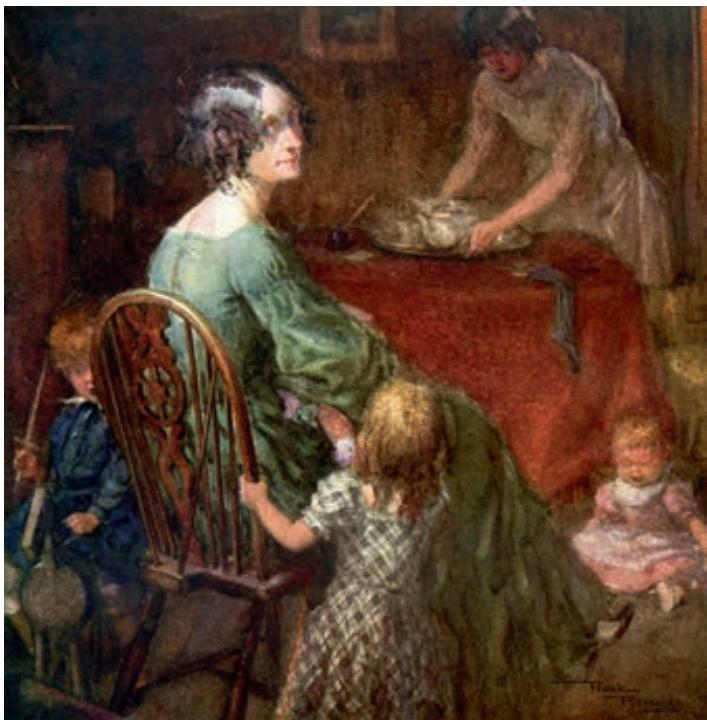

## 第三单元

读一部经典小说，犹如进行一次奇异的漫游。翻开作品，我们便仿佛置身于不同时代、不同地域的社会生活之中，目睹各式各样的人生故事，探寻丰富多彩的心灵世界，感受多种多样的文化风貌。

本单元收入四部外国小说的节选。《大卫·科波菲尔》和《复活》是19世纪现实主义长篇小说，展现了广阔的社会生活，表达了作者多方面的深刻思考；《老人与海》和《百年孤独》属于现代小说，在题材内容、创作手法等方面有诸多创新，极大地拓展了小说的天地。

学习本单元，要联系相关的历史文化背景，体察小说展现的千姿百态的社会生活，感受人类文化的丰富多彩。要了解小说多样化的风格样式，从主题内容、叙事手法、语言风格等多方面入手把握作品独特的艺术成就；总结小说的艺术特点，提升鉴赏小说的能力，并尝试写小小说。

# 大卫·科波菲尔a（节选）

狄更斯

如今，我对世事已有足够了解，因而几乎对任何事物都不再引以为怪了。不过像我这样小小年纪就如此轻易地遭人遗弃，即使是现在，也不免使我感到有点儿吃惊。好端端一个极有才华、观察力强、聪明热情、敏感机灵的孩子，突然身心两伤，可居然没有人出来为他说一句话，我觉得这实在是咄咄怪事。没有一个人出来为我说一句话，于是在我十岁那年，我就成了谋得斯通-格林比货行里的一名小童工了。

谋得斯通-格林比货行坐落在河边，位于黑衣修士区。那地方经过后来的改建，现在已经变了样了。当年那儿是一条狭窄的街道，街道尽头的一座房子，就是这家货行。街道曲曲弯弯直达河边，尽头处有几级台阶，供人们上船下船之用。货行的房子又破又旧，有个自用的小码头和码头相连，涨潮时是一片水，退潮时是一片泥。这座房子真正是老鼠横行的地方。它那些镶有护墙板的房间，我敢说，经过上百年的尘污烟熏，已经分辨不出是什么颜色了；它的地板和楼梯都已腐烂；地下室里，成群的灰色大老鼠东奔西窜，吱吱乱叫；这儿到处是污垢和腐臭：凡此种种，在我的心里，已不是多年前的事，而是此时此刻眼前的情景了。它们全都出现在我的眼前，就跟当年那倒霉的日子里，我颤抖的手被昆宁先生握着，第一次置身其间时见到的完全一样。

谋得斯通-格林比货行跟各色人等都有生意上的往来，不过其中重要的一项是给一些邮船供应葡萄酒和烈性酒。我现在已经记不起这些船主要开往什么地方，不过我想，其中有些是开往东印度群岛和西印度群岛的。我现在还记得，这种买卖的结果之一是有了许多空瓶子。于是有一些大人和小孩就着亮光检查这些瓶子，扔掉破裂的，把完好的洗刷干净。摆弄完空瓶子，就往装满酒的瓶子上贴标签，塞上合适的软木塞，或者是在软木塞上封上火漆，盖上印，然后还得把完工的瓶子装箱。这全是我的活儿，我就是雇来干这些活儿的孩子中的一个。

连我在内，我们一共三四个人。我干活儿的地方，就在货行的一个角落里。昆宁先生要是高兴，他只要站在账房间他那张凳子最低的一根横档上，就能从账桌上面的那个窗子里看到我。在我如此荣幸地开始独自谋生的第一天早上，童工中年纪最大的那个奉命前来教我怎样干活儿。他叫米克·沃克，身上系一条破围裙，头上戴一顶纸帽子。他告诉我，他父亲是个船夫，在伦敦市长就职日，曾戴着黑色天鹅绒帽子参加步行仪仗队a。他还告诉我，我们的主要伙伴是另一个男孩，在给我介绍时，我觉得他的名字很古怪，叫粉白·土豆。后来我才发现，原来这并不是这个孩子起初的名字，而是货行里的人给他取的诨名，因为他面色灰白，像煮熟的土豆般粉白。粉白的父亲是个运水夫，还兼做消防队员，以此受雇于一家大剧院。他家还有别的亲人——我想是他的妹妹吧——在那儿扮演哑剧中的小鬼。

我竟沦落到跟这样一班人为伍，内心隐藏的痛苦，真是无法用言语表达。我把这些天天在一起的伙伴跟我幸福的孩提时代的那些伙伴作了比较——更不要说跟斯蒂福思、特雷德尔那班人比较了——我觉得，想成为一个有学问、有名望的人的希望，已在我胸中破灭了。当时我感到绝望极了，对自己所处的地位深深地感到羞辱。我年轻的心里痛苦地认定，我过去所学的、所想的、所喜爱的，以及激发我想象力和上进心的一切，都将一天天地渐渐离我而去，永远不再回来了，凡此种种，全都深深地印在我的记忆之中，绝非笔墨所能诉说。那天上午，每当米克·沃克离开时，我的眼泪就直往下掉，混进了我用来洗瓶子的水中。我呜咽着，仿佛我的心窝也有了一道裂口，随时都有爆炸的危险似的。

账房里的钟已指向12点30分，大家都准备去吃饭了。这时，昆宁先生敲了敲窗子，打手势要我去账房。我进去了，发现那儿还有一个胖墩墩的中年男子，他身穿褐色外套、黑色马裤、黑色皮鞋，脑袋又大又亮，没有头发，光秃得像个鸡蛋，他的大脸盘完全对着我。他的衣服破旧，但装了一条颇为神气的衬衣硬领。他手里拿着一根很有气派的手杖，手杖上系有一对已褪色的大穗子，他的外套的前襟上还挂着一副有柄的单片眼镜——我后来发现，这只是用作装饰的，因为他难得用来看东西，即使他用来看了，也是什么都看不见的。

“这位就是。”昆宁先生指着我说。

“这位，”那个陌生人说，语调中带有一种屈尊俯就的口气，还有一种说不出的装成文雅的气派，给我印象很深，“就是科波菲尔少爷了。你好吗，先生？”

我说我很好，希望他也好。其实，老天爷知道，当时我心里非常局促不安，可是当时我不便多诉苦，所以我说很好，还希望他也好。

“感谢老天爷，”陌生人回答说，“我很好。我收到谋得斯通先生的一封信，信里提到，要我把我住家后面的一间空着的屋子——拿它，简而言之，出租——简而言之，”陌生人含着微笑，突然露出亲密的样子说道，“用作卧室——现在能接待这么一位初来的年轻创业者，这是本人的荣幸。”说着，陌生人挥了挥手，把下巴架在了衬衣的硬领上。

“这位是米考伯先生。”昆宁先生对我介绍道。

“啊哈！”陌生人说，“这是我的姓。”

“米考伯先生，”昆宁先生说，“认识谋得斯通先生。他能找到顾客时，就给我们介绍生意，我们付他佣金。谋得斯通先生已给他写了信，谈了你的住宿问题，现在他愿意接受你做他的房客。”

“我的地址是，”米考伯先生说，“城市路，温泽里。我，简而言之，”说到这儿，他又带着先前那种文雅的气派，同时突然再次露出亲密的样子，“就住在那儿。”

我朝他鞠了一躬。

“我的印象是，”米考伯先生说，“你在这个大都市的游历还不够广，要想穿过这座迷宫似的现代巴比伦a，前往城市路，似乎还有困难——简而言之，”说到这儿，米考伯又突然露出亲密的样子，“你也许会迷路—为此，今天晚上我将乐于前来，以便让你知道一条最为便捷的路径。”

我全心全意地向他道了谢，因为他愿不怕麻烦前来领我，对我真是太好了。

“几点钟？”米考伯先生问道，“我可以——”

“8点左右吧。”昆宁先生回答。

“好吧，8点左右。”米考伯先生说，“请允许我向你告辞，昆宁先生，我不再打扰了。”

于是，他便戴上帽子，腋下夹着手杖，腰杆儿笔挺地走出来。离开账房后，他还哼起了一支曲子。

于是昆宁先生便正式雇用了我，要我在谋得斯通-格林比货行尽力干活儿，工资，我想是，每星期六先令。至于到底是六先令，还是七先令，我已记不清了。由于难以肯定，所以我较为相信，开始是六先令，后来是七先令。他预付给我一星期的工资（我相信，钱是从他自己的口袋里掏出来的），我从中拿出六便士给了粉白·土豆，要他在当天晚上把我的箱子扛到温泽里。箱子虽然不大，但以我的力气来说，实在太重了。我又花了六便士吃了一顿中饭，吃的是一个肉饼，喝的则是附近水龙头里的冷水。接着便在街上闲逛了一通，直到规定的吃饭时间过去。

到了晚上约定的时间，米考伯先生又来了。我洗了手和脸，以便向他的文雅表示更多的敬意。接着我们便朝我们的家走去，我想，我现在得这样来称呼了。一路上，米考伯先生把街名、拐角地方的房子形状等，直往我脑子里装，要我记住，为的是第二天早上我可以轻易地找到回货行的路。

到达温泽里他的住宅后（我发现，这住宅像他一样破破烂烂，但也跟他一样一切都尽可能装出体面的样子），他把我介绍给他的太太。

米考伯太太是个面目消瘦、憔悴的女人，一点儿也不年轻了。她正坐在小客厅里（楼上的房间里全都空空的，一件家具也没有，成天拉上窗帘，挡住邻居的耳目），怀里抱着一个婴儿在喂奶。婴儿是双胞胎里的一个。我可以在这儿提一下，在我跟米考伯家的整个交往中，我从来不曾见到这对双胞胎同时离开过米考伯太太。其中总有一个在吃奶。

他们家另外还有两个孩子：大约四岁的米考伯少爷和大约三岁的米考伯小姐。在这一家人中，还有一个黑皮肤的年轻女人，这个有哼鼻子习惯的女人是这家的仆人。不到半个小时，她就告诉我说，她是“一个孤儿”，来自附近的圣路加济贫院。我的房间就在屋顶的后部，是个闷气的小阁楼，墙上全用模板刷了一种花形，就我那年轻人的想象力来看，那就像是一个蓝色的松饼。房间里家具很少。

  
米考伯太太  ［英］弗兰克·雷诺兹 作

“我结婚以前，”米考伯太太带着双胞胎和其他人，领我上楼看房间，坐下来喘口气说，“跟我爸爸妈妈住在一起，当时我从来没有想到，有一天我不得不招个房客来住。不过，既然米考伯先生有困难，所有个人情感上的好恶，也就只好让步了。”

我回答说：“你说得对，太太。”

“眼下米考伯先生的困难，几乎要把我们给压垮了，”米考伯太太说，“到底是否能渡过这些难关，我不知道。当我跟爸爸妈妈一起过日子时我真的不懂，我现在用的‘困难’这两个字是什么意思。不过经验能让人懂得一切——正像爸爸时常说的那样。”

米考伯先生曾当过海军军官，这是米考伯太太告诉我的，还是出于我自己的想象，我已弄不清楚。我只知道，直到现在我依然相信，他确实一度在海军里做过事。只是不知道我为什么会这样相信。现在，他给各行各业的商家跑街招揽生意，不过恐怕赚不到多少钱，也许根本赚不到钱。

“要是米考伯先生的债主们不肯给他宽限时间，”米考伯太太说，“那他们就得自食其果了。这件事越快了结越好。石头是榨不出血来的。眼下米考伯先生根本还不了债，更不要说要他出诉讼费了。”

是因为我过早地自食其力，米考伯太太弄不清我的年龄呢，还是由于她老把这件事放在心上，总得找个人谈谈，要是没有别的人可谈，哪怕跟双胞胎谈谈也好，这一点我一直不太清楚。不过她一开头就对我这么说了，以后在我跟她相处的所有日子里，她一直就是如此。

可怜的米考伯太太！她说她曾尽过最大的努力，我毫不怀疑，她的确如此，想过一切办法。朝街的大门正中，全让一块大铜牌给挡住了，牌上刻有“米考伯太太青年女子寄宿学舍”的字样，可是我从来没有发现有什么青年女子在这一带上学，没有见到有什么青年女子来过这儿，或者打算来这儿，也没见过米考伯太太为接待什么青年女子作过任何准备。我所看到和听到的上门来的人，只有债主。这班人没日没夜地找上门来，其中有的人凶得不得了。有个满脸污垢的男人，我想他是个鞋匠，经常在早上7点就挤进过道，朝楼上的米考伯先生大喊大叫：“喂，你给我下来！你还没出门，这你知道。快还我们钱，听到没有？你别想躲着，这你知道，那太不要脸了。要是我是你，我绝不会这样不要脸面。快还我们钱，听到没有？你反正得还我们钱，你听到了没有？喂，你给我下来！”他这样骂了一通后，仍旧得不到回答，火气就更大了，于是就骂出“骗子”“强盗”这些字眼来。连这些字眼也不起作用时，有时他就跑到街对面，对着三楼的窗子大声叫骂，他知道米考伯先生住在哪一层。遇到这种时候，米考伯先生真是又伤心，又羞愧，甚至悲惨得不能自制，用一把剃刀做出抹脖子的动作来（这是有一次他太太大声尖叫起来我才知道的）。可是在这过后还不到半个小时，他就特别用心地擦亮自己的皮鞋，然后哼着一支曲子，摆出比平时更加高贵的架势，走出门去了。米考伯太太也同样能屈能伸。我曾看到，她在3点钟时为缴税的事急得死去活来，可是到了4点钟，她就吃起炸羊排，喝起热麦酒来了（这是典当掉两把银茶匙后买来的）。有一次，她家刚被法院强制执行，没收了财产，我碰巧提前在6点钟回家，只见她躺在壁炉前（当然还带着一对双胞胎），头发散乱，披在脸上，可是就在这天晚上，她一面在厨房的炉子旁炸牛排，一面告诉我她爸妈以及经常来往的朋友们的事。我从未见过她的兴致有比那天晚上更好的了。

我就在这座房子里，跟这家人一起，度过我的空闲时间。每天我一人独享的早餐是一便士面包和一便士牛奶，由我自己购买。另外我还买一个小面包和一小块干酪，放在一个特定食品柜的特定一格上，留作晚上回来时的晚餐。我清楚地知道，这在我那六七个先令工资里，是一笔不小的开销了。我整天都在货行里干活儿，而整个一星期，我就得靠这点儿钱过活，从星期一早晨到星期六晚上，从来没有人给过我任何劝告、建议、鼓励、安慰、帮助和支持，这一点，就像我渴望上天堂一样，脑子里记得一清二楚！

米考伯先生的困难更增加了我精神上的痛苦。我的处境这样孤苦伶仃，也就对这家人产生了深厚的感情。每当我四处溜达时，老是想起米考伯太太那些筹款的方法，心里总压着米考伯先生的债务负担。星期六的晚上是我最高兴的时候——一方面是因为我回家时口袋里有六七个先令，一路上可以进那些店铺看看，琢磨琢磨这笔钱可以买些什么，这是件很适意的事；另一方面是那一天回家比平时早——可米考伯太太却往往对我诉说起最伤心的知心话来。星期天早晨也是如此，当我把头天晚上买来的茶或咖啡，放进刮脸用的小杯子里冲水搅动一番，然后坐下来吃早饭时，米考伯太太又会对我诉说起来。有一次，这种星期六晚上的谈话刚开始，米考伯先生就泣不成声，可是到了快结束时，他竟又唱起“杰克爱的是他可爱的南a”来。我曾见过他回家吃晚饭时，泪如泉涌，口口声声说，现在除了进监狱，再也没有别的路了；可是到了上床睡觉时，他又计算起来，有朝一日，时来运转（这是他的一句口头禅），给房子装上凸肚窗得花多少钱。米考伯太太跟她丈夫完全一样。

我想，由于我们各自的处境，所以我跟这对夫妇之间就产生了一种奇特而平等的友谊，虽然我们之间年龄差别大得可笑。不过，在米考伯太太把我完全当成她的知己以前，我从来没有接受过他们的邀请，白吃白喝过他们的东西（我知道他们跟肉铺、面包铺的关系都很紧张，他们那点儿东西往往连他们自己都不够吃喝）。她把我当成知己的那天晚上，情况是这样的：

“科波菲尔少爷，”米考伯太太说，“我不拿你当外人，所以不瞒你说，米考伯先生的困难已经到了最危急的关头了。”

我听了这几句话，心里非常难过，带着极度的同情看着米考伯太太通红的眼睛。

“除了一块荷兰干酪的皮儿外，”米考伯太太说，“食物间里真是连一点儿渣子都没有了。可干酪皮儿又不适合给孩子们吃。我跟爸妈在一起时，说惯了食物间，这会儿几乎不觉又用起这个词来了。我的意思是说，我们家什么吃的都没有了。”

“哎呀！”我很关切地说。

我口袋里一个星期的工资还剩有两三先令——从这钱数来看，我认为我们的这次谈话一定发生在星期三晚上——我赶紧掏了出来，真心实意地要求米考伯太太收下，就算是我借给她的。可是那位太太吻了吻我，定要我把钱放回口袋，并说，这样的事她想也不能想。

“不，亲爱的科波菲尔少爷，”她说，“我丝毫没有这种想法！不过你年纪虽小，已经很懂事了，你要是肯答应的话，你可以帮我另外一个忙，这个忙我一定接受，而且还十分感激。”

我请她说出要我帮什么忙。

“我已经亲自拿出去一些银餐具了，”米考伯太太说，“悄悄拿了六只茶匙、两只盐匙和一对糖匙，分几次亲自送去当铺当了钱。可是这对双胞胎老是缠得我分不开身。而且想到我爸妈，现在我得去做这种事，心里就很痛苦。我们还有几件小东西可以拿去处理掉。米考伯先生容易动感情，他是决不肯去处理这些东西的。而克莉基特，”——这是从济贫院来的那个女仆——“是个粗人，要是过分信任她，她就会放肆起来，弄得我们受不了的。所以，科波菲尔少爷，要是我可以请你——”

现在我懂得米考伯太太的意思了，就求她尽管支使我，做什么都行。从那天晚上起，我就开始处理起她家的那些轻便的财物来了。此后，几乎每天早上，在我上谋得斯通-格林比货行以前，都要出去干一次同样的事。

最后，米考伯先生的困难终于到了危急关头，一天清晨，他被捕了，被关进塞德克的高等法院监狱。在走出家门时，他对我说，他的末日到了——我真以为他的心碎了，我的心也碎了。可是我后来听说，就在那天上午，还有人看到他正兴高采烈地在玩九柱戏a 呢！

在他入狱后的第一个星期天，我决定去看看他，并跟他一起吃顿中饭。我向人问了路，说得先到一个地方，快到时就会看到另一个跟它一样的地方，在它附近会看到一个院子，穿过那院子，再一直往前走，就能看到一个监狱看守。我一一照办了。最后，终于看到了一个看守（我真是个可怜的小家伙），我想到罗德里克·蓝登b 关在负债人监狱里时，跟他同狱的只有一个人，那人除了身上裹的一块破地毯外，一无所有。这时我泪眼模糊，心里直扑腾，那个看守在我面前直摇晃。

米考伯先生正在栅栏门里面等着我，我走进他的牢房（在顶层下面的一层），我们大哭了一场。我记得，他郑重地劝告我，要拿他的这种结局引以为戒。他要我千万记住，一个人要是每年收入二十镑，花掉十九镑十九先令六便士，那他会过得很快活，但要是他花掉二十镑一先令，那他就惨了。在这以后，他向我借了一先令买黑啤酒喝，还写了一张要米考伯太太归还的单据给我，随后他就收起手帕，变得高兴起来了。

我们坐在一个小火炉前，生锈的炉栅上，一边放着一块砖头，免得烧煤太多。我们一直坐着，直到跟米考伯先生同牢房的另一个人进来。他从厨房里端来一盘羊腰肉，这就是我们三人共同享用的饭菜了。接着，米考伯先生派我去顶上一层“霍普金斯船长”的牢房，带去米考伯先生对他的问候，对他说明我是他的年轻朋友，问他是否可以借给我一副刀叉。

霍普金斯船长借给我一副刀叉，并要我向米考伯先生问好。他的那间小牢房里有一个很邋遢的女人，还有两个面无血色的女孩，长着一头蓬乱的头发，是他的女儿。我当时想，好在是向霍普金斯船长借刀叉，而不是向他借梳子。船长自己，衣服也褴褛到不能再褴褛了，留着长长的络腮胡子，身上只穿着一件旧得不能再旧的褐色大衣，里面没有穿上衣。我看到他的床折起放在角落里，他的那点盘、碟、锅、罐全都放在一块搁板上。我猜想（只有老天知道我为什么会这样想），那两个头发蓬乱的女孩虽然是霍普金斯船长的孩子，但那个邋遢的女人并不是他明媒正娶的妻子。我怯生生地站在他门口最多不过两分钟，可是我从他那儿下楼时，心里却清楚地意识到这一切，就像那副刀叉清楚地握在我手里一样。

不管怎么说，这顿中饭倒也有点儿吉卜赛人的风味，颇为有趣。午饭后不多久，我把刀叉还给了霍普金斯船长，便返回寓所，向米考伯太太报告探监的情况，好让她放心。她一见我回来，就晕过去了。后来她做了一小壶鸡蛋酒a，在我们谈论这件事时，作为慰藉。

我不知道，这家人为了维持家庭生活，是怎样卖掉家具的，是谁帮他们卖的，我只知道，反正不是我。不过家具的确给卖掉了，是由一辆货车拉走的，只剩下床、几把椅子和一张厨房用的桌子。带着这几件家具，我们，米考伯太太、她的几个孩子、那个孤儿，还有我，就像露营似的，住在温泽里这座空荡荡的房子的两个小客厅中。我们日夜住在这两间房间里，我已说不清究竟住了多久，不过我觉得已经很久了。后来，米考伯太太决定也搬进监狱去住，因为这时候米考伯先生搞到了一个单独的房间。于是我就把这所住房的钥匙交还给房东，房东拿到钥匙非常高兴。几张床都搬到高等法院监狱里去了，留下了我的一张。我把它搬到了另外租的一个小房间里。这个新寓所就在监狱大墙外不远的地方，我为此感到很满意，因为我跟米考伯一家患难与共，彼此已经很熟，舍不得分开了。他们也给那个孤儿在附近租了个便宜的住处。我的新住所是间清静的阁楼，在房子的后部，房顶是倾斜的。下面是个贮木场，看起来景色宜人。我到那儿住下时，想到米考伯先生到底还是过不了关，就觉得我这里实在是一个天堂了。

在这段时间里，我依旧一直在谋得斯通-格林比货行里干着普通的活儿，跟那几个普通人做伙伴，心里仍和开始时一样，感到不应该这样落魄，受这样的屈辱。我每天去货行，从货行回家，以及中饭时在街上溜达，都会看到许多孩子，可我从来没有结识过其中的任何一个人，也没有跟其中的任何一个人交谈，当然对我来说，幸亏如此。我过的同样是苦恼自知的生活，而且也跟从前一样，依旧孑然一身，一切都靠自己。我感到自己的变化只有两点：第一，我的穿着变得更加褴褛了；第二，米考伯夫妇的事，现在已不再像以前那样重压在我的心头了。因为他们的一些亲戚朋友，已出面来帮助他们渡过难关了，因而他们在监狱里的生活，反倒比长期以来住在监狱外面更舒服一些。靠了某些安排，现在我可以经常跟他们一起吃早饭了，至于这种安排的详情，现在我已经忘记了。监狱早上什么时候开门，什么时候允许我进去，我也记不清了。不过我记得，当时我通常在6点钟起床，在去监狱前的这段时间，我就在街上溜达。我最喜欢溜达的地方是伦敦桥。我习惯坐在石桥的某个凹处，看过往的人们，或者趴在桥栏上，看太阳照在水面泛出万点金光，照到伦敦大火纪念塔a 顶上的金色火焰上。有时，那孤儿也会在这儿碰上我，我就把有关码头和伦敦塔的事编成些惊人的故事，说给她听。有关这些故事，我只能说，我希望自己也相信是真的。晚上，我又回到监狱里，有时跟米考伯先生在运动场上来回走动散步，有时则跟米考伯太太玩纸牌，听她讲她爸妈的往事。谋得斯通先生是否知道我住在什么地方，我说不上来。反正我从来没有对谋得斯通-格林比货行里的人说过这些事。

米考伯先生的事，虽然渡过了最危急的关头，但是由于过去有张“契据”什么的，所以依然还有纠葛。有关这种契据的事，我以前听他们谈得很多，现在我想，那一定是他以前立给债权人的某种约定偿还债务的借据，不过当时我弄不清这是怎么一回事，把它跟从前在德国流行一时的魔鬼的文件b 混为一谈了。最后，这个文件不知怎么的，好像不碍事了，米考伯太太告诉我，“她娘家的人”认定，米考伯先生可以援用破产债务人法，请求释放。这么一来，她指望，再过六个星期，他就可以获得自由。

我每天都往来于塞德克和黑衣修士区之间，吃饭时间就到偏僻的街上转悠，街上的石头想必都让我那双孩子的脚给踩坏了。我不知道，当年在霍普金斯船长的朗读声中，一个个从我面前走过的人里，有多少人已经不在了！现在，每当回忆起少年时代那一点点挨过来的痛苦岁月，我也不知道，我替这些人编造出来的故事中，有多少是被我想象的迷雾笼罩着的记得十分真切的事实！可是我毫不怀疑，当我重返旧地时，我好像看到一个在我面前走着，让我同情的天真而富有想象力的孩子，他凭着那些奇特的经历和悲惨的事件，创造出了自己的想象世界。

## 学习提示

狄更斯说，在他的全部作品中，他最爱《大卫·科波菲尔》。这部作品带有一点儿“自传”性质，小说中的大卫克服了重重困难，最终成长为一位有成就的作家，这与狄更斯本人的生平有相似之处；课文节选部分出场的米考伯夫妇，也有着狄更斯父母的影子。阅读时，可以扣住“成长”这一线索，看看大卫经历了哪些事，遇到了哪些人，想想这一切对他的成长会有哪些影响。

狄更斯是一位特别擅长塑造人物形象的作家。他笔下的人物，无论是主角还是配角，都性格鲜明，令人难忘，其中许多已成为文学史上的经典形象。阅读时，注意把握作品中人物的主要特征，体会作者通过外貌、语言、动作等方面的细节塑造人物形象的精湛手法。

小说通过大卫这个孩子的眼睛来看周围的人物和环境，既表达了对人世间善良、宽厚、仁爱等美德的赞美，同时也蕴含着对当时社会的批判。阅读时，注意领略小说中所展现的19世纪英国的社会风貌，理解作者对当时社会现实的态度，体会小说的叙述角度带来的独特艺术效果，特别是其中的情感意味。