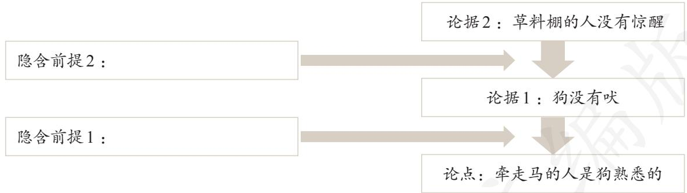

## 第四单元逻辑的力量

生活和学习中，逻辑无处不在。每天我们都会接触到海量信息，懂一点儿逻辑，可以更好地辨识信息，把握事实真相；我们常常要对生活中的现象发表观点，作出论证，学习逻辑，可以使思维更缜密，论证更严谨，语言表达更准确；我们在工作学习中也往往会基于事实进行推理，作出判断，掌握一些逻辑方法，可以帮助我们合理思考，由已知探寻未知。

在本单元中，我们会接触一些基本的逻辑方法，学习辨析逻辑错误，进行简单的逻辑推理，并运用逻辑方法来构建并完善论证。经过这样的“逻辑之旅”，我们能更清晰地认识语言与逻辑的关系，发展逻辑思维，滋养理性精神，提升思维品质。

在我们的语文生活中，逻辑是无处不在的：烛之武入情入理的分析挽救了国家，这是外交中的逻辑；林庚细致辨析“木叶”的内涵与使用的场合，这是文艺鉴赏中的逻辑；王安石以雄辩的论说驳斥对变法的非难，这是治国理政中的逻辑；“既已烧着，又何苦伤心流泪？”热情奔放的诗句中，也同样包含着逻辑……学点儿逻辑，可以增强我们的思维能力，增进我们对外部世界的认识，也可以帮助我们更好地进行语文学习。

逻辑能够让我们化繁为简，去伪存真，透过纷繁复杂的表象，洞察问题的本质。例如，鲁迅《拿来主义》一文，就包含着这样一个推理：

或者闭关，或者送去，或者等别人“送来”，或者自己去拿（当时没有其他选择）

不能闭关，不能送去，不能等别人“送来”

## 只有自己去拿

文章先分析了“闭关主义”“送去主义”等几种不同的做法，否定这些错误的做法，也就证明了“拿来主义”的正确性。这篇文章充分展现了逻辑思维的力量。

有些时候，文学作品又会故意在表面上违背逻辑，以取得更好的表达效果。例如臧克家《有的人——纪念鲁迅逝世十三周年有感》中的诗句“有的人活着，他已经死了；有的人死了，他还活着”，在表面的自相矛盾中，隐藏着“精神”和“肉体”这两个评判人生的角度，含蓄地表达了对精神不朽、虽死犹生的鲁迅先生的景仰，以及对欺压人民、虽生犹死者的鄙夷。这句诗看似不合逻辑，有悖常识，实则凝练深刻，引人深思。能有如此突出的表达效果，与诗句“违背逻辑”的表达方式有着密切的联系。

下面，就让我们开启一段“逻辑之旅”，试着运用逻辑来发现谬误、进行推理、展开论证，你会发现：逻辑不神秘，过去你就自觉不自觉地用过它；逻辑很有用，它能让你的思考更加严谨周密，阅读与表达更具洞见，更富理性。

## 一 发现潜藏的逻辑谬误

我们生活在互联网时代，获取信息更加方便，但遭遇的谬误也更多。我们必须具备识别谬误的能力，否则就有可能成为谬误的受害者甚至传播者。

逻辑，正是甄别信息与辨析谬误的武器。

逻辑学所说的谬误特指具有一定迷惑性的逻辑错误。逻辑错误往往违反了思维和表达的一些基本规范，例如概念的含义前后不一致，立场自相矛盾、态度模棱两可，理由站不住脚或推不出结论等。

任务1：分析下面的例子，指出其中的逻辑错误。

① 鲁迅的作品不是一天能读完的，《孔乙己》是鲁迅的作品，所以，《孔乙己》不是一天能读完的。

② 庄子曰：“请循其本。子曰‘汝安知鱼乐’云者，既已知吾知之而问我。我知之濠上也。”（《庄子与惠子游于濠梁之上》）

③“服务员同志，请当心，你的手指浸到我的汤里去了。”

“没有关系，汤不烫，我不痛。”

④“我是答应您昨天来修门铃没错。可我来了三次，每次按门铃，都没有人来开门，我只好走了。”

⑤ 在法国某地，一个耍戏法的人招揽观众：“快来快来，这里有拿破仑的头骨。”围观的一个人说：“奇怪，听说拿破仑的脑袋是很大的，这个头骨怎么和普通人的没有区别啊？”耍戏法的解释道：“没错，这是拿破仑小时候的头骨。”

⑥ 有人说《红楼梦》值得读，有人说不值得。两种意见我都不赞成。读，太花时间；不读，又有点儿可惜。

⑦  不薄之谓厚，不白之谓黑。

⑧《祝福》中，鲁四老爷知道祥林嫂的死讯后说：“不早不迟，偏偏要在这时候，——这就可见是一个谬种！”

⑨ 你是否已经停止了对我的毁谤？请回答“是”或者“不是”！

任务2：辨析日常语言表达中的逻辑错误。

你关注过日常话语中的逻辑错误吗？例如，“我爱读外国文学，尤其爱读俄罗斯的、拉美的、古典的”，这是划分不当；“为演好课本剧我可以赴汤蹈火，要不是雨下得太大我就赶去排练了”，这是自相矛盾；“他出生时天昏地暗、飞沙走石，注定此生不凡”，这是强加因果；“目前大学生普遍缺少对传统文化的热情，最新调查显示，大学生喜欢和较喜欢京剧的只占被调查人数的14%”，这是以偏概全；……它们都违背了逻辑。再回顾一些你平时遇到过的存在逻辑错误的话语，分析其错误的原因。

## 二 运用有效的推理形式

冯梦龙的《智囊全集》记载了一件令人称奇的故事：

唐代有一个农夫耕田时挖到一瓮马蹄形黄金，乡里（古代居民组织单位）立刻派人送到县衙去，县官担心公库防护不严，就放到自己家里。隔夜打开检验，发现都是土块。瓮金出土时，乡里人都曾去见证。县官无法辩白，最终承认将黄金掉包的罪名。就在快要定案的时候，事情传到了一个叫袁滋的官员耳里，袁滋说：“我怀疑这案子里有冤情。”州府长官让他重新调查。他点验出瓮中“马蹄金”共二百五十多块。请金铺铸造同样形状和大小的马蹄金，才造出一半数目，总重就达三百斤了，又了解到当初是两个农夫用竹扁担抬着瓮到县府的。算一下，如果这二百五十多块是真金，就不是两个人能抬得动的。这说明在运到县衙之前，金子就被换成土块了。至此案情大白，县官洗清冤屈。

从怀疑有冤，到证实冤情，袁滋的一系列思考和行动，都是以缜密的逻辑推理为基础的，其推理过程可以概括如下：

假设县官以土换金，运送到他那里的必是真金；如果运送到他那里的是真金，总重量会有六百斤；如果总重量达到六百斤，那么不可能只有两个人用竹扁担抬过来。

也就是说：如果县官以土换金，那么不可能只有两个人用竹扁担抬送金子到他那里。

但事实上，运“金”的只有两个人，用的是竹扁担。

所以县官收到的不是黄金，不可能以土换金。

我国古代著名戏曲《十五贯》也讲述了一个断案的故事。屠夫尤葫芦被害，还被盗走十五贯钱，商人伙计熊友兰恰巧身上带着十五贯钱去办事，偏偏又路遇尤葫芦养女苏成娟，因此被误判为凶手。主审官过于执的推理是这样的：

杀死尤葫芦的罪犯有十五贯钱。

熊友兰有十五贯钱。

熊友兰是杀死尤葫芦的罪犯。

袁滋和过于执掌握的线索都是准确的，但是袁滋洞悉冤情，过于执却制造冤案，这是因为前者采用了正确的推理，后者采用了错误的推理。

推理不仅是探案才用得到的本领，生活、学习、工作处处都离不开它，语文学习也常常会遇到各种各样的推理。《邹忌讽齐王纳谏》展现了政论中的推理，《晏子使楚》记录了外交中的推理，《王戎不取道旁李》反映了生活中的推理，诗歌“欲寄君衣君不还，不寄君衣君又寒，寄与不寄间，妾身千万难”（元姚燧《越调·凭阑人·寄征衣》）证明推理和抒情也可以完美结合……

任务：以下案例大都与我们学过的课文有关，请指出各个案例中的前提和结论，简述其推理过程，并从中提炼出可以普遍应用的推理形式。

① 楚人以晏子短，为小门于大门之侧而延晏子。晏子不入，曰：“使狗国者，从狗门入。今臣使楚，不当从此门入。”（《晏子使楚》）

②《红楼梦》第六十四回，贾宝玉得知林黛玉在私室内用瓜果私祭时想：“但我此刻走去，见他伤感，必极力劝解，又怕他烦恼郁结于心，若不去，又恐他过于伤感，无人劝止。两件皆足致疾。”

③ 大概是物以希为贵罢。北京的白菜运往浙江，便用红头绳系住菜根，倒挂在水果店头，尊为“胶菜”；福建野生着的芦荟，一到北京就请进温室，且美其名曰“龙舌兰”。（鲁迅《藤野先生》）

④ 臣诚知不如徐公美。臣之妻私臣，臣之妾畏臣，臣之客欲有求于臣，皆以美于徐公。今齐地方千里，百二十城，宫妇左右莫不私王，朝廷之臣莫不畏王，四境之内莫不有求于王：由此观之，王之蔽甚矣。（《邹忌讽齐王纳谏》）

还可以进一步探析：上述案例采用的几种推理形式，有些可以保证前提为真则结论一定为真，有些则不能保证。你觉得哪些推理不能保证？为什么？

## 三 采用合理的论证方法

论证，就是用某些论据去支持或反驳某个观点。规范的论证总是包含由多个判断构成的逻辑链条。恰当运用逻辑方法，可以更好地理解、评估论证的合理性，提高论证的水平。

## 1. 关注论证的隐含前提

论证过程往往不会详尽地呈现逻辑推理的每一个环节，在论证中省略的部分，往往潜藏着理解论证的关键。

柯南道尔的《银色马》中，主人公福尔摩斯有这样一段话：

马厩中有一条狗，然而，尽管有人进来，并且把马牵走，它竟毫不吠叫，没有惊动睡在草料棚里两个看马房的人。显然，这位午夜来客是这条狗非常熟悉的人。

这段话是一个论证，思考其表述出来的论据在逻辑上是否足够证明论点，如不能，说明存在隐含前提，试在方框内补写隐含前提。

值得注意的是，论证省略的隐含前提往往不止一个两个，如果深入追问福尔摩斯的论证，会发现还有其他隐含前提。这些前提只要有一个不成立，论点就值得怀疑。发现论证的隐含前提，并对它的可靠性进行考察，是评估和改进论证的一个重要方面。在文本的字里行间捕捉隐含前提，能够推断出许多话语背后的基本假定，由此可以进入文本深层，探究其深层意蕴。这是深度阅读的一个重要方法。

## 2. 学会间接论证

在某些情况下，使用直接论证比较困难或不容易取得好的效果，使用间接论证——排除法、反证法和归谬法反而可以更有效地进行论证。前面分析《拿来主义》的论证思路时，我们已经了解了排除法。反证法，就是先假设与某个论点相矛盾的观点成立，然后推出明显的错误或矛盾，从而间接地证明最初的论点。有同学在学习鲁迅的《祝福》时，提出：故事一定发生在辛亥革命之后，如果不是发生在辛亥革命之后，就不可能有“旧历”的说法，可是课文头一句就说“旧历的年底毕竟最像年底”。这就运用了反证法。

归谬法则是从某一观点推出明显的错误或矛盾，从而证明这一观点本身的错误，常用于驳论。下面的驳论就使用了归谬法。

有人认为“君子慎其独”是封建时代的士大夫语言，我们今天还使用它，会使思想倒退到封建社会去。果真如此，那我们今天所说的话，大多来自古代社会，山水草木、日月风雨且不必说，就连“兼听则明，偏信则暗”“鞠躬尽瘁，死而后已”“以史为鉴”等也来自古代社会，甚至出自封建士大夫之口。照这些人的逻辑，这类语言也不能说了，那我们今天只好做半个哑巴了。

试着从你学过的议论性文章中找出几个间接论证的例子来，分析其中的逻辑推理，体会间接论证的作用。

## 3. 在论证中引入“虚拟论敌”

在证明某个观点时，可以想象存在一个驳论者，不妨称其为“虚拟论敌”。这个“论敌”可能会对我们的论点举出反例或从论点推出错误，也可能会质疑论据及隐含前提的可靠性，抑或指出论证中存在的逻辑问题。面对这些可能受到的攻击，我们再进一步考虑采取怎样的措施能使自己的论证免于或抵御这些攻击。

例如，苏洵《六国论》开头，就通过“或曰”，引入了虚拟论敌，提出“六国互丧，率赂秦耶”这一质疑，再通过反驳这一质疑，有力地支撑了自己的论证。我们在构思、写作议论性文章时，也可以通过引入虚拟论敌，与自己展开质疑问难，来完善自己的构思，增强文章的说服力。例如，要求以“兼听则明”为论题写一篇议论文，写作者可能一下子想到齐王和邹忌、李世民和魏征等大量事例，于是有了这样一个提纲：

论点：兼听则明。

正面的例子：“齐王纳谏”等。

反面的例子：“晁盖丧命”等。

按照这样的提纲写下去，很容易写成“观点加例子”的模式，即使材料再丰富，逻辑上还是不够周密。

现在，试引入“虚拟论敌”，想一想：这个“论敌”会从哪些方面攻击现有的论证呢？

① “兼听”就一定“明”吗？“三人成虎”“父子骑驴”的故事里的主人公恰恰是听得越多越糊涂啊……

②“偏信则暗”能够证明“兼听则明”吗？

③ 齐王听了“宫妇左右”“朝廷之臣”“四境之内”的声音还不算“兼听”吗？而李世民有时听魏征一个人的就够了。究竟达到什么程度才算兼听？

为了应对质疑、驳斥攻击、解释反例，写作者就得对“兼听”的内涵作出阐述，对现有的例子进行分析，甚至还要主动对论点的适用范围进行限定。由此，改进论证提纲如下：

① 提出论点：兼听则明。

② 阐述论点：

“兼”的目的：拓宽视野，打开思路。

“兼”的核心：在“多”，更在“异”。

③ 举例分析：

正：“齐王纳谏”等，分析齐王“兼听”的表现，重点突出“刺”“谏”“谤议”。  
反：“晁盖丧命”等，分析不“明”的根本原因是不能“兼听”，尽量排除他因。

④ 进行限定（同时阐述如何兼听）：

主动引入反例“父子骑驴”等，指出“听”不能代替“断”。

进一步分析：“兼听则明”的前提是听者包容与善断。

“兼听”的原则是独立思考、为我所用。

以上论证的改进过程还可以继续下去。只要讲逻辑，肯思考，多一个“虚拟论敌”就会少一个真实论敌。

现在，让我们运用掌握的逻辑方法，完成下列任务。

任务1：搜集典型议论性文章，分析其中的逻辑链条。

逻辑是议论性文章的重要元素之一。行文的思路，或者说论点被逐步证明的过程，其实也就是文章内在逻辑链条的推展过程。读者只有梳理出这一过程，才能够真正理解作者的论证。小组合作，先分头搜集典型的议论性文章，再共同剖析文章的论证过程，理清其中包含的逻辑链条，推敲其论证的逻辑性，思考如何在自己的议论文写作中学习借鉴。

任务2：以小组为单位开展班级辩论赛，在辩论中体会逻辑的力量。

小组一起先确定辩题，然后从逻辑的角度对辩题进行分析，对辩论进行谋划。分析和谋划的思路可以参考下面的示例。

示例：假设以“温饱是不是谈道德的必要条件”为辩题展开辩论，可从以下几个方面进行思考和辨析。

## （1）观点分析

以下哪些是正方观点？哪些是反方观点？哪些都不是？

没有温饱免谈道德

谈道德的都是温饱之人

不温不饱依然谈道德

有人处于温饱之中，却不谈道德

温饱之人都谈道德

## （2）概念界定

以下对“温饱”概念的界定，哪些对正方有利？哪些对反方有利？

温饱是人最基本的衣食需求

温饱就是社会上总体无衣食之困

温饱就是或温或饱

温饱就是既温且饱

## （3）论证思路

以下的论证思路是正方的还是反方的？分析这样设计论证思路的理由。

人存在是谈道德的必要条件

人有理性，理性是谈道德的必要条件

在任何情况下都能够谈道德

走向温饱的过程中尤其应该谈道德

## （4）攻防策略

以下哪些属于正方的策略？哪些属于反方的策略？

论证不能温饱就难以生存

论证从生存到温饱存在过渡地带

对方举例时，指出例中的人物并未讲道德，或者指出其已处于温饱状态对道德行为的界定尽量宽泛

任务3：尝试写驳论文。

驳论文就是为反驳某种观点而写的议论文。写驳论文，会促使你独立思考、辩证分析，帮助你学会有效表达观点、参与公共讨论。围绕最近的社会热点问题，搜集、阅读媒体上的评论文章，选择你不认同其观点的一篇，写一篇不少于800字的驳论文。