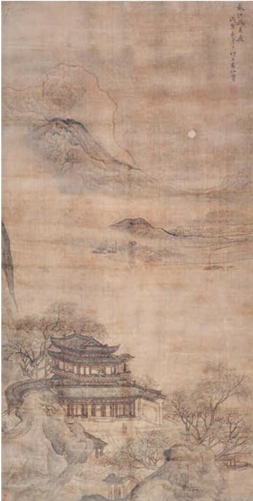

## 古诗词诵读

# 无  衣 a

《诗经·秦风》

岂曰无衣？与子同袍 b。

王于兴师c，修我戈矛，与子同仇d。

岂曰无衣？与子同泽e。

王于兴师，修我矛戟，与子偕作f。

岂曰无衣？与子同裳。

王于兴师，修我甲兵g，与子偕行。

《无衣》产生于秦地。该诗反复咏唱：怎么能说没有衣服穿呢？我的衣服跟你共享。修好我们的铠甲和兵器，我跟你一同奔赴战场。诗歌既表现了慷慨赴敌、同仇敌忾的豪情，也表现了战士之间深厚的情谊。朱熹评价这首诗，强调它体现了秦人“尚气概，先勇力，忘生轻死”的气魄和“与子同仇”的“欢爱之心”（《诗集传》）。诵读这首诗，注意体会质朴诗句中蕴含的真挚情感。

## 春江花月夜 a

张若虚

春江潮水连海平，海上明月共潮生。  
滟滟b 随波千万里，何处春江无月明c。  
江流宛转绕芳甸d，月照花林皆似霰e。  
空里流霜f 不觉飞，汀上白沙看不见。  
江天一色无纤尘，皎皎空中孤月轮。  
江畔何人初见月？江月何年初照人？人生代代无穷已，江月年年望相似。  
不知江月待何人，但见长江送流水。  
白云一片去悠悠，青枫浦g 上不胜愁。  
谁家今夜扁舟子h ？何处相思明月楼i ？可怜楼上月裴回j，应照离人k 妆镜台。  
玉户帘中卷不去l，捣衣砧上拂还来。  
此时相望不相闻，愿逐月华m 流照n 君。  
鸿雁长飞光不度o，鱼龙潜跃水成文p。  
昨夜闲潭梦落花，可怜春半不还家。  
江水流春去欲尽，江潭落月复西斜。

斜月沉沉藏海雾，碣石潇湘a 无限路。

不知乘月几人归，落月摇情满江树b。

这首诗以月升、月悬、月斜、月落为线索，贯串叙事、写景、议论、抒情，把春、江、花、月、夜的景色和情理融为一体，空灵而美妙；而所有场景的转换都有内在的连续性，自然而流畅。毫无疑问，这一切是因为人的观照：人对美景的赏鉴和美景对人的情思的启发，自然的恒久与个体生命的短暂，游子的离情别绪和亲人的相思之苦，交互感发，让人心旌摇荡。诵读这首诗，感受诗人以月为核心意象营造出的空灵曼妙的意境，体会其中寄寓的情怀和哲思。

  
春江花月夜  ［清］袁江 作

# 将进酒 a

李 白

君不见黄河之水天上来，奔流到海不复回。君不见高堂b 明镜悲白发，朝如青丝暮成雪。人生得意c 须尽欢，莫使金樽d 空对月。天生我材必有用，千金散尽还复来。烹羊宰牛且为乐，会须e 一饮三百杯。

岑夫子，丹丘生，将进酒，杯莫停。与君歌一曲，请君为我倾耳听。钟鼓馔 玉f 不足贵，但愿长醉不愿醒。古来圣贤皆寂寞g，惟有饮者留其名。陈王h 昔 时宴平乐i，斗酒十千j 恣欢谑k。主人l 何为言少钱，径须沽取m 对君酌。五花 马n、千金裘o，呼儿p 将出q 换美酒，与尔同销r 万古愁。

李白怀才不遇，与友人岑勋、元丹丘登高宴饮，借酒抒情，一泄其寂寞的愁怀，由此产生了《将进酒》这首诗。诗中所云“天生我材必有用，千金散尽还复来”，以及“古来圣贤皆寂寞，惟有饮者留其名”，表达了怀才不遇的郁愤，传达出舍我其谁的自信；而“人生得意须尽欢”“会须一饮三百杯”“但愿长醉不愿醒”等语句，淋漓尽致地展现了诗人于穷愁之境中的狂放不羁。黄河奔流入海的宏大空间，无疑也暗示了时光流逝；“古来圣贤皆寂寞”的感叹，更使诗人的郁愤、失意之情具有了典型意义。诵读时，要细心体会诗人豪迈激昂的笔调，感受他虽人生失意却依然潇洒自信的胸怀。

# 江城子·乙卯正月二十日夜记梦

苏 轼

十年生死两茫茫b。不思量，自难忘。千里孤坟c，无处话凄凉。纵使相逢 应不识，尘满面，鬓如霜。　　夜来幽梦d 忽还乡。小轩窗e，正梳妆。相顾无 言，惟有泪千行。料得年年肠断处，明月夜，短松冈f。

生死相隔，深情难忘。这首悼亡词一开篇便抒发作者对妻子诚笃的感情。生死，是一种隔；妻子葬于千里外的故乡，是一种隔；岁月沧桑，即使相逢也认不出，又是一种隔；梦中还乡，四目相对，千言万语无从谈起，还是一种隔。在对梦境的淡淡追述中，将死别之悲、独处之苦、世路之艰写得极为沉痛。诵读这首词，留意细节描写，体会作者是如何把梦境的记述、对亡妻的思念和落拓的身世之感融合在一起的。