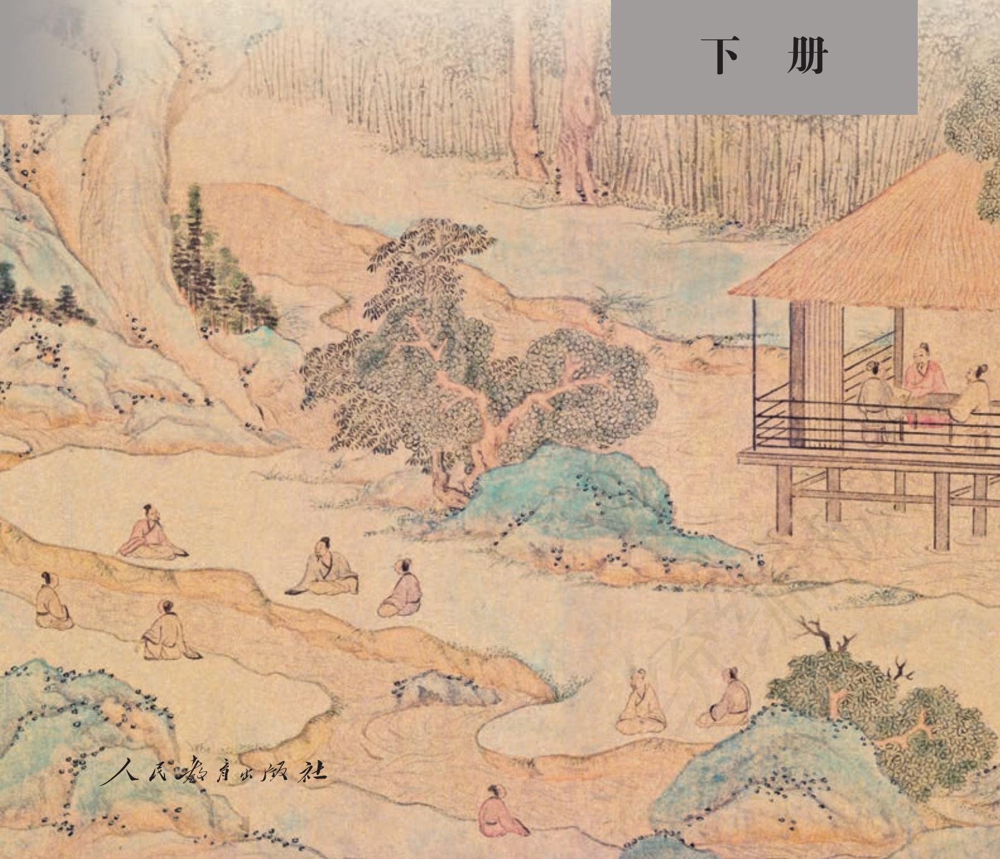

# 语文

选择性必修

普通高中教科书

# 语文

# 选择性必修

下册

教育部组织编写

总主编：温儒敏

本册主编：王立军朱于国

编写人员：（以姓氏笔画为序） 丁亚平李卫东汪锋张洁宇 陈尔杰胡星亮姜涛

责任编辑：覃文珍

美术编辑：房海莹

普通高中教科书语文选择性必修下册

教育部组织编写

出版人民教育出版社（北京市海淀区中关村南大街17号院1号楼 邮编：100081）  
网 址 http://www.pep.com.cn  
重 印 ×××出版社  
发 行 × × ×新华书店  
印刷 × × ×印刷厂  
版 次 2020年6月第1版年 月第 次印刷  
开 本 890 毫米 × 1 240 毫米 1/16  
印张7.5  
字 数 165 千字  
印数册  
书 号 ISBN 978-7-107-35025-2  
定价 元

版权所有·未经许可不得采用任何方式擅自复制或使用本产品任何部分·违者必究

如发现内容质量问题，请登录中小学教材意见反馈平台：jcyjfk.pep.com.cn

如发现印、装质量问题，影响阅读，请与×××联系调换。电话：×××-××××××××

## 目录

第一单元  
1 氓/《诗经·卫风》 2  
离骚（节选)/屈原 3  
2\*孔雀东南飞并序 7  
3 蜀道难/李白 14  
\*蜀相/杜甫 16  
4\*望海潮（东南形胜)/柳永 17  
\*扬州慢（淮左名都)/姜夔 18  
单元研习任务 20  
第二单元 21  
5 阿Q正传（节选)/鲁迅 22  
\*边城（节选)/沈从文 29  
6 大堰河——我的保姆/艾青 41  
\*再別康桥/徐志摩 4547  
7 一个消逝了的山村/冯至  
\*秦腔/贾平凹 50  
8 茶馆（节选)/老舍 55  
单元研习任务 67  
第三单元 69  
9 陈情表/李密 统编版 70  
\*项脊轩志/归有光 72  
10 兰亭集序/王羲之 75  
归去来兮辞并序/陶渊明 77  
11\*种树郭橐驼传/柳宗元 81  
12\*石钟山记/苏轼 83  
单元研习任务 85  
第四单元 87  
13 自然选择的证明/达尔文 88  
\*宇宙的边疆/卡尔·萨根 94  
14\*天文学上的旷世之争/关增建 101  
单元研习任务 109  
古诗词诵读 111  
拟行路难（其四)/鲍照 111  
客至/杜甫 112  
登快阁/黄庭坚 113  
临安春雨初霁/陆游 114