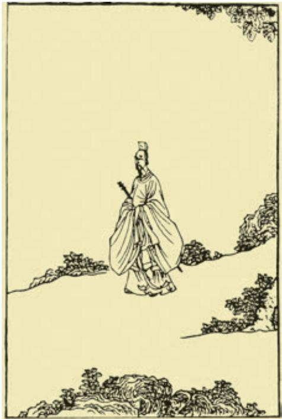

中国的古典诗歌源远流长，名家辈出，体式多样，风格各异。让我们从源头出发，顺流而下，欣赏不同时期各具特色的诗歌名作。

《诗经》和《楚辞》是古典诗歌的源头，分别开启了现实主义和浪漫主义两大文学传统；汉乐府继承《诗经》开创的现实主义传统，在叙事诗方面取得了很高的成就，《孔雀东南飞》就是其中的杰出代表；唐诗是古典诗歌发展史上的又一高峰，李白和杜甫各领风骚；词是古典诗歌的新发展，到了宋代，词境逐渐拓展，技巧日臻成熟。通过本单元的研习，可以增进对古典诗歌体式和源流的了解。

学习本单元，要围绕“诗意的探寻”展开研习，品味诗歌之美，感受古人的哀乐悲欢，把握诗歌蕴含的传统文化精神，认识古典诗歌的当代价值。还要结合以前所学，了解我国古典诗歌的发展脉络，并比较不同体裁的诗歌在节奏韵律、表现手法、艺术风格等方面的异同。

## 氓 a

《诗经·卫风》

氓之蚩蚩b，抱布贸c丝。匪d来贸丝，来即我谋e。送子涉淇f， 至于顿丘g。匪我愆期h，子无良媒。将i子无怒，秋以为期。

乘j 彼垝垣k，以望复关l。不见复关，泣涕涟涟。既见复关， 载m 笑载言。尔卜尔筮n，体o无咎言p。以尔车来，以我贿q迁。

桑之未落，其叶沃若r。于嗟鸠兮，无食桑葚s ！于嗟女兮，无与士耽t ！士之耽兮，犹可说u也。女之耽兮，不可说也！

桑之落矣，其黄而陨v。自我徂w 尔，三岁食贫x。淇水汤 汤y，渐z 车帷裳@7。女也不爽@8，士贰@9其行。士也罔极#0，二三 其德#1。

三岁为妇，靡室劳矣a。夙兴夜寐，靡有朝矣b。言c 既遂d 矣，至于暴矣。兄弟不知，咥e其笑矣。静言思之，躬自悼f矣。

及g 尔偕老，老使我怨h。淇则有岸，隰则有泮i。总角之宴j， 言笑晏晏k。信誓旦旦l，不思其反m。反是不思n，亦已焉哉o ！

离骚p（节选）

屈 原

帝高阳之苗裔兮，朕皇考曰伯庸q。摄提贞于孟陬兮，惟庚寅吾以降r。皇览揆余初度兮，肇锡余以嘉名s。名余曰正则兮，字余曰灵均。

  
屈子行吟图 ［明］陈洪绶 作

纷吾既有此内美兮，又重之以修能a。扈江离与 辟芷兮，纫秋兰以为佩b。汩c 余若将不及兮，恐年 岁之不吾与d。朝搴阰之木兰兮，夕揽洲之宿莽e。 日月忽f 其不淹g 兮，春与秋其代序h。惟草木之 零落兮，恐美人i 之迟暮。不抚壮而弃秽兮，何不改 此度j ？乘骐骥以驰骋兮，来吾道夫先路k ！

## …………

长太息l 以掩涕m 兮，哀民生n 之多艰。余虽 好修姱以 羁兮，謇朝谇而夕替o。既替余以蕙 兮，又申之以揽茝p。亦余心之所善兮，虽九死其 犹未悔。怨灵修q 之浩荡r 兮，终不察夫民心s。众 女嫉余之蛾眉兮，谣诼谓余以善淫t。固时俗之工巧 兮，偭规矩而改错u。背绳墨以追曲兮，竞周容以为 度a。忳郁邑余侘傺兮，吾独穷困乎此时也b。宁溘c 死以流亡d 兮，余不忍为此态e 也！鸷鸟之不群f 兮，自前世而固然。何方圜 之能周兮，夫孰异道而相安g ？屈心而抑志兮，忍尤而攘诟h。伏 清白以死直兮，固前圣之所厚i。

悔相道之不察兮，延伫乎吾将反j。回朕车以复路兮，及行迷 之未远k。步余马于兰皋兮，驰椒丘且焉止息l。进不入以离尤兮， 退将复修吾初服m。制芰荷n 以为衣兮，集芙蓉以为裳。不吾知其 亦已兮，苟余情其信芳o。高余冠之岌岌兮，长余佩之陆离p。芳 与泽其杂糅兮，唯昭质其犹未亏q。忽反顾以游目r 兮，将往观乎 四荒。佩缤纷其繁饰兮，芳菲菲其弥章s。民生各有所乐兮，余独好 修以为常t。虽体解吾犹未变兮，岂余心之可惩u ？

《诗经》和《楚辞》在我国文学史上地位崇高，影响深远，后人将其艺术精神概称为“风骚”。本课选取《诗经·卫风》中的《氓》和《楚辞》中的《离骚》，学习时要注意比较作品不同的艺术风格，认识中国诗歌的抒情传统。两首诗都运用了比兴的手法，诵读时要注意品味相关诗句，体会其表达效果。

《氓》以一个女子的口吻讲述自己从恋爱、结婚到被抛弃的过程，展示了她从情意绵绵到悲伤无助，再到激愤决绝的心路历程，将叙事与抒情巧妙地结合起来。诵读时，要仔细体会女主人公心理的前后变化，感受诗歌“怨而不怒，哀而不伤”（《论语·八佾》）的抒情特征。

《离骚》（节选）中，诗人自叙其身世、遭遇，表达了对高洁人格的坚守和对高远理想的追求，并将个人命运与国家兴衰紧紧联系在一起。学习时不妨结合《屈原列传》，把握诗歌中“香草美人”的象征意义，体味诗人的情志。诵读时，要注意诗中繁复的意象、回旋复沓的表达、独特的节奏韵律，感受其中澎湃激荡的情感。

背诵《离骚》（节选）第3段。

诗者，志之所之也。在心为志，发言为诗。情动于中而形于言。言之不足，故嗟叹之；嗟叹之不足，故咏歌之；咏歌之不足，不知手之舞之，足之蹈之也。

——《毛诗序》

若乃春风春鸟，秋月秋蝉，夏云暑雨，冬月祁寒，斯四候之感诸诗者也。嘉会寄诗以亲，离群托诗以怨。至于楚臣去境，汉妾辞宫；或骨横朔野，或魂逐飞蓬；或负戈外戍，或杀气雄边；塞客衣单，孀闺泪尽；或士有解佩出朝，一去忘返；女有扬蛾入宠，再盼倾国。凡斯种种，感荡心灵，非陈诗何以展其义，非长歌何以骋其情。故曰：“诗可以群，可以怨。”

——锺嵘《诗品序》

感人心者，莫先乎情，莫始乎言，莫切乎声，莫深乎义。《诗》者，根情，苗言，华声，实义。

——白居易《与元九书》