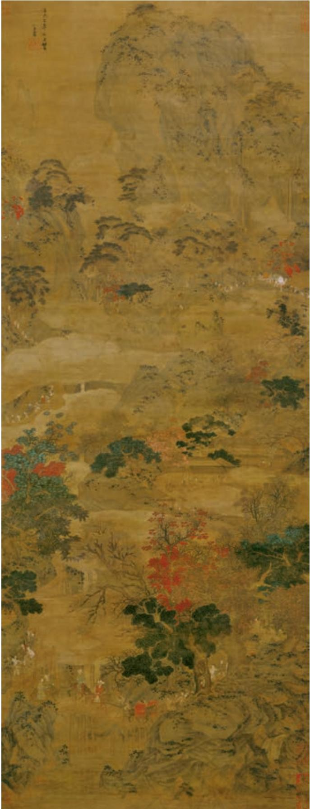

# 蜀道难 a

李 白

噫吁嚱b，危乎高哉！蜀道之难，难于上青天！蚕丛及鱼凫c， 开国何茫然d ！尔来e 四万八千岁，不与秦塞f 通人烟。西当太 白有鸟道g，可以横绝h 峨眉巅。地崩山摧壮士死i，然后天梯石 栈j 相钩连。上有六龙回日之高标k，下有冲波逆折之回川l。黄 鹤m 之飞尚不得过，猿猱n 欲度愁攀援。青泥o 何盘盘p，百步九 折萦岩峦。扪参历井q 仰胁息r，以手抚膺坐s 长叹。

问君西游t 何时还？畏途 岩u 不可攀。但见悲鸟号古木，雄飞雌从绕林间。又闻子规啼夜月，愁空山。蜀道之难，难于上青天，使人听此凋朱颜v ！连峰去天不盈尺，枯松倒挂倚绝壁。飞湍a 瀑流争喧豗b，砯崖转石万壑雷c。其险也如此，嗟尔远道之人胡为乎来哉d ！

剑阁e 峥嵘而崔嵬，一夫当关， 万夫莫开f。所守或匪亲，化为狼与 豺g。朝避猛虎，夕避长蛇，磨牙 吮血，杀人如麻。锦城虽云乐，不 如早还家。蜀道之难，难于上青天， 侧身西望长咨嗟h ！

蜀道难图 ［元］赵孟 作

# 蜀  相 a

杜 甫

丞相祠堂b 何处寻？锦官城外柏森森。  
映阶碧草自春色，隔叶黄鹂空好音c。  
三顾频烦天下计d，两朝开济e 老臣心。  
出师未捷身先死f，长使英雄泪满襟。

## 学习提示

唐诗是中华民族宝贵的文化遗产，李白、杜甫是两位具有代表性的伟大诗人。李白擅长古体诗；杜甫诸体皆擅，在律诗方面成就尤高。

《蜀道难》是杂言古体诗，格律不拘，形式灵活。这首诗想象奇特，笔意纵横，境界阔大，集中体现了李白诗歌豪放飘逸的创作特点。诵读时，一方面要感受杂言古体诗的参差错落之美，另一方面要想象作者笔下蜀道的雄奇险峻，体会李白诗歌的浪漫主义风格。

《蜀相》是七言律诗，结构严整，法度森然。这首诗抒写作者游览武侯祠的所见所感，表达了对诸葛亮才干、德行的称颂及对其“出师未捷身先死”的惋惜，也暗含着感时忧国的情怀和以身许国的抱负。全诗情感深沉悲壮，有厚重的历史感。学习时要反复诵读涵泳，并联系《出师表》等文，加深对诗人情志的理解。

背诵课文。

d〔三顾频烦天下计〕指刘备为统一天下三顾茅庐，问计于诸葛亮。频烦，即频繁。一说多次烦劳咨询。