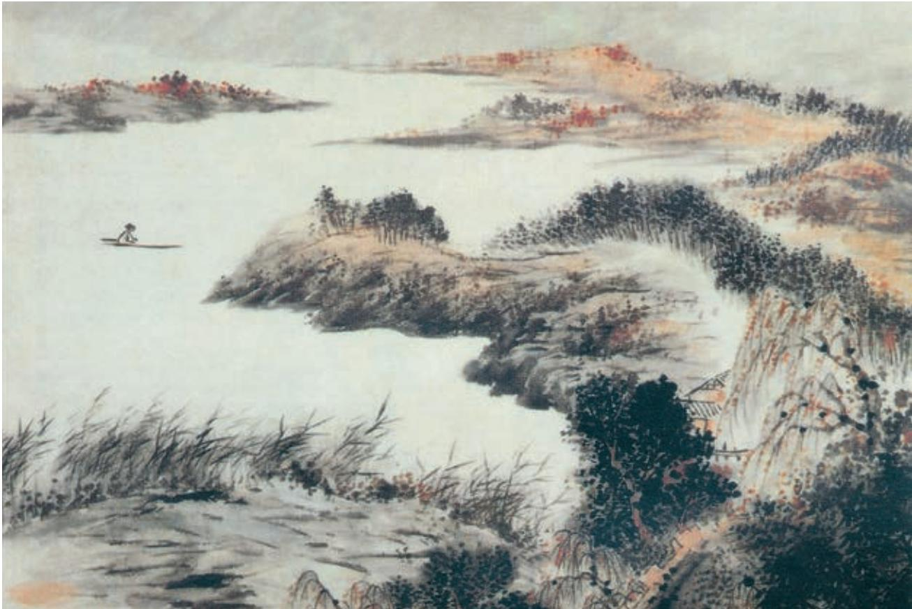

# 望海潮 a

柳 永

东南形胜b，三吴c 都会，钱塘d 自古繁华。烟柳画桥e，风帘 翠幕f，参差十万人家。云树g 绕堤沙，怒涛卷霜雪h，天堑i 无 涯。市列珠玑j，户盈罗绮k，竞豪奢。 重湖l 叠 清嘉，有 三秋m 桂子n，十里荷花。羌管弄晴，菱歌泛夜o，嬉嬉p 钓叟莲 娃q。千骑拥高牙r，乘醉听箫鼓，吟赏烟霞s。异日图将t 好景， 归去凤池夸 u。

  
钱塘秋潮图（局部） ［南宋］佚名 作

a 选自《乐章集校注》中编（中华书局2015年版）。望海潮，词牌名。这首词为赠两浙转运使孙何之作。柳永（约987—约1053），字耆卿，原名三变，崇安（今属福建）人，北宋词人。

b〔形胜〕地理形势优越。

c〔三吴〕指吴兴（今浙江湖州）、吴郡（今江苏苏州）、会稽（今浙江绍兴）。

d〔钱塘〕今浙江杭州，旧属吴郡。

e〔烟柳画桥〕如烟的柳树，雕饰华丽的桥。

f〔风帘翠幕〕遮挡门窗的帘子与青绿色的帷幕。

g〔云树〕高耸入云的树木。

h〔怒涛卷霜雪〕指汹涌的波涛卷起如霜似雪的白色浪花。

i〔天堑〕天然壕沟。这里指钱塘江。

j〔珠玑〕珠宝。玑，不圆的珠。

k〔罗绮〕绫罗绸缎。

l〔重湖〕指西湖，分里湖、外湖。

m〔三秋〕指农历九月。

n〔桂子〕桂花。

o〔羌管弄晴，菱歌泛夜〕羌笛在晴空下吹奏，采菱的歌声在夜空中飘荡。

p〔嬉嬉〕戏乐的样子。

q〔莲娃〕采莲女。

r〔高牙〕牙旗，将军之旗。这里借指孙何。

s〔吟赏烟霞〕指吟咏欣赏山水景色。

t〔图将〕描绘。将，助词，用于动词之后，无实义。

u〔归去凤池夸〕意思是，回到朝廷，夸耀杭州的美景。这是委婉称扬孙何因政绩卓著，将入朝执政。凤池，即凤凰池，原指禁苑中的池沼，代指最高行政机关中书省。

# 扬州慢 a

姜 夔

淳熙丙申至日b，予过维扬c。夜雪初霁d，荠麦e 弥望。 入其城则四顾萧条，寒水自碧。暮色渐起，戍角f 悲吟。予 怀怆然，感慨今昔，因自度g 此曲。千岩老人h 以为有黍离 之悲 i 也。

  
淮扬洁秋图（局部） ［清］石涛 作

f〔戍角〕指驻防部队的号角。

g〔度〕谱写，作曲。

h〔千岩老人〕南宋诗人萧德藻的自号。姜夔娶其侄女为妻，并跟他学诗。

i〔黍离之悲〕指故国残破的悲思。《黍离》，《诗经·王风》中的一首诗。《毛诗序》称，周大夫见故都的宗庙宫室倾覆，遗址上长满了茂盛的黍子，于是写了《黍离》一诗表达自己的忧伤。

j〔红药〕芍药花。

淮左a 名都，竹西b 佳处，解鞍少驻c 初程。过春风十里d， 尽荠麦青青。自胡马窥江e 去后，废池乔木，犹厌言兵。渐黄昏， 清角f 吹寒，都在空城。 杜郎俊赏g，算而今，重到须惊。纵 豆蔻词工，青楼梦好，难赋深情h。二十四桥i 仍在，波心荡，冷 月无声。念桥边红药j，年年知为谁生？

## 学习提示

这两首宋词都以城市为表现对象，一写承平盛世，一写劫后孤城，内容不同，意趣亦相异。《望海潮》开头总览杭州的优越位置和悠久历史，接着描绘此地风景的优美、市井的繁华以及人民生活的平和安乐。这首词采用铺叙的写法，以点带面，虚实相间，渲染烘托，形成一种畅达流利的气势。同样是歌咏城市，《扬州慢》则聚焦于扬州今昔盛衰的对比。词人一面描摹眼前景象，一面想象杜牧重游故地的震惊和悲哀，强化了兵火劫后的沉痛心情。

柳永和姜夔都是深谙音律的词人，《望海潮》和《扬州慢》的词牌分别为二人首创，两首词作也极富声韵之美。诵读时要细加体会。

使杜牧能极为工巧地描绘扬州的妙龄少女和青楼之梦，也难以表达对扬州遭劫的悲痛之情。杜牧诗《赠别》（其一）有“娉娉袅袅十三余，豆蔻梢头二月初”之语，《遣怀》有“十年一觉扬州梦，赢得青楼薄幸名”之语。

i〔二十四桥〕指吴家砖桥，因古有二十四位美人吹箫于此，故名。一说，扬州在唐时极为富盛，著名的桥有二十四座，故名。杜牧诗《寄扬州韩绰判官》有“二十四桥明月夜，玉人何处教吹箫”之语。