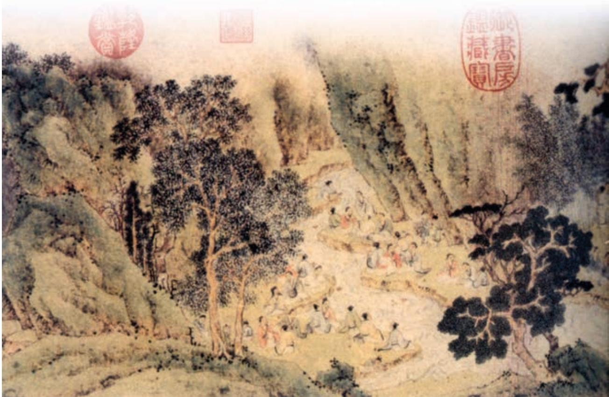
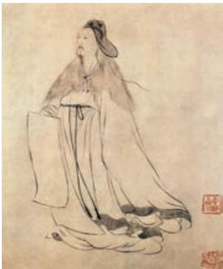
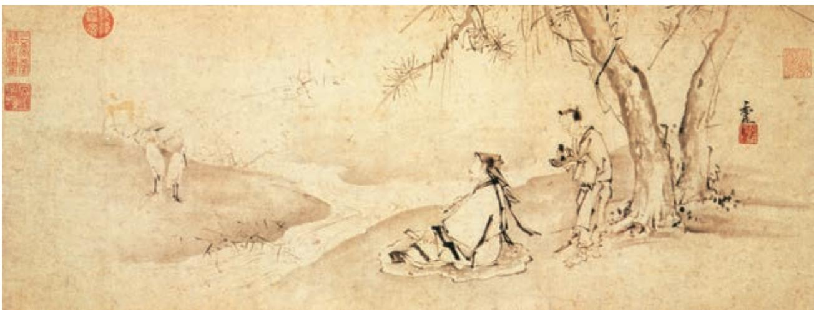

# 兰亭集序 a

王羲之

永和九年，岁在癸丑b，暮春之初，会于会稽山阴之兰亭， 修禊c 事也。群贤毕d 至，少长咸e 集。此地有崇山峻岭，茂林 修竹f，又有清流激湍，映带g 左右，引以为流觞曲水h，列坐 其次i。虽无丝竹管弦之盛，一觞一咏，亦足以畅叙幽情j。

是日也，天朗气清，惠风k 和畅。仰观宇宙之大，俯察品类l之盛，所以游目骋怀m，足以极视听之娱，信可乐也。

夫人之相与，俯仰一世n。或取诸怀抱，悟言一室之内o ；或 因寄所托，放浪形骸之外p。虽趣舍万殊q，静躁r 不同，当其欣 于所遇s，暂得于己t，快然自足u，不知老之将至v ；及其所之 既倦a，情随事迁b，感慨系之c 矣。向之所欣，俯仰之间，已为 陈迹，犹d 不能不以之兴怀e，况修短随化f，终期于尽g ！古人 云：“死生亦大矣h。”岂不痛哉!

每览昔人兴感之由i，若合一契j，未尝不临文嗟悼k，不能喻之于怀l。固知一死生为虚诞，齐彭殇为妄作m。后之视今，亦犹今之视昔，悲夫！故列叙时人n，录其所述，虽世殊事异，所以兴怀，其致o 一也。后之览者，亦将有感于斯文。

兰亭修禊图（局部）  ［明］文征明 作

a﹝所之既倦〕（对于）所喜爱或得到的已经厌倦。之，求得。

b﹝情随事迁〕感情随着情况的变化而变化。

c﹝感慨系之〕感慨随着这种变化而有所不同。系，连接。

d﹝犹〕尚且。

e﹝以之兴怀〕因它而引起心中的感触。以，因。之，指“向之所欣……已为陈迹”。兴，发生、引起。

f﹝修短随化〕寿命长短，听凭造化。化，指自然。

g﹝终期于尽〕终究归结于消灭。

h﹝死生亦大矣〕死生是一件大事。语出《庄子·德充符》。

i﹝每览昔人兴感之由〕每当看到古人（对死生）发生感慨的原因。

j﹝若合一契〕像符契那样相合（意思是发生感触的原因相同）。契，即符契，古代符信的一种，以金玉竹木等制成，上刻文字，分成两半，合在一起可为凭验。

k﹝嗟悼〕叹息哀伤。悼，悲伤。

l﹝不能喻之于怀〕不能明白于心。意思是，看到古人对死生发生感慨的文章，就为此悲伤感叹，也说不出是什么原因。喻，明白。一说是消解、释怀的意思。

m﹝固知一死生为虚诞，齐彭殇（shāng）为妄作〕就知道把死和生等同起来的说法是不真实的，把长寿和短命等同起来的说法是虚妄之谈。固，乃。一，把……看作一样。齐，把……看作相等。虚诞，虚妄荒诞。彭，即彭祖，传说他曾活到八百岁。殇，未成年而死去的人。妄作，虚妄之谈。一死生、齐彭殇，都是《庄子·齐物论》中的看法。

n﹝列叙时人〕一个一个记下当时与会的人。

o﹝致〕意态，情趣。

# 归去来兮辞并序 a

陶渊明

余家贫，耕植b 不足以自给c。幼稚盈室d，瓶无储 粟e，生生所资f，未见其术g。亲故多劝余为长吏h，脱 然i 有怀j，求之靡途k。会有四方之事l，诸侯以惠爱为 德m，家叔n 以余贫苦，遂见用于小邑。于时风波未静o， 心惮远役p，彭泽q 去家百里，公田r 之利，足以为酒。 故便求之。及少日，眷然有“归欤”之情s。何则t ？质 性u 自然，非矫厉v 所得。饥冻虽切，违己w 交病x。尝从 人事y，皆口腹自役z。于是怅然慷慨@7，深愧平生之志。 犹望一稔@8，当敛裳宵逝@9。寻程氏妹#0丧于武昌，情在骏 奔#1，自免去职。仲秋至冬，在官八十余日。因事顺心#2， 命篇曰《归去来兮》。乙巳#3岁十一月也。

  
陶渊明像  ［明］王仲玉 作

归去来兮，田园将芜a 胡不归？既自以心为形役b，奚c 惆怅 而独悲？悟已往之不谏，知来者之可追d。实迷途其未远e，觉今 是而昨非。舟遥遥以轻飏f，风飘飘而吹衣。问征夫以前路g，恨 晨光之熹微 h。

乃瞻衡宇i，载欣载奔j。僮仆欢迎，稚子候门。三径就荒k， 松菊犹存。携幼入室，有酒盈樽。引壶觞以自酌，眄庭柯以怡 颜l。倚南窗以寄傲m，审容膝之易安n。园日涉以成趣o，门虽设 而常关。策扶老以流憩p，时矫首而遐观q。云无心以出岫r，鸟 倦飞而知还。景翳翳以将入s，抚孤松而盘桓t。

归去来兮，请息交以绝游u。世与我而相违，复驾言兮焉求v ？悦 亲戚之情话w，乐琴书以消忧。农人告余以春及x，将有事于西畴y。 或命巾车z，或棹孤舟@7。既窈窕以寻壑@8，亦崎岖而经丘@9。木欣欣 以向荣，泉涓涓而始流。善万物之得时#0，感吾生之行休#1。

p﹝策扶老以流憩〕拄着拐杖出去，到处走走，随时随地休息。策，拄着。扶老，拐杖。流憩，指无目的地漫步和随时随地休息。

q﹝时矫首而遐观〕常常抬起头遥望远方。矫，举。遐观，远望。

r﹝云无心以出岫（xiù）〕云气自然而然地冒出山头。 无心，无意。岫，峰峦。

s﹝景翳翳以将入〕阳光黯淡，太阳快要下山了。景，日光。翳翳，阴暗的样子。入，指太阳下山。

u﹝请息交以绝游〕让我同外界断绝交游。

v﹝复驾言兮焉求〕还要驾车出去追求什么？驾言，驾车出游。《诗经·邶风·泉水》有“驾言出游”之语。驾，驾车。言，助词。

w﹝情话〕知心话。

x﹝春及〕春天到了。

y﹝将有事于西畴（chóu）〕将要到西边的田里去春耕。事，指耕种之事。畴，田地。

z﹝或命巾车〕有时坐着有帷幕的小车。命，命人备置。巾车，外面覆盖着帷幕的小车。

@7﹝或棹孤舟〕有时划着一只小船。

@8﹝窈窕以寻壑（hè）〕沿着幽深曲折的山谷。窈窕，幽深的样子。寻，循着。

@9﹝崎岖而经丘〕经过道路崎岖的山丘。

#0﹝善万物之得时〕羡慕万物恰逢繁荣滋长的好时节。善，羡慕。得时，顺应天时。

#1﹝感吾生之行休〕感叹我的一生将要结束。行，将要。休，终结。

已矣乎a ！寓形宇内复几时b ？曷不委心任去留c ？胡为乎 遑遑欲何之d ？富贵非吾愿，帝乡不可期e。怀良辰以孤往f，或 植杖而耘耔g。登东皋以舒啸h，临清流而赋诗。聊乘化以归尽i， 乐夫天命复奚疑 j ！

  
临清流而赋诗图  ［明］李在 作

## 学习提示

王羲之纵情山水，叹死生之至大；陶渊明辞官返乡，欲乘化而归尽。从雅集欢会、山水田园中，他们领悟到生命的哲理，体现了魏晋文士的旷达和善思。

《兰亭集序》从文人雅集写起，寥寥数语，将良辰美景、赏心乐事写得韵味悠长。但描写曲水流觞之乐并非作者的真正意图，他很快沉浸到对暂与久、悲与欢、生与死等问题的思考中，发出了一连串的叹息。阅读时要循着作者的思路，理解他富于哲理的思考，感受文章情理交融的特点。魏晋时期道家思想流行，王羲之也深受影响，在本文中他对庄子的生死观有取有舍，阅读时注意体会其中的深意。

《归去来兮辞（并序）》的“序”以散体叙事，“辞”以骈体抒情，二者相得益彰。“辞”的部分是阅读的重点。作者反复铺陈、连续咏叹，抒写自己回归田园、重返自然的欢愉，也透露出对自我与世俗、生命与自然的思考。阅读时要注意理解作品所呈现的情感状态和人生境界，感受其骈偶押韵的语言特色。

魏晋时期，文坛上已开始流行雕饰堆砌之风，这两篇文章却堪称其中的清流：虽然也锤炼语言，却不追求藻饰，不滥用典故，以淡雅生动为本；文辞精致，佳句甚多，却又不失素朴自然之美。研习时可反复诵读，涵泳品味。

古代诗文中常常使用一些对偶句，如“仰观宇宙之大，俯察品类之盛”“悟已往之不谏，知来者之可追”。句中处于相同位置上的词语，语义往往相近或相反，如前例“观”与“察”，“谏”与“追”，“大”与“盛”，两两相对，意思相近。借助这一特点，在阅读陌生文本时，我们可以由已知推未知，如由“追”推知“谏”的可能含义，再借助上下文，大致确定某个词语的准确含义。找出这两篇文章中的对偶句，认真体会。

背诵《兰亭集序》。