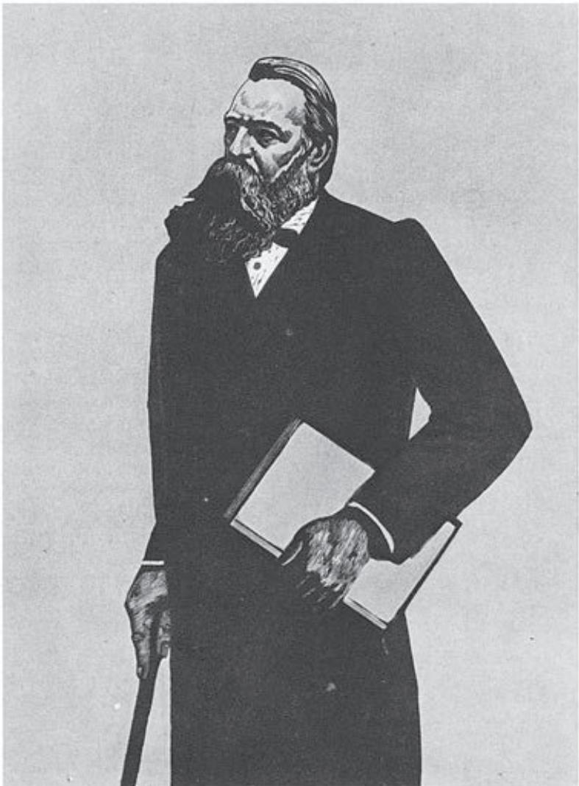

## 第一单元

理论对于实践有着巨大的指导意义。一个人理论素养越高，就越能在实践中见微知著，行稳致远。提高理论素养的重要途径之一是努力学习经典理论著作，特别是马克思主义理论著作。

本单元的文章，或阐释社会历史发展的规律，或论述学风改造的问题和正确思想的来源，或阐说真理的检验标准，或探讨个人立身处世的原则，这些都有助于加深我们对社会、历史和人生的认识。尤其是恩格斯、毛泽东的文章，体现了历史唯物主义和辩证唯物主义的世界观和方法论，具有重要的理论价值和实践指导意义。

学习本单元，要通过研读经典理论文章，获得思想启迪，提升思维品质。有些文章的历史背景比较复杂，要参考相关资料增进了解；阅读时要抓住主要概念，把握核心观点，理清论述思路，感受文章强大的思想力量；同时注意欣赏文章的论证艺术，体会语言表达的准确性和严密性。

# 社会历史的决定性基础

恩格斯

尊敬的先生：

对您的问题回答如下：

1. 我们视之为社会历史的决定性基础的经济关系，是指一定社会的人们生产生活资料和彼此交换产品（在有分工的条件下）的方式。因此，这里包括生产和运输的全部技术。这种技术，照我们的观点看来，也决定着产品的交换方式以及分配方式，从而在氏族社会解体后也决定着阶级的划分，决定着统治关系和奴役关系，决定着国家、政治、法等等。此外，在经济关系中还包括这些关系赖以发展的地理基础和事实上由过去沿袭下来的先前各经济发展阶段的残余（这些残余往往只是由于传统或惰性才继续保存着），当然还包括围绕着这一社会形式的外部环境。

如果像您所说的，技术在很大程度上依赖于科学状况，那么，科学则在更大得多的程度上依赖于技术的状况和需要。社会一旦有技术上的需要，这种需要就会比十所大学更能把科学推向前进。整个流体静力学（托里拆利b 等）是由于16世纪和17世纪意大利治理山区河流的需要而产生的。关于电，只是在发现它在技术上的实用价值以后，我们才知道了一些理性的东西。可惜在德国，人们撰写科学史时习惯于把科学看作是从天上掉下来的。

2. 我们把经济条件看作归根到底制约着历史发展的东西。而种族本身就是一种经济因素。不过这里有两点不应当忽视：

（a）政治、法、哲学、宗教、文学、艺术等等的发展是以经济发展为基础的。但是，它们又都互相作用并对经济基础发生作用。这并不是说，只有经济状况才是原因，才是积极的，其余一切都不过是消极的结果，而是说，这是在归根到底不断为自己开辟道路的经济必然性的基础上的相互作用。例如，国家就是通过保护关税、自由贸易、好的或者坏的财政制度发生作用的，甚至德国庸人的那种从1648—1830年德国经济的可怜状况a 中产生的致命的疲惫和软弱（最初表现为虔诚主义，而后表现为多愁善感和对诸侯贵族的奴颜婢膝），也不是没有对经济起过作用。这曾是重新振兴的最大障碍之一，而这一障碍只是由于革命战争和拿破仑战争b 把慢性的穷困变成了急性的穷困才动摇了。所以，并不像人们有时不加思考地想象的那样是经济状况自动发生作用，而是人们自己创造自己的历史，但他们是在既定的、制约着他们的环境中，是在现有的现实关系的基础上进行创造的，在这些现实关系中，经济关系不管受到其他关系——政治的和意识形态的——多大影响，归根到底还是具有决定意义的，它构成一条贯穿始终的、唯一有助于理解的红线。

  
恩格斯在新形势下捍卫和发展马克思主义（木刻）  李焕民 作

（b）人们自己创造自己的历史，但是到现在为止，他们并不是按照共同的意志，根据一个共同的计划，甚至不是在一个有明确界限的既定社会内来创造自己的历史。他们的意向是相互交错的，正因为如此，在所有这样的社会里，都是那种以偶然性为其补充和表现形式的必然性占统治地位。在这里通过各种偶然性来为自己开辟道路的必然性，归根到底仍然是经济的必然性。这里我们就来谈谈所谓伟大人物问题。恰巧某个伟大人物在一定时间出现于某一国家，这当然纯粹是一种偶然现象。但是，如果我们把这个人去掉，那时就会需要有另外一个人来代替他，并且这个代替者是会出现的，不论好一些或差一些，但是最终总是会出现的。恰巧拿破仑这个科西嘉人做了被本身的战争弄得精疲力竭的法兰西共和国所需要的军事独裁者，这是个偶然现象。但是，假如没有拿破仑这个人，他的角色就会由另一个人来扮演。这一点可以由下面的事实来证明：每当需要有这样一个人的时候，他就会出现，如凯撒a、奥古斯都b、克伦威尔c 等等。如果说马克思发现了唯物史观，那么梯叶里d、米涅e、基佐f 以及1850年以前英国所有的历史编纂学家则表明，人们已经在这方面作过努力，而摩尔根g 对于同一观点的发现表明，发现这一观点的时机已经成熟了，这一观点必定被发现。

历史上所有其他的偶然现象和表面的偶然现象都是如此。我们所研究的领域越是远离经济，越是接近于纯粹抽象的意识形态，我们就越是发现它在自己的发展中表现为偶然现象，它的曲线就越是曲折。如果您画出曲线的中轴线，您就会发现，所考察的时期越长，所考察的范围越广，这个轴线就越是接近经济发展的轴线，就越是同后者平行而进。

在德国，达到正确理解的最大障碍，就是著作界对于经济史的不负责任的忽视。不仅很难抛掉学校里灌输的那些历史观，而且更难搜集为此所必需的材料。例如，老古·冯·居利希a 在自己的枯燥的材料汇集中的确收集了能够说明无数政治事实的大量材料，可是他的著作又有谁读过呢！

此外，我认为马克思在《雾月十八日》b 一书中所作出的光辉范例，能对您的问题给予颇为圆满的回答，正是因为那是一个实际的例子。我还认为，大多数问题都已经在《反杜林论》第一编第九至十一章、第二编第二至四章和第三编第一章或导言里，后来又在《费尔巴哈》c 最后一章里谈到了。

请您不要过分推敲上面所说的每一句话，而要把握总的联系；可惜我没有时间能像给报刊写文章那样字斟句酌地向您阐述这一切。

请代我向……d 先生问好并代我感谢送来的……e，它使我十分高兴。

致以崇高的敬意。

您的 弗·恩格斯

## 学习提示

上层建筑由什么力量决定？历史的发展主要受什么因素制约？对此，马克思曾指出，经济基础是决定性因素。但是，马克思逝世之后，一些资产阶级理论家歪曲了马克思的观点，篡改了历史唯物主义的基本原理，把马克思关于经济因素决定性作用的观点歪曲为“经济决定一切”、经济是制约历史发展的唯一因素，造成当时德国青年极大的思想混乱。他们当中有不少人写信向恩格斯请教，大学生瓦尔特·博尔吉乌斯就是其中一位。

恩格斯给瓦尔特·博尔吉乌斯的回信针对当时资产阶级理论家对马克思思想的歪曲，以丰富的历史知识和辩证的理论分析，论述了经济因素与历史发展、上层建筑的关系，指出经济关系是“社会历史的决定性基础”，“归根到底制约着历史发展”；政治、法、哲学、宗教、文学、艺术等上层建筑的发展是“以经济发展为基础的”，但“它们又都互相作用并对经济基础发生作用”；经济不是制约历史发展和上层建筑的唯一因素。恩格斯的这封回信澄清了一些重大理论问题，充分体现了马克思主义的辩证唯物史观，这是我们学习这封信所要掌握的重点内容。

学习恩格斯这封信，要了解恩格斯写这封信的背景和针对性，抓住文中的基本观点，思考这些观点之间的逻辑关系。同时，要学习恩格斯论述问题的辩证思维和严密的逻辑性，学会总体把握，像恩格斯在信中所说的“不要过分推敲上面所说的每一句话，而要把握总的联系”。