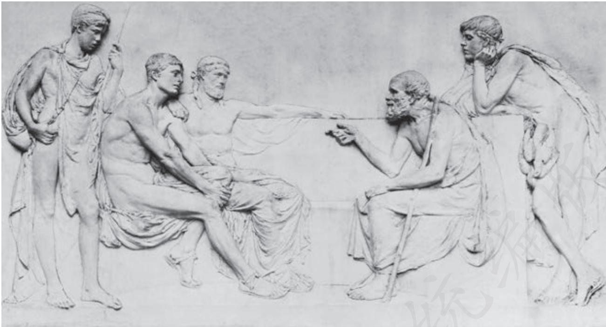

# 人应当坚持正义

柏拉图

## 苏格拉底

亲爱的格黎东啊，你对我的关怀如果合乎正道，那是非常可贵的；如果不合，那就越关心越难从命了。我们首先必须考虑是不是应当照你说的那样做b。因为我不但现在奉行，而且一贯遵守的原则是听从道理，凡是经过研究见到无可非议的道理我就拳拳服膺c。我不能由于遇到灾难就把自己所讲过的道理抛开，我认为那些道理还跟过去一样真实，我仍旧跟过去一样重视它们，尊重它们。如果我们在现在的情况下不能说出更强的道理来，我是肯定不会对你让步的，哪怕众人对我施加更大的恫吓d，如同以妖怪吓儿童那样，声称要监禁、处死、没收财产等等。现在我们能够怎样研究最恰当呢？首先可以提起你对意见所说的那些话，看看我们是不是有理由说有些意见我们应该注意，也有些意见我们应该不考虑。是不是在我被判死刑前这话说得对，到现在就显然成了空谈，无非是戏言和废话而已？我希望和你一道弄明白，在我现在的情况下，格黎东啊，我们说的那个道理究竟是变了，还是仍然有效，究竟是应当放弃，还是必须遵从。那些思想严谨的人，曾经多次断言在人们的意见中间有些必须高度重视，有些不必理会，像我刚才说的那样。格黎东啊，神灵在上，你不觉得他们说得对吗？从人情上说，你并没有明天就要死掉的危险，你的判断不应该为那种局面所左右。请你考虑一下，你认为我们该不该说，我们不必尊重人们的一切意见，有些意见要重视，有些就没有必要，也不必听从所有的人的意见，有些人的要听，有些人的不必听？你以为如何？这话说得不对吗？

格 黎 东 说得很对。

苏格拉底 那就该重视好的意见，不管那些坏的意见吗？

格 黎 东 是的。

苏格拉底 好的意见不就是明白人的意见，坏的意见不就是糊涂人的意见吗？

格 黎 东 当然是。

苏格拉底 在这方面，我们该怎么说呢？一个从事体育锻炼并且以此为业的人，是重视一般人的赞美、责备和看法，还是只听从一个人，即医生或教练的褒贬意见？

格 黎 东 只听从一个人的。

苏格拉底 那他就该畏惧那一个人的责备，喜爱那一个人的赞美，而不理会众人之见啰？

格 黎 东 很明显。

苏格拉底 那他就该照着那一位主管和内行的意思行动、锻炼、喝水、吃东西，不用理会别人的想法啰？

格 黎 东 就是。

苏格拉底 很好。他如果不服从那一位内行，不理睬他的意见和赞许，而听信另外一些外行的话，不是要遭到损害吗？

格 黎 东 怎么不是呢？

苏格拉底 什么损害呀？哪方面的损害？损害那个不服从者的什么部分？

格 黎 东 显然是他的身体，因为遭殃的是这个部分。

苏格拉底 你说得对。别的事情岂不也是这样吗，格黎东？我们用不着一一枚举，可以总起来看。例如正义和不正义，丑和美，好和坏，这都是我们现在所考虑的事情。在这些事情上我们是应当听从众人的意见，对众人的意见诚惶诚恐，还是应当只听那一个内行的，对他毕恭毕敬胜于他人？我们如果不听他的，就会损伤我们那个为道义所改善、为不义所毁灭的部分。难道不是这样吗？

格 黎 东 我想是这样，苏格拉底。

苏格拉底 很好。如果我们由于听从外行的意见而毁掉了我们那个为健康所改善、为疾病所破坏的部分，在这个部分毁掉之后我们还能活吗？这个部分就是身体，对吗？

格 黎 东 对的。

苏格拉底 身体坏了、毁了，我们还能活吗？

格 黎 东 不能。

苏格拉底 如果那个为道义所改善、为不义所毁灭的部分毁了，我们还能活吗？那一个部分，不管叫什么，是我们的那个与道义和不义有关的部分，我们认为它比身体差吗？

格 黎 东 不。

苏格拉底 比身体贵重吗？

格 黎 东 贵重得多。

苏格拉底 我最好的朋友啊，那我们就不能听从众人对我们的说法，只能听从那一个深知道义和不义的人的说法，听从真理本身了。所以，你一起头的提法是不对的，你说我们应当考虑关于正义、美、好及其反面的意见。也许可以说，众人是有权置我们于死地的。

格 黎 东 这很显然，苏格拉底，你说得对。

苏格拉底 可是，我了不起的朋友啊，我觉得我们刚才说过的话现在还照样有效。请看一看，我们是不是还主张：我们应当认为最重要的并不是活着，而是活得好。

  
苏格拉底与人交谈（浮雕）

格 黎 东 我还是这样主张。

苏格拉底 你是不是也承认活得好就是活得体面、正派？

格 黎 东 是的。

苏格拉底 根据我们所同意的看法，我们首先应该研究一下，我试图未得雅典人同意释放便离开此地是不是正当。如果正当，就该试它一下；如果不正当，就该打消此念。因为你向我提到的那些考虑，如花钱、名誉和养家等，格黎东啊，实际上都是众人的考虑。他们可以轻易地置人于死地，也可以随随便便地使人复活，只要办得到就干，并不根据道理。而我们则相反，我们是深受道理约束的，一定要像刚才说的那样，慎重考虑我们行事是否正当，如向那些愿意把我放跑的人花钱和致谢，以及自己把自己放跑和接受别人释放之类，要想想自己做这些事实际上是否不正当。如果看出自己这样做只能是不正当的，就不应当考虑自己如果留在这里静坐不动是否必定要死，是否必定要受其他的罪，只该考虑自己这样做不正当的问题。

格 黎 东 我试试看。

苏格拉底 请告诉我：是不是我们在任何情况下都不能容许故意做不正当的事？是不是在某某情况下可做，在别的情况下不许做？是不是像我们以前曾经多次同意，而且现在刚刚说过的那样，在任何情况下做不正当的事都是既不好又不美的？是不是我们以前的那些主张在这几天里都已经全部推翻了？格黎东啊，我们这些上年纪的人是不是没有觉察到，我们的那些严肃的交谈并不比儿童高明？是不是我们说过的全都确定不移，不管人们是否同意？是不是我们必须承受一些比死刑更加重或者比较轻的刑罚？是不是做不正当的事在任何情况下对于做此事的人都不可避免地是邪恶的、可耻的？我们要不

## 要这样说？

格 黎 东 要。

苏格拉底 那就无论如何不能做不正当的事了。

格 黎 东 当然不能。

苏格拉底 既然根本不能做不正当的事，那就连那个人们所相信的以不正当报不正当也不行吗？

格 黎 东 看来不行。

苏格拉底 怎么啦，对人做坏事行不行？

格 黎 东 当然不行，苏格拉底。

苏格拉底 怎么啦？以坏报坏，像人们所说的那样，是正当的，还是不正当的？

格 黎 东 当然不正当。

苏格拉底 因为对人做坏事跟做不正当的事是一样的。

格 黎 东 你说得对。

苏格拉底 那就既不能以坏报坏，也不能对人做不正当的事，不管人家对我们做的什么事。

## 学习提示

公元前399年，雅典法庭以“不敬神明”的罪名判处哲学家苏格拉底死刑。判决执行前夕，苏格拉底的朋友格黎东潜入监狱，试图劝说他越狱逃跑。苏格拉底不赞同逃跑，他针对格黎东的建议，抛出了“正道”“道义”“道理”“正当”等一系列他所坚守的“正义”理念，层层铺垫，步步设问，深入浅出地阐述了自己唯正义是从的道德信念，说服格黎东放弃劝说自己越狱的努力。学习本文，要把握上述理念的内涵，理解苏格拉底据此提出的观点，探讨他是如何一步一步使格黎东的思路进入自己的逻辑轨道的，从而学习一种既以理服人又生动活泼的劝说艺术。

苏格拉底将“正当”“道义”视为绝对的原则，舍生取义，令人感动。但是，永恒的“正义”真的存在吗？它有没有时代性？是不是一定社会历史条件的产物？不妨像苏格拉底一样追问这些问题，与先贤展开思想的对话，丰富自己的精神世界。

这里仅节选了苏格拉底长篇论述的序幕和铺垫部分，更多精彩的论辩还在后面，建议课外阅读全篇内容，更完整地把握苏格拉底的论辩逻辑。