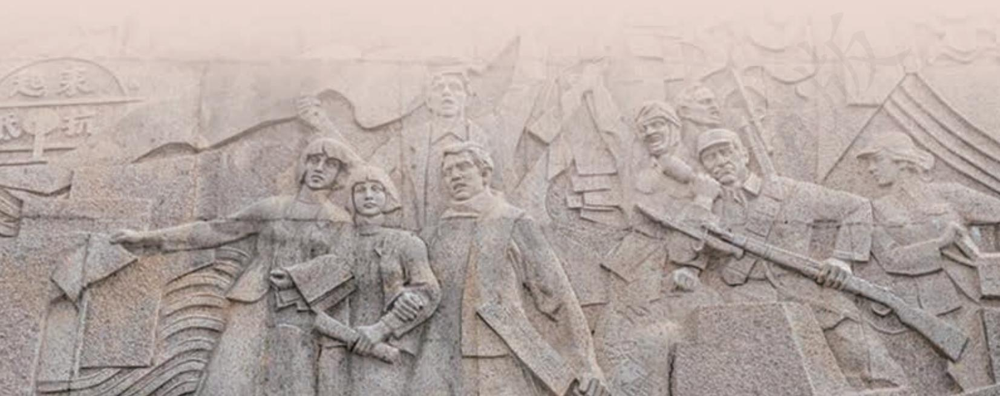
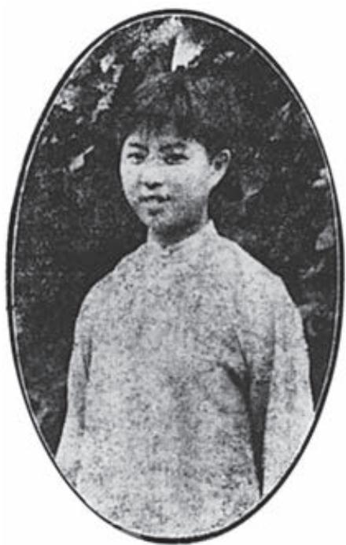
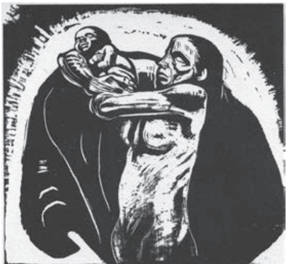

## 第二单元

“天若有情天亦老，人间正道是沧桑。”在苦难深重的旧中国，中国共产党领导人民进行了艰苦卓绝的斗争，以巨大的奉献和牺牲换来了国家的解放、民族的新生。了解这一伟大历史进程，思考中国革命的意义，理解革命文化的精神内涵，可以帮助我们更好地认识历史，把握当下，树立当代中国人的文化自信。

本单元所选的作品，有的寄托对烈士牺牲的深切哀痛，表达对正义力量的信心；有的展现旧中国劳动人民的苦难，揭示中国革命的意义；有的描绘革命斗争的场景，反映革命志士的高尚品质和人民群众的不懈奋斗。

学习本单元，深刻认识革命历程，激发奋发向上的精神力量；了解纪实作品和虚构作品各自的特点和表现手法，欣赏作家塑造艺术形象的深刻功力和富有个性的创作风格。

# 记念刘和珍君

鲁 迅

中华民国十五年b 三月二十五日，就是国立北京女子师范大学为十八日在段祺瑞执政府c 前遇害的刘和珍杨德群d 两君开追悼会的那一天，我独在礼堂外徘徊，遇见程君e，前来问我道，“先生可曾为刘和珍写了一点什么没有？”我说“没有”。她就正告我，“先生还是写一点罢；刘和珍生前就很爱看先生的文章。”

这是我知道的，凡我所编辑的期刊，大概是因为往往有始无终之故罢，销行一向就甚为寥落f，然而在这样的生活艰难中，毅然预定了《莽原》g全年的就有她。我也早觉得有写一点东西的必要了，这虽然于死者毫不相干，但在生者，却大抵只能如此而已。倘使我能够相信真有所谓“在天之灵”，那自然可以得到更大的安慰，——但是，现在，却只能如此而已。

可是我实在无话可说。我只觉得所住的并非人间。四十多个青年的血，洋溢在我的周围，使我艰于呼吸视听，那里h 还能有什么言语？长歌当哭i，是必须在痛定之后的。而此后几个所谓学者文人的阴险的论

a 选自《华盖集续编》（《鲁迅全集》第三卷，人民文学出版社2005年版）。记念，现在写作“纪念”。1926年3月，奉系军阀在日本帝国主义支持下进兵关内，冯玉祥率领的国民军与之作战。日本帝国主义公开援助奉军，派军舰驶入大沽口，炮击国民军。国民军开炮还击。日本帝国主义纠合英、美、法、意、荷、比、西等国驻北京公使，借口维护八国联军入侵时与清政府签订的《辛丑条约》，提出种种无理条件，并且在天津附近集结各国军队，准备武力进攻。3 月18日，北京各界民众为了反对帝国主义侵犯我国主权，在天安门前集会抗议，会后到执政府前请愿。段祺瑞竟命令卫兵向请愿群众开枪，并用大刀铁棍追打砍杀，打死打伤二百余人，制造了“三一八”惨案。刘和珍等都是在当时遇害的。刘和珍（1904—1926），江西南昌人，北京女子师范大学英文系学生，学生自治会主席。

调a，尤使我觉得悲哀。我已经出离b 愤怒了。我将深味c 这非人间的浓黑的悲凉；以我的最大哀痛显示于非人间，使它们快意于我的苦痛，就将这作为后死者的菲薄d 的祭品，奉献于逝者的灵前。

##

真的猛士，敢于直面惨淡的人生e，敢于正视淋漓的鲜血。这是怎样的哀痛者和幸福者？然而造化f 又常常为庸人设计，以时间的流驶，来洗涤旧迹，仅使留下淡红的血色和微漠g 的悲哀。在这淡红的血色和微漠的悲哀中，又给人暂得偷生，维持着这似人非人的世界。我不知道这样的世界何时是一个尽头！

我们还在这样的世上活着；我也早觉得有写一点东西的必要了。离三月十八日也已有两星期，忘却的救主快要降临了罢h，我正有写一点东西的必要了。

## 三

在四十余被害的青年之中，刘和珍君是我的学生。学生云者，我向来这样想，这样说，现在却觉得有些踌躇了，我应该对她奉献我的悲哀与尊敬。她不是“苟活到现在的我”的学生，是为了中国而死的中国的青年。

她的姓名第一次为我所见，是在去年夏初杨荫榆i 女士做女子师范大学校长，开除校中六个学生自治会职员的时候。其中的一个就是她；但是我不认识。直到后来，也许已经是刘百昭率领男女武将，强拖出校a 之后了，才有人指着一个学生告诉我，说：这就是刘和珍。其时我才能将姓名和实体联合起来，心中却暗自诧异。我平素想，能够不为势利所屈，反抗一广有羽翼b 的校长的学生，无论如何，总该是有些桀骜c 锋利的，但她却常常微笑着，态度很温和。待到偏安于宗帽胡同，赁屋授课d 之后，她才始来听我的讲义，于是见面的回数就较多了，也还是始终微笑着，态度很温和。待到学校恢复旧观e，往日的教职员以为责任已尽，准备陆续引退f 的时候，我才见她虑及母校前途，黯然至于泣下。此后似乎就不相见。总之，在我的记忆上，那一次就是永别了。

  
刘和珍

## 四

我在十八日早晨，才知道上午有群众向执政府请愿的事；下午便得到噩耗，说卫队居然开枪，死伤至数百人，而刘和珍君即在遇害者之列。但我对于这些传说，竟至于颇为怀疑。我向来是不惮以最坏的恶意，来推测中国人的，然而我还不料，也不信竟会下劣凶残到这地步。况且始终微笑着的和蔼的刘和珍君，更何至于无端在府门前喋血g 呢？

然而即日证明是事实了，作证的便是她自己的尸骸。还有一具，是杨德群君的。而且又证明着这不但是杀害，简直是虐杀，因为身体上还有棍棒的伤痕。

但段政府就有令，说她们是“暴徒”！

但接着就有流言，说她们是受人利用的。

惨象，已使我目不忍视了；流言，尤使我耳不忍闻。我还有什么话可说呢？我懂得衰亡民族之所以默无声息的缘由了。沉默呵，沉默呵！不在沉默中爆发，就在沉默中灭亡。

## 五

但是，我还有要说的话。

我没有亲见；听说，她，刘和珍君，那时是欣然前往的。自然，请愿而已，稍有人心者，谁也不会料到有这样的罗网a。但竟在执政府前中弹了，从背部入，斜穿心肺，已是致命的创伤，只是没有便死。同去的张静淑b 君想扶起她，中了四弹，其一是手枪，立仆c ；同去的杨德群君又想去扶起她，也被击，弹从左肩入，穿胸偏右出，也立仆。但她还能坐起来，一个兵在她头部及胸部猛击两棍，于是死掉了。

始终微笑的和蔼的刘和珍君确是死掉了，这是真的，有她自己的尸骸为证；沉勇d 而友爱的杨德群君也死掉了，有她自己的尸骸为证；只有一样沉勇而友爱的张静淑君还在医院里呻吟。当三个女子从容地转辗于文明人所发明的枪弹的攒射中的时候，这是怎样的一个惊心动魄的伟大呵！中国军人的屠戮妇婴的伟绩，八国联军的惩创e 学生的武功，不幸全被这几缕血痕抹杀了。

但是中外的杀人者却居然昂起头来，不知道个个脸上有着血污……。

## 六

时间永是流驶，街市依旧太平，有限的几个生命，在中国是不算什么的，至多，不过供无恶意的闲人f 以饭后的谈资，或者给有恶意的闲人g 作“流言”的种子。至于此外的深的意义，我总觉得很寥寥，因为这实在不过是徒手的请愿。人类的血战前行的历史h，正如煤的形成，当时用大量的木材，结果却只是一小块，但请愿是不在其中的i，更何况是徒手。

然而既然有了血痕了，当然不觉要扩大。至少，也当浸渍了亲族，师友，爱人的心，纵使时光流驶，洗成绯红，也会在微漠的悲哀中永存微笑的和蔼的旧影。陶潜说过，“亲戚或余悲，他人亦已歌，死去何所道，托体同山阿a。”倘能如此，这也就够了。

## 七

我已经说过：我向来是不惮以最坏的恶意来推测中国人的。但这回却很有几点出于我的意外。一是当局者竟会这样地凶残，一是流言家竟至如此之下劣，一是中国的女性临难竟能如是之从容。

我目睹中国女子的办事，是始于去年的，虽然是少数，但看那干练坚决，百折不回的气概，曾经屡次为之感叹。至于这一回在弹雨中互相救助，虽殒身不恤b 的事实，则更足为中国女子的勇毅，虽遭阴谋秘计，压抑至数千年，而终于没有消亡的明证了。倘要寻求这一次死伤者对于将来的意义，意义就在此罢。

苟活者在淡红的血色中，会依稀看见微茫的希望；真的猛士，将更奋然而前行。

呜呼，我说不出话，但以此记念刘和珍君！

四月一日。

# 为了忘却的记念

鲁 迅

我早已想写一点文字，来记念几个青年的作家。这并非为了别的，只因为两年以来，悲愤总时时来袭击我的心，至今没有停止，我很想借此算是竦身b 一摇，将悲哀摆脱，给自己轻松一下，照直说，就是我倒要将他们忘却了。

两年前的此时，即一九三一年的二月七日夜或八日晨，是我们的五个青年作家c 同时遇害的时候。当时上海的报章都不敢载这件事，或者也许是不愿，或不屑载这件事，只在《文艺新闻》d 上有一点隐约其辞的文章e。那第十一期（五月二十五日）里，有一篇林莽f 先生作的《白莽印象记》，中间说：

“他做了好些诗，又译过匈牙利诗人彼得斐g 的几首诗，当时的《奔流》h 的编辑者鲁迅接到了他的投稿，便来信要和他会面，但他却是不愿见名人的人，结果是鲁迅自己跑来找他，竭力鼓励他作文学的工作，但他终于不能坐在亭子间里写，又去跑他的路i了。不久，他又一次的被了捕。……”

这里所说的我们的事情其实是不确的。白莽并没有这么高慢a，他曾经到过我的寓所来，但也不是因为我要求和他会面；我也没有这么高慢，对于一位素不相识的投稿者，会轻率的写信去叫他。我们相见的原因很平常，那时他所投的是从德文译出的《彼得斐传》，我就发信去讨原文，原文是载在诗集前面的，邮寄不便，他就亲自送来了。看去是一个二十多岁的青年，面貌很端正，颜色是黑黑的，当时的谈话我已经忘却，只记得他自说姓徐，象山人；我问他为什么代你收信的女士是这么一个怪名字（怎么怪法，现在也忘却了），他说她就喜欢起得这么怪，罗曼谛克b，自己也有些和她不大对劲了。就只剩了这一点。

夜里，我将译文和原文粗粗的对了一遍，知道除几处误译之外，还有一个故意的曲译。他像是不喜欢“国民诗人”这个字的，都改成“民众诗人”了。第二天又接到他一封来信，说很悔和我相见，他的话多，我的话少，又冷，好像受了一种威压似的。我便写一封回信去解释，说初次相会，说话不多，也是人之常情，并且告诉他不应该由自己的爱憎，将原文改变。因为他的原书留在我这里了，就将我所藏的两本集子送给他，问他可能再译几首诗，以供读者的参看。他果然译了几首，自己拿来了，我们就谈得比第一回多一些。这传和诗，后来就都登在《奔流》第二卷第五本，即最末的一本里。

我们第三次相见，我记得是在一个热天。有人打门了，我去开门时，来的就是白莽，却穿着一件厚棉袍，汗流满面，彼此都不禁失笑。这时他才告诉我他是一个革命者，刚由被捕而释出，衣服和书籍全被没收了，连我送他的那两本；身上的袍子是从朋友那里借来的，没有夹衫，而必须穿长衣，所以只好这么出汗。我想，这大约就是林莽先生说的“又一次的被了捕”的那一次了。

我很欣幸他的得释，就赶紧付给稿费，使他可以买一件夹衫，但一面又很为我的那两本书痛惜：落在捕房的手里，真是明珠投暗了。那两本书，原是极平常的，一本散文，一本诗集，据德文译者说，这是他搜集起来的，虽在匈牙利本国，也还没有这么完全的本子，然而印在《莱克朗氏万有文库》c（Reclam’s Universal-Bibliothek）中，倘在德国，就随处可得，也值不到一元钱。不过在我是一种宝贝，因为这是三十年前，正当我热爱彼得斐的时候，特地托丸善书店d 从德国去买来的，那时还恐怕因为书极便宜，店员不肯经手，开口时非常惴惴。后来大抵带在身边，只是情随事迁，已没有翻译的意思了，这回便决计送给这也如我的那时一样，热爱彼得斐的诗的青年，算是给它寻得了一个好着落。所以还郑重其事，托柔石亲自送去的。谁料竟会落在“三道头a”之类的手里的呢，这岂不冤枉！

## 二

我的决不邀投稿者相见，其实也并不完全因为谦虚，其中含着省事的分子也不少。由于历来的经验，我知道青年们，尤其是文学青年们，十之九是感觉很敏，自尊心也很旺盛的，一不小心，极容易得到误解，所以倒是故意回避的时候多。见面尚且怕，更不必说敢有托付了。但那时我在上海，也有一个惟一的不但敢于随便谈笑，而且还敢于托他办点私事的人，那就是送书去给白莽的柔石。

我和柔石最初的相见，不知道是何时，在那里。他仿佛说过，曾在北京听过我的讲义，那么，当在八九年之前了。我也忘记了在上海怎么来往起来，总之，他那时住在景云里，离我的寓所不过四五家门面，不知怎么一来，就来往起来了。大约最初的一回他就告诉我是姓赵，名平复。但他又曾谈起他家乡的豪绅的气焰之盛，说是有一个绅士，以为他的名字好，要给儿子用，叫他不要用这名字了。所以我疑心他的原名是“平福”，平稳而有福，才正中乡绅的意，对于“复”字却未必有这么热心。他的家乡，是台州的宁海b，这只要一看他那台州式的硬气就知道，而且颇有点迂，有时会令我忽而想到方孝孺c，觉得好像也有些这模样的。

他躲在寓里弄文学，也创作，也翻译，我们往来了许多日，说得投合起来了，于是另外约定了几个同意的青年，设立朝华社d。目的是在绍介东欧和北欧的文学，输入外国的版画，因为我们都以为应该来扶植一点刚健质朴的文艺。接着就印《朝花旬刊》，印《近代世界短篇小说集》，印《艺苑朝华》e，算都在循着这条线，只有其中的一本《蕗谷虹儿画选》f，是为了扫荡上海滩上的“艺术家”，即戳穿叶灵凤a 这纸老虎而印的。

然而柔石自己没有钱，他借了二百多块钱来做印本。除买纸之外，大部分的稿子和杂务都是归他做，如跑印刷局，制图，校字之类。可是往往不如意，说起来皱着眉头。看他旧作品，都很有悲观的气息，但实际上并不然，他相信人们是好的。我有时谈到人会怎样的骗人，怎样的卖友，怎样的吮血，他就前额亮晶晶的，惊疑地圆睁了近视的眼睛，抗议道，“会这样的么？——不至于此罢？……”

不过朝华社不久就倒闭了，我也不想说清其中的原因，总之是柔石的理想的头，先碰了一个大钉子，力气固然白化b，此外还得去借一百块钱来付纸账。后来他对于我那“人心惟危c”说的怀疑减少了，有时也叹息道，“真会这样的么？……”但是，他仍然相信人们是好的。

他于是一面将自己所应得的朝华社的残书送到明日书店和光华书局去，希望还能够收回几文钱，一面就拼命的译书，准备还借款，这就是卖给商务印书馆的《丹麦短篇小说集》和戈理基d 作的长篇小说《阿尔泰莫诺夫之事业》。但我想，这些译稿，也许去年已被兵火e 烧掉了。

他的迂渐渐的改变起来，终于也敢和女性的同乡或朋友一同去走路了，但那距离，却至少总有三四尺的。这方法很不好，有时我在路上遇见他，只要在相距三四尺前后或左右有一个年青漂亮的女人，我便会疑心就是他的朋友。但他和我一同走路的时候，可就走得近了，简直是扶住我，因为怕我被汽车或电车撞死；我这面也为他近视而又要照顾别人担心，大家都苍皇f 失措的愁一路，所以倘不是万不得已，我是不大和他一同出去的，我实在看得他吃力，因而自己也吃力。

无论从旧道德，从新道德，只要是损己利人的，他就挑选上，自己背起来。

他终于决定地改变了，有一回，曾经明白的告诉我，此后应该转换作品的内容和形式。我说：这怕难罢，譬如使惯了刀的，这回要他耍棍，怎么能行呢？他简洁的答道：只要学起来！

他说的并不是空话，真也在从新学起来了，其时他曾经带了一个朋友来访我，那就是冯铿女士。谈了一些天，我对于她终于很隔膜，我疑心她有点罗曼谛克，急于事功a ；我又疑心柔石的近来要做大部的小说，是发源于她的主张的。但我又疑心我自己，也许是柔石的先前的斩钉截铁的回答，正中了我那其实是偷懒的主张的伤疤，所以不自觉地迁怒到她身上去了。——我其实也并不比我所怕见的神经过敏而自尊的文学青年高明。

她的体质是弱的，也并不美丽。

## 三

直到左翼作家联盟成立之后，我才知道我所认识的白莽，就是在《拓荒者》b 上做诗的殷夫。有一次大会时，我便带了一本德译的，一个美国的新闻记者所做的中国游记c 去送他，这不过以为他可以由此练习德文，另外并无深意。然而他没有来。我只得又托了柔石。

但不久，他们竟一同被捕，我的那一本书，又被没收，落在“三道头”之类的手里了。

## 四

明日书店要出一种期刊，请柔石去做编辑，他答应了；书店还想印我的译著，托他来问版税的办法，我便将我和北新书局所订的合同，抄了一份交给他，他向衣袋里一塞，匆匆的走了。其时是一九三一年一月十六日的夜间，而不料这一去，竟就是我和他相见的末一回，竟就是我们的永诀。

第二天，他就在一个会场上被捕了，衣袋里还藏着我那印书的合同，听说官厅因此正在找寻我。印书的合同，是明明白白的，但我不愿意到那些不明不白的地方去辩解。记得《说岳全传》里讲过一个高僧，当追捕的差役刚到寺门之前，他就“坐化”了，还留下什么“何立从东来，我向西方走”的偈子d。这是奴隶所幻想的脱离苦海的惟一的好方法，“剑侠”盼不到，最自在的惟此而已。我不是高僧，没有

d〔《说岳全传》……偈（jì）子〕清代小说《说岳全传》里讲，镇江金山寺道悦和尚同情岳飞，反对秦桧，秦桧就派差役何立去抓他。当时他正在寺内讲经，一见何立，念了一个偈子就坐化了。坐化，佛教徒盘膝端坐，安然而逝。偈子，佛经中的唱词，也泛指佛教徒隽永的诗句或言辞。

涅槃a 的自由，却还有生之留恋，我于是就逃走b。

这一夜，我烧掉了朋友们的旧信札，就和女人抱着孩子走在一个客栈里。不几天，即听得外面纷纷传我被捕，或是被杀了，柔石的消息却很少。有的说，他曾经被巡捕带到明日书店里，问是否是编辑；有的说，他曾经被巡捕带往北新书局去，问是否是柔石，手上上了铐，可见案情是重的。但怎样的案情，却谁也不明白。

他在囚系c 中，我见过两次他写给同乡d 的信，第一回是这样的——

“我与三十五位同犯（七个女的）于昨日到龙华。并于昨夜上了镣，开政治犯从未上镣之纪录。此案累及太大，我一时恐难出狱，书店事望兄为我代办之。现亦好，且跟殷夫兄学德文，此事可告周先生；望周先生勿念，我等未受刑。捕房和公安局，几次问周先生地址，但我那里知道。诸望勿念。祝好！

赵少雄 一月二十四日。”

以上正面。

“洋铁饭碗，要二三只

如不能见面，可将东西

望转交赵少雄”

以上背面。

他的心情并未改变，想学德文，更加努力；也仍在记念我，像在马路上行走时候一般。但他信里有些话是错误的，政治犯而上镣，并非从他们开始，但他向来看得官场还太高，以为文明至今，到他们才开始了严酷。其实是不然的。果然，第二封信就很不同，措词非常惨苦，且说冯女士的面目都浮肿了，可惜我没有抄下这封信。其时传说也更加纷繁，说他可以赎出的也有，说他已经解往南京的也有，毫无确信；而用函电来探问我的消息的也多起来，连母亲在北京也急得生病了，我只得一一发信去更正，这样的大约有二十天。

天气愈冷了，我不知道柔石在那里有被褥不？我们是有的。洋铁碗可曾收到了没有？……但忽然得到一个可靠的消息，说柔石和其他二十三人，已于二月七日夜或八日晨，在龙华警备司令部被枪毙了，他的身上中了十弹。

原来如此！……

在一个深夜里，我站在客栈的院子中，周围是堆着的破烂的什物；人们都睡觉了，连我的女人和孩子。我沉重的感到我失掉了很好的朋友，中国失掉了很好的青年，我在悲愤中沉静下去了，然而积习却从沉静中抬起头来，凑成了这样的几句：

惯于长夜过春时，挈妇将雏a 鬓有丝。

梦里依稀慈母泪，城头变幻大王旗 b。

忍看朋辈成新鬼，怒向刀丛觅小诗。

吟罢低眉无写处，月光如水照缁衣c。

但末二句，后来不确了，我终于将这写给了一个日本的歌人d。

可是在中国，那时是确无写处的，禁锢得比罐头还严密。我记得柔石在年底曾回故乡，住了好些时，到上海后很受朋友的责备。他悲愤的对我说，他的母亲双眼已经失明了，要他多住几天，他怎么能够就走呢？我知道这失明的母亲的眷眷的心，柔石的拳拳的心。当《北斗》e 创刊时，我就想写一点关于柔石的文章，然而不能够，只得选了一幅珂勒惠支（KätheKollwitz）夫人f 的木刻，名曰《牺牲》，是一

  
牺牲（木刻）  ［德］珂勒惠支 作

内山书店寄给她。

个母亲悲哀地献出她的儿子去的，算是只有我一个人心里知道的柔石的记念。

同时被难a 的四个青年文学家之中，李伟森我没有会见过，胡也频在上海也只见过一次面，谈了几句天。较熟的要算白莽，即殷夫了，他曾经和我通过信，投过稿，但现在寻起来，一无所得，想必是十七那夜统统烧掉了，那时我还没有知道被捕的也有白莽。然而那本《彼得斐诗集》却在的，翻了一遍，也没有什么，只在一首《Wahlspruch》（格言）的旁边，有钢笔写的四行译文道：

“生命诚宝贵，

爱情价更高；

若为自由故，

二者皆可抛！”

又在第二叶上，写着“徐培根b”三个字，我疑心这是他的真姓名。

## 五

前年的今日，我避在客栈里，他们却是走向刑场了；去年的今日，我在炮声中逃在英租界，他们则早已埋在不知那里的地下了；今年的今日，我才坐在旧寓里，人们都睡觉了，连我的女人和孩子。我又沉重的感到我失掉了很好的朋友，中国失掉了很好的青年，我在悲愤中沉静下去了，不料积习又从沉静中抬起头来，写下了以上那些字。

要写下去，在中国的现在，还是没有写处的。年青时读向子期c《思旧赋》，很怪他为什么只有寥寥的几行，刚开头却又煞了尾。然而，现在我懂得了。

不是年青的为年老的写记念，而在这三十年中，却使我目睹许多青年的血，层层淤积起来，将我埋得不能呼吸，我只能用这样的笔墨，写几句文章，算是从泥土中挖一个小孔，自己延口残喘，这是怎样的世界呢。夜正长，路也正长，我不如忘却，不说的好罢。但我知道，即使不是我，将来总会有记起他们，再说他们的时候的。……

二月七——八日。

## 学习提示

《记念刘和珍君》和《为了忘却的记念》都是以写人记事为主的纪念性散文。前者赞扬以刘和珍为代表的“为了中国而死的中国的青年”，后者感叹白莽、柔石等人的牺牲使“中国失掉了很好的青年”，两篇文章都表达了对青年革命烈士的哀悼和对反动势力的痛恨。

《记念刘和珍君》“一字一泪，是用血泪写出了心坎里的哀痛，表达了革命者至情的文字”（许广平《女师大风潮与“三一八”惨案》）。学习时，要注意概括刘和珍的有关事迹，梳理本文的情感发展脉络，体会鲁迅在字里行间表达的“至情”，以及对烈士牺牲意义的理性思考。文中很多语句值得反复品味，比如作者一方面说“我也早觉得有写一点东西的必要了”，另一方面又说“可是我实在无话可说”；又如“真的猛士，敢于直面惨淡的人生，敢于正视淋漓的鲜血”“不在沉默中爆发，就在沉默中灭亡”等。这些都是理解本文思想与情感的切入点。

《为了忘却的记念》为纪念“左联”五烈士而作，重点回忆了白莽和柔石。作者选取一些看似零碎却很能表现人物性格的小事，勾勒出两位烈士的崇高形象。文中的议论和抒情文字也非常精辟、感人，阅读时要注意感受其表达效果。“惯于长夜过春时”一诗，感情深挚沉痛，与文中一些内容相互印证，不妨反复诵读，深入体会。

两篇文章有许多可以比较之处：比如二者都提到了“忘却”，前者以讽刺的口吻说“忘却的救主快要降临了罢”，后者则说“我不如忘却，不说的好罢”；又如二者都带有很强的抒情性，但前者的抒情直露显豁、汪洋恣肆，后者则使用了不少曲折隐晦的笔法。这些都值得深入探究。