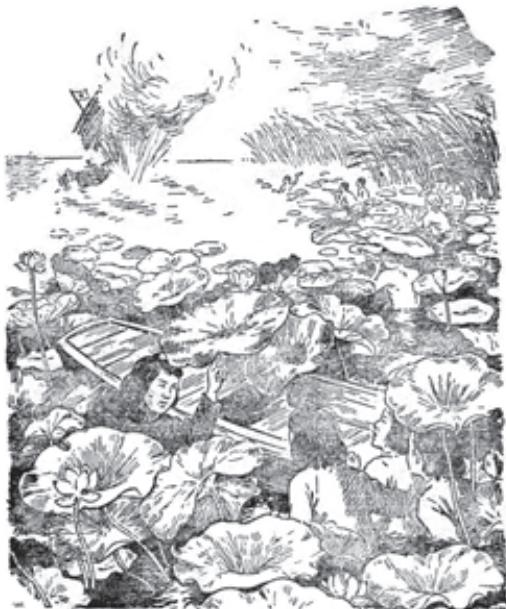
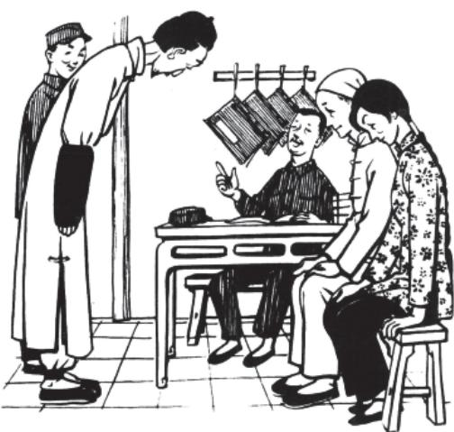
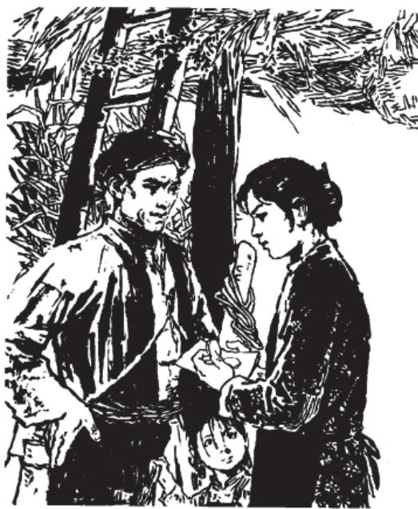

# 荷花淀 a

孙 犁

月亮升起来，院子里凉爽得很，干净得很。白天破好的苇眉子b潮润润的，正好编席。女人坐在小院当中，手指上缠绞着柔滑修长的苇眉子。苇眉子又薄又细，在她怀里跳跃着。

要问白洋淀有多少苇地，不知道；每年出多少苇子，也不知道。只晓得每年芦花飘飞苇叶黄的时候，全淀的芦苇收割，垛起垛来，在白洋淀周围的广场上，就成了一条苇子的长城。女人们在场里院里编着席。编成了多少席？六月里，淀水涨满，有无数的船只运输银白雪亮的席子出口。不久，各地的城市村庄就全有了花纹又密又精致的席子用了。大家争着买：“好席子，白洋淀席！”

这女人编着席。不久，在她的身子下面就编成了一大片。她像坐在一片洁白的雪地上，也像坐在一片洁白的云彩上。她有时望望淀里，淀里也是一片银白世界。水面笼起一层薄薄透明的雾，风吹过来，带着新鲜的荷叶荷花香。

但是大门还没有关，丈夫还没有回来。

很晚丈夫才回来了。这年轻人不过二十五六岁，头戴一顶大草帽，上身穿一件洁白的小褂，黑单裤卷过了膝盖，光着脚。他叫水生，小苇庄的游击组长，党的负责人。今天领着游击组到区上开会去来。

女人抬头笑着问：“今天怎么回来得这么晚？”站起来要去端饭。

水生坐在台阶上说：“吃过饭了，你不要去拿。”

女人就又坐在席子上。她望着丈夫的脸，她看出他的脸有些红涨，说话也有些气喘。她问：“他们几个哩？”

水生说：“还在区上。爹哩？”

“睡了。”

“小华哩？”

“和他爷爷去收了半天虾篓 a，早就睡了。他们几个为什么还不回来？”

水生笑了一下。女人看出他笑得不像平常。“怎么了，你？”

水生小声说：“明天我就到大部队上去了。”

女人的手指震动了一下，想是叫苇眉子划破了手。她把一个手指放在嘴里吮了一下。

水生说：“今天县委召集我们开会。假若敌人再在同口安上据点，那和端村就成了一条线，淀里的斗争形势就变了。会上决定成立一个地区队b。我第一个举手报了名的。”

女人低着头说：“你总是很积极的。”

水生说：“我是村里的游击组长，是干部，自然要站在头里。他们几个也报了名。他们不敢回来，怕家里的人拖尾巴，公推我代表，回来和家里人说一说。他们全觉得你还开明一些。”

女人没有说话。过了一会儿，她才说：“你走，我不拦你。家里怎么办？”

水生指着父亲的小房，叫她小声一些，说：“家里，自然有别人照顾。可是咱的庄子小，这一次参军的就有七个。庄上青年人少了，也不能全靠别人，家里的事，你就多做些，爹老了，小华还不顶事。”

女人鼻子里有些酸，但她并没有哭，只说：“你明白家里的难处就好了。”

水生想安慰她。因为要考虑和准备的事情还太多，他只说了两句：“千斤的担子你先担吧。打走了鬼子，我回来谢你。”

说罢，他就到别人家里去了，他说回来再和父亲谈。

鸡叫的时候，水生才回来。女人还是呆呆地坐在院子里等他，她说：“你有什么话，嘱咐嘱咐我吧。”

“没有什么话了，我走了，你要不断进步，识字，生产。”

“嗯。” ,

“什么事也不要落在别人后面！”

“嗯。还有什么？”

“不要叫敌人汉奸捉活的。捉住了要和他们拼命。”这才是那最重要的一句。女人流着眼泪答应了他。

a〔虾篓〕把许多小篓子用绳系着，里面放些食饵， b〔地区队〕中国共产党领导下的敌后地方人民武装沉在水里，用来捕虾。 队伍。

第二天，女人给他打点a 好一个小小的包裹，里面包了一身新单衣，一条新毛巾，一双新鞋子。那几家也是这些东西，交水生带去。一家人送他出了门。父亲一手拉着小华，对他说：“水生，你干的是光荣事情，我不拦你，你放心走吧。大人孩子我给你照顾，什么也不要惦记。”

全庄的男女老少也送他出来。水生对大家笑一笑，上船走了。

女人们到底有些藕断丝连。过了两天，四个青年妇女集在水生家里，大家商量。

“听说他们还在这里没走。我不拖尾巴，可是忘下了一件衣裳。”

“我有句要紧的话，得和他说说。”

“听他说，鬼子要在同口安据点……”水生的女人说。

“哪里就碰得那么巧，我们快去快回来。”

“我本来不想去，可是俺婆婆非叫我再去看看他——有什么看头啊！”

于是这几个女人偷偷坐在一只小船上，划到对面马庄去了。

到了马庄，她们不敢到街上去找，来到村头一个亲戚家里。亲戚说：“你们来得不巧。昨天晚上他们还在这里，半夜里走了，谁也不知开到哪里去。你们不用惦记他们，听说水生一来就当了副排长，大家都是欢天喜地的……”

几个女人羞红着脸告辞出来，摇开靠在岸边上的小船。现在已经快到晌午了，万里无云，可是因为在水上，还有些凉风。这风从南面吹过来，从稻秧上苇尖上吹过来。水面没有一只船，水像无边的跳荡的水银。

几个女人有点儿失望，也有些伤心，各人在心里骂着自己的狠心贼。可是青年人永远朝着愉快的事情想，女人们尤其容易忘记那些不痛快。不久，她们就又说笑起来了。

“你看，说走就走了。”

“可慌b 哩！比什么也慌，比过新年，娶新——也没见他这么慌过！”

“拴马桩也不顶事了。”

“不行了，脱了缰了！”

“一到军队里，他一准得忘了家里的人。”

“那是真的。我们家里住过一些年轻的队伍，一天到晚仰着脖子，出来唱，进去唱，我们一辈子也没那么乐过。等他们闲下来没有事了，我就傻想：该低下头了吧。你猜人家干什么？用白粉子在我家影壁上画

b〔慌〕方言，兴奋。

上许多圆圈圈，一个一个蹲在院子里，托着枪瞄那个，又唱起来了！”

她们轻轻划着船，船两边的水，哗，哗，哗。顺手从水里捞上一棵菱角来，菱角还很嫩很小，乳白色，顺手又丢到水里去。那棵菱角就又安安稳稳浮在水面上生长去了。

“现在你知道他们到了哪里？”

“管他哩！也许跑到天边上去了。”

她们都抬起头往远处看了看。

“哎呀！那边过来一只船。”

“哎呀，日本！你看那衣裳！”

“快摇！”

小船拼命往前摇。她们心里也许有些后悔，不该这么冒冒失失走来，也许有些怨恨那些走远了的人。但是立刻就想：什么也别想了，快摇，大船紧紧追过来了！

大船追得很紧。

幸亏是这些青年妇女，白洋淀长大的，她们摇得小船飞快。小船活像离开了水皮的一条打跳的梭鱼。她们从小跟这小船打交道，驶起来就像织布穿梭、缝衣透针一般快。

假如敌人追上了，就跳到水里去死吧！

后面大船来得飞快。那明明白白是鬼子！这几个青年妇女咬紧牙，制止住心跳，摇橹的手并没有慌，水在两旁大声地哗哗，哗哗，哗哗哗！

“往荷花淀里摇！那里水浅，大船过不去。”

她们奔着那不知道有几亩大小的荷花淀去，那一望无边际的密密层层的大荷叶迎着阳光舒展开，就像铜墙铁壁一样。粉色荷花箭a 高高地挺出来，是监视白洋淀的哨兵吧。

她们向荷花淀里摇，最后，努力地一摇，小船窜进了荷花淀。几只野鸭扑棱棱飞起，尖声惊叫，掠着水面飞走了。就在她们的耳边响起一排枪！

整个荷花淀全震荡起来。她们想，陷在敌人的埋伏里了，一准要死了，一齐翻身跳到水里去。渐渐听清楚枪声只是向着外面，她们才又扒着船帮露出头来。她们看见不远的地方，那宽厚肥大的荷叶下面，有一个人的脸，下半截身子长在水里。荷花变成人了？那不是我们的水生吗？又往左右看去，不久各人就找到了各人丈夫的脸。啊，原来是他们！

但是那些隐蔽在大荷叶下面的战士们，正在聚精会神瞄着敌人射击，半眼也没有看她们。枪声清脆，三五排枪过后，他们投出了手榴弹，冲出了荷花淀。

手榴弹把敌人那只大船击沉，一切都沉下去了，水面上只剩下一团烟硝火药气味。战士们就在那里大声欢笑着，打捞战利品。他们又开始了沉到水底捞出大鱼来的拿手戏。他们争着捞出敌人的枪支、子弹带，然后是一袋子一袋子叫水浸透了的面粉和大米。水生拍打着水去追赶一个在水波上滚动的东西——是一盒用精致纸盒装着的饼干。

  
啊，原来是他们！  蒋德舜 作

妇女们带着浑身水，又坐到她们的小船上去了。

水生追回那个纸盒子，一只手高高举起，一只手用力拍打着水，好使自己不沉下去。对着荷花淀吆喝：

“出来吧，你们！”

好像带着很大的气。

她们只好摇着船出来。忽然从她们的船底下冒出一个人来，只有水生的女人认得那是区小队的队长。这个人抹一把脸上的水，问她们：“你们干什么去来呀？”

水生的女人说：“又给他们送了一些衣裳来。”

小队长回头对水生说：“都是你村的？”

“不是她们是谁，一群落后分子！”说完，把纸盒顺手丢在女人们船上，一泅，又沉到水底下去了，到很远的地方才钻出来。

小队长开了个玩笑，他说：“你们也没有白来。不是你们，我们的伏击不会这么彻底。可是，任务已经完成，该回去晒晒衣裳了。情况还紧得很！”

战士们已经把打捞出来的战利品全装在他们的小船上，准备转移。一人摘了一片大荷叶顶在头上，抵挡正午的太阳。几个青年妇女把掉在水里又捞出来的小包裹丢给了他们。战士们的三只小船就奔着东南方向，箭一样飞去，不久就消失在中午水面上的烟波里。

几个青年妇女划着她们的小船赶紧回家，一个个像落水鸡似的。一路走着，因过于刺激和兴奋，她们又说笑起来。

坐在船头脸朝后的一个噘着嘴说：“你看他们那个横样子，见了我

们爱搭理不搭理的！”

“啊，好像我们给他们丢了什么人似的。”

她们自己也笑了，今天的事情不算光彩，可是——

“我们没枪，有枪就不往荷花淀里跑，在大淀里就和鬼子干起来！”

“我今天也算看见打仗了。打仗有什么出奇？只要你不着慌，谁还不会趴在那里放枪呀！”

“打沉了，我也会凫水捞东西，我管保比他们水式a 好，再深点儿我也不怕！”

“水生嫂，回去我们也成立队伍，不然以后还能出门吗？”

“刚当上兵就小看我们，过二年，更把我们看得一钱不值了。谁比谁落后多少呢！”

这一年秋季，她们学会了射击。冬天，打冰夹鱼b 的时候，她们一个个登在流星一样的冰船c 上，来回警戒。敌人“围剿”那百顷大苇塘的时候，她们配合子弟兵作战，出入在那芦苇的海里。

1945年于延安

## 小二黑结婚d（节选）

赵树理

## 二诸葛的神课

邻居们见是兴旺弟兄们捆人，也没有人敢给小二黑讲情，直等到他们走后，才把二诸葛招呼回家。

二诸葛连连摇头说：“唉！我知道这几天要出事啦！前天早上我上地去，才上到岭上，碰上个骑驴媳妇，穿了一身孝，我就知道坏了。我

a〔水式〕游水的本领。

d 选自《赵树理文集》第一卷（中国工人出版社2000年版）。小说共十二节，这里节选的是第九至十二节。赵树理（1906—1970），山西沁水人，作家。著有小说《小二黑结婚》《李有才板话》等。

今年是罗睺星照运a，要谨防戴孝的冲了运气，因此哪里也不敢去，谁知躲也躲不过。昨天晚上二黑他娘梦见庙里唱戏。今天早上一个老鸦落在东房上叫了十几声……唉！反正是时运，躲也躲不过。”他啰里啰唆念了一大堆，邻居们听了有些厌烦，又给他说了一会儿宽心话，就都散了。

有事人哪里睡得着？人散了之后，二诸葛家里除了童养媳之外，三个人谁也没有睡。二诸葛摸了摸脸，取出三个制钱占了一卦，占出之后吓得他面色如土。他说：“了不得呀了不得！丑土的父母动出午火的官鬼，火旺于夏，恐怕有些危险了。唉！人家把他选成青年队长，我就说过不叫他当，小杂种硬要充人物头！人家说要按军法处理，要不当队长哪里犯得了军法？”老婆也拍手跺脚道：“小爹呀！谁知道你要闯这么大的事啦？”大黑劝道：“不怕！事已经出下了，由他去吧！我想这又不是人命事，也犯不了什么大罪！既然他们送到区上了，我先到区上打听打听！你们都睡吧！”说着点了个灯笼就走了。

二诸葛打发大黑去后，仍然低头细细研究方才占的那一卦。停了一会儿，远远听着有个女人哭，越哭越近，不大一会儿就来到窗下，一推门就进来了。二诸葛还没有看清是谁，这女人就一把把他拉住，带哭带闹说：“刘修德！还我闺女！你的孩子把我的闺女勾引到哪里了？还我……”二诸葛老婆正气得死去活来，一看见来的是三仙姑，正赶上出气，从炕上跳下来拉住她道：“你来了好！省得我去找你！你母女两个好生生把我个孩子勾引坏，你倒有脸来找我！咱两人就也到区上说说理！”两个女人滚成一团，二诸葛一个人拉也拉不开，也再顾不上研究他的卦。三仙姑见二诸葛老婆已经不顾了命，自己先胆怯了几分，不敢恋战，少闹了一会儿挣脱出来就走了。二诸葛老婆追出门来，被二诸葛拦回去，还骂个不休。

## 恩典恩典

二诸葛一夜没有睡，一遍一遍念：“大黑怎么还不回来，大黑怎么还不回来。”第二天天不明就起程往区上走，走到半路，远远看见大黑、三个民兵已都回来了，还来了区上一个助理员，一个交通员。他远远就喊叫道：“大黑！怎么样？要紧不要紧？”大黑说：“没有事！不怕！ ”

  
小二黑结婚  丁聪 作

说着就走到跟前，助理员跟三个民兵先走了。大黑告交通员说：“这就是我爹！”又向二诸葛说：“区上添传你跟于福老婆。你去吧，没有事！二黑跟小芹两个人，一到区上就放开了。区上早就说兴旺跟金旺两个人不是东西，已经把他两个人押起来了，还派助理员到咱村开大会调查他们横行霸道的证据。我赶到那里人家就问罢了，听说区上还许咱二黑跟小芹结婚。”二诸葛说：“不犯罪就好，结婚可不行，命相不对！你没有听说添传我做什么？”大黑说：“不知道，大约也没有

什么大事。你去吧，我先回去告我娘说。”交通员说：“老汉！这就算见了你了！你去吧，我再传那一个去！”说了就跟大黑相跟着走了。

二诸葛到了区上，看见小二黑跟小芹坐在一条板凳上，他就指着小二黑骂道：“闯祸东西！放了你你还不快回去？你把老子吓死了！不要脸！”区长道：“干什么？区公所是骂人的地方？”二诸葛不说话了。区长问：“你就是刘修德？”二诸葛答：“是！”问：“你给刘二黑收了个童养媳？”答：“是！”问：“今年几岁了？”答：“属猴的，十二岁了。”区长说：“女不过十五岁不能订婚，把人家退回娘家去，刘二黑已经跟于小芹订婚了！”二诸葛说：“她只有个爹，也不知逃难逃到哪里去了，退也没处退。女不过十五不能订婚，那不过是官家规定，其实乡间七八岁订婚的多着哩。请区长恩典恩典就过去了……”区长说：“凡是不合法的订婚，只要有一方面不愿意都得退！”二诸葛说：“我这是两家情愿！”区长问小二黑道：“刘二黑，你愿意不愿意？”小二黑说：“不愿意！”二诸葛的脾气又上来了，瞪了小二黑一眼道：“由你啦？”区长道：“给他订婚不由他，难道由你啦？老汉！如今是婚姻自主，由不得你了，你家养的那个小姑娘，要真是没有娘家，就算成你的闺女好了。”二诸葛道：“那也可以，不过还得请区长恩典恩典，不能叫他跟于福这闺女订婚！”区长说：“这你就管不着了！”二诸葛发急道：“千万请区长恩典恩典，命相不对，这是一辈子的事！”又向小二黑道：“二黑！你不要糊涂了！这是你一辈子的事！”区长道：“老汉！你不要糊涂了！强逼着你十九岁的孩子娶上个十二岁的小姑娘，恐怕要生一辈子气！ 我不过是劝一劝你，其实只要人家两个人愿意，你愿意不愿意都不相干。回去吧！童养媳没处退就算成你的闺女！”二诸葛还要请区长“恩典恩典”，一个交通员把他推出来了。

## 看看仙姑

三仙姑去寻二诸葛，一来为的是逞逞闹气的本领，二来为的是遮遮外人的耳目，其实让小芹吃一吃亏她很高兴，所以跟二诸葛老婆闹了一阵之后，回去就睡了。第二天早上，她起得很迟，于福虽比她着急，可是自己既没有主意，又不敢叫醒她，只好自己先去做饭；饭快成的时候，三仙姑慢慢起来梳妆，于福问她道：“不去打听打听小芹？”她说：“打听她做甚啦？她的本领多大啦？”于福也再没有敢说什么，把饭菜做成了放在炉边等，直等到她梳妆罢了才开饭。

饭还没有吃罢，区上的交通员来传她。她好像很得意，嗓子拉得长长地说：“闺女大了咱管不了，就去请区长替咱管教管教！”她吃完了饭，换上新衣服、新首帕、绣花鞋、镶边裤，又擦了一次粉，加了几件首饰，然后叫于福给她备上驴，她骑上，于福给她赶上，往区上去。

到了区上，交通员把她引到区长房子里，她趴下就磕头，连声叫道：“区长老爷，你可要给我做主！”区长正伏在桌上写字，见她低着头跪在地下，头上戴了满头银首饰，还以为是前两天跟婆婆生了气的那个年轻媳妇，便说道：“你婆婆不是有保人吗？为什么不找保人？”三仙姑莫名其妙，抬头看了看区长的脸。区长见是个擦着粉的老太婆，才知道是认错人了。交通员道：“认错人了！这就是于小芹的娘！”区长打量了她一眼道：“你就是小芹的娘呀？起来！不要装神做鬼！我什么都清楚！起来！”三仙姑站起来了。区长问：“你今年多大岁数？”三仙姑说：“四十五。”区长说：“你自己看看你打扮得像个人不像？”门边站着老乡一个十来岁的小闺女嘻嘻嘻笑了。交通员说：“到外边耍！”小闺女跑了。区长问：“你会下神是不是？”三仙姑不敢答话。区长问：“你给你闺女找了个婆家？”三仙姑答：“找下了！”问：“使了多少钱？”答：“三千五！”问：“还有些什么？”答：“有些首饰布匹！”问：“跟你闺女商量过没有？”答：“没有！”问：“你闺女愿意不愿意？”答：“不知道！”区长道：“我给你叫来你亲自问问她！”又向交通员道：“去叫于小芹！”

刚才跑出去那个小闺女，跑到外边一宣传，说有个打官司的老婆，四十五了，擦着粉，穿着花鞋。邻近的女人们都跑来看，挤了半院，唧唧哝哝说：“看看！四十五了！”“看那裤腿！”“看那鞋！”三仙姑半辈子没有脸红过，偏这会儿撑不住气了，一道道热汗在脸上流。交通员领着小芹来了，故意说：“看什么？人家也是个人吧，没有见过？闪开路！”一伙女人们哈哈大笑。

把小芹叫来，区长说：“你问问你闺女愿意不愿意！”三仙姑只听见院里人说“四十五”“穿花鞋”，羞得只顾擦汗，再也开不得口。院里的人们忽然又转了话头，都说“那是人家的闺女”“闺女不如娘会打扮”，也有人说“听说还会下神”，偏又有个知道底细的断断续续讲“米烂了”的故事a，这时三仙姑恨不得一头碰死。

区长说：“你不问我替你问！于小芹，你娘给你找的婆家你愿意跟人家结婚不愿意？”小芹说：“不愿意！我知道人家是谁？”区长问三仙姑道：“你听见了吧？”又给她讲了一会儿婚姻自主的法令，说小芹跟小二黑订婚完全合法，还吩咐她把吴家送来的钱和东西原封退了，让小芹跟小二黑结婚。她羞愧之下，一一答应了下来。

## 怎么到底

三个民兵回到刘家峧b，一说区上把兴旺金旺二人押起来，又派助理员来调查他们的罪恶，真是人人拍手称快。午饭后，庙里开一个群众大会，村长报告了开会宗旨，就请大家举他两个人的作恶事实。起先大家还怕扳不倒人家，人家再返回来报仇，老大一会儿没有人说话；有几个胆子太小的人，还悄悄劝大家说：“忍事者安然。”有个被他两人作践垮了的年轻人说：“我从前没有忍过？越忍越不得安然！你们不说我说！”他先从金旺领着土匪到他家绑票说起，一连说了四五款，才说道：“我歇歇再说，先让别人也说几款！”他一说开了头，许多受过害的人也都抢着说起来：有给他们花过钱的，有被他们逼着上过吊的，也有产业被他们霸了的，老婆被他们奸淫过的；他两人还派上民兵给他们自己割柴，拨上民夫给他们自己锄地；浮收粮，私派款，强迫民兵捆人……你一宗他一宗，从晌午说到太阳落，一共说了五六十款。

区上根据这些罪状把他两人送到县里，县里把罪状一一证实之后，除叫他们赔偿大家损失外，又判了十五年徒刑。

经过这次大会之后，村里人也都敢出头了。不久，村干部又都经过大改选，村里人再也不敢乱投坏人的票了。这期间，金旺老婆自然也落了选。偏她还变了口吻，说：“以后我也要进步了。”

两个神仙也有了变化：

三仙姑那天在区上被一伙妇女围住看了半天，实在觉着不好意思，

去捞饭！米烂了！”不料被人听见，传为笑谈。

b〔峧〕读jiāo。

回去对着镜子研究了一下，真有点儿打扮得不像话；又想到自己的女儿快要跟人结婚，自己还卖什么老俏？这才下了个决心，把自己的打扮从顶到底换了一遍，弄得像个当长辈人的样子，把三十年来装神弄鬼的那张香案也悄悄拆去。

二诸葛那天从区上回去，又向老婆提起二黑跟小芹的命相不对，他老婆道：“把你的鬼八卦收起吧！你不是说二黑这回了不得吗？你一辈子放个屁也要卜一课，究竟抵了些什么事？我看小芹蛮不错，能跟咱二黑过就很好！什么命相对不对？你就不记得‘不宜栽种a’？”二诸葛见老婆都不信自己的阴阳，也就不好意思再到别人跟前卖弄他那一套了。

小芹和小二黑各回各家，见老人们的脾气都有些改变，托邻居们趁势和说和说，两位神仙也就顺水推舟同意他们结婚。后来两家都准备了一下，就过门。过门之后，小两口都十分得意，邻居们都说是村里第一对好夫妻。

夫妻们在自己卧房里有时候免不了说玩话：小二黑好学三仙姑下神时候唱“前世姻缘由天定”，小芹好学二诸葛说“区长恩典，命相不对”。淘气的孩子们去听窗，学会了这两句话，就给两位神仙加了新外号：三仙姑叫“前世姻缘”，二诸葛叫“命相不对”。

1943年5月，写于太行

## 党 费 b

王愿坚

每逢我领到了津贴费，拿出钱来缴党费的时候，每逢我看着党的小组长接过钱，在我的名字下面填上钱数的时候，我就不由得心里一热，想起了1934年的秋天。

1934年是我们闽粤赣边区斗争最艰苦的开始。我们那儿的主力红

b 选自《王愿坚文集》第一卷（春风文艺出版社2018年版）。略有改动。王愿坚（1929—1991），山东诸城人，作家。

军一部分参加了“抗日先遣队”北上了，一部分和中央红军合编，准备长征，四月天就走了。我们留下来坚持敌后斗争的一支小部队，在主力红军撤走以后，就遭到白匪a 疯狂的“围剿”。为了保存力量，坚持斗争，我们被逼得上了山。

队伍虽然上了山，可还是当地地下斗争的领导中心，我们支队的政治委员魏杰同志就是这个中心县委的书记。当时，我们一面瞅空子打击敌人，一面通过一条条看不见的交通线，和各地地下党组织保持着联系，领导着斗争。这种活动进行了没多久，敌人看看整不了我们，竟使出了一个叫作“移民并村”的绝招儿，把山脚下偏僻的小村子的群众统统强迫迁到靠平原的大村子去了。敌人这一招儿使得可真绝，切断了我们和群众的联系，各地的党组织也被搞乱了，要坚持斗争就得重新组织。

上山以前，我是干侦察员的。那时候整天在敌人窝里逛荡，走到哪里，吃、住都有群众照顾着，瞅准了机会，一下子给敌人个“连锅端”，歼灭个把小队的保安团，真干得痛快。可是自打上了山，特别是敌人来了这一手，日子不那么惬意了：生活艰苦倒不在话下，只是过去一切生活、斗争都和群众在一起，现在蓦地离开了群众，可真受不了；浑身有劲没处使，觉得真憋得慌。

正憋得难受呢，魏杰同志把我叫去了，要我当“交通”，下山和地方党组织取得联系。

接受了这个任务，我可是打心眼里高兴。当然，这件工作跟过去当侦察员有些不一样，任务是秘密地把“并村”以后的地下党组织联络起来，沟通各村党支部和中心县委——游击队的联系，以便进行有组织的斗争。去的落脚站八角坳，是个离山较近的大村子，有三四个村的群众新近被迫移到那里去。要接头的人名叫黄新，是个二十五六岁的媳妇，1931年入党的。1932年“扩红”的时候，她带头把自由结婚的丈夫送去参加了红军。以后，她丈夫跟着毛主席长征了，眼下家里就剩下她跟一个才五岁的小妞儿。敌人实行“并村”的时候，把她们那村子一把火烧光了，她就随着大伙儿来到了八角坳。听说她在“并村”以后还积极地组织党的活动，是个忠实、可靠的同志，所以这次就去找她接头，传达县委的指示，慢慢开展活动。

这些，都是魏政委交代的情况。其实我只知道八角坳的大概地势，至于接头的这位黄新同志，我并不认识。魏政委怕我认错人，在交代任务时还特别嘱咐说：“你记着，她耳朵边上有个黑痣！”

就这样，我收拾了一下，换了身便衣，就趁天黑下山了。

八角坳离山有三十多里路，再加上要拐弯抹角地走小路，下半夜才赶到。这庄子以前我来过，那时候在根据地里像这样大的庄子，每到夜间，田里的活儿干完了，老百姓开会啦，上夜校啦，锣鼓喧天，山歌不断，闹得可热火。可是，现在呢，鸦雀无声，连个火亮儿也没有，黑沉沉的，活像个乱葬岗子。只有个把白鬼有气没力地喊两声，大概他们以为根据地的老百姓都被他们的“并村”制服了吧。可是我知道这看来阴森森的村庄里还埋着星星点点的火种，等这些火种越着越旺，连串起来，就会烧起漫天大火的。

我悄悄地摸进了庄子，按着政委告诉的记号，从东头数到第十七座窝棚，蹑手蹑脚地走到窝棚门口。也奇怪，天这么晚了，里面还点着灯，看样子是使什么遮着亮儿，不近前是看不出来的。屋里有人轻轻地哼着小调儿，听声音是个女人，声音压得很低很低的。哼的那个调儿那么熟，一听就听出是过去“扩红”时候最流行的《送郎当红军》：

…………

五送我郎当红军，

冲锋陷阵要争先，

若为革命牺牲了，

伟大事业侬担承。

…………

十送我郎当红军，

临别的话儿记在心，

郎当红军我心乐，

我做工作在农村。

…………

好久没有听这样的歌子了，在这样的时候，听到这样的歌子，心里真觉得熨帖。我想的一点儿也不错，群众的心还红着哩，看，这么艰难的日月，群众还想念着红军，想念着扯起红旗闹革命的红火日子。兴许这哼歌的就是我要找的黄新同志？要不，怎么她把歌子哼得七零八落的呢？看样子她的心不在唱歌，她在想她那在长征路上的爱人哩。我在外面听着，真不愿打断这位红军战士的妻子对红军、对丈夫的思念，可是不行，天快亮了。我连忙贴在门边上，按规定的暗号，轻轻地敲了敲门。

歌声停了，屋里顿时静下来。我又敲了一遍，才听见脚步声走近来，一个老妈妈开了门。

我一步迈进门去，不由得一怔：小窝棚里挤挤巴巴坐着三个人，有两个女的，一个老头儿，围着一大篮青菜，头也不抬地在择菜叶子。他们的态度都那么从容，像没有什么人进来一样。这一来我可犯难了：到底哪一个是黄新？万一认错了人，我的性命事小，就会带累了整个组织。怔了一霎，也算是急中生智，我说：“咦，该不是走错了门了吧？”

这一招儿很有效，几个人一齐抬起头来望我了。我眼珠一转，一眼就看见在地铺上坐着的那位大嫂耳朵上那颗黑痣了。我一步抢上去说：“黄家阿嫂，不认得我了吧？卢大哥托我带信来了！”末了这句话也是约好的，原来这块儿“白”了以后，她一直说她丈夫卢进勇在外地一家香店里给人家干活儿。

别看人家是妇道人家，可着实机灵，她满脸堆笑，像招呼老熟人似的，一把扔给我个木凳子让我坐，一面对另外几个人说：“这么的吧：这些菜先分分拿回去；盐，等以后搞到了再分！”

那几个人眉开眼笑地望望我，每人抱起一大抱青菜，悄悄地走了。

她也跟出去了，大概是去看动静去了吧，这工夫，按我们干侦察员的习惯，我仔细地打量了这个红军战士的妻子、地下党员的家：这是一间用竹篱子糊了泥搭成的窝棚，靠北墙，一堆稻草搭了个地铺，地铺上一堆烂棉套子底下躺着一个小孩子，小鼻子一扇一扇的睡得正香。这大概就是她的小妞儿。墙角里三块石头支着一个黑乎乎的砂罐子，这就是她煮饭的锅。再往上看，靠房顶用几根木棒搭了个小阁楼，上面堆着一些破烂家具和几捆甘蔗梢子……

正打量着，她回来了，关上了门，把小油灯遮严了，在我对面坐下来，说：“刚才那几个也是自己人，最近才联系上的。”她大概想到了我刚进门时的那副情景，又指着墙角上的一个破洞说：“以后再来，先从那里瞅瞅，别出了什么岔子。”——看，她还很老练哪。

她看去已经不止政委说的那年纪，倒像个三十开外的中年妇人了。头发往上拢着，挽了个髻子，只是头发嫌短了点儿；当年“剪了头发当红军”的痕迹还多少可以看得出来。脸不怎么丰满，可是两只眼睛却忽闪忽闪有神，看去是那么和善、安详又机警。眼里潮润润的，也许是因为太激动了，不多一会儿就撩起衣角擦擦眼睛。

半天，她说话了：“同志，你不知道，一跟党断了联系，就跟断了线的风筝似的，真不是味儿啊！眼看着咱们老百姓遭了难处，咱们红军遭了难处，也知道该斗争，只是不知道该怎么干，现在总算好了，和县委联系上了，有我们在，有你们在，咱们想法儿把红旗再打起来！”

本来，下山时政委交代要我鼓励鼓励她的，我也想好了一些话要对她说，可是一看刚才这情况，听了她的话，她是那么硬实，口口声声谈的是怎么坚持斗争，根本没把困难放在心上，我还有啥好说的？干脆就直截了当地谈任务了。

我刚要开始传达县委的指示，她蓦地像想起什么似的，说：“你看，见了你我喜欢得什么都忘了，该弄点儿东西给你吃吃。”她揭开砂罐，拿出两个红薯丝子拌和菜叶做的窝窝，又拉出一个破坛子，在里面掏了半天，摸出一块咸萝卜，递到我脸前说：“自从并了村，离山远了，白鬼看得又严，什么东西也送不上去，你们可受了苦了；好的没有，凑合着吃点儿吧！

走了一夜，也实在有些饿了，再加上好久没见盐味儿了，看到了咸菜，也真想吃；我没怎么推辞就吃起来。咸菜虽说因为缺盐，腌得带点儿酸味，吃起来可真香。一吃到咸味，我不由得想起山上同志们那些黄瘦的脸色——山上缺盐缺得凶呢。

一面吃着，我就把魏政委对地下党活动的指示传达了一番。县委指示的问题很多，譬如了解敌人活动情况，组织反收租夺田，等等，还有一些可能遇到的困难和办法。她一边听一边点头，还断不了问几个问题，末了，她说：“魏政委说的一点儿也不假，是有困难哪，可咱是什么人！十八年a 上刚开头干的时候，几次反‘围剿’的时候，咱都坚持了，现在的任务也能完成！”她说得那么坚决又有信心，她把困难的任务都包下来了。

我们交换了一些情况，鸡就叫了。因为这是初次接头，我一时还落不住脚，要趁着早晨雾大赶回去。

在出门的时候，她又叫住了我。她揭起衣裳，把衣裳里子撕开，掏出了一个纸包。纸包里面是一张党证，已经磨损得很旧了，可那上面印的镰刀锤头和县委的印章都还鲜红鲜红的。打开党证，里面夹着两块银洋。她把银洋拿在手里掂了掂，递给我说：“程同志，这是妞儿她爹出征以前给我留下的，我自从‘并村’以后好几个月也没缴党费了，你带给政委，积少成多，对党还有点儿用处。”

这怎么行呢，一来上级对这问题没有指示，二来眼看一个女人拖着个孩子，少家没业的，还要在这样的环境里坚持工作，也得准备着点儿用场。我就说：“关于党费的事，上级没有指示，我不能带，你先留着吧！”

她见我不带，想了想又说：“也对，目下这个情况，还是实用的东西好些！”

缴党费，不缴钱，缴实用的东西，看她想得多周到！可是谁知道事情就出在这句话上头呢！

  
党费  桑麟康 作

过了半个多月，听说白匪对“并村”以后的群众斗争开始注意了，并且利用个别动摇分子破坏我们，有一两个村里党的组织受了些损失。于是我又带着新的指示来到了八角坳。

一到黄新同志家门口，我按她说的，顺着墙缝朝里瞅了瞅。灯影里，她正忙着呢。屋里地上摆着好几堆腌好的咸菜，也摆着上次拿咸菜给我吃的那个破坛子，有腌白菜、腌萝卜、腌蚕豆……有黄的，有绿的。她把这各种各样的菜理好了，放进一个箩筐里。一边整着，一边哄孩子：“乖妞子，咱不要，这是妈要拿去卖的，等妈卖了菜，赚了钱，给你买个大烧饼……什么都买！咱不要，咱不要！”

妞儿不如大人禁折磨，比她妈瘦得还厉害，细长的脖子挑着瘦脑袋，有气无力地倚在她妈的身上。大概也是轻易不大见油盐，两个大眼骨碌碌地瞪着那一堆堆的咸菜，馋得不住地咂嘴巴。她不肯听妈妈的哄劝，还是一个劲儿地扭着她妈的衣服要吃。又爬到那个空空的破坛子口上，把干瘦的小手伸进坛子里去，用指头蘸点儿盐水，填到口里吮着，最后忍不住竟伸手抓了一根腌豆角，就往嘴里填。她妈一扭头看见了，瞅了瞅孩子，又瞅了瞅箩筐里的菜，忙伸手把那根菜拿过来。孩子哇的一声哭了。

看了这情景，我只觉得鼻子尖一酸一酸的，再也憋不住了，就敲了门进去。一进门我就说：“阿嫂，你这就不对了，要卖嘛，自己的孩子吃根菜也算不了啥，别屈了孩子！”

她看我来了，又提到孩子吃菜的事，长抽了一口气说：“老程啊，你寻思我当真是要卖？这年头盐比金子还贵，哪里有咸菜卖啊！这是我们几个党员凑合着腌了这点儿咸菜，想交给党算作党费，兴许能给山上的同志们解决点儿困难。这刚刚凑齐，等着你来呢！”

我想起来了，第一次接头时碰到她们在择青菜，就是这咸菜啊！

她望望我，望望孩子，像是对我说，又像自言自语似的说：“只要有咱的党，有咱的红军，说不定能保住多少孩子哩！”

我看看孩子，孩子不哭了，可是还围着个空坛子转。我随手抓起一把豆角递到孩子手里，说：“千难万难也不差这一点点，我宁愿十天不吃啥也不能让孩子受苦！……”

我的话还没有说完，忽然门外一阵慌乱的脚步声，一个人跑到门口，轻轻地敲着门，急乎乎地说：“阿嫂，快，快开门！”

拉开门一看，原来就是第一次来时见到的择菜的一个妇女。她气喘吁吁地说：“有人走漏了消息，说山上来了人，现在，白鬼来搜人了，快想办法吧！我再通知别人去。”说罢，悄悄地走了。

我一听有情况，忙说：“我走！”

黄新一把拉住我说：“人家来搜人，还不围个风雨不透？你往哪儿走？快想法儿隐蔽起来！”

这情况我也估计到了，可是因为怕连累了她，我还想甩开她往外走。她一霎间变得严肃起来，板着脸，说话也完全不像刚才那么柔声和气了，变得又刚强，又果断。她斩钉截铁地说：“按地下工作的纪律，在这里你得听我管！为了党，你得活着！”她指了指阁楼说：“快上去躲起来，不管出了什么事也不要动，一切有我应付！”

这时，街上乱成了一团，吆喝声、脚步声越来越近了。我上了阁楼，从楼板缝里往下看，看见她把菜筐子用草盖了盖，很快地抱起孩子亲了亲，把孩子放在地铺上，又霍地转过身来，朝着我说：“程同志，既然敌人已经发觉了，看样子是逃不脱这一关了，万一我有个什么好歹，八角坳的党组织还在，反‘夺田’已经布置好了，我们能搞起来！以后再联络你找胡敏英同志，就是刚才来的那个女同志。你记着，她住西头从北数第四个窝棚，门前有一棵小榕树……”她指了指那筐咸菜，又说：“你可要想着把这些菜带上山去，这是我们缴的党费！”

停了一会儿，她侧耳听了听外面的动静，又说话了，只是声音又变得那么和善了：“孩子，要是你能带，也托你带上山去，或者带到外地去养着，将来咱们的红军打回来，把她交给卢进勇同志。”话又停了，大概她的心绪激动得很厉害。“还有，上次托你缴的钱，和我的党证，也一起带去；有一块钱买盐用了。我把它放在砂罐里，你千万记着带走！

话刚完，白鬼子已经赶到门口了。她连忙转过身来，搂着孩子坐下，慢条斯理地理着孩子的头发。我从板缝里看她，她还像第一次见面时那么和善，那么安详。

白匪敲门了。她慢慢地走过去，开了门。四五个白鬼闯进来，劈胸揪住了她问：“山上来的人在哪儿？”

她摇摇头：“不知道！”

白鬼们在屋里到处翻了一阵，眼看着泄气了，忽然一个家伙发现了那一箩筐咸菜，一脚把箩筐踢翻，咸菜全撒了。白鬼用刺刀拨着咸菜，似乎看出了什么，问：“这咸菜是哪儿来的！”

“自己的！”

“自己的！干吗有这么多的颜色！这不是凑了来往山上送的？”那家伙打量了一下屋子，命令其他白鬼说：“给我翻！”

就这么间房子，要翻还不翻到阁楼上来？这时，只听得她大声地说：“知道了还问什么！”她猛地一挣跑到了门口，直着嗓子喊：“程同志，往西跑啊！”

两个白匪跑出去，一阵脚步声往西去了，剩下的两个白匪扭住她就往外走。

我原来想事情可以平安过去的，现在眼看她被抓走了，我能眼看着让别人替我去牺牲？我得去！凭我这身板，赤手空拳也干个够本！我刚打算往下跳，只见她扭回头来，两眼直盯着被惊呆了的孩子，拉长了声音说：“孩子，好好地听妈妈的话啊！”

这是我听到她最后的一句话。

这句话使我想到刚才发生情况时她说的话，我用力抑制住了冲动。但是这句话也只有我明白，“听妈妈的话”，妈妈，就是党啊！

当天晚上，村里平静了以后，我把孩子哄得不哭了。我收拾了咸菜，从砂罐里菜窝窝底下找到了黄新同志的党证和那一块银洋，然后，把孩子也放到一个箩筐里，一头是菜，一头是孩子，挑着上山了。

见了魏政委。他把孩子揽到怀里，听我汇报。他详细地研究了八角坳的情况以后，按照往常做的那样，在登记党费的本子上端端正正地写上：

黄新同志1934年11月21日缴到党费……

他写不下去了。他停住了笔。在他脸上我看到了一种不常见的严肃的神情。他久久地抚摸着孩子的头，看着面前的党证和咸菜。然后掏出手巾，蘸着草叶上的露水，轻轻地，轻轻地把孩子脸上的泪痕擦去。

在黄新的名字下面，他再也没有写出党费的数目。

是的，一筐咸菜是可以用数字来计算的，一个共产党员爱党的心怎么能够计算呢？个党员献身的精神怎么能够计算呢？

1954年6月15 日初稿

1954年11月8日三次修改

## 学习提示

革命为了人民群众，也要依靠人民群众。本课三篇小说用不同方式抒写了革命者的情怀，表达了劳动人民对美好生活的向往和追求。《荷花淀》歌颂了白洋淀抗日军民的斗争精神与美好情感，《小二黑结婚》讲述了根据地青年在中国共产党领导下追求婚姻自主、走向新生活的故事，《党费》表现了地下工作者对党的忠诚与忘我的牺牲精神。

阅读时，要体会这几位作者深入生活、讴歌人民的共同创作追求，以及他们各自不同的创作风格。《荷花淀》以清新的笔触刻画了善良勇敢的抗日军民形象，充满诗情画意；《小二黑结婚》具有极强的乡土气息，“土味”的语言使得人物形象个性鲜明；《党费》中的故事扣人心弦，体现了革命斗争的艰险和革命者对党的热爱与忠诚。

三篇小说都注意通过细节塑造人物、表达情感，如水生嫂被苇眉子扎破手指时的动作、神态，三仙姑老来俏妆扮的悄然变化，黄新珍藏的镰刀锤头和县委的印章都还鲜红的旧党证，都从不同侧面揭示了人物的内心世界或精神品格。这样的例子还有很多，阅读时要细细品味。