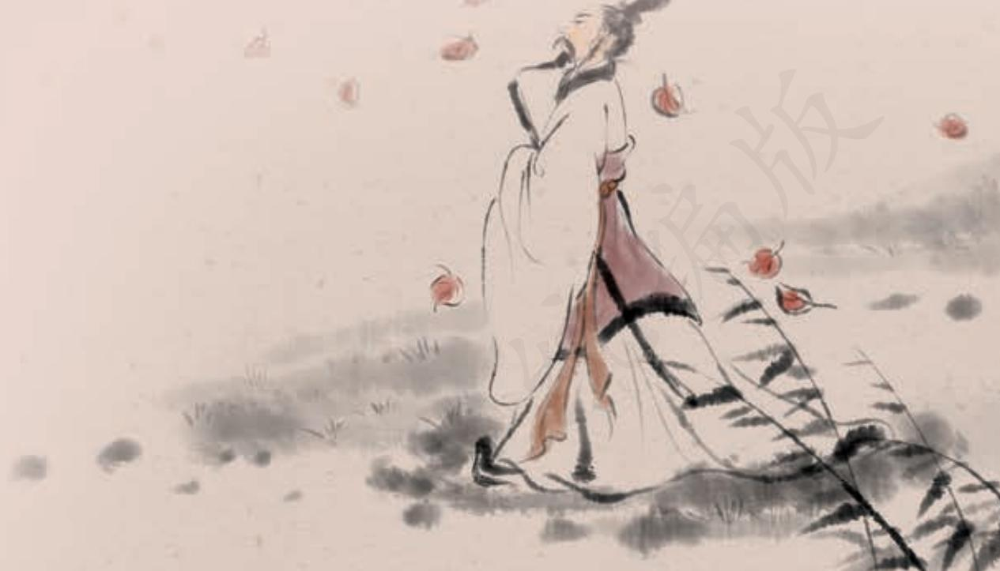

## 第三单元

历史是一面镜子，它映照着现实，也预示着未来。了解历史，不忘过去，才能看清前进的方向；尊重历史，以史为鉴，才能更好地走向未来。

历史著作在中国古代文化典籍中占有重要的位置。本单元选入了《史记》《汉书》中的两篇经典作品，我们可以从中窥见古代史家的历史观念、开创精神；选入的两篇史论，均意在劝诫，总结历史经验教训，为当时的社会政治服务，其观点至今仍然具有借鉴价值。

学习本单元，要“回到历史现场”，鉴赏作品的叙事艺术和说理艺术，领会其中体现的历史观念、家国情怀和担当精神；理解史家对笔下人物的认识和评价，把握论者的观点和论述方式，学习和借鉴他们思考社会现实问题的态度和方法；丰富文言文的语言积累，学会在具体语境中分辨词语的意义和用法，把握古今汉语的差异与联系。

# 屈原列传 a

司马迁

屈原者，名平，楚之同姓也。为楚怀王左徒b。博闻强志c，明于 治乱d，娴于辞令e。入则与王图议f 国事，以出号令；出则接遇宾客， 应对诸侯。王甚任g 之。

上官大夫与之同列h，争宠而心害其能i。怀王使屈原造为宪令j，屈平属k 草稿未定，上官大夫见而欲夺l 之，屈平不与。因谗之曰：“王使屈平为令，众莫不知。每一令出，平伐m 其功，曰以为n‘非我莫能为’也。”王怒而疏屈平。

屈平疾王听之不聪o 也，谗谄之蔽明p 也，邪曲之害公q 也，方正之 不容r 也，故忧愁幽思而作《离骚》。“离骚”者，犹离忧s 也。夫天者， 人之始也；父母者，人之本也。人穷则反本t，故劳苦倦极u，未尝不呼 天也；疾痛惨怛v，未尝不呼父母也。屈平正道直行，竭忠尽智以事其 君，谗人间之，可谓穷矣。信而见疑w，忠而被谤，能无怨乎？屈平之作 《离骚》，盖自怨生也x。《国风》好色而不淫，《小雅》怨诽而不乱y。若 《离骚》者，可谓兼之矣。上称帝喾a，下道齐桓b，中述汤、武c，以 刺世事d。明道德之广崇e，治乱之条贯f，靡g 不毕见。其文约h， 其辞微i，其志洁，其行廉。其称文小而其指极大j，举类迩而见义 远k。其志洁，故其称物芳l ；其行廉，故死而不容m。自疏濯淖污泥之 中n，蝉蜕于浊秽o，以浮游尘埃之外，不获世之滋垢p，皭然泥而不滓 者也q。推r 此志也，虽与日月争光可也。

屈平既绌s，其后秦欲伐齐，齐与楚从亲t。惠王u患之，乃令张仪详去秦，厚币委质事楚v，曰：“秦甚憎齐，齐与楚从亲，楚诚能绝齐w，秦愿献商於x 之地六百里。”楚怀王贪而信张仪，遂绝齐，使使如秦受地y。张仪诈之曰：“仪与王约六里，不闻六百里。”楚使怒去，归告怀王。怀王怒，大兴师伐秦。秦发兵击之，大破楚师于丹、淅z，斩首八万，虏楚将屈匄@7，遂取楚之汉中地。怀王乃悉发国中兵，以深入击秦，战于蓝田@8。魏闻之，袭楚至邓@9。楚兵惧，自秦归。而齐竟怒不救楚，楚大困。

明年#0，秦割汉中地与楚以和。楚王曰：“不愿得地，愿得张仪而甘心焉。”张仪闻，乃曰：“以一仪而当汉中地，臣请往如楚。”如楚，又因厚币用事者臣靳尚a，而设诡辩b 于怀王之宠姬郑袖。怀王竟听郑袖，复释去张仪。是时屈平既疏，不复在位，使于齐，顾反c，谏怀王曰：“何不杀张仪？”怀王悔，追张仪，不及。

其后诸侯共击楚，大破之，杀其将唐眜d。

时秦昭王与楚婚，欲与怀王会。怀王欲行，屈平曰：“秦，虎狼之国，不可信。不如毋行。”怀王稚子子兰劝王行：“奈何绝秦欢？”怀王卒行。入武关e，秦伏兵绝其后，因留怀王，以求割地。怀王怒，不听。亡走赵，赵不内。复之秦，竟死于秦而归葬。

长子顷襄王立，以其弟子兰为令尹。楚人既咎f 子兰以劝怀王入秦而不反也。屈平既嫉g 之，虽放流，眷顾楚国，系心怀王，不忘欲反，冀幸君之一悟，俗之一改也。其存h 君兴国而欲反覆i 之，一篇之中三致志j 焉。然终无可奈何，故不可以反。卒以此见怀王之终不悟也。人君无愚、智、贤、不肖，莫不欲求忠以自为k，举贤以自佐；然亡国破家相随属l，而圣君治国m 累世而不见者，其所谓忠者不忠，而所谓贤者不贤也。怀王以不知忠臣之分，故内惑于郑袖，外欺于张仪，疏屈平而信上官大夫、令尹子兰，兵挫地削，亡其六郡n，身客死于秦，为天下笑。此不知人之祸也。……

令尹子兰闻之，大怒，卒使上官大夫短 o 屈原于顷襄王，顷襄王怒 而迁 p 之。

屈原至于江滨，被发行吟泽畔，颜色憔悴，形容q 枯槁。渔父见而 问之曰：“子非三闾大夫r 欤？何故而至此？”屈原曰：“举世混浊而我 独清，众人皆醉而我独醒，是以见放s。”渔父曰：“夫圣人t 者，不凝 滞于物u，而能与世推移v。举世混浊，何不随其流而扬其波w ？众人 皆醉，何不 其糟而啜其醨a ？何故怀瑾握瑜b，而自令见放为？” 屈原曰：“吾闻之，新沐者必弹冠c，新浴者必振衣。人又谁能以身之 察察d，受物之汶汶e 者乎？宁赴常流f 而葬乎江鱼腹中耳，又安能以 晧晧之白g，而蒙世俗之温蠖h 乎？”乃作《怀沙》之赋。……于是怀 石，遂自投汨罗i 以死。

屈原既死之后，楚有宋玉、唐勒、景差之徒者，皆好辞j 而以赋 见称；然皆祖k 屈原之从容l 辞令，终莫敢直谏。其后楚日以削，数十 年，竟为秦所灭。……

太史公曰m ：“余读《离骚》《天问》《招魂》《哀郢》n，悲其志。 适o 长沙，观屈原所自沉渊，未尝不垂涕，想见其为人。及见贾生 吊之p，又怪屈原以彼其材q，游诸侯，何国不容，而自令若是！读 《服鸟赋》r，同死生s，轻去就t，又爽然自失u 矣。”

《史记》被鲁迅誉为“史家之绝唱，无韵之《离骚》”（《汉文学史纲要》）。《史记》和《离骚》有怎样的关联？读了《屈原列传》，相信你会有自己的理解。

《屈原列传》将屈原的生平事迹放在楚国日趋衰亡的大背景下展现，既有对史实的粗笔勾勒，又有对细节的工笔描绘，揭示了屈原个人的身世浮沉与国家生死存亡的内在联系，充分彰显了屈原的人格风采。阅读时要注意把握屈原的精神品质，品味作品精湛的叙事艺术。

前人评论说：“史公与屈子，实有同心。”（吴楚材、吴调侯《古文观止》）与《史记》中的其他许多传记不同，《屈原列传》在叙事中融入大段的议论，论中有情，直抒胸臆。阅读课文结尾的“太史公曰”一段，并拓展阅读《报任安书》，体会司马迁寄托在屈原身上的情感。

课文中有一些词语，形式上与现代汉语合成词相同，意义却不同，如“明年”“诡辩”“颜色”“形容”等。学习时，要特别注意这一类词语在具体语境中的意义，避免以今义理解古义。

背诵课文第3段。