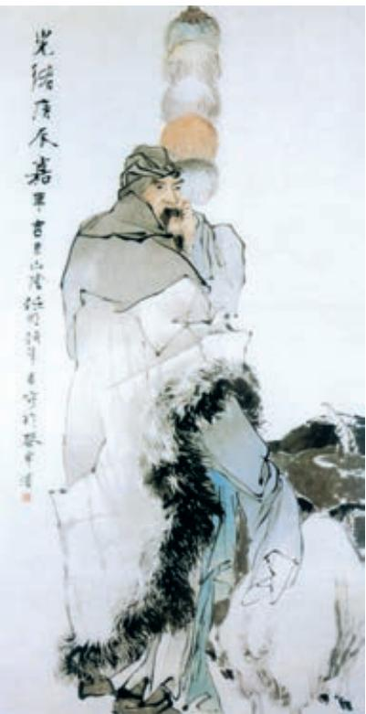

# 苏武传 a

班 固

武，字子卿b。少以父任，兄弟并为郎c。稍迁至栘 中厩监d。时汉连伐胡e，数通使相窥观f。匈奴留汉使 郭吉、路充国等，前后十余辈g。匈奴使来，汉亦留之 以相当h。天汉元年i，且鞮侯单于j 初立，恐汉袭之， 乃曰：“汉天子我丈人行也k。”尽归汉使路充国等。武帝 嘉其义l，乃遣武以中郎将使持节送匈奴使留在汉者m， 因厚赂n 单于，答其善意。武与副中郎将张胜及假吏o 常惠等募士p 斥候q 百余人俱，既至匈奴，置币遗单 于r ；单于益s 骄，非汉所望也t。

  
苏武牧羊  ［清］任伯年 作

方欲发使送武等a，会缑王与长水虞常等谋反匈奴中b。缑王者， 昆邪王c 姊子也，与昆邪王俱降汉，后随浞野侯没胡中d。及卫律所将 降者e，阴相与谋劫单于母阏氏归汉f。会武等至匈奴，虞常在汉时， 素与副张胜相知g，私候h 胜曰：“闻汉天子甚怨卫律，常能为汉伏弩 射杀之i，吾母与弟在汉，幸蒙其赏赐j。”张胜许之，以货物k 与常。

后月余，单于出猎，独阏氏子弟在l。虞常等七十余人欲发m，其 一人夜亡n，告o 之。单于子弟发兵与战。缑王等皆死，虞常生得p。 单于使卫律治其事q，张胜闻之，恐前语发r，以状语武s。武曰：“事 如此，此必及 t 我，见犯乃死，重负国 u。”欲自杀，胜、惠共止之。虞 常果引v 张胜。单于怒，召诸贵人w 议，欲杀汉使者。左伊秩訾x 曰： “即谋单于，何以复加 y ？宜皆降之 z。”

单于使卫律召武受辞@7。武谓惠等：“屈节辱命@8，虽生，何面目以 归汉！”引佩刀自刺。卫律惊，自抱持武，驰召医。凿地为坎@9，置 煴火#0，覆武其上，蹈#1其背以出血。武气绝，半日复息#2。惠等哭，

a〔方欲发使送武等〕（匈奴）正要派遣使者送苏武等人（返汉）。

m〔发〕发动，动手。

n〔亡〕逃跑。

o〔告〕告发。

p〔生得〕指被活捉。

q〔治其事〕审理这个案件。

r〔恐前语发〕担心以前（与虞常）的谈话泄露。发，暴露、泄露。

s〔以状语武〕把情况告诉苏武。状，情状、情况。

t〔及〕牵连。

u〔见犯乃死，重（zhòng）负国〕等到被（匈奴）侮 辱以后才死，更加对不起国家。见犯，指受到侮 辱。重，更加。

v〔引〕牵扯。

w〔贵人〕指贵族大臣。

x〔左伊秩訾（zī）〕匈奴王号。

y〔即谋单于，何以复加〕假使谋杀单于，又该用什么更重的处罚呢？意思是，因为密谋劫持阏氏、杀掉卫律就把汉使处死，处罚太重。

z〔宜皆降之〕应该让他们都投降。降，使动用法，使……投降。

@7〔受辞〕听取供词。

@8〔屈节辱命〕污损了节操，辜负了使命。

@9〔坎〕坑。

#0〔煴（yūn）火〕没有火焰的微火。

#1〔蹈〕同“搯（tāo）”，叩击，拍打。一说当作“焰”，熏。

#2〔复息〕又能呼吸。

舆a 归营。单于壮b 其节，朝夕遣人候问c 武，而收系d 张胜。

武益愈e，单于使使晓武f，会论虞常g，欲因此时降武。剑斩虞 常已，律曰：“汉使张胜谋杀单于近臣h，当死i。单于募降者赦罪。” 举剑欲击之，胜请降。律谓武曰：“副有罪，当相坐j。”武曰：“本无 谋k，又非亲属，何谓相坐l ？”复举剑拟之m，武不动。律曰：“苏 君，律前负汉归匈奴，幸蒙大恩，赐号称王。拥众数万，马畜弥山，富 贵如此！苏君今日降，明日复然。空以身膏草野n，谁复知之！”武不 应。律曰：“君因我降o，与君为兄弟；今不听吾计，后虽欲复见我，尚 可得乎？”武骂律曰：“汝为人臣子，不顾恩义，畔主背亲p，为降虏于 蛮夷q，何以汝为见r ？且单于信汝，使决人死生，不平心持正，反欲 斗两主，观祸败s。若知我不降明t，欲令两国相攻，匈奴之祸，从我 始矣 u。”

律知武终不可胁v，白单于。单于愈益欲降之。乃幽w 武置大窖 中，绝不饮食x。天雨雪y，武卧啮z 雪，与旃毛并咽之@7，数日不死。 匈奴以为神。乃徙武北海@8上无人处，使牧羝@9，羝乳乃得归#0。别其 官属常惠等各置他所#1。武既至海上，廪食不至#2，掘野鼠去草实而食 之a。杖汉节牧羊b，卧起操持，节旄尽落c。积五六年，单于弟於靬 王弋射海上d。武能网e 纺缴f，檠g 弓弩，於靬王爱之，给其衣食。 三岁余，王病，赐武马畜、服匿h、穹庐。王死后，人众徙去。其冬， 丁令i 盗武牛羊，武复穷厄j。

初，武与李陵俱为侍中k。武使匈奴，明年，陵降，不敢求l 武。 久之，单于使陵至海上，为武置酒设乐。因谓武曰：“单于闻陵与子卿 素厚，故使陵来说足下，虚心欲相待m。终不得归汉，空自苦亡人之地n， 信义安所见乎o ？前长君为奉车p，从至雍棫阳宫q，扶辇下除r，触 柱折辕s，劾大不敬t，伏剑自刎，赐钱二百万以葬。孺卿从祠河东后 土u，宦骑与黄门驸马争船v，推堕驸马河中溺死，宦骑亡，诏使孺卿 逐捕，不得，惶恐饮药而死。来时太夫人已不幸w，陵送葬至阳陵x。 子卿妇年少，闻已更嫁y 矣。独有女弟z 二人，两女一男@7，今复十余 年，存亡不可知。人生如朝露，何久自苦如此！陵始降时，忽忽如狂， 自痛负汉@8，加以老母系保宫@9。子卿不欲降，何以过陵#0 ？且陛下春 秋高a，法令亡常b，大臣亡罪夷灭c 者数十家，安危不可知，子卿尚复 谁为乎d ？愿听陵计，勿复有云e。”武曰：“武父子亡功德，皆为陛下 所成就f，位列将g，爵通侯h，兄弟亲近i，常愿肝脑涂地j。今得 杀身自效k，虽蒙斧钺汤镬l，诚甘乐之。臣事君，犹子事父也，子为 父死，亡所恨，愿勿复再言！”

陵与武饮数日，复曰：“子卿壹m 听陵言！”武曰：“自分n 已死久矣！王必欲降武，请毕今日之欢，效死于前o ！”陵见其至诚，喟然叹曰：“嗟乎，义士！ 陵与卫律之罪上通于天p ！”因泣下沾衿，与武决去 q。……

昭帝r 即位，数年，匈奴与汉和亲。汉求武等，匈奴诡言武死。后汉使复至匈奴，常惠请其守者s 与俱，得夜见汉使，具自陈道t。教使者谓单于，言天子射上林u 中，得雁，足有系帛书，言武等在某泽中。使者大喜，如惠语以让v 单于。单于视左右而惊，谢汉使曰：“武等实在。”……

单于召会w 武官属，前以降及物故x，凡随武还者九人。武以始元六年y 春至京师。……武留匈奴凡十九岁，始以强壮出，及还，须发尽白。

m〔壹〕一定。

n〔分（fèn）〕料想，断定。

o〔效死于前〕在您面前死去。

p〔上通于天〕意思是罪行严重，无以复加。通，达。

q〔决去〕告别离开。决，同“诀”，辞别、告别。

“苏武牧羊”的故事我们耳熟能详，但苏武出使前后的遭际、在匈奴经历的艰辛，其中种种细节我们未必清楚。阅读《苏武传》，可使我们进一步了解这些细节，更加深入地认识苏武其人。

《汉书》是一部“包举一代”（刘知几《史通》）的纪传体断代史，展现了西汉广阔的社会生活和各种人物的精神风貌，《苏武传》是其中的名篇。文章按时间顺序记叙了苏武出使匈奴、因变被扣、不惧威逼、不受利诱、苦守北海、持节不失的事迹，生动刻画了苏武这位爱国者的形象。阅读课文，注意梳理情节脉络，感受苏武的人格魅力，探寻他备尝艰辛却矢志不渝的精神力量源泉。

《苏武传》以叙事为主，却“不待论断而于序事之中即见其指”（顾炎武《日知录》），表达了作者对苏武的敬佩与赞美。作品精于剪裁，善用对比，灵活选取人物的典型语言，学习时要特别关注其叙事艺术，并体会作者寓于其中的情感倾向。

文中存在一些词类活用现象：如意动用法，像“单于壮其节”，“壮”意为“以（其节）为壮”；再如使动用法，像“反欲斗两主”，“斗”意为“使（两主）相斗”。从课文中再找出一些例子，体会它们在语境中的意义。