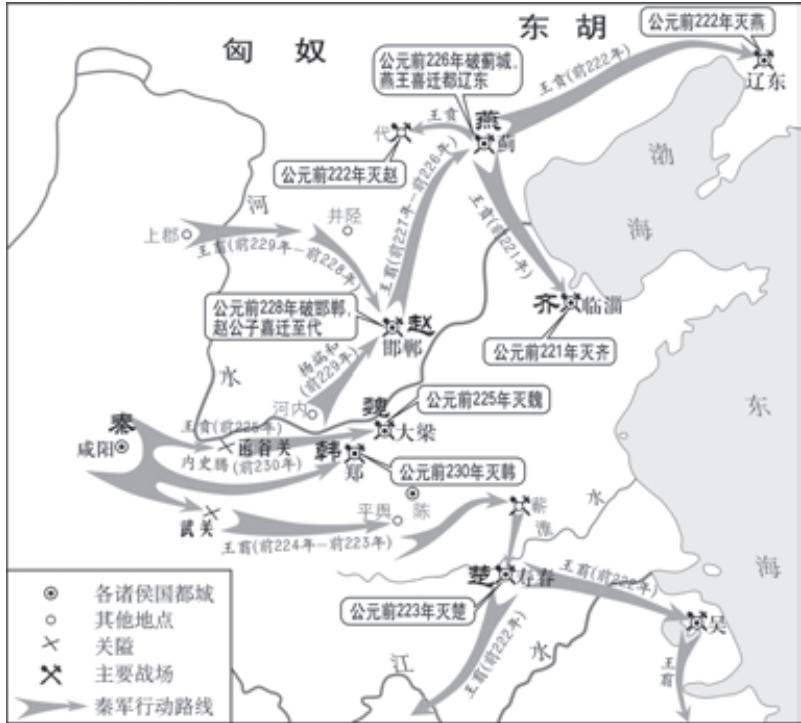

# 过秦论 a

贾 谊

秦孝公 b 据崤函 c 之固，拥雍州 d 之地，君臣固守以窥周室，有席 秦孝公②据崤函③之固，拥雍州④ 卷天下，包举宇内，囊括四海之意， 并吞八荒之心e。当是时也，商君佐 之，内立法度，务耕织，修守战之 具，外连衡f 而斗诸侯。于是秦人拱 手g 而取西河h之外。

孝公既没，惠文、武、昭襄i蒙故业，因遗策j，南取汉中，西举巴、蜀，东割膏腴之地，北收要害之郡k。诸侯恐惧，会盟而谋弱l 秦，不爱m 珍器重宝肥饶之地，以致n 天下之士，合从缔交，相与为一o。当此之时，齐有孟尝，赵有平原，楚有春申，魏有信陵p。

  
秦灭六国示意图

此四君者，皆明智而忠信，宽厚而爱人，尊贤而重士，约从离衡a，兼韩、 魏、燕、楚、齐、赵、宋、卫、中山之众。于是六国之士，有甯越、徐 尚、苏秦、杜赫之属为之谋b，齐明、周最、陈轸、召滑、楼缓、翟 景、苏厉、乐毅之徒通其意c，吴起、孙膑、带佗、倪良、王廖、田 忌、廉颇、赵奢之伦制其兵d。尝以十倍之地，百万之众，叩关e 而攻 秦。秦人开关延敌f，九国g 之师，逡巡h 而不敢进。秦无亡矢遗镞i 之费，而天下诸侯已困矣。于是从散约败，争割地而赂秦。秦有余力 而制其弊j，追亡逐北k，伏尸百万，流血漂橹l ；因利乘便，宰割天 下，分裂山河。强国请服，弱国入朝。延及孝文王、庄襄王m，享国之 日浅，国家无事。

及至始皇，奋六世之余烈n，振长策而御宇内o，吞二周p 而亡诸 侯，履至尊而制六合q，执敲扑而鞭笞天下r，威振四海。南取百越s 之地，以为桂林、象郡t ；百越之君，俯首系颈u，委命下吏v。乃使 蒙恬w 北筑长城而守藩篱x，却y 匈奴七百余里；胡人不敢南下而牧马， 士不敢弯弓而报怨。于是废先王之道，焚百家之言a，以愚黔首b； 隳c 名城，杀豪杰；收天下之兵，聚之咸阳，销锋镝d，铸以为金人 十二，以弱天下之民。然后践华为城，因河为池e，据亿丈之城f，临 不测之渊g，以为固。良将劲弩守要害之处，信臣h 精卒陈利兵而谁 何i。天下已定，始皇之心，自以为关中之固，金城j 千里，子孙帝王 万世之业也。

o〔振长策而御宇内〕意思是用武力来统治各国。振，举起。策，马鞭子。御，驾驭、统治。

p〔二周〕在东周王朝最后在位的周赧（nǎn）王时，东西周分治。西周都于河南东部旧王城，东周则都巩，史称“东西二周”。二周灭于秦始皇继位前，作者只是为了行文方便，才这样写的。

q〔履至尊而制六合〕登上皇帝的宝座控制天下。至尊，至高无上的地位，指帝位。六合，天地四方。

r〔执敲扑而鞭笞天下〕用严酷的刑罚来奴役天下的百姓。敲扑，行刑用的棍杖，短的叫“敲”，长的叫“扑”。

s〔百越〕古代越族居住在桂、浙、闽、粤等地，每个部落都有名称，统称“百越”。也叫“百粤”。

t〔以为桂林、象郡〕设置了桂林郡、象郡（在今广西一带）。

u〔俯首系颈〕意思是愿意降服。系颈，颈上系绳，表示投降。

v〔委命下吏〕（百越之君）把自己的性命交给狱官。下吏，下级官吏，这里指狱官。

w〔蒙恬〕秦将领。秦始皇时领兵三十万北逐匈奴，修筑长城。

x〔藩篱〕比喻边疆上的屏障。藩，篱笆。

始皇既没，余威震于殊俗k。然陈涉瓮牖绳枢l 之子，氓隶m 之人， 而迁徙之徒n 也；才能不及中人o，非有仲尼、墨翟之贤，陶朱、猗 顿p 之富；蹑足q 行伍之间，而倔起r 阡陌之中，率疲弊之卒，将数百 之众，转而攻秦；斩木为兵，揭s 竿为旗，天下云集响应，赢粮而 景从t。山东u 豪俊遂并起而亡秦族矣。

且夫天下非小弱也，雍州之地，崤函之固，自若v 也。陈涉之位， 非尊于齐、楚、燕、赵、韩、魏、宋、卫、中山之君也；锄櫌棘矜，非 铦于钩戟长铩也w ；谪戍x 之众，非抗y 于九国之师也；深谋远虑，行 军用兵之道，非及乡时z 之士也。然而成败异变，功业相反，何也？试 使山东之国与陈涉度长絜大@7，比权量力，则不可同年而语矣。然秦

生意而致富，所以后人常以“陶朱”为富人的代称。猗顿，春秋时鲁国人。他向陶朱公学致富之术，大畜牛羊于猗氏（今山西临猗）南部，积累了很多财物。

q〔蹑足〕置身，参与。

r〔倔起〕兴起。

s〔揭〕举。

t〔赢粮而景从〕（许多人）担着粮食如影随形地跟着（陈涉）。赢，担负。景，同“影”。

u〔山东〕崤山以东，代指东方诸国。

v〔自若〕意思是像是原来的样子。

w〔锄櫌（yōu）棘矜（qín），非铦（xiān）于钩戟长铩（shā）也〕农具木棍不如钩戟长矛锋利。櫌，同“耰”，碎土平田用的农具。棘矜，用酸枣木做的棍子。棘，酸枣木。这里的意思是农民军的武器，只有农具和木棍。铦，锋利。钩戟，带钩的戟。长铩，长矛。

x〔谪戍〕因有罪而被征调去守边。

y〔抗〕匹敌，相当。

z〔乡时〕先前。乡，同“向”。

@7〔度（duó）长絜（xié）大〕量量长短，比比大小。絜，衡量。

以区区之地，致万乘a 之势，序八州而朝同列b，百有余年矣；然后以 六合为家，崤函为宫；一夫作难c 而七庙隳d，身死人手e，为天下笑 者，何也？仁义不施而攻守之势异也f。

# 五代史伶官传序

欧阳修

呜呼！盛衰之理，虽曰天命，岂非人事 h 哉！原 i 庄宗 j 之所以得天下，与其所以失之者，可以知之矣。

世言晋王k 之将终也，以三矢赐庄宗而告之曰：“梁，吾仇也l； 燕王吾所立 m，契丹与吾约为兄弟 n，而皆背晋以归梁。此三者，吾遗 恨也。与尔三矢，尔其o 无忘乃父之志！”庄宗受而藏之于庙。其后 用兵，则遣从事p 以一少牢q 告庙r，请其矢s，盛以锦囊，负而前驱，

a〔万乘〕兵车万辆。表示军事力量强大。

b〔序八州而朝同列〕统理八州，使六国诸侯都来朝见。序，安置使有序。八州，兖州、冀州、青州、徐州、豫州、荆州、扬州、梁州。古时天下分九州，秦居雍州，六国分居其他八州。同列，指六国诸侯。秦与六国本来是同列诸侯。

c〔一夫作难（nàn）〕指陈涉起义。作难，起事。

姓朱邪，名赤心，有功于唐朝，赐姓名为李国昌），因出兵帮助唐朝镇压黄巢起义，受封为晋王。

l〔梁，吾仇也〕梁王朱温是我的仇敌。梁，黄巢部将朱温，投降唐朝，赐名全忠，受封为梁王。唐僖宗时，他设计谋杀李克用，李克用也屡次上表请求讨伐他。李克用曾长期与朱温交战。

m〔燕王吾所立〕刘仁恭本来是幽州将领，借李克用的势力夺取幽州，任卢龙节度使。后来刘仁恭归附朱温，他的儿子刘守光开始称燕王，后来称帝。这里称刘仁恭为燕王，是笼统的说法。

n〔契丹与吾约为兄弟〕李克用和契丹首领耶律阿保机订立盟约，结为兄弟，希望共同举兵攻打朱温。后来阿保机背盟，派人和朱温通好。

o〔其〕副词，表示祈使语气。

p〔从事〕官名，这里泛指一般属官。

q〔一少牢〕羊、猪各一头。古代祭祀用牛、羊、猪各一头叫“太牢”，用羊、猪各一头叫“少牢”。牢，祭祀用的牲畜。

r〔告庙〕天子或诸侯遇出巡、战争等重大事件而祭告祖庙。

s〔请其矢〕恭敬地取出他父亲（留下）的箭。请，敬辞，用以代替某些动词，表示恭敬、慎重。

及凯旋而纳之a。

方其系燕父子以组b，函梁君臣之首c，入于太庙，还矢先王，而告以成功，其意气之盛，可谓壮哉！及仇雠d 已灭，天下已定，一夫夜呼，乱者四应e，仓皇东出，未及见贼而士卒离散，君臣相顾，不知所归，至于誓天断发，泣下沾襟f，何其衰也！岂得之难而失之易欤？抑g 本h 其成败之迹，而皆自于人欤i ？《书》曰：“满招损，谦得益j。”忧劳可以兴国，逸豫k 可以亡身，自然之理也。

故方其盛也，举l 天下之豪杰，莫能与之争；及其衰也，数十伶人 困之m，而身死国灭n，为天下笑。夫祸患常积于忽微o，而智勇多困 于所溺p，岂独伶人也哉？

历史上有一些朝代，“其兴也勃焉，其亡也忽焉”（《左传》），如秦朝，如五代之后唐，其速亡的历史教训令后人感叹不已，常引以为鉴。《过秦论》和《五代史伶官传序》两篇文章，分别对秦朝和后唐灭亡的历史教训进行总结，得出了各自的结论。阅读课文，注意联系作者所处的时代背景，把握文章的主要观点及写作意图。

《过秦论》铺陈历史，形成对比和反差，水到渠成得出结论；《五代史伶官传序》纵说盛衰之理，却从一个细微的角度切入。《过秦论》以赋体写史论，多用夸张、对比，通篇一气贯注，气势充沛，铺张扬厉；《五代史伶官传序》以散体写史论，文字平易晓畅，简洁生动，感慨遥深。两种不同文体的写作方法和论述风格各具特色，须反复诵读，细加体会。

在现代汉语中，名词一般不作状语，但在古汉语中，名词作状语的现象时有出现。如“天下云集响应，赢粮而景从”中的“云”“响”“景”，均为名词作状语，意为“像云一样（集合）”“像回声一样（回应）”“像影子一样（跟随）”。从课文中再找一些例子，体会这种用法的特点。

背诵《过秦论》。