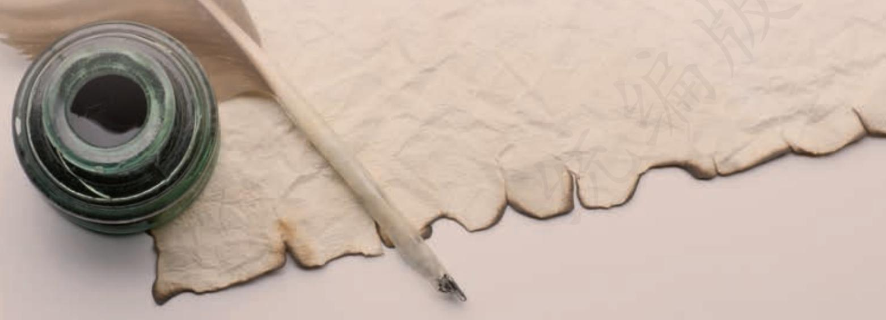
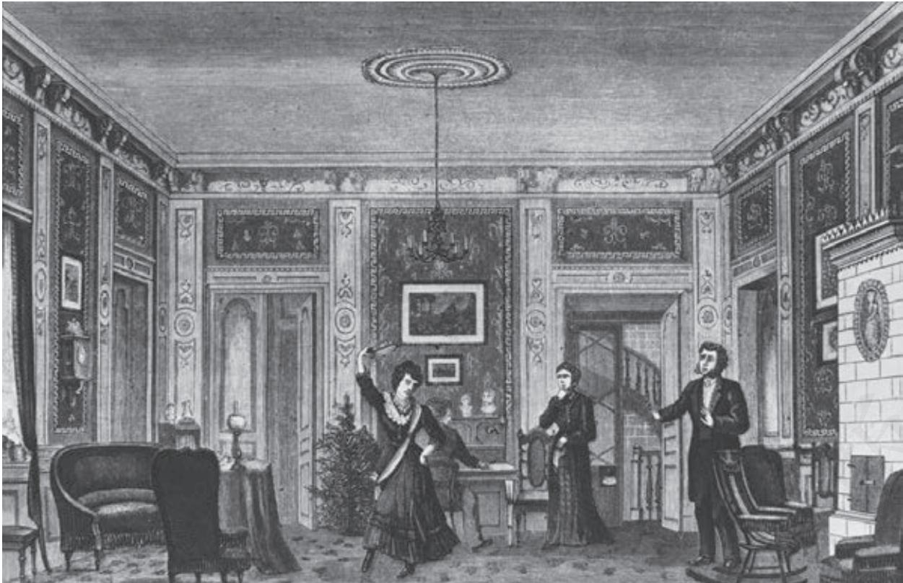

## 第四单元

外国文学作品反映了不同地区、国家和民族不同时期的社会风貌，展示了多种多样的文化现象，表现了人类广阔而丰富的心灵世界。阅读外国文学作品，可以开阔我们的视野，培养开放的文化心态，提升人文素养。

本单元学习外国戏剧和诗歌。《玩偶之家》是被誉为“现代戏剧之父”的易卜生的名作，作品表现的妇女解放、个性解放、社会解放的鲜明立场，及其所开创的“社会问题剧”样式，都有着世界性的影响；四首外国诗歌，风格多样，各臻其美，让我们领略诗歌世界的丰富多彩。

学习本单元，要理解作品的内涵，领会多样的文化观念，尝试探讨作品所反映的社会文化差异，感受人类精神世界的丰富。要着重把握戏剧的矛盾冲突，体会对话在推动情节、塑造形象、揭示主题等方面的作用；要通过诵读感受诗歌的氛围，体会意象和隐喻，把握诗歌语言和情感的内在节奏，体味诗歌意蕴。

12

# 玩偶之家a（节选）

易卜生

## 第三幕

海尔茂 （送她到门口）明天见，明天见，一路平安。我本来该送你回去，可是好在路很近。再见，再见。（林丹太太走出去，海尔茂关上大门回到屋子里）好了，好容易才把她打发走。这个女人真啰唆！

娜 拉 你累了吧，托伐？

海尔茂 一点儿都不累。

娜 拉 也不想睡觉？

海尔茂 一点儿都不想。精神觉得特别好。你呢？你好像又累又想睡。

娜 拉 是，我很累。我就要去睡觉。

海尔茂 你看！我不让你再跳舞不算错吧？

娜 拉 喔，你做的事都不错。

海尔茂 （亲她的前额）我的小鸟儿这回说话懂道理。你看见没有，今儿晚上阮克真高兴！

娜 拉 是吗？他居然很高兴？我没跟他说过话。

海尔茂 我也只跟他说了一两句。可是我好久没看见他兴致这么好了。（对她看了会儿，把身子凑过去）回到自己家里，静悄悄的只有咱们两个人，滋味多么好！喔，迷人的小东西！

娜 拉 别那么瞧我。

海尔茂 难道我不该瞧我的好宝贝儿——我一个人的亲宝贝儿？

a 选自《易卜生文集》第五卷（人民文学出版社1995年版）。潘家洵译。易卜生（1828—1906），挪威剧作家。《玩偶之家》的主要情节是：娜拉与丈夫海尔茂结婚八年，一直相信丈夫深爱着自己。多年前，娜拉为给海尔茂治病，伪造父亲的签名向海尔茂的同事、银行职员柯洛克斯泰借过一笔款子。柯洛克斯泰为保住自己的职位，以这件事威胁娜拉。海尔茂得知此事后，先是勃然大怒，在柯洛克斯泰归还当年的借据后又态度大变，以为娜拉会接受自己的“饶恕”。娜拉看穿了海尔茂的本质，领悟到自己在婚姻中只是丈夫的玩偶，毅然离家出走。

娜 拉 （走到桌子那边）今天晚上你别跟我说这些话。

海尔茂 （跟过来）你血管里还在跳塔兰特拉a——所以你今天晚上格外惹人爱。你听，楼上的客要走了。（声音放低些）娜拉，再过一会儿整个这所房子里就静悄悄的没有声音了。

娜 拉 我想是吧。

海尔茂 是啊，我的娜拉。咱们出去做客的时候我不大跟你说话，我故意避开你，偶然偷看你一眼，你知道为什么？因为我心里好像觉得咱们偷偷地在恋爱，偷偷地订了婚，谁也不知道咱们的关系。

娜 拉 是，是，是，我知道你的心都在我身上。

海尔茂 到了要回家的时候，我把披肩搭上你的滑溜的肩膀，围着你的娇嫩的脖子，我心里好像觉得你是我的新娘子，咱们刚结婚，我头一次把你带回家——头一次跟你待在一块儿，头一次陪着你这娇滴滴的小宝贝儿！今天晚上我什么都没想，只是想你一个人。刚才跳舞的时候，我看见你那些轻巧活泼的身段，我的心也跳得按捺不住了，所以那么早我就把你拉下楼。

  
《玩偶之家》演出图

娜 拉 走开，托伐！撒手，我不爱听这些话。

海尔茂 什么？你成心逗我吗，娜拉？你不爱听！难道我不是你丈夫？（有人敲大门）

娜 拉 （吃惊）你听见没有？

海尔茂 （走到门厅里）谁？

阮 克 （在外面）是我。我能不能进来坐会儿？

海尔茂 （低声叽咕）讨厌！这时候他还来干什么？（高声）等一等！（开门）请进，谢谢你从来不肯过门不入。

阮 克 我走过这儿好像听见你说话的声音，因此就忍不住想进来坐一坐。（四面望望）啊，这个亲热的老地方！你们俩在这儿真快活，真舒服！

海尔茂 刚才你在楼上好像也觉得很受用。

阮 克 很受用，为什么不受用？一个人活在世界上能享受为什么不享受？能享受多少就算多少，能享受多久就算多久。今晚的酒可真好。

海尔茂 香槟酒特别好。

阮 克 你也觉得好？我喝了那么多，说起来别人也不信。

娜 拉 托伐喝的香槟酒也不少。

阮 克 是吗？

娜 拉 真的，他喝了酒兴致总是这么好。

阮 克 辛苦了一天，晚上喝点儿酒没什么不应该。

海尔茂 辛苦了一天！这句话我可不配说。

阮 克 （在海尔茂肩膀上拍一下）我倒可以说这句话。

娜 拉 阮克大夫，你是不是刚做完科学研究？

阮 克 一点儿都不错。

海尔茂 你听！小娜拉也谈起科学研究来了！

娜 拉 结果怎么样，是不是可以给你道喜？

阮 克 可以。

娜 拉 这么说，结果很好？

阮 克 好极了，对大夫也好，对病人也好，结果是确实无疑的。

娜 拉 （追问）确实无疑？

阮 克 绝对地确实无疑。知道了这样的结果，你说难道我还不应该痛快一晚上？

娜 拉 不错，很应该，阮克大夫。

海尔茂 我也这么说，只要你明天不还账。

阮 克 在这世界上没有白拿的东西，什么全都得还账。

娜 拉 阮克大夫，我知道你很喜欢化装跳舞会。

阮 克 是，只要有新奇打扮，我就喜欢。

娜 拉 我问你，下次化装跳舞会咱们俩应该打扮成什么？

海尔茂 不懂事的孩子！已经想到下次跳舞会了！

阮 克 你问咱们俩打扮成什么？我告诉你，你打扮成个仙女。

海尔茂 好，可是仙女该怎么打扮？

阮 克 仙女不用打扮，只穿家常衣服就行。

海尔茂 你真会说！你自己打扮成什么角色呢？

阮 克 喔，我的好朋友，我早打定主意了。

海尔茂 什么主意？

阮 克 下次开化装跳舞会的时候，我要扮隐身人。

海尔茂 这话真逗人。

阮 克 我要戴一顶大黑帽子——你们没听说过眼睛瞧不见的帽子吗？帽子一套在头上，人家就看不见你了。

海尔茂 （忍住笑）是，是。

阮 克 哦，我忘了进来干什么了。海尔茂，给我一支雪茄烟——要那种黑的哈瓦那。

海尔茂 请。（把雪茄烟盒递过去）

阮 克 （拿了一支烟，把烟头切掉）谢谢。

娜 拉 （给他划火柴）我给你点烟。

阮 克 谢谢，谢谢！（娜拉拿着火柴，阮克就着火点烟）现在我要跟你们告别了！

海尔茂 再见，再见！老朋友！

娜 拉 阮克大夫，祝你安眠。

阮 克 谢谢你。

娜 拉 你也应该照样祝我。

阮 克 祝你？好吧，既然你要我说，我就说。祝你安眠，谢谢你给我点烟。阮克向他们点点头，走出去

海尔茂 （低声）他喝得太多了。

娜 拉 （心不在焉）大概是吧。（海尔茂从衣袋里掏出一串钥匙来，走进门厅）托伐，你出去干什么？

海尔茂 我把信箱倒一倒，里头东西都满了，明天早上报纸装不下了。

娜 拉 今晚你工作不工作？

海尔茂 你不是知道我今晚不工作吗？唔，这是怎么回事？有人弄过锁。

娜 拉 弄过锁？

海尔茂 一定是。这是怎么回事？我想用人不会——？这儿有只撅折的头发夹子。娜拉，这是你常用的。

娜 拉 （急忙接嘴）一定是孩子们——

海尔茂 你得管教他们别这么胡闹。好！好容易开开了。（把信箱里的信件拿出来，朝着厨房喊道）爱伦，爱伦，把门厅的灯吹灭了。（拿着信件回到屋里，关上门）你瞧，攒了这么一大堆。（把整叠信件翻过来）哦，这是什么？

娜 拉 （在窗口）那封信！喔，托伐，别看！

海尔茂 有两张名片，是阮克大夫的。

娜 拉 阮克大夫的？

海尔茂 （瞧名片）阮克大夫。这两张名片在上头，一定是他刚扔进去的。

娜 拉 名片上写着什么没有？

海尔茂 他的名字上头有个黑十字。你瞧，多么不吉利！好像他给自己报死信。

娜 拉 他是这意思。

海尔茂 什么！你知道这件事？他跟你说过什么没有？

娜 拉 他说了。他说给咱们这两张名片的意思就是跟咱们告别。他以后就在家里关着门等死。

海尔茂 真可怜！我早知道他活不长，可是没想到这么快！像一只受伤的野兽爬到窝里藏起来！

娜 拉 一个人到了非死不可的时候最好还是静悄悄地死。托伐，你说对不对？

海尔茂 （走来走去）这些年他跟咱们的生活已经结合成一片，我不能想象他会离开咱们。他的痛苦和寂寞比起咱们的幸福好像乌云衬托着太阳，苦乐格外分明。这样也许倒好——至少对他很好。（站住）娜拉，对于咱们也未必不好。现在只剩下咱们俩，靠得更紧了。（搂着她）亲爱的宝贝儿！我总是觉得把你搂得不够紧。娜拉，你知道不知道，我常常盼望有桩危险事情威胁你，好让我拼着命，牺牲一切去救你。

娜 拉 （从他怀里挣出来，斩钉截铁的口气）托伐，现在你可以看信了。

海尔茂 不，不，今晚我不看信。今晚我要陪着你，我的好宝贝儿。

娜 拉 想着快死的朋友，你还有心肠陪我？

海尔茂 你说的不错。想起这件事咱们心里都很难受。丑恶的事情把咱们分开了，想起死人真扫兴。咱们得想法子撇开这些念头。咱们暂且各自回到屋里去吧。

娜 拉 （搂着他脖子）托伐！明天见！明天见！

海尔茂 （亲她的前额）明天见，我的小鸟儿。好好儿睡觉，娜拉！我去看信了。他拿了那些信走进自己的书房，随手关上门。

娜 拉 （瞪着眼瞎摸，抓起海尔茂的舞衣披在自己身上，急急忙忙，断断续续，哑着嗓子，低声自言自语）从今以后再也见不着他了！永远见不着了，永远见不着了。（把披肩蒙在头上）也见不着孩子们了！永远见不着了！喔，漆黑冰凉的水！没底的海！快点儿完事多好啊！现在他已经拿着信了，正在看！喔，还没看。再见，托伐！再见，孩子们！她正朝着门厅跑出去，海尔茂猛然推开门，手里拿着一封拆开的信，站在门口。

海尔茂 娜拉！

娜 拉 （叫起来）啊！

海尔茂 这是谁的信？你知道信里说的什么事？

娜 拉 我知道。快让我走！让我出去a ！

海尔茂 （拉住她）你上哪儿去？

娜 拉 （竭力想脱身）别拉着我，托伐。

海尔茂 （惊慌倒退）真有这件事？他信里的话难道是真的？不会，不会，不会是真的。

娜 拉 全是真的。我只知道爱你，别的什么都不管。

海尔茂 哼，别这么花言巧语的！

娜 拉 （走近他一步）托伐！

海尔茂 你这坏东西——干的好事情！

娜 拉 让我走——你别拦着我！我做的坏事不用你担当！

海尔茂 不用装腔作势给我看。（把出去的门锁上）我要你老老实实把事情招出来，不许走。你知道不知道自己干的什么事？快说！

<table><tr><td>娜拉不错，这么报答你。 海尔茂你把我一生幸福全都葬送了。我的前途也让你断送了。喔，想</td><td>娜拉（眼睛盯着他，态度越来越冷静）嗯，现在我才完全明白了。 海尔茂（走来走去）嘿！好像做了一场噩梦醒过来！这八年工夫 我最得意、最喜欢的女人—没想到是个伪君子，是个撒谎的 人比这还坏—是个犯罪的人。真是可恶极了！哼！哼！ （娜拉不作声，只用眼睛盯着他）其实我早就该知道。我早该 料到这一步。你父亲的坏德行—（娜拉正要说话）少说话！ 你父亲的坏德行，你全都沾上了不信宗教，不讲道德，没 有责任心。当初我给他遮盖，如今遭了这么个报应！我帮你父 亲都是为了你，没想到现在你这么报答我！</td></tr><tr><td>娜拉我死了你就没事了。</td><td>起来真可怕！现在我让一个坏蛋抓在手心里。他要我怎么样我 就得怎么样，他要我干什么我就得干什么。他可以随便摆布 我，我不能不依他。我这场大祸都是一个下贱女人惹出来的！ 海尔茂哼，少说骗人的话。你父亲从前也老有那么一大套。照你说， 就是你死了，我有什么好处？一点儿好处都没有。他还是可以</td></tr><tr><td>娜拉（冷静安详）我明白。</td><td>把事情宣布出去，人家甚至还会疑惑我是跟你串通一气的，疑 惑是我出主意撺掇你干的。这些事情我都得谢谢你——结婚以 来我疼了你这些年，想不到你这么报答我。现在你明白你给我 惹的是什么祸吗？ 海尔茂 这件事真是想不到，我简直摸不着头脑。可是咱们好歹得商量 个办法。把披肩摘下来。摘下来，听见没有！我先得想个办法 稳住他，这件事无论如何不能让人家知道。咱们俩，表面上照</td></tr><tr><td>过去开门）</td><td>爱伦（披着衣服在门厅里）太太，您有封信。</td></tr><tr><td></td><td>海尔茂给我。（把信抢过来，关上门）果然是他的。你别看。我念给</td></tr><tr><td></td><td>你听。</td></tr><tr><td>娜拉快念！</td><td>海尔茂（凑着灯光）我几乎不敢看这封信。说不定咱们俩都会完蛋。 也罢，反正总得看。（慌忙拆信，看了几行之后发现信里夹着</td></tr><tr><td></td><td>一张纸，马上快活得叫起来）娜拉！（娜拉莫名其妙地瞧着他） 海尔茂娜拉！喔，别忙！让我再看一遍！不错，不错！我没事了！娜</td></tr><tr><td>娜拉我呢？</td><td>拉，我没事了！</td></tr><tr><td></td><td>海尔茂当然你也没事了，咱们俩都没事了。你看，他把借据还你了。 他在信里说，这件事非常抱歉，要请你原谅，他又说他现在交 了运—喔，管他还写些什么。娜拉，咱们没事了！现在没人 能害你了。喔，娜拉，娜拉—咱们先把这害人的东西消灭了 再说。让我再看看—（朝着借据瞟了一眼）喔，我不想再看</td></tr><tr><td></td><td>娜拉 这三天我真不好过。 海尔茂你心里难过，想不出好办法，只能喔，现在别再想那可怕 的事情了。我们只应该高高兴兴地多说几遍：“现在没事了， 现在没事了！”听见没有，娜拉！你好像不明白。我告诉你， 现在没事了。你为什么绷着脸不说话？喔，我的可怜的娜拉。 我明白了，你以为我还没饶恕你。娜拉，我赌咒，我已经饶恕</td></tr><tr><td>娜拉这倒是实话。</td><td>你了。我知道你于那件事都是因为爱我。 海尔茂你正像做老婆的应该爱丈夫那样地爱我。只是你没有经验，用 错了方法。可是难道因为你自己没主意，我就不爱你吗？我决 不会。你只要一心一意依赖我，我会指点你，教导你。正因为 你自己没办法，所以我格外爱你，要不然我还算什么男子汉大 丈夫？刚才我觉得好像天要塌下来，心里一害怕，就说了几句 不好听的话，你千万别放在心上。娜拉，我已经饶恕你了。我 赌咒不再埋怨你。</td></tr></table>

娜 拉 谢谢你饶恕我。（从右边走出去）

海尔茂 别走！（向门洞里张望）你要干什么？

娜 拉 （在里屋）我去脱掉跳舞的服装。

海尔茂 （在门洞里）好，去吧。受惊的小鸟儿，别害怕，定定神，把心静下来。你放心，一切事情都有我。我的翅膀宽，可以保护你。（在门口走来走去）喔，娜拉，咱们的家多可爱，多舒服！你在这儿很安全，我可以保护你，像保护一只从鹰爪子底下救出来的小鸽子一样。我不久就能让你那颗扑扑跳的心定下来，娜拉，你放心。到了明天，事情就不一样了，一切都会恢复老样子。我不用再说我已经饶恕你，你心里自然会明白我不是说假话。难道我舍得把你撵出去？别说撵出去，就说是责备，难道我舍得责备你？娜拉，你不懂得男子汉的好心肠。要是男人饶恕了他老婆——真正饶恕了她，从心坎里饶恕了她——他心里会有一股没法子形容的好滋味。从此以后他老婆越发是他私有的财产。做老婆的就像重新投了胎，不但是她丈夫的老婆，并且还是她丈夫的孩子。从今以后，你就是我的孩子，我的吓坏了的可怜的小宝贝儿。别着急，娜拉，只要你老老实实对待我，你的事情都由我做主，都由我指点。（娜拉换了家常衣服走进来）怎么，你还不睡觉？又换衣服干什么？

娜 拉 不错，我把衣服换掉了。

海尔茂 这么晚还换衣服干什么？

娜 拉 今晚我不睡觉。

海尔茂 可是，娜拉——

娜 拉 （看自己的表）时候还不算晚。托伐，坐下，咱们有好些话要谈一谈。（她在桌子一头坐下）

海尔茂 娜拉，这是什么意思？你的脸色铁板冰冷的——

娜 拉 坐下。一下子说不完。我有好些话跟你谈。

海尔茂 （在桌子那一头坐下）娜拉，你把我吓了一大跳。我不了解你。

娜 拉 这话说得对，你不了解我，我也到今天晚上才了解你。别打岔。听我说下去。托伐，咱们必须把总账算一算。

海尔茂 这话怎么讲？

娜 拉 （顿了一顿）现在咱们面对面坐着，你心里有什么感想？

海尔茂 我有什么感想？

娜 拉 咱们结婚已经八年了。你觉得不觉得，这是头一次咱们夫妻正

正经经谈谈话？

海尔茂 正正经经！这四个字怎么讲？

娜 拉 这整整的八年——要是从咱们认识的时候算起，其实还不止八年——咱们从来没在正经事情上头谈过一句正经话。

海尔茂 难道要我经常把你不能帮我解决的事情麻烦你？

娜 拉 我不是指着你的业务说。我说的是，咱们从来没坐下来正正经经细谈过一件事。

海尔茂 我的好娜拉，正经事跟你有什么相干？

娜 拉 咱们的问题就在这儿！你从来就没了解过我。我受尽了委屈，先在我父亲手里，后来又在你手里。

海尔茂 这是什么话！你父亲和我这么爱你，你还说受了我们的委屈！

娜 拉 （摇头）你们何尝真爱过我，你们爱我只是拿我消遣。

海尔茂 娜拉，这是什么话！

娜 拉 托伐，这是老实话。我在家跟父亲过日子的时候，他把他的意见告诉我，我就跟着他的意见走。要是我的意见跟他不一样，我也不让他知道，因为他知道了会不高兴。他叫我“泥娃娃孩子”，把我当作一件玩意儿，就像我小时候玩我的泥娃娃一样。后来我到你家来住着——

海尔茂 用这种字眼形容咱们的夫妻生活简直不像话！

娜 拉 （满不在乎）我是说，我从父亲手里转移到了你手里。跟你在一块儿，事情都归你安排。你爱什么我也爱什么，或者假装爱什么——我不知道是真还是假——也许有时候真，有时候假。现在我回头想一想，这些年我在这儿简直像个要饭的叫花子，要一口，吃一口。托伐，我靠着给你耍把戏过日子。可是你喜欢我这么做。你和我父亲把我害苦了。我现在这么没出息都要怪你们。

海尔茂 娜拉，你真不讲理，真不知好歹！你在这儿过的日子难道不快活？

娜 拉 不快活。过去我以为快活，其实不快活。

海尔茂 什么！不快活！

娜 拉 说不上快活，不过说说笑笑凑个热闹罢了。你一向待我很好。可是咱们的家只是一个玩儿的地方，从来不谈正经事。在这儿我是你的“玩偶老婆”，正像我在家里是我父亲的“玩偶女儿”一样。我的孩子又是我的泥娃娃。你逗着我玩儿，我觉得有意思，正像我逗孩子们，孩子们也觉得有意思。托伐，这就是咱们的夫妻生活。

海尔茂 你这段话虽然说得太过火，倒也有点儿道理。可是以后的情形就不一样了。玩耍的时候过去了，现在是受教育的时候了。

娜 拉 谁的教育？我的教育还是孩子们的教育？

海尔茂 两方面的，我的好娜拉。

娜 拉 托伐，你不配教育我怎样做个好老婆。

海尔茂 你怎么说这句话？

娜 拉 我配教育我的孩子吗？

海尔茂 娜拉！

娜 拉 刚才你不是说不敢再把孩子交给我吗？

海尔茂 那是气头上的话，你老提它干什么？

娜 拉 其实你的话没说错。我不配教育孩子。要想教育孩子，先得教育我自己。你没资格帮我的忙。我一定得自己干。所以现在我要离开你。

海尔茂 （跳起来）你说什么？

娜 拉 要想了解我自己和我的环境，我得一个人过日子，所以我不能再跟你待下去。

海尔茂 娜拉！娜拉！

娜 拉 我马上就走。克里斯蒂纳一定会留我过夜。

海尔茂 你疯了！我不让你走！你不许走！

娜 拉 你不许我走也没用。我只带自己的东西。你的东西我一件都不要，现在不要，以后也不要。

海尔茂 你怎么疯到这步田地！

娜 拉 明天我要回家去——回到从前的老家去。在那儿找点儿事情做也许不太难。

海尔茂 喔，像你这么没经验——

娜 拉 我会努力去吸取。

海尔茂 丢了你的家，丢了你丈夫，丢了你儿女！不怕人家说什么话！

娜 拉 人家说什么不在我心上。我只知道我应该这么做。

海尔茂 这话真荒唐！你就这么把你最神圣的责任扔下不管了？

娜 拉 你说什么是我最神圣的责任？

海尔茂 那还用我说？你最神圣的责任是你对丈夫和儿女的责任。

娜 拉 我还有别的同样神圣的责任。

海尔茂 没有的事！你说的是什么责任？

娜 拉 我说的是我对自己的责任。

海尔茂 别的不用说，首先你是一个老婆，一个母亲。

娜 拉 这些话现在我都不信了。现在我只信，首先我是一个人，跟你一样的一个人——至少我要学做一个人。托伐，我知道大多数人赞成你的话，并且书本里也是这么说的。可是从今以后我不能一味相信大多数人说的话，也不能一味相信书本里说的话。什么事情我都要用自己脑子想一想，把事情的道理弄明白。

海尔茂 难道你不明白你在自己家庭的地位？难道在这些问题上没有颠扑不破的道理指导你？难道你不信仰宗教？

娜 拉 托伐，不瞒你说，我真不知道宗教是什么。

海尔茂 你这话怎么讲？

娜 拉 除了行坚信礼的时候牧师对我说的那套话，我什么都不知道。牧师告诉过我，宗教是这个，宗教是那个。等我离开这儿一个人过日子的时候，我也要把宗教问题仔细想一想。我要仔细想一想，牧师告诉我的话究竟对不对，对我合用不合用。

海尔茂 喔，从来没听说过这种话！并且还是从这么个年轻女人嘴里说出来的！要是宗教不能带你走正路，让我唤醒你的良心来帮助你——你大概还有点儿道德观念吧？要是没有，你就干脆说没有。

娜 拉 托伐，这个问题不容易回答。我实在不明白。这些事情我摸不清。我只知道我的想法跟你的想法完全不一样。我也听说，国家的法律跟我心里想的不一样，可是我不信那些法律是正确的。父亲病得快死了，法律不许女儿给他省烦恼。丈夫病得快死了，法律不许老婆想法子救他的性命！我不信世界上有这种不讲理的法律。

海尔茂 你说这些话像个小孩子。你不了解咱们的社会。

娜 拉 我真不了解。现在我要去学习。我一定要弄清楚，究竟是社会正确，还是我正确。

海尔茂 娜拉，你病了，你在发烧说胡话。我看你像精神错乱了。

娜 拉 我的脑子从来没像今天晚上这么清醒、这么有把握。

海尔茂 你这么清醒、这么有把握，居然要丢掉丈夫和儿女？

娜 拉 一点儿不错。

海尔茂 这么说，只有一句话讲得通。

娜 拉 什么话？

海尔茂 那就是你不爱我了。

娜 拉 不错，我不爱你了。

海尔茂 娜拉！你忍心说这话！

娜 拉 托伐，我说这话心里也难受，因为你一向待我很不错。可是我不能不说这句话。现在我不爱你了。

海尔茂 （勉强管住自己）这也是你清醒的有把握的话？

娜 拉 一点儿不错。所以我不能再在这儿待下去。

海尔茂 你能不能说明白，我究竟做了什么事使你不爱我？

娜 拉 能。就因为今天晚上奇迹没出现，我才知道你不是我理想中的那种人。

海尔茂 这话我不懂，你再说清楚点儿。

娜 拉 我耐着性子整整等了八年，我当然知道奇迹不会天天有。后来大祸临头的时候，我曾经满怀信心地跟自己说：“奇迹来了！”柯洛克斯泰把信扔在信箱里以后，我绝没想到你会接受他的条件。我满心以为你一定会对他说“尽管宣布吧”，而且你说了这句话之后，还一定会—

海尔茂 一定会怎么样？叫我自己的老婆出丑丢脸，让人家笑骂？

娜 拉 我满心以为你说了那句话之后，还一定会挺身出来，把全部责任担在自己肩膀上，对大家说：“事情都是我干的。”

海尔茂 娜拉——

娜 拉 你以为我会让你替我担当罪名吗？不，当然不会。可是我的话怎么比得上你的话那么容易叫人家相信？这正是我盼望它发生又怕它发生的奇迹。为了不让奇迹发生，我已经准备自杀。

海尔茂 娜拉，我愿意为你日夜工作，我愿意为你受穷受苦。可是男人不能为他所爱的女人牺牲自己的名誉。

娜 拉 千千万万的女人都为男人牺牲过名誉。

海尔茂 喔，你心里想的嘴里说的都像个傻孩子。

娜 拉 也许是吧。可是你想的和说的也不像我可以跟他过日子的男人。后来危险过去了——你不是怕我有危险，是怕你自己有危险——不用害怕了，你又装作没事人儿了。你又叫我跟从前一样乖乖地做你的小鸟儿，做你的泥娃娃，说什么以后要格外小心保护我，因为我那么脆弱不中用。（站起来）托伐，就在那当口，我好像忽然从梦里醒过来，我简直跟一个陌生人同居了八年，给他生了三个孩子。喔，想起来真难受！我恨透了自己没出息！

海尔茂 （伤心）我明白了，我明白了，在咱们中间出现了一道深沟。可是，娜拉，难道咱们不能把它填平吗？

娜 拉 照我现在这样子，我不能跟你做夫妻。

海尔茂 我有勇气重新再做人。

娜 拉 在你的泥娃娃离开你之后——也许有。

海尔茂 要我跟你分手！不，娜拉，不行！这是不能设想的事情。

娜 拉 （走进右边屋子）要是你不能设想，咱们更应该分开。（拿着外套、帽子和旅行小提包又走出来，把东西搁在桌子旁边椅子上）

海尔茂 娜拉，娜拉，现在别走，明天再走。

娜 拉 （穿外套）我不能在陌生人家里过夜。

海尔茂 难道咱们不能像哥哥妹妹那么过日子？

娜 拉 （戴帽子）你知道那种日子长不了。（围披肩）托伐，再见。我不去看孩子了。我知道现在照管他们的人比我强得多。照我现在这样子，我对他们一点儿用处都没有。

海尔茂 可是，娜拉，将来总有一天——

娜 拉 那就难说了。我不知道我以后会怎么样。

海尔茂 无论怎么样，你还是我的老婆。

娜 拉 托伐，我告诉你。我听人说，要是一个女人像我这样从她丈夫家里走出去，按法律说，她就解除了丈夫对她的一切义务。不管法律是不是这样，我现在把你对我的义务全部解除。你不受我拘束，我也不受你拘束。双方都有绝对的自由。拿去，这是你的戒指。把我的也还我。

海尔茂 连戒指都要还？

娜 拉 要还。

海尔茂 拿去。

娜 拉 好。现在事情完了。我把钥匙都搁在这儿。家里的事，用人都知道——她们比我更熟悉。明天我动身之后，克里斯蒂纳会来给我收拾我从家里带来的东西。我会叫她把东西寄给我。

海尔茂 完了！完了！娜拉，你永远不会再想我了吧？

娜 拉 喔，我会时常想到你，想到孩子们，想到这个家。

海尔茂 我可以给你写信吗？

娜 拉 不，千万别写信。

海尔茂 可是我总得给你寄点儿——

娜 拉 什么都不用寄。

海尔茂 你手头不方便的时候我得帮点儿忙。

娜 拉 不必，我不接受陌生人的帮助。

海尔茂 娜拉，难道我永远只是个陌生人？

娜 拉 （拿起手提包）托伐，那就要等奇迹中的奇迹发生了。

海尔茂 什么叫奇迹中的奇迹？

娜 拉 那就是说，咱们俩都得改变到——喔，托伐，我现在不信世界上有奇迹了。

海尔茂 可是我信。你说下去！咱们俩都得改变到什么样子——？

娜 拉 改变到咱们在一块儿过日子真正像夫妻。再见。（她从门厅走出去）

海尔茂 （倒在靠门的一张椅子里，双手蒙着脸）娜拉！娜拉！（四面望望，站起身来）屋子空了。她走了。（心里闪出一个新希望）啊！奇迹中的奇迹——楼下砰的一响传来关大门的声音。

——剧终

## 学习提示

1879年《玩偶之家》的首演，曾经给欧洲社会带来如同暴风雨一般猛烈的震撼，因为这部剧作尖锐地提出了家庭中妇女地位的问题，给当时欧洲保守而又伪善的社会道德一记响亮的耳光，由此它也成为欧洲批判现实主义戏剧的经典。

课文节选的第三幕是全剧的高潮，同时也是结局部分。阅读时，注意抓住人物言行前后的变化，分析娜拉和海尔茂这两个人物的性格，理解他们之间矛盾冲突的本质，从而把握作品的思想意蕴。

《玩偶之家》属于“社会问题剧”，这是易卜生创造的戏剧类型，强调在舞戏剧中直接讨论当代社会的重要问题。阅读时，要注意结合作品体会这些特点，还要注意分析作品中的“戏剧性事件”以及“突转”手法的运用，领略剧作家独特的艺术创造。