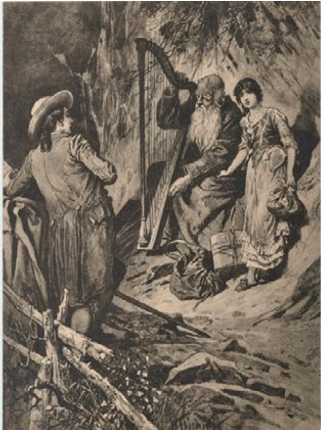
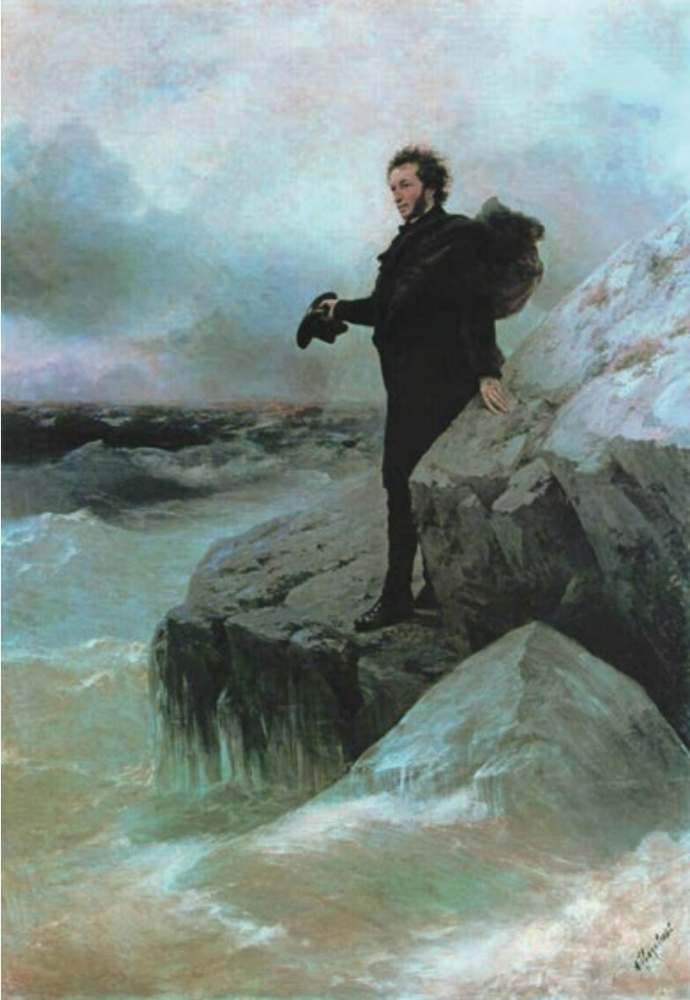

# 迷娘（之一）a

德

你知道吗，那柠檬花开的地方，

茂密的绿叶中，橙子金黄，

蓝天上送来宜人的和风，

桃金娘静立，月桂梢头高昂，

你可知道那地方？

前往，前往，

我愿跟随你，爱人啊，随你前往！

  
歌唱的迷娘和威廉·迈斯特

你可知道那所房子，圆柱成行，  
厅堂辉煌，居室宽敞明亮，  
大理石立像凝望着我：  
人们把你怎么了，可怜的姑娘？  
你可知道那所房子？  
前往，前往，  
我愿跟随你，恩人啊，随你前往！  
你知道吗，那云径和山岗？  
驴儿在雾中觅路前进，  
岩洞里有古老龙种的行藏，  
危崖欲坠，瀑布奔忙，  
你可知道那座山岗？  
前往，前往，  
我愿跟随你，父亲啊，随你前往！

## 致大海 a

普希金

再见吧，自由的元素！最后一次了，在我眼前你的蓝色的浪头翻滚起伏，你的骄傲的美闪烁壮观。

仿佛友人的忧郁的絮语，仿佛他别离一刻的招呼，最后一次了，我听着你的喧声呼唤，你的沉郁的吐诉。

我全心渴望的国度啊，大海！多么常常地，在你的岸上我静静地，迷惘地徘徊，苦思着我那珍爱的愿望。

啊，我多么爱听你的回声，那喑哑的声音，那深渊之歌，我爱听你黄昏时分的幽静，和你任性的脾气的发作！

渔人的渺小的帆凭着  
你的喜怒无常的保护  
在两齿之间大胆地滑过，  
但你若汹涌起来，无法克服，成群的渔船就会覆没。

直到现在，我还不能离开这令我厌烦的凝固的石岸，我还没有热烈地拥抱你，大海！也没有让我的诗情的波澜随着你的山脊跑开！

你在期待，呼唤……我却被缚住，我的心徒然想要挣脱开，是更强烈的感情把我迷住，于是我在岸边留下来……

有什么可顾惜的？而今哪里能使我奔上坦荡的途径？在你的荒凉中，只有一件东西也许还激动我的心灵。

一面峭壁，一座光荣的坟墓…那里，种种伟大的回忆

已在寒冷的梦里沉没，

啊，是拿破仑熄灭在那里。

他已经在苦恼里长眠。

紧随着他，另一个天才

像风暴之声驰过我们面前，

啊，我们心灵的另一个主宰。

他去了，使自由在悲泣中！

他把自己的桂冠留给世上。

喧腾吧，为险恶的天时而汹涌，

噢，大海！他曾经为你歌唱。

  
普希金向大海告别  ［俄］艾瓦佐夫斯基、列宾 合作

他是由你的精气塑成的，

海啊，他是你的形象的反映；

他像你似的深沉，有力，阴郁，

他也倔强得和你一样。

世界空虚了……哦，海洋，

现在你还能把我带到哪里？

到处，人们的命运都是一样：

哪里有幸福，必有教育

或暴君看守得非常严密。

再见吧，大海！你壮观的美色

将永远不会被我遗忘；

我将久久地，久久地听着

你在黄昏时分的轰响。

心里充满了你，我将要把

你的山岩，你的海湾，

你的光和影，你的浪花的喋喋，

带到森林，带到寂静的荒原。

# 自己之歌a（节选）

## 惠特曼

我相信一片草叶所需费的工程不会少于星星，

一只蚂蚁、一粒沙和一个鹪鹩b 的卵都是同样地完美，

雨蛙也是造物者的一种精工的制作，

藤蔓四延的黑莓可以装饰天堂里的华屋，

我手掌上一个极小的关节可以使所有的机器都显得渺小可怜！

母牛低头啮草的样子超越了任何的石像，

一个小鼠的神奇足够使千千万万的异教徒吃惊。

我看出我是和片麻石、煤、藓苔、水果、谷粒、可食的菜根混合在一起，并且全身装饰着飞鸟和走兽，  
虽然有很好的理由远离了过去的一切，  
但需要的时候我又可以将任何东西召来。

逃跑或畏怯是徒然的，

火成岩喷出了千年的烈火来反对我接近是徒然的，

爬虫退缩到它的灰质的硬壳下面去是徒然的，

事物远离开我并显出各种不同的形状是徒然的，

海洋停留在岩洞中，大的怪物偃卧在低处是徒然的，

鹰雕背负着青天翱翔是徒然的，

蝮蛇在藤蔓和木材中间溜过是徒然的，

麋鹿居住在树林的深处是徒然的，

尖嘴的海燕向北飘浮到拉布多是徒然的，

我快速地跟随着，我升到了绝岩上的罅隙中的巢穴。

## 树和天空 a

特朗斯特罗姆

一棵树在雨中走动

在倾洒的灰色中匆匆走过我们身边

它有急事。它汲取雨中的生命

就像果园里的黑鹂

雨停歇。树停下脚步

它在晴朗的夜晚挺拔地静闪

和我们一样它在等待那瞬息

当雪花在空中绽开

## 学习提示

歌德的诗《迷娘》（之一）运用众多意象，构建起了一个迷离而又优美、令人神往的境界。反复出现的“前往”，犹如一声声急切的呼唤，拨动着读者的心弦。反复朗读，感受诗歌回环往复的声韵之美，体会其浓郁的抒情氛围。作曲家贝多芬、舒伯特、舒曼、柴可夫斯基等都曾经为这首诗谱过曲，可以找来欣赏。

《致大海》写于1824年。当时，普希金遭遇放逐，从黑海之滨的敖德萨来到俄国外省一个偏僻的村庄，但沙皇的严厉惩罚并未动摇诗人心中对自由和正义的渴望。诗中辽阔而又自由、深沉而又有力、骄傲而又倔强的大海，正是诗人反抗意志的象征。阅读时，要注意体会这首诗歌内在情绪的起伏跌宕，理解其中对现实和自我的思考，感受诗人在重重束缚下迸发出的斗争激情。

郭沫若曾盛赞惠特曼是一位犹如“太平洋一样”（《晨安》）广阔的诗人。惠特曼的诗歌意境开阔，气魄宏大，有一种质朴而明朗的力量，本课选的这一节《自己之歌》，就充分展现了这一特点。朗读这首诗，感受其中涌动的旺盛的生命之力和诗中凸显出的那个宏大的自我。诗中列举的许多自然事物，在传统的诗歌中很少出现，惠特曼则赋予这些事物以诗意。

《树和天空》的想象十分奇特，意境似乎也有点儿朦胧，仿佛关联着多方面的主题，如自然的生生不息、人与自然的关系、生命的奇迹等；但又很难读解，不好把握。阅读时，不要逐字逐句推敲索解，而要运用想象，尝试进入诗歌所创造的那个奇异的世界。诗中这棵“在雨中走动”的树，结尾那“在空中绽开”的雪花，是否给你带来了新鲜的感受？