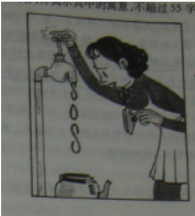

# 2009年普通高等学校招生全国统一考试（山东卷）

# 语文

本试卷分第Ⅰ卷（选择题）和第Ⅱ卷（非选择题）两部分。第Ⅰ卷1至4页，第Ⅱ卷5至9页。考试结束后，将本试卷和答题卡一并交回。

## 第Ⅰ卷

## 一、（15分，每小题3分）

1、下列词语中，字形与加点字的读音全都正确的一组是BA. 眷顾 伺候（cì） 怯生生（què） 不揣冒昧（chuǎi）B. 糅合 愠色（yùn）闹别扭（biè） 闭目塞听（sè）C. 遴选 舛误（chuǎn）煞风景（shā） 飞扬跋扈（hù）D. 做梗 咋舌（zé） 处方药（chǔ） 唧唧喳喳（chā）

2、下列各句中，标点符号使用正确的一句是DA．郝明义认为“没有越界不成阅读，”提出阅读者应走的四步，即：向前一步、往旁一步、随便走几步、在网络与书籍之间跨步。B. 从这些关于祖先的事迹中，孩子们在精神上与祖先建立了联系，找到了族群上的归属感，完成了“我是谁？”“我从哪里来？”的原初确认。C.“陆资入台”可以使两岸在更广泛的领域实现优势互补、互利双赢，特别是在当前国际金融危机的形势下，更需要两岸携手、共渡难关。D. 德国联邦司法部长表示：“连接德国和中国的不仅是经济合作，政治、文化方面我们在不断靠近。德中法制对话’活动有助于达到这一目的。”

3、依次填入下列格局中横线处的词，最恰当的一组是C

①谈起抗震救灾，温总理很深。他动情地说：“这次抗震救灾，更加深了我对人民的爱。”

②在破解开发型资源城市转型难题的过程中，该市原有资源，以钒钛资源开发为重点，努力打造世界级的产业集群。

③作者科尔曼年轻气盛，观点鲜明，但常常论据不足或论证不周，显得犀利有余，老练不够。A. 感受 依托 未免 B. 感触 依附 未免

C. 感触 依托 不免 D. 感受 依附 不免

4.下列各句中，加点的成语使用最恰当的一句是AA. 在某些传染病暴发初期，医学专家最感到左右为难的是，如何判断和预测疫情的规模和发展趋势，以便为公共决策提体供更多的科学依据。B. 大型实景舞剧《长恨歌》的演员们充分利用华清池的空间，以优美的舞姿把发生在一千多年前的爱情悲剧演绎得动人心弦，幻若梦境。C. 再完美的机制出得靠人去操作，一旦机会主义、暴利主义成为心底横行之猛兽，即便要付出天大的代价，破坏制度与规则者也会前赴后继。D.广交会为企业提供了内外贸对接的契机，但这种对接不可能一挥而就，绝大多数出口企业由于不熟悉国内市场，即使有意内销也无从着手。

5.下列各句中，没有语病、句意明确的一句是AA. 目前国际金融危机的影响仍在持续，尽管国内外旅游业面临的压力和不确定性都在加大，但中国旅游业繁荣与发展的基本面并未改变。B. 或许连作者都没想到，由于这一篇哀悼家鹤的纪念文章刻在石上，使得文本的命运与石头的命运牵连在一起，为后人留下了诸多难解之谜。C.房地产市场之所以陷入长达一的的萧条，除了市场周期性调整的因素外，还在于部分开发商追求暴利，哄抬房价，也是泡沫加速破裂的重要原因。D.海峡两岸关系协会与海峡交流基金会今天下午针对第三次陈江会谈的各项协议文本，举行了最后一次预备性磋商，历时大约一个多小时。

## 二、（9分，每小题3分）

阅读下列文字，完成6-8题

## “断桥”考

唐代诗人张祜《题杭州孤山寺》中有“断先桥荒藓合，空院落花深”的诗句，这被视为今日西湖十景之“断桥”的最早文献记录。

断桥在南宋咸淳年间因隶属宝祜坊而改称宝祜桥。因“断桥”不断，当时也出现了用谐音“段桥”解释为“段家桥”的说法，如周密《武林旧事》卷五“断桥”下就说“又名段家桥”。但因为在“断桥”不断的问题上没能达成共识，所以后来人们围绕“断桥”的名义问题聚诉纷纭。

翻阅典籍，除西湖断桥之外，诗文中说道“不断之断桥’”的还有几例。如金赵秉文《墓归》诗云：“行过断桥沙路黑，忽从电影得前村。”明邵经邦《断桥》诗云：“闻到桥名断，从来金勒过。”清顾于观《南楼四咏》诗云：“门前空有断桥在，十日人无款竹扉。”可见“不断之‘断桥’”在古代是比较常见的，并非杭州西湖所独有。

然而桥既不断，为什么称为“断桥”呢？据考证，这里的“断桥”实即“簖桥”，而“簖桥”则是与捕鱼蟹之“簖”相伴的一种桥，它主要是用来协助捕鱼蟹的。每年秋冬之交，螃蟹会进行生殖洄游，到江海交界的浅滩中繁殖后代，渔人便利用螃蟹的这种生活习性加以捕捉。他们把芦蒿、竹竿等编连起来的“簖”插在江河之中，挡住螃蟹向下游行进的路，然后螃蟹必沿“簖”爬上来，以求越过下行，而渔人就在“簖”侧的桥上捕捉它们（当然也有划船前往捕蟹或收笼的）。这种捕蟹方法在江南一带尤为常见，陆游《稽山行》有“村村作蟹椴，处处起鱼梁”（“椴”亦可作“簖”）之语。清藩衍桐《两浙輶轩续录》载海盐才女李壬《由武原至梅里》诗云：“沿塘两岸遍桑麻，画舫朝移日又斜。望见簖桥心便喜，急收帆脚到侬家。簖、蟹簖有关的桥，这种说法在部分地区至今还有。但因放置鱼簖或蟹簖过多对河流及湖面的水流影响较大，古代官府就已有所限制。近代以来，这种捕鱼蟹的方法，随着人工养殖业的兴起而逐渐被淘汰。

杭州西湖为钱塘江的泄湖，在中唐以前，钱塘江与西湖的水域连成一片，湖中水流因孤山分流，携带的泥沙逐渐形成了“白堤”。流经孤山的两股水流在宝石山东南端合流而出，“白堤”也便成为一道天然“鱼梁”。渔人在“白堤”东端设簖来捕鱼蟹，而且依簖设桥，以方便捕捉鱼蟹和到孤山的交通，这样的桥叫做“簖桥”，也在情理之中。张祜的诗句中写作“簖桥”，因为那时“簖”字或许还没有产生，或许很少有人使用。五代以后，特别是自吴越王钱穆筑垾海塘以来，钱塘江的鱼蟹经西湖而洄游的现象消失，渔人也就逐渐不再用簖捕捉鱼蟹了。随着杭州都城文化的发展和西湖旅游形象的提升，“断桥”已失去设薪捕捉鱼蟹功能的本义，但“断桥”之名却由于文人作品的称颂和民间口耳相传而得以沿用。

（节选自关长龙《“断桥”考》，有改动)[注]①金勒：金饰的带嚼子的马笼头，这里借指骑马者。

6.下列选项中关于“簖桥”的说明，不正确的一项是BA.“簖桥”是与渔人用芦蒿、竹竿等编连起来捕鱼虾的“簖”相伴的一种桥。B. “簖桥”的主要功能是方便渔人用簖捕捉鱼蟹。C.“白堤”东端的“簖桥”即今日西湖断桥，原是为方便渔人捕捉鱼蟹而设。D.“簖桥”在张祜的诗中写作“断桥”的原因是那时“簖”字可能还没有产生，也可能很少有人使用。

7.下列不属于用“簖”捕捉鱼蟹的方法逐渐被淘汰的原因的一项是DA. 古代官府对在河流及湖面放置鱼簖或蟹簖有所限制。B. 近代以来，人工养殖业的兴起。C. 五代以后，钱塘江的鱼蟹经西湖而洄流的现象消失了。D.杭州都城文化的发展和西湖旅游形象的提升。

8. 下列表述不符合原文意思的一项是BA.唐代诗人张祜的《题杭州孤山寺》是目前所能见到的记载西湖断桥的最早文献。B.西湖十景之“断桥”在南宋时又称宝祐桥，还曾因“断”“段”谐音而被称作“段家桥”。C.第三段列举了赵乘文等人的诗，说明除西湖断桥之外，在古代其他地方也有“不断之断桥”。D.第四段引用海盐才女李壬的诗，说明近代以前江南一带用鱼簖或蟹簖捕鱼蟹的方法很常见。

## 三、（12分，每小题3分）

阅读下面的文言文，完成9\~12题。

晋文公攻原，裹十日粮，遂与大夫期十日。至原十日而原不下，击金而退，罢兵而去。士有从原中出者，曰：“原三日即下矣。”群臣左右谏曰：“夫原之食竭力尽矣，君姑待之。”公曰：“吾与士期十日，不去，是亡吾信也。得原失馆，吾不为也。”遂罢兵而去。原人闻曰：“有君如彼其信也，可无归乎？”乃降公。卫人闻曰：“有君如彼其信也，可无从乎？”乃降公。孔子闻而记之，曰：“攻原得卫者，信也。”

文公问箕郑曰：“救饿奈何？”对曰：“信。”公曰：“安信？”曰：“信名、信事、信义。信名，则群臣守职，善恶不逾，百事不怠；信事，则不失天时，百姓不逾；信义，则近亲劝勉而远者归之矣。”

吴起出，遇故人而止之食。故人曰：“诺。”令返而御。吴子曰：“待公而食。”故人至墓不来，起不食待之。明日早，令人求故人。故人来，方与之食。 人

魏文候与虞人①期猎。明日，会天疾风，左右止文候，不听，曰：“不可。以风疾之故而失信，吾不为也。“遂自驱车住，犯风而罢虞人。

曾子之妻之市，其子随之而泣。其母曰：“女还，顾反为女杀彘。”妻适市来，曾子欲捕彘杀之。妻止之曰：“特与婴儿戏耳。”曾子曰：“婴儿非与戏也。婴儿非有知也，待父母而学者也，听父母之教。今子欺之，是教子欺也。母欺子，子而不信其母，非以成教也。”遂烹彘也。

楚厉王有警，为鼓以与百姓为戍。饮酒醉，过而击之也，民大警。使人止之，曰：“吾醉而与左右戏，过击之也。”民皆罢。居数月，有警，击鼓而民不赴。乃更令明号而民信之。

李悝警其两和②曰：“谨警！敌人旦暮且至击汝。”如是者再三而敌不至。两和懈怠，不信李悝。居数月，秦人来袭之，至，几夺其军。此不信之患也

卫嗣公使人伪客过关市，关市呵难之，因事关市以金，关市乃舍之。嗣公谓关市曰：“某时有客过而子汝金，因遣之。”关市大恐，以嗣公为明察。

（选自《韩非子·外储说左上》，略有改动)

【注】①虞人：古代掌管山泽苑囿的官。②两和：指古代军队左右营垒中的将士。

9.对下列句子中加点词的解释，不正确的一项是DA. 遂与大夫期十日 期：约定B. 会天疾风 会：适逢C. 犯风而罢虞人 犯：冒着D. 过而击之也 过：经过

10.下列各组句子中，加点词的意义和用法相同的一组是DA.∫攻原得卫者假舆马者B. 待公而食信而见疑C.∫为鼓以与百姓为戍 号洎牧以谗诛D.敌人旦暮且至击汝 雪若属且为所虏

11. 以下六句话分别编成四组，全部直接体现诚信的一组是B①遂罢兵而去 ②群臣守职，善恶不逾，百事不怠。③故人来，方与之食 ④遂自驱车往，犯风而罢虞人⑤曾子欲捕彘杀之 ⑥乃更令明号而民信之A.①②⑤ B. ③④⑤ C. ①③⑥ D. ②④⑥

12下列对原文有关的内容的理解和分析，不正确的一项是DA.晋文公用十天时间没有攻下原邑而主动撤兵，由于坚守诚信，文公感动了原邑和卫国的人，反而得到了两地。孔子对此表示赞赏。B.吴起在“故人至暮不来”时仍坚持不食而等待，魏文侯在“会天疾风”时仍不失信于虞人，体现出了高尚的诚信品格，令人钦佩。

## C.

楚厉王因醉酒击鼓为戏而失信与民，致使有警而百姓不来；李悝因欺骗将士而失信于军，险致全军覆没。这两个故事从反面强调了诚信的重要。

## D.

卫嗣公派人假扮客商通过关口的集市，集市的官吏刁难客商并接受了贿赂。

卫嗣公知道后要罢免这个官吏，他非常害怕，认为卫嗣公能明察秋毫。

## 四、（24分）

13. 把文言文阅读材料中加横线的句子翻译成现代汉语。（10分）

（1） 有君如彼其信也，可无归乎？（3分）

（2） 吴起出，遇故人而止之食。故人曰：“诺。”（3分）

（3） 母欺子，子而不信其母，非以成教也。（4分）

14. 阅读下面这首唐诗，回答问题。（8分）

## 寄远

## 杜牧

南陵水面慢悠悠，风紧云轻欲变秋。 正是客心孤回处，谁家红袖凭江楼？

（1）首句中“悠悠”在诗中有何作用？（3分）气氛、心情

（2） 本诗后两句表现了诗人怎样的情感变化？请作简要分析。惊（5分）

15. 补写出下列名篇名句中的空缺部分。（任选3个小题）（6分）

（1）子曰：“ 朝闻道 ，夕死可矣。”（《论语·里仁》）只是当时已惘然。（李商隐《锦瑟》）

（2）纵一苇之所如， 0 (苏轼《赤壁赋》)三杯两盏淡酒， ！（李清照《声声慢》）

（3）蒹葭苍苍，白露为霜。所谓伊人， 。（《诗经·蒹葭》）

杨意不逢，抚凌云而自惜；钟期既遇，奏流水以何惭

\_？（王勃《腾王阁序》）

(4) 故不积跬步， o （《荀子·劝学》)

文章千古事，得失寸心知 。（杜甫《偶题》）

## 五、（12分）

16.概括下面一则消息的主要信息，不超过35字。（4分）

《人民日报》巴厘岛5月3日电，东盟10国与中日韩财长会议在印度尼西亚巴厘岛发表联合公报宣布，亚洲区域外汇储备库将在今年年底前正式成立并运行，以解决区域内的短期资金流动困难，并作为现有国际金融机构的补充。

根据公报提供的数据，在规模为1200亿美元的亚洲区域外汇储备库中，中日韩3国出资80%，东盟10国出资20%。其中，中国、日本、各占32%，韩国占16%。具体金额为中国384亿美元、日本384亿美元、韩国192亿美元

17. 请仿照下面诗歌前两节的格式，续写第三、第四节。（4分）

我是雪

我被太阳翻译成水

我是水

我把种子翻译成植物

18. 请说明下面漫画的画面内容，并揭示其中的寓意，不超过55字。（4分）

## 六、（18分）

# 本题为选做题，考生须从所给（一）（二）两题中任选一题作答，不能全选。

（一）阅读下面的文字，完成19\~22题。

记住回家的路

周国平

每到一个陌生的城市，我的习惯是随便走走，好奇心驱使我去探寻这里热闹的街巷和冷僻的角落。在这途中，难免暂时地迷路，但心中一定要有把握，自信能记起回住处的路线，否则便会感觉不踏实。我想，人生也是如此。你不妨在世界上闯荡，去建功立业，去探险猎奇，去觅情求爱，可是，你一定不要忘记了回家的路。这个家，就是你的自我，你自己的心灵世界。

生活在今日的世界，心灵的宁静颇不易得。这个世界既充满着机会，也充满着压力。机会诱惑着人去尝试，压力逼迫着人去奋斗，都使人静不下心来。我不主张年轻人拒绝任何机会，逃避一切压力，以闭关自守的姿态面对世界。年轻的心灵不该静如止水，波澜不起。世界是属于年轻人的，趁着年轻到广阔的世界上去闯荡一番，原是人生必要的经历。所须防止的只是：把自己完全交给了机会和压力去支配，在世界上风风火火或浑浑噩噩，迷失了回家的路途。

寻求心灵的宁静，前提是首先要有一个心灵。在理论上，人人都有一个心灵，但事实上却不尽然。有一些人，他们永远被外界的力量左右着，永远生活在喧闹的外部世界里，未尝有真正的内心生活。对于这样的人，心灵的宁静就无从谈起。一个人唯有关注心灵，才会因为心灵被扰乱而不安，才会有寻求心灵宁静的需要。所以，具有过内心生活的禀赋，或者养成这样的习惯，这是最重要的。有此禀赋或习惯的人都知道，其实内心生活与外部生活并非互相排斥，同一个人完全可能在两方面都十分丰富。区别在于，注重内心生活的人善于把外部生活的收获变成心灵的财富，缺乏此种禀赋或习惯的人则往往会迷失在外部生活中，人整个儿是散的。外面的世界布满了纵横交错的路，每一条都通往不同的地点。那只知死死盯着外部生活的人，一心一意走在其中的一条上，其余的路对于他等于不存在。只有不忘外部生活且更关注内心生活的人，才能走在一切可能的方向上，同时始终是走在他自己的路上。一个人有了坚实的自我，他在这个世界上便有了精神的坐标，无论走多远都能寻找到回家的路。换一个比方，我们不妨说，一个有着坚实的自我的人便仿佛有了一个精神的密友，他无论走到哪里都带着这个密友，这个密友将忠实地分享他的一切遭遇，倾听他的一切心语。

如果一个人有自己的心灵追求，又在世界上闯荡一番，有了相当的人生阅  
历，那么，他就会逐渐认识到自己在这个世界上的位置。世界无限广阔，诱惑  
永无止境，然而，属于每一个人的现实可能性终究是有限的。你不妨对一切可  
能性保持着开放的心态，因为那是人生魅力的源泉，但同时你也要早一些在世  
界之海上抛下自己的锚，找到最适合自己的领域。一个人不论伟大还是平凡，  
只要他顺应自己的天性，找到了自己真正喜欢做的有意义的事，并且一心把它  
做得尽善尽美，他在这个世界上就有了牢不可破的家园。于是，他不但会有足  
够的勇气去承受外界的压力，而且会以足够的清醒来面对形形色色的机会的诱  
惑。我们当然没有理由怀疑，这样的一个人必能获得生活的充实和心灵的宁静人

## (有删改)

19．作者在文章开头说自己“每到一个陌生的城市”有“随便走走”的习惯，这样写有什么好处？（4分）

20． 解释下面两句话在文中的含意。（4分）

(1)把自己完全交给了机会和压力去支配，在世界上风风火火或浑浑噩噩，迷失了回家的路途。(2分)

(2)一个人有了坚实的自我，他在这个世界上便有了精神的坐标，无论走多远都能够找到回家的路。(2分)

21．结合全文，谈谈你对文章标题“记住回家的路”的理解。（4分）

22.文章最后一段说：“你不妨对一切可能性保持着开放的心态，因为那是人生魅力的源泉，但同时你也要早一些在世界之海上抛下自己的锚，找到最适合自己的领域。”请结合全文，谈谈这句话对你的启发。（6分）

（二）阅读下面的访谈，完成19-22题。

①杨澜（以下简称“杨”）：您看您去过这么多地方，台北、高雄、美国、香港，哪一块地方是您最心爱的？

余光中（以下简称“余”）：这很难说。有人说我是乡愁诗人。我写过好多乡愁诗，可是我觉得我的乡愁呢，不是同乡会式的，不是关乎某省、某县、某村的，因为乡愁可以升华或者普遍化为整个民族的感情寄托。这样说来呢，乡愁就不完全寄托在地理上的某一点，它不仅仅是地理的，也可能是历史的，可以说是历史的乡愁，文化的乡愁，而且在中文里面也可以有所寄托。那一年到东北访问，我在短短的致辞里就讲到，小时候在抗战时就会唱“我的家在东北松花江上”，还有“万里长征万里长”。那时，我没有去过长城，更没去过松花江，可是整个民族的一个大感情就可以融合在一起。我是说着说着眼泪就掉下来了。我有一篇散文，结尾两句我是这样写的：“你以中国的名字为荣，有一天，中国亦将以你的名字……”

杨：为荣？

余：没有。

杨：没有这两个字，所以我不是诗人，就要差这两个字才好。

②杨：我们看您的人生经历，觉得您其实并没有遇到过特别大的困难，家庭很美满，生活呢，教书、写诗、写散文、写评论，也是人们想像的比较安定的生活。但您为什么却说“我写作是因为我失去平衡，心理失去保障，而心安理得的人是幸福的，缪斯不会去照顾他们”？

余：一个人不能光看他表面的职业和家庭。他内心有很多心魔，内心世界可能很复杂，比如他的愿望并没有完全达到，那就不是表面上看得出来的。我在21岁时就离开大陆，那对我是一个很大的打击，因为我的好朋友都忽然不见了。我投入到一个陌生的地方，要重新来过；而且一个人到了21岁，记忆已经很多了，所以这件事情让我念念不忘，也成为我的一个……心结，一个中国结

③杨：今天仍然有很多人喜欢您的诗，但人们的欣赏对象好像发生了一些变化。年轻人喜欢卡通、流行歌曲等那种节奏更快、更有形象感的东西。那么用于看白纸黑字的时间呢，相对就要减少一些了。您觉得未来的诗歌，希望在哪里呢？

余：这个情况不仅仅存在于大陆、台湾、香港。因为媒体变了，价值观也随之改变了。我向来不认为文艺要大众化，而应该小众化。可如果你连小众都维持不了的话，那就有很大问题了，像三毛也好，或者余秋雨也好，到底还是不能跟一个流行歌星比，对不对？可是，听流行歌的跟读余秋雨散文的还是不一样，所以不能够拿来比较。目前的新诗有相当多的毛病，很多诗人如果得不到知音，也应该反省一下，检讨自己的诗是不是能吸引人，这是多方面的因果现象。 二

④杨：现在年轻一代接触更多的是一种网络上的语言，要想保持中文原来的那种纯粹和一脉相承，已经是越来越难了。您担不担心中文的纯洁度问题，或者认为这是历史发展的必然，所以也要听之任之？

余：我是相当担心的，也不能听之任之。有学者说，语言就像河流，你不能阻碍它。问题是有河流就有两岸，两岸如果太模糊了，这河流不晓得流到哪儿去了。所以很多人认为语言就由它去，它有它的生命，其实不然。比如说我们目前的中文，如果过分西化的话，中文特色就会荡然无存了。

(有删改)

19. 这篇访谈涉及四个方面的内容，请简要概括。（4分）

20． 阅读访谈第一部分，回答下面的问题。（4分）

(1)如何理解余光中所说的乡愁？ （2分)

(2)为什么杨澜说“就要差这两个字才好”？（2分）

22．第四部分中提到“有学者说，语言就像河流，你不能阻碍它”而余中认为“有河流就有两岸，两岸如果太模糊了，这河流就不晓得流到哪儿去了”。请联系中文的纯洁度问题，谈谈你的看法。（6分）

## 七、（60分）

23． 阅读下面的文字，根据要求作文。

见证是一种经历，也是人生、社会记忆的凝聚。在生命历程中，我们见证了人生的悲喜、社会的变迁；在历史长河中，许多人或事物又成为历史的见证

请以“见证”为题，写一篇不少于800字的文章。

要求：①自选角度。②自定立意。③除诗歌处，文体不限。④文体特征鲜明。

# 2009年普通高等学校招生全国统一考试（山东卷）语文参考答案

1、【答案】B【解析】A.怯生生（qìè）C. 舛误（chuǎn）D. 唧唧喳喳（zhā）

## 2、【答案】D

【解析】A．郝明义认为“没有越界不成阅读，”逗号应放到后引号外；B项不用问号C“活动”应放到引号内。

## 3、【答案】C

【解析】A感受：接触外界事物得到的影响；体会。感触：跟外界事物接触而引起思想情绪；感触侧重思想情绪。依附：附着，依赖依靠。依托：依靠。依托侧重有所凭借，借托。未免：同一些词语搭配，表示前面所说的情况不合适，或对前面所说的情况不以为然，

：副词。表示由于前面所说的原因而不能避免某种消极的结果，“科尔曼年轻气盛”正是“老练不够”的原因。此处是对科尔曼作客观评价，没有批评的语气。

## 4、【答案】A

## 【解析】B项

动人心弦：激动人心，非常动人。C前赴后继：赴，向前冲前面的冲上去了，后面的紧跟上来。形容连续不断投入战斗，奋勇冲杀向前。褒义词。D项“一挥而就”

应为“一蹴而就”。一挥而就：形容才思敏捷，一动笔就写成。就:成。应为一蹴而就：蹴：踏；就：成功。踏一步就成功。比喻事情轻而易举，一下子就成功。

## 5、【答案】A

【解析】B项成分残缺，“由于”和“使”保留其一；C项句式杂糅；D“大约”与“多”重复。

## 二、（9分，每小题3分）

## 6、【答案】B

【解析】原文中说“而且依簖设桥，以方便捕捉鱼蟹和到孤山的交通”，

主要功能应该有两种。

7、【答案】D

【解析】注意原文第四段中“但因放置鱼簖或蟹簖过多对河流及湖面的水流影响较大，古代官府就已有所限制。近代以来，这种捕鱼蟹的方法，随着人工养殖业的兴起而逐渐被淘汰。”和第五段“五代以后，特别是自吴越王钱穆筑垾海塘以来，钱塘江的鱼蟹经西湖而洄游的现象消失，渔人也就逐渐不再用簖捕捉鱼蟹了”几个句子。

## 8、【答案】B.

【解析】注意原文第二段“因断桥’不断，当时也出现了用谐音段桥’解释为段家桥’的说法”，根本原因应该是“因断桥’不断”。

## 三、（12分，每小题3分）

## 9、【答案】D

【解析】过：错误。

10、【答案】D均为副词，将要。

【解析】A 第一个表提顿语气，不译；第二个“……的人”。B第一个“而”表顺承；第二个“而”表转折，却。C第一个“以”，表目的，来；第二个“以”，因为。

## 11、【答案】B

【解析】②⑥并非直接体现诚信。

## 12、【答案】D

【解析】“卫嗣公知道后要罢免这个官吏”有误。

## 四、（12分）

13、【答案】（1）有君王像文公这样讲信义的，怎可不归附他呢！

（2）从前吴起外出，遇到了老友，就留他吃饭。老友说：“好啊。”

（3）母亲欺骗儿子，儿子就不相信他的母亲，这不是教育孩子的方法啊。

14、【答案】（1）“悠悠”，写出了水面的平和、水流的悠长、也透露出江上的清寂。这景象既显出舟行者的心情比较平静容与，也暗透出他一丝羁旅的孤独。为第三句的“客心孤迥”作了准备，打下了铺垫。

(2)诗人的情感由孤迥孤寂而变得精神振奋。

正当旅人触物兴感、心境孤迥的时候，忽见岸边的江楼上有红袖女子正在凭栏眺望。三、四两句所描绘的这幅图景，色彩鲜明，饶有画意，不妨当作江南水乡风情画来欣赏。在客心孤迥之时，意绪本来有些索寞无聊，流目江上，忽然望见这样一幅美妙的图景，精神振奋，羁旅的孤寂在一时间似乎冲淡了不少。这是从“正是”、“谁家”这样开合相应、摇曳生姿的语调中可以感觉出来的。

15、【答案】（1）朝闻道 此情可待成追忆（2）凌万顷之茫然 怎敌他晚来风急（3）在水一方 奏流水以何惭（4）无以至千里 得失寸心知

## 五、（12分）

16、【答案】亚洲区域外汇储备库年底前成立并运作

17、【答案】  
我是植物  
我把花朵翻译成果实  
我是果实  
我被父母翻译成生命  
我是生命  
我被衰老翻译成死亡  
我是死亡  
我被冬季翻译成雪  
我是雪  
我被太阳翻译成水

18、画面内容：一位家庭主妇，正在全神贯注地调整水龙头的流量，使水像短线的珠子一样滴入水壶。

寓意：在“水情”如此严峻的情况下，有不少人却在用水上大做文章，利用水龙头“滴漏”时不走水表的办法取水，以此“揩油”，损公肥私，有损社会公德。

## 六、（18分）

本题为选做题，考生须从所给（一）（二）两题中任选一题作答，不能全选。

（一）阅读下面的文字，完成19\~22题。

## 【参考答案】

19.

作者在文章开头说自己“每到一个陌生的城市”有“随便走走”的习惯，说明人们都有好

奇心，肯定了下文人生路途上“世界上闯荡，去建功立业，支探险猎奇，去觅情求爱”是无可非议的；从自己写起，从现实生活中的走路写起，给人亲切的感受，自然地引出“人生也是如此”。

20.（1）永远被外界的力量左右着，永远生活在喧闹的外部世界里，没有真正的内心生活o

（2）他不但会有足够的勇气去承受外界的压力，而且会以足够的清醒来面对形形色色的机会的诱惑。这样的一个人必能获得生活的充实和心灵的宁静。

21.文题中“家”指的是自我，自己的心灵世界（人的精神家园、或自我的精神坐标）；作者认为：人们应该到广阔的世界上去闯荡一番，去建功创业；但一定不要迷失了自我，要记住回归自己的心灵世界的路。

22.一个人不论伟大还是平凡，他应该顺应自己的天性，去寻找自己真正喜欢做的有意义的事，并且一心把它做得尽善尽美，他在这个世界上就有了牢不可破的家园。

（二）阅读下面的访谈，完成19-22题。

## 【答案】

19.民族感情、写作动机、诗歌前景、中文现状

（1）余光中所说的乡愁乡愁超出了地理的某一点，融入了历史的、文化的内容，升华或者普遍化为了整个民族的感情寄托。

（2）诗歌贵在含蓄，“就要差这两个字”，省略号所包含的内涵就更丰富，更耐人寻味，余味无穷，更有诗意。

21.（1）人的内心世界可能很复杂，不能只从从表面上看，离开大陆是他心中永远挥之不去的痛。

（2）诗言志，心中有复杂的情感才有创作的强烈动机，才能写出好的诗歌作品。

22.可以谈要保持中文的纯粹性，为汉语的纯粹性而奋斗，规范网络语言，保持中文特色；  
也可以谈网络语言是历史发展的必然，要包容。言之有理即可。

## 七、（60分）

23. 阅读下面的文字，根据要求作文。

作文解析

“见证”一词，《现代汉语词典》注解为“当场目睹可以作证的”，或“指见证人或可作证据的物品”。

## 见证者可以是人，如

我或我们见证母爱、见证2008等；也可以是物，如一株小草的见证、色彩一一

惊魂的见证、历史的见证等。见证的内容多为抽象事物，成长历程、某种情感、事物的发展过程等等。适合写成记叙文、散文。从见证的内容角度考虑，比如写我亲眼目睹的事件，写出事件的意义及对自己的重要影响，或写某件事物经历过某个事件或一段时间，从它的角度叙事抒情，如我的小院、我的学校、长城、卢沟桥等。回顾反思社会热点及人生经历，可以写2008年国家、自己经历的风风雨雨及感动、愉悦、兴奋、愤怒的种种事件。

## 例文（来自网上）

## 1. 色彩—精魂的见证

“赤橙黄绿青蓝紫，谁持彩练当空舞。”

缓缓流动的历史长河淘尽了千古人物，每一个伟岸的灵魂都流动着一种色彩，有的绚丽夺目，有的清淡自如，一样的让人须仰视才见。

“风萧萧兮易水寒，壮士一去兮不复返。”当荆轲踏上了刺秦之路离开家乡时，他没有动摇，抱着一颗视死如归的侠义心；当图尽匕现遭遇失败时，他没有畏惧，流下了一滴红色的英雄泪。他是红色的，对燕太子丹赤胆忠心，成就了他红色的碎败犹荣的英雄魂灵。

“人生得意须尽欢，莫使金樽空对月。”想当年力士为他脱靴，贵妃为他磨墨，受到万般宠爱的他饮酒赋诗，可当他看清当权者真正的图谋时，便毅然决然地选择了离开，“安能摧眉折腰事权贵，使我不得开心颜”。诗仙李太白是橙色的，他那飘逸的文字，深刻的感情就像那橙色在纸上表现的绚丽而多姿，清丽而爽快。

“长太息以掩涕兮，哀民生之多艰。”汩罗江边的风吹起屈原缭乱的青丝，微风散发着他香草的气味，那样的受人尊敬、爱戴，站在那里的他是那样的从容、坚定，没有一丝畏惧，因为他已无法挽救失败的局面，无法再去说服怀王，在他纵身一跃的瞬间，天空划下一道流星。他是淡蓝色的，世人皆醉，惟斯人独醒，世人皆浊，惟斯人独清，淡蓝如他，高洁而美好。

“结庐在人境，而无车马喧”他一手持酒杯，一手采菊花，悠闲自在。闷时，作诗解闷，聊以自趣：累时，五柳树下，斟饮美酒。“好一个不为五斗米而折腰”的陶渊明，他的生命充满绿色，既是天原的自然的颜色，又是他修适闲趣的生命的颜色。

“王师北定中原日，家祭无忘告乃翁”，一首《示儿》表现了陆游一腔爱国之情。他虽病卧床铺，却不忘“铁马冰河入梦来”的沙场；他虽身住茅屋，却有着“安得广厦千万间，大庇天下寒士俱欢颜”的胸襟。他是紫色的，深沉而稳重，满腹豪情，紫色如他，内在而沉稳。

历史的车轮隆隆作响，每一位英雄人物走过，都在白练上留下了一道色彩，或灿烂、或淡雅、或奔放、或深沉。色彩是绚丽多姿的，因而每一段历史都是动人心魄、催人泪下的，正是一道道变幻无穷的色彩见证了人类的精魂。

## 2. 见证母爱

在失落与迷茫中徘徊，苦苦寻觅无视的母爱。殊不知，十年春秋，母爱的大门，依然继续地敞开着……见证母爱，更是母爱的见证！

——题记

## 母爱最恰当的诠释

夏日炎炎，悠闲的漫步，伴随着美妙的阳光度过，轻柔而自在。不经意间，淡淡的空气中多了一丝甜甜的味道，风的造化。风的姿态多变，但更爱展现出慈母的温柔，像一位身着云一样飘逸的白色长裙的女子

像一位身着云一样飘逸的白色长裙的女子，让舐动的裙摆轻轻抚裟你的脸庞，让你涅馨得好象要依偎在母亲的怀抱里甜甜地熟睡。母爱的感觉，这般美丽和谐。

母爱最准确的见证者

生活中，这种感觉太多太多。但都觉得像白开水一样平淡乏味，甚至比黄连更苦涩。原因是：母爱与你的距离太近，以至于无法体会到。早晨，送上一个煎鸡蛋，是否知道里面酝酿着母子情的香浓？中午，打上一壶清凉的井水，是否知道里面酝酿着母子情的甘甜？说到这里，一个字：情。正因为那为母亲的爱子之情，所以才惊慌得呆若木鸡；正因为她的爱子之情，所以才在儿子坠落的那一瞬间，爆发出无可想象的力量；正因为她的爱子之情，上帝才让她们母子俩安然无恙。情，母爱爆发力的导火索。例子还有很多很多，但都是

因为有了它的存在。

## 母爱最不可思议的过程

的确有些无法让人相信。但已经成为了现实，我无法否认。平常，“废墟下母亲为救自己的婴儿不惜割断静脉围血给孩子”、“病重怕女儿六一儿童节过得不快乐而撑到三号”，已分明地体现了母爱的力量之大，而这一段话，我更见识了母爱这最不可思议的过程。完全像坠落的过程一样，短短地一瞬间。平凡的妇女，如此惊人的速度。我感叹。我流泪。母子之情如此难以割舍！就为了儿子一个人，脑海一片空白地跑，跑，无杂念，并且是没有丝毫的犹豫。想来想去，更不能让人理解，反而成为一个美丽的谜团。也许母爱永远无法得到解释，永远是一个不可思议的过程。

拥有母爱的人是幸福的

既然母爱不可思议，拥有者更是一个幸运儿了。像那个儿子一样，因为有了母爱，而幸福  
。不管再贫寒，你我也总是一个幸福的人。这篇见证母爱的文章，也让我想坠落一次，坠  
落在柔碎的泪眼中，坠落在母爱的天堂里。人

感谢这篇文章，它让我又一次见证了母爱的伟大。

## 3. 成长见证泪水的可贵

从我们呱呱落地的第一声啼哭起，泪水似乎注定与我们的成长相伴，而我们成长的一步步脚印，也同时见证着泪水的可贵。

记得小学三年级因为数学考试得了99分而在家抱着布娃娃放声大哭的我…泪水里饱含着委屈与遗憾。可也正因为那些泪水，我精益求精，追逐完美，不再纵容微小的差错，聚精会神，专心致志。眼泪是一种激励，谢谢你，泪水！

初一军训课上，我一边兴高采烈地跟同学交流，一边踮着脚蹦。突然“噼”地一下摔在了地上，一时间身上剧烈的疼痛让我的泪水在眼睛里涌来涌去。泪水里饱含着疼痛与无助，可也正因为那些泪水，让我得到了教训，以后，我再也没有那样肆意地走过路。眼泪是一种教训，谢谢你，泪水！

初三期末考试结束了，好多同学开心地飞回家向父母交捷报，而我却闷闷不乐地往家磨。天空中飘着零星的小雨，有些透骨的凉。“难道老天爷也为我没考好而难过吗？”我嘴里嘀咕着。“妈，我……”刚一张嘴，眼泪就不听话了，小泪珠儿争先恐后地挤出眼眶。妈妈一把搂住我，“没事的，下次加油。”“嗯！”我回答。可是，心里那份失落与伤感还是让我回到自己的屋里哭起来—

我觉得哭泣不是懦弱，而是一种坦然地宣泄。哭完了，心情好了许多。眼泪是一种释放，谢谢你，泪水！

泪水多么可贵啊，她是激励，是教训，是释放…在我们成长的道路上，泪水陪伴在我们左右。在我们快乐时，泪水是甜的；在我们伤心时，泪水是苦的；在我们成功时，泪水就是那打翻了的调料盒。如果没有泪水，我们的人生该是多么地寡味。

感谢泪水，感谢她带给我这么多，我的成长见证着泪水的可贵。

## 4、成长见证挫折的可贵

我自信昂仰地奔向未来，却忍不住回望，那些与挫折相伴的成长日子。 ——题记

手里的试卷上滴满了我伤心的泪水，血红的分数再一次刺痛了我的双眼。曾经的付出在这一刻分文不值，曾经的豪言在这一刻化为乌有。是的，我又碰到了你，我的老对头：挫折。你几次三番地让我的信心消失， 又三番几次地把我打入谷底。你以为我会就此放弃，永不拼搏吗？不！伤痕累累的我即使再苦也会挥动尚未折断的翅膀，继续向我的梦想靠近。我擦干了泪水，投身于书本之中，我变换了学习方法，踊跃地找老师讨论……是的，我成功了，这一次我成功地打败了你

挫折，并且学会了勇敢地面对你，我想这是我成长的利器，我不会将它丢掉。

朋友的背叛再一次让我泪流满面。天长地久已崩溃，山盟海誓亦飘零。你好，挫折，我们又相见了。尽管我是如此地不甘，但是，你的出现激起了我不向挫折屈服的豪情。你不能强求别人为你付出多少，你也不能改变别人的选择。这朵友谊花虽然凋败，但下一朵友谊花照样会盛开。在阳光的沐浴下，我挺起不屈的脊梁。挫折，你还是没有战胜我。我的嘴角重新挂上了微笑，我决定带着这微笑重新启程，继续勇敢地成长。

“高人林黛玉”的绰号嘲弄地挂到了我的头上，的确，八百米的跑道让我望而生畏。而你又及时出现了，就这么轻易让我投降吗？笑话！我郑重宣布要和挫折挑战，也许你会嘲笑在放学后操场上那跑跑停停的身影，也许你会讥笑我坚持不住时快要放弃的懦弱。但是，挫折，无论怎样，你还是输了，在我拼尽会力冲过八百米终点线时，我知道我再次把你打败了。

猛然发现，在我成长的日子里，一路有你相伴，而正是你的出现让我学会拼搏、坚持、宽容；是你的存在让我的成长变得多彩，而我的成长也见证了你—

挫折的可贵。感谢你，挫折，谢谢你促我成长。

## 5、见证历史的泥土

(一)

垓下幽静的山谷中响起你沉重的歌声。“力拔山兮气盖世，时不利兮骓不逝，骓不逝 兮可奈何，虞兮虞兮奈若何？”

从歌声中我听出了忧伤的心声。她、他们都听出来了。听出了她的、他们的泪，冰冷的砸在我身上，凝成血滴，我嗅到了甜腥气息。

(二)

她俯首拉开房门，两滴泪滑落她白皙的面颊，她用修长的手指将它们拭去，抬起头，强做笑容，回到高宗身边。当她的足踏过我时，我分明感到一股浓重的阳气压得我透不过气来

(三)

曾经的“兴尽晚归”，如今的“物是人非”。她一个柔弱的女子如何承受得了！娇好的面容变得苍白，乌黑的秀发白丝缕缕，面对她一天天的憔悴，我的心在滴血。如果有什么能使她面颊重新红润，我愿，我愿为此付出代价。

(四)

在她泪水的滋润下，我的表面生出了几根小草，它们柔弱的身体仿佛一碰就会折掉，就象她的腰。

“试看春残花渐落，便是红颜老死时。一朝春尽红颜老，花落人亡两不知！”她又在拭泪了，哭的好不伤心，这真应了宝玉那句“女儿是水做的骨肉”。我周围充斥着泪的咸味。

(五)

多少年来，我见证了太多的事情战争、权利、感情……一切的一切让我厌倦。

狂风带着我飞呀飞，越过高山，越过平原，落在奔流的河里，在某些我看不见也感知不到的地方，我流入了另一条河，然后又汇入了另一条河，直至流入大海。

## 6、雕塑——城市发展的见证

社会是发展的，不会停滞不前。只要从一个小小的细节就可以看出城市的发展之快。

阳光明媚的一天，我早早地来到了南京路，趁”十一”放假，准备好好地逛逛马路，顺便淘淘宝。

马路上有许多挂胸牌的中国人外国人，哦！现在是特奥会期间，志愿者可真多啊！我正在感叹中，不知不觉，走到了一块大碑前，看着碑后墙上的题字，才发觉原来是五卅运动纪念碑。

“五卅”运动是中国共产党直接领导的以工人阶级为主力军的中国人民反帝革命运动。标志着当时反帝国主义革命的开端，意义深刻，许多游人在这座碑前照相留念。有爷爷与孙子照的，有母亲与孩子照的，还有一群群青年一起合影。尽管高楼林立的南京路有许多现代化的大厦，但似乎只有这个地方最受欢迎，它是城市发展的见证者，也许时代的进步更让过去显得意味深长。

我正准备离开，没走几步却又像发现新大陆一般瞪大了眼睛。在距离五卅纪念碑没多远处就是第七届南京路雕塑邀请展，一座座精美的雕塑仿佛是中国传统文化与西方欧美文化美的结晶。盲人摸象、鹤立鸡群等用成语起名的雕像，古色古香，金色与古铜色的结合让作品不失豪迈的富贵气，漫画式的夸张、戏剧式的诙谐让这些有深刻文化底蕴的作品引锝人人驻足观看。

而西方雕刻大师用字母创造的一个个线条柔美，造型奇特的雕塑与之相得益彰，显得如此和谐，动人。

同样是艺术，五卅纪念碑像是历史的见证，另一个是现代艺术的象征。同样是雕塑，一个是时代落后的警示，一个是蓬勃发展的标志。阳光下，这些美的事物如此和谐，但意义却截然不同。这些雕塑仿佛微笑着告诉我：世界瞬息万变，社会日新月异。

历史，不仅仅带给我们警示，每一个昨天也称为是历史。

在历史的对比中我们走过春夏秋冬，不断进步，不断发展。不同的艺术，给我们不同的启示，不断告诉我们，时间在向前流逝，我们是不能止步不前的，当你转过身，没有什么在等待。社会千变万化，只有不断努力，才能跟上它的步伐。而我们的祖国正因为每个地方小小的一点一滴而慢慢进步，发生了日新月异的变化。明天要靠我们的双手来创造，每一个细节都是关键。

“江山如此多娇，引无数英雄竞折腰。”新与旧、古与今的对比让我心潮澎湃。自古多少文人墨客，英雄豪杰赞扬着晓风残月，小桥流水，孰不知现在的祖国更有了天翻地覆的变化。美丽的祖国画卷，也期待我们抹上绚烂的一笔！

资料提供形式：QQ群+百度网盘群（两个群一起，QQ群每日发布更新通知，网盘群分享资料）资料包含内容：

1、1990\~2024年的各科高考真题（新高考、全国甲卷乙卷、各地地方卷等等）

2、2024年6月份到2025年6月份各地名校卷、期中期末试卷、各地联考卷、一二模模拟卷、仿真卷等等（每天都会更新）

3、各科精品资料（高考真题汇编、各个题型的做题方法、作文范文、作文素材（基本每日更新）、答题模板、知识点总结、笔记等等）

4、后续我们也会将高考押题资料放进资料库内（不会额外收费）

5、如果我们资料库内没有大家需要的资料，可以随时联系我们客服，我们会尽力去给大家整理你们需要的资料，比如某个学科的某块知识点总结，某种题型的答题模板，或者某某名校的内部资料等等，并且不会额外收费哦！给大家在这一年里享受最好的服务，

6、后续我们可能还会出填报志愿服务，给大家提供志愿卡成本价渠道！

7、我们付费资料群内的资料基本都是没有水印的，让大家打印或者使用的时候有最佳的观看体验！

进群费用：目前入群特价88元（后续我们会涨价！！）时间期限：资料持续更新到2025年6月高考结束，资料截止更新

购买方式有两种：

第一种(最方便)：关注微信公众号【雪山学社】，留言“VIP”，支付完以后添加学长微信安排后续事宜第二种：添加学长微信XSWK21，添加好友时留言“VIP”

微信搜一搜

雪山学社

  
这个是学长的微信微信号XSWK21需要购买的同学添加时请备注“VIP”

  
低价线上打印仅需5分1页，顺丰包邮！需要的同学可以打开微信扫码！

  
低价正版教辅QQ群群号：928159480平时会发放五年高考三年模拟、试题调研、解题觉醒等等一系列正版教辅的优惠券\~\~