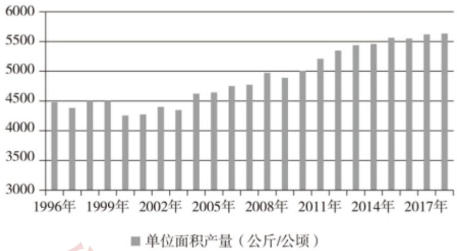
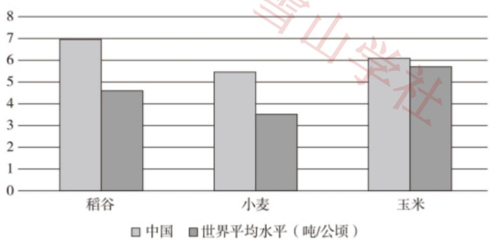
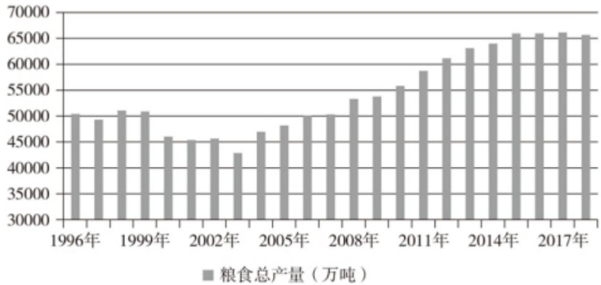

# 2021年普通高等学校招生全国统一考试（乙卷）

# 语文

## 注意事项：

1. 答卷前，考生务必将自己的姓名，准考证号填写在答题卡上。

2. 回答选择题时，选出每小题答案后，用铅笔把答题卡上对应题目的答案标号涂黑。如需改动，用橡皮擦干净后，再选涂其他答案标号。回答非选择题时，将答案写在答题卡上，写在本试卷上无效。

3. 考试结束后，将本试卷和答题卡一并交回。

## 一、现代文阅读（36分）

## （一）论述类文本阅读（本题共3小题，9分）

阅读下面的文字，完成下面小题。

对于人文研究来说，计算方法以往只是作为辅助手段而存在的，而今天已取得了不可替代的地位。一种新的人文研究形态应运而生，这就是“数字人文”。学者莫莱蒂曾设想一种建立在全部文学文本之上的世界文学研究，人们必须借助计算机对大规模的文学文本集合进行采样、统计、图绘，分类，描述文学史的总体特征，然后再做文学评论式的解读。为此，他提出了与“细读”相对的“远读“作为方法论。弄清计算机的远读与人的细读之间的差别，不仅能使我们清晰地界定计算方法在人文研究中的作用，而且可以帮助我们重新确立人的阅读的价值。

计算机是为科学计算而创造出来的，擅长的是“计数”，而非理解。要处理自然语言文本，计算机必须先将文本置换成便于计数的词汇集合，或者用更复杂的代数模型和概率模型来表示文本，这一过程被称为“数据化”。数据化之后所得到的文本替代物（集合、向量、概率）虽然损失了原始文本的丰富语义，但终究是可以计算的了。不过，尽管计算机能处理海量的语料，执行复杂的统计、分类、查询等任务，但它并不能理解文本的内容。

远读是数字人文的基石。大规模的文本集合上的远读，基本上可以归为两类：一是对文本集合整体统计特征的描述，一是对文本集合内在结构特征的揭示。例如，数字人文学者米歇尔等人对数百万册数字化图书进行多种词汇和词频统计，以分析英语世界的语言演变，这属于前者；莫莱蒂用地图、树结构来分别展示文学作品的地理特征和侦探故事的类型结构，这属于后者。无论是宏观统计描述还是内在结构揭示，都是超越文本具体内容的抽象表示，所得结果都是需要解读的。正如米歇尔所说，在巨量文本集合上得到的统计分析结果，为人文材料的宏观研究提供了证据；但是要解读这些证据，就像分析古代生物化石一样，是有挑战性的。对远读结果的解读，仍然是依赖学者在细读文本的基础上所建立起来的对本领域的认知

和理解。一句话，人的阅读不可替代。

需要补充的是，当考查单篇文本的文本特征（例如计算一篇文档中所有单字的出现频率），或者分析其内部结构（例如提取一部小说中所有人物的对话网络）时，数据量也会增长到个人无法处理的程度。所以，上述对文本集合所做的讨论在单篇文本层面也是成立的。

一个普遍存在的对数字人文的评判依据，是看数字人文能不能更好地回答传统人文学者所关心的问题。严格说来，只有当数据量或者数据精度超出了个人阅读理解的能力范围时，才有理由借助计算机来对文本或者文本集合的特征予以量化描述，进而提供给人去进行深入解读。数字人文不仅仅是新的手段和方法，更重要的是，它赋予我们提出新问题的能力。我们现在可以问，五千年来全人类使用最频繁的词是什么。透过这类问题，可以获得观察超长历史时段文化现象的新视角。

(摘编自王军《从人文计算到可视化——数字人文的发展脉络梳理》）

1. 下列关于原文内容的理解和分析，不正确的一项是（）A.在数字人文的概念提出之前，计算方法已被引入人文领域，在研究中发挥作用。  
B.要实现莫莱蒂设想的世界文学研究，首先应进行大规模的文学文本集合的数据化。  
C.选择远读还是细读的方法，取决于阅读的对象是大规模的文本集合还是单篇文本。  
D.数字人文不仅为文本处理提供了新的手段和方法，而且为人文研究提供了新视角。2. 下列对原文论证的相关分析，不正确的一项是（A.文章区分“计数”与“理解”，是为了论证计算机不能处理某些特定类型的文本。  
B. 文章转述数字人文学者米歇尔本人的说法，有助于论证应该更全面地看待远读。  
C.文章第四段讨论单篇文本层面的问题，对前文补充论证，使得论证更加周密。  
D.文章同时肯定计算机远读和人的细读的作用，有助于避免人们对远读的误解。3. 根据原文内容，下列说法正确的一项是（）A.人文研究的主体，在数字人文中实现了从具体的学者个人向计算机的转变。  
B.远读不是要深化对文本内容的理解，而是要发掘文本集合的共同形式特征。  
C.数字人文的价值，在于将历史上未被注意和阅读的文本都进行数据化并做研究。  
D.和人的细读相比，远读的理念和做法体现出大数据时代文理融合的跨学科取向。

【答案】1.C 2.A 3.D

【解析】  
【分析】  
【1题详解】

本题考查学生理解分析原文内容的能力。C.“选择远读还是细读的方法，取决于阅读对象是大规模的文本集合还是单篇文本”错误，原文第四段说“即便是单篇文档…数据量也会增长到个人无法处理的程度”

“当数据量或者数据精度超出了个人阅读理解的能力范围时，才有理由借助计算机来对文献或者文献集合的特征予以量化描述，再提供给人去深入解读”可见，即使是单篇文本也可以选择远读方法，起决定作用的是数据量是否超出个人阅读理解的能力范围。

故选C。

## 【2题详解】

本题考查学生分析论点、论据与论证关系的能力。

A.“文章区分计数’与理解’，是为了论证计算机不能处理某些特定类型的文本”错误，从“尽管计算机能处理海量的语料，执行复杂的统计、分类、查询等任务，但它并不能理解文本的内容”来看，是为了证明计算机不能理解文本内容，数字人文仍离不开人的阅读，从而“帮助我们重新确立人的阅读的价值

故选A。

## 【3题详解】

本题考查学生筛选并整合信息的能力。

A.“人文研究的主体，在数字人文中实现了从具体的学者个人向计算机的转变”错误，根据原文“对远读结果的解读，仍然要依赖学者在细读文本基础上所建立起来的对本领域的认知和理解。一句话，人的阅读不可替代”可见，并没有实现主体从具体的学者到计算机的转变。

B.“远读不是要深化对文本内容的理解，而是要发掘文本集合的共同形式特征”以偏概全，原文第三段说“大规模的文本集合上的远读，基本可以归为两类：一是对文本集合整体统计特征的描述，一是对文本集合内在结构特征的揭示”，可见，并不仅仅只是“发掘文本集合的共同形式特征”，还有揭示内在结构特征。

C.“将历史上未被注意和阅读的文本都进行数据化并做研究”错误，原文说的是“借助计算机对大规模的文学文本集合进行采样、统计、图绘、分类，描述文学史的总体特征”，是“大规模的文学文本集合”，而非“将历史上未被注意和阅读的文本都进行”数据化。

故选D。

## （二）实用类文本阅读（本题共3小题，12分）

阅读下面的文字，完成下面小题。

材料一：

新中国成立后，中国始终把解决人民吃饭问题作为治国安邦的首要任务。70年来，在中国共产党领导下，经过艰苦奋斗和不懈努力，中国在农业基础十分薄弱、人民生活极端贫困的基础上，依靠自己的力量实现了粮食基本自给，不仅成功解决了近14亿人口的吃饭问题，而且居民生活质量和营养水平显著提升，

粮食安全取得了举世瞩目的巨大成就。

党的十八大以来，以习近平同志为核心的党中央把粮食安全作为治国理政的头等大事，提出了“确保谷物基本自给、口粮绝对安全”的新粮食安全观，确立了以我为主、立足国内、确保产能、适度进口、科技支撑的国家粮食安全战略，走出了一条中国特色粮食安全之路。

  
图1:中国粮食单位面积产量(1996\~2018年)  
数据来源：国家统计局

  
图2:2017年三大谷物品种单位面积产量对比  
数据来源：联合国粮食及农业组织数据库(FAOSTAT)

  
图 3:中国粮食总产量(1996\~2018 年)  
数据来源：国家统计局

(摘自国务院新闻办公室《中国的粮食安全》白皮书)

## 材料二：

山东省临朐县是一个有着90多万人口和近90万亩耕地的山区农业大县。临朐县山区丘陵面积较大，而且地形错综复杂，起伏多变，成百上千亩集中连片且开阔平坦的农田很少见，加之农田基础设施落后，从自然村落到田间地头的道路基本都是土路，交通极其不便。用乡亲们的话说：“开门就见山，种田走半天。耕地就像百衲衣，一顶苇笠也能盖一块地。”近年来，临朐县在推进高标准农田建设时，立足山区实际，把解决地块零散、水电路不配套等问题作为重点，坚持集中连片规划建设，着力补齐农业基础设施短板，合理利用土地资源，为粮食稳产增产夯实了基础。“十三五”以来，全县共改造中低产田3.73万亩，建成高标准农田12万亩。 衣X

(摘编自张正瑜等《山东临朐立足山区实际科学谋划建设高标准农田》)

材料三：

近几年，江西省南昌市安义县长埠镇江下村村容村貌有了翻天覆地的变化，全村6个村小组前前后后共修建了逾11公里的水泥路，95%的水塘进行了清淤处理，建成了3.2公里高标准农田沟渠。过去，江下村因土地贫瘠，一直没有找到产业发展的好路子，祖辈守着一亩三分地种水稻及常规农作物，产量较低的“斗笠田”随处可见。为改变现状，村干部主动为江下村争取了高标准农田项目，引进种粮大户盘活荒地。作为高标准农田的“集成模块”，越来越多的新技术在江下村大显身手粮食耕、种、管、收实现全程机械化，逐步提高智能作业的精准度和覆盖率……去年11月，江下村2168亩高标准农田建设项目开始动工，项目如今已全部完成。现在村里的耕地质量普遍提升两个等级，粮食产能平均提高15%，亩均粮食产量提高100公斤，高标准农田已成为带动农民持续增收、实现贫困群众稳步脱贫的有力引擎。

(摘编自李慧《粮食安全：把饭碗牢牢端在自己手中》，《光明日报》2020年12月24日)

4.下列对材料一相关内容的理解和分析，不正确的一项是（）  
A.  
我国粮食单位面积产量显著提高，2010年开始平均每公顷粮食产量突破5000公斤，粮食生产取得了举世瞩目的巨大成就。  
B.

2017年我国稻谷、小麦、玉米的每公顷产量明显高于世界平均水平，可见居民的生活质量和营养水平得到了显著提升。

C.  
2003～2015年，粮食总产量连续多年保持增长势头，中国特色粮食安全之路越走越稳健，粮食生产能力不断增强。D.  
从2015年起，我国粮食总产量连续四年稳定在65000万吨以上水平，这有助于保障国家粮食安全、促进经济社会发展。

5. 下列对材料相关内容的概括和分析，正确的一项是（）A. 1

交通极其不便、产业发展路径缺失、开阔平坦的农田数量较少，这些曾经是制约临朐县山区发展现代农业的主要因素。 山学B.

在提升粮食产能方面，临朐县山区与安义县江下村的工作侧重点有所不同，前者着力解决地块零散的问题，后者着重改变村容村貌。

“开门就见山，种田走半天”，这是临朐县山区地形和耕地的特点，安义县江下村“斗笠田”的地形地貌也呈现出这种特点。

村干部主动作为，引进种粮大户盘活荒地，利用新技术推进农业机械化，这是推动江下村农民持续增收、  
稳步脱贫的有效举措。  
6. 在促进粮食增产方面，临朐县山区与安义县江下村有哪些相同的经验，请概括说明。【答案】4.B5.D

（1）都立足自身实际，结合土地特点制定相应的增产措施；（2）重视农业基础设施建设，先行解决水电

路等制约农业发展的问题；（3）都把建设高标准农田作为促进粮食增产的重要手段。

## 【解析】

## 【分析】

## 【4题详解】

本题考查学生筛选并辨析信息的能力。

B.“明显高于”说法不当，根据材料一图表2的数据，玉米的产量刚刚超过世界平均水平；“可见，居民的生活质量和营养水平得到了显著提升”说法不当，虽然我国主要粮食产量有所提升，但人均粮食数量不并多，因此“显著提升”的说法不当。

故选B。

## 【5题详解】

本题考查学生筛选并辨析信息的能力。

A.“交通极其不便，产业发展路径缺失，开阔平坦的农田数量较少，这些曾是……主要因素”错，原文是“临朐县山区丘陵面积较大，而且地形错综复杂，起伏多变，成百上千亩集中连片且开阔平坦的农田很少见，加之农田基础设施落后，从自然村落到田间地头的道路基本都是土路，交通极其不便”，可见并没有强调这些是“主要因素”，也没有“产业发展路径缺失”；

B.“后者着重改变村容村貌”说法错误。原文的表达是“为改变现状，村干部主动为江下村争取了高标准农田项目，引进种粮大户盘活荒地”，这才是江下村提升粮食产能的做法，改变村容村貌只是改善影响粮食增产的基础设施的做法； 山心

C.“安义县江下村斗笠田’的地形地貌也呈现出这种特点”无中生有。原文只是说“产量较低的斗笠田’随处可见”，可见江下村的田地主要是产量低，没有说与临朐县的地形地貌特点一样。

## 【6题详解】

本题考查学生筛选并辨析信息的能力。

题目要求分析临朐县和江下村在促进粮食增产方面有哪些相同的经验。

材料二是临朐县的做法，材料三是江下村的做法，学生可从这两则材料中筛选他们做法中相同的方面。

材料二临朐县的特点是“山区丘陵面积较大，而且地形错综复杂，起伏多变，成百上千亩集中连片且开阔平坦的农田很少见，加之农田基础设施落后，从自然村落到田间地头的道路基本都是土路，交通极其不便”。他们的做法是，“近年来，临朐县在推进高标准农田建设时，立足山区实际，把解决土地零散，水电路不配套等问题作为重点，坚持集中连片规划建设，着力补齐农业基础设施短板，合理利用土地资源，为粮食增产奠定了基础”。可见他们针对交通极其不便、开阔平坦的农田数量较少、农田基础设施落后的问题制定了相应的增产措施；重视农业基础设施建设；推动了高标准农田建设。

材料三中江下村的特点是“土地贫瘠，一直没有找到产业发展的好路子”，“祖辈守着一亩三分地种水稻及常规农作物，产量较低的斗笠田’随处可见”，种植作物比较单一，“斗笠田”产量低。他们的做法是“全村六个村小组前前后后共修建了逾11公里的水泥路。95%的水塘进行了清淤处理，建成了32公里高标准农田沟渠”“为改变现状，村干部主动为江下村争取了高标准农田项目，引进种粮大户盘活荒地。作为高标准农田的集成模块’，越来越多的新技术在江下村大显身手一

粮食耕、种、管、收实施全程机械化，逐步提高智能作业的精准度和覆盖率”。可见他们也是针对自身特点制定相应的增产措施；同样注重农田基础设施建设；也同样把建设高标准农田作为促进粮食增产的重要手段。

## （三）文学类文本阅读（本题共3小题，15分）

阅读下面的文字，完成下面小题。

## 秦琼卖马

谈歌

民国二十二年立秋这天下午，保定城淹没在一片知了的鸣叫声中。一辆人力三轮停在了古董店艺园斋门前。一个身着灰布大褂的中年汉子下了三轮，提个柳条箱进了店门。伙计杨三忙迎上来，给汉子让座沏茶。 1

“我找韩定宝先生。”

杨三怔了一下，低声答道：“韩老板已经去世三年了。”

汉子惊了脸，手里的茶碗险些跌落。杨三又道：“现在的老板是杨成岳先生。”汉子呆了片刻，缓声道：“我想见一见杨老板。”说着取出一张名片。杨三接过看了一眼，惊讶道： 您就是王超杰先生啊。您稍等。”

王超杰，人称北方铁嗓，专攻老生。平生喜好收藏官窑彩瓷。几年前一场中风，愈后左腿不利落，便不再登台。

不一刻，一壮年男人出来，拱手道：“王先生，幸会。我是杨成岳。早年曾听过王先生的大戏，今日竟是有缘在此相见。”王超杰笑笑：“这么说杨老板也是门里人了？”杨成岳笑道：“不瞒王先生，杨某也曾是票友，只是不敢与王先生坐论其道。—

不知王先生到保定有何贵干？”王超杰笑道：“有几件古瓷，想让杨先生鉴赏。”便打开柳条箱，取出一摞盘子，放在桌案上，共是六件。

杨成岳凑近细看，看了半刻，便向王超杰点头微笑。王超杰笑道：“这是我多年前从一个落魄商家手里收购而来。地道上品，还请杨老板说个价钱。”杨成岳问：“此乃王先生心爱之物，何故出手呢？”王超杰长叹一声：“生计所迫，还望杨老板成全。”杨成岳点头笑笑：“本店小本生意，实在不好言价了。

还请王先生体谅。”王超杰脸上滑过一丝失望，杨成岳道：“买卖不成仁义在，先不说价钱，容我再想想。”王超杰起身告辞，杨成岳却一定留他吃饭。吃过饭，又给王超杰找了一家上等客栈，店钱饭钱都由艺园斋开支。

王超杰来到保定的消息很快传开。这一天，名琴师张小武请王超杰和杨成岳吃酒。吃过几杯酒，话便多了起来。杨成岳道：“王先生，当年听您一出戏可真是不易，一张票要卖到十五块大洋。”王超杰摆手笑道：“好汉不提当年啊。”张小武笑道：“今日何不乘兴唱上几段，一饱我二人的耳福呢。”王超杰笑道：“二位想听，那我就干唱几句吧。”张小武忙摆手：“不行不行。取我的胡琴来。”

胡琴响起，王超杰就唱起来：“店主东拉过了黄骠马，不由得秦叔宝珠泪洒下……”一曲唱罢，杨成岳击掌叫好。“王先生唱得字正腔圆，只是悲凉了些，壮气不足。秦琼秦叔宝盖世英雄，一时落魄，壮志不减才对。”王超杰笑道：“秦叔宝到了那时，壮志不减也得减了。毕竟不知道单雄信能够出来啊。”三人都笑了。

说笑了几句，王超杰笑道：“超杰此次来保定不是卖马，而是卖瓷器。只是杨老板不肯成交啊。”杨成岳沉吟了一下：“王先生一定要卖，就请说一句落底的话吧。”王超杰笑道：“这几只雍正官窑粉彩过枝碧桃大盘，我当年得来也的确不易。一只盘子五百块大洋总是值的吧。”杨成岳想了想，笑道：“那好

第二天，王超杰带着箱子去了艺园斋。进了店门，见张小武和杨成岳已经等在那里。

王超杰笑道：“二位摆好功架，是否还要我再唱上一段助兴？”杨成岳击掌大笑：“正是此意。”王超杰想了想，就说：“今日就唱一段《奇冤报》吧。”胡琴响起，王超杰唱起：“未曾开言两泪汪，尊一声太爷听端详……”

杨成岳击掌叫好。张小武叹道：“今日真是大大地过了一场瘾。”王超杰笑道：“也唱过了，就请成岳先生过目吧。”杨成岳让账房取过一箱大洋，笑道：“超杰先生，清点一下。”王超杰摆手道：“不必不必。”

王超杰告辞，杨成岳和张小武送出门外，直到看不见了，二人才转回店里。杨成岳盯着那六件瓷盘发呆。

张小武笑道：“成岳，不知道你能赚多少。”杨成岳一笑：“你说呢？”猛一挥手，那六件瓷盘竟被掸落，摔在地上，碎了。张小武大吃一惊：“你……”

杨成岳道：“请随我来。”进了里屋，只见货架上有几只盘子。杨成岳叹道：“这才是真的。”张小武结舌道：“你是说，超杰先生带来的，是赝品……”杨成岳道：“正是，那东西顶多值上几吊钱。我看出王先生心爱此物，不好说破，也只好装痴作呆了。”说罢长叹一声。

张小武皱眉道：“那三千大洋……”杨成岳一笑：“我们一共听了超杰先生两出戏，也就值了。钱这东西，生不带来，死不带走，送与王先生，也便是用在了去处。”

张小武默默无语，转身要走。杨成岳喊住他：“小武兄，何不操琴，我今天直是嗓子作痒了。”张小武怔了一下，就坐下，操起了琴。杨成岳唱起，苍凉的唱段就灌了满店：“一轮明月照窗前，愁人心中似箭穿……”

门外已经是秋风一片。

(有删改)

7.下列对小说相关内容和艺术特色的分析鉴赏，不正确的一项是（）  
A.  
王超杰说话多是“笑道”，唱的戏词则是“珠泪两下”“两泪汪”，这种细节写出了他当时的处境与心态0  
B.  
杨成岳当着张小武的面，把重金买到的六件瓷盘掸落地上，这一转折将故事推向高潮，也使杨成岳形象更为饱满。  
C. N  
小说语言比较独特，用语考究，古朴典雅，对话不用日常口语，有种舞台味道，与人物的身份地位极为相符。  
D.小说从立秋这天的知了鸣叫写起，以“门外已经是秋风一片”收尾，借秋意加深来传达人世的苍凉之感。  
8. 王超杰为什么选择《秦琼卖马》的唱段，且唱得壮气不足？请简要分析。

9. 买卖瓷盘的过程中，杨成岳的心理发生了哪些变化？请结合作品简要说明。【答案】7. C 不

借唱《秦琼卖马》抒发胸中郁闷之情；把自己卖瓷器与秦琼卖马类比，希望有人帮助自己渡过难关；唱得壮气不足，更真实地表达了他当时的感受。

9.  
先是无意购买：他看出瓷盘是赝品，并不说破，以“小本生意”为由婉拒；然后是有意相帮：表示再想想，留下王超杰并细心安排吃住；最后决意相助：对戏剧的热爱、对世道人生的感悟，让他知假买假、慷慨解囊。  
【解析】  
【分析】  
【7题详解】

本题考查学生对小说相关内容和艺术特色的分析鉴赏能力。C.“对话不用日常口语”错误，对话使用日常口语，贴近生活，亲切生动，比如：“王先生一定要卖，就

请说一句落底的话吧。”

故选C。

## 【8题详解】

本题考查学生对情节安排语段设置作用的理解分析能力。

结合“胡琴响起，王超杰就唱起来：店主东拉过了黄骠马，不由得秦叔宝珠泪洒下……’一曲唱罢，杨成岳击掌叫好”“王先生唱得字正腔圆，只是悲凉了些，壮气不足”分析，得出借唱《秦琼卖马》抒发胸中郁闷之情，应该是遭遇了不幸，生活落魄，有感而发；

结合“秦琼秦叔宝盖世英雄，一时落魄，壮志不减才对”“王超杰笑道：秦叔宝到了那时，壮志不减也得减了。毕竟不知道单雄信能够出来啊。’三人都笑了”分析，得出王超杰唱得壮气不足，更真实地表达了他当时的感受，生活不顺利，精神难以振奋，势气自然削减，与当年意气风发时的心境下所唱的感觉不能相提并论。

结合“说笑了几句，王超杰笑道：超杰此次来保定不是卖马，而是卖瓷器。只是杨老板不肯成交啊。，杨成岳沉吟了一下：王先生一定要卖，就请说一句落底的话吧。’王超杰笑道：“这几只雍正官窑粉彩过枝碧桃大盘，我当年得来也的确不易。 一只盘子五百块大洋总是值的吧。”杨成岳想了想，笑道：“那好，明天你到我店里去，我们当面钱货两讫”分析，得出王超杰把自己卖瓷器与秦琼卖马类比，希望有人帮助自己渡过难关，唱这一段除了抒发真情实感，还有就是换取同情心，希冀得到理解和支持；

## 【9题详解】

本题考查学生分析人物形象理解概括心理变化脉络的能力。

结合第六段“取出一摞盘子，放在桌案上，共是六件”，第七段“杨成岳凑近细看，看了半刻，便向王超杰点头微笑。……杨成岳问：此乃王先生心爱之物，何故出手呢？’王超杰长叹一声：生计所迫，还望杨老板成全。’杨成岳点头笑笑：本店小本生意，实在不好言价了。还请王先生体谅’”

分析可知一开始是无意购买，但不好意思直言，委婉拒绝。

结合第七段“王超杰脸上滑过一丝失望，杨成岳道：买卖不成仁义在，先不说价钱，容我再想想。’王超杰起身告辞，杨成岳却一定留他吃饭。吃过饭，又给王超杰找了一家上等客栈，店钱饭钱都由艺园斋开支”分析，可知听闻昔日意气风发演出票价高昂的名角儿今日生活落魄困顿人生失意落寞时，让善良友爱的杨成岳心生不忍，由无意购买变成“再想想”，并热心帮忙安排住宿，所有花销自己垫付，可谓细致周全体贴入微。

结合第八、九、十这三段分析，杨成岳由王超杰的《秦琼卖马》唱词间了解了王超杰的经历，由当年的风光今日的落魄困窘中越发同情王超杰，一面委婉规劝宽慰，一面决意相帮：“胡琴响起，王超杰就唱起来：店主东拉过了黄骠马，不由得秦叔宝珠泪洒下……’一曲唱罢，杨成岳击掌叫好。王先生唱得字正腔圆，只是悲凉了些，壮气不足。秦琼秦叔宝盖世英雄，一时落魄，壮志不减才对。’王超杰笑道：“秦叔宝到了那时，壮志不减也得减了。毕竟不知道单雄信能够出来啊。’………杨成岳沉吟了一下：王先生一定要卖，就请说一句落底的话吧。’……杨成岳想了想，笑道：那好，明天你到我店里去，我们当面钱货两讫。’”

结合“王超杰告辞，杨成岳和张小武送出门外，直到看不见了，二人才转回店里。杨成岳盯着那六件瓷盘发呆”“张小武笑道：成岳，不知道你能赚多少。’杨成岳一笑：你说呢？’猛一挥手，那六件瓷盘竟被掸落，摔在地上，碎了……杨成岳叹道：这才是真的。’……正是，那东西顶多值上几吊钱。我看出王先生心爱此物，不好说破，也只好装痴作呆了。’说罢长叹一声”分析，可知他看出瓷盘是赝品，并不说破。

结合结尾“张小武皱眉道：那三千大洋……’杨成岳一笑：我们一共听了超杰先生两出戏，也就值了。钱这东西，生不带来，死不带走，送与王先生，也便是用在了去处’”“小武兄，何不操琴，我今天直是嗓子作痒了。’……杨成岳唱起，苍凉的唱段就灌了满店：‘一轮明月照窗前，愁人心中似箭穿……’”分析，可知对戏剧的热爱、对世道人生的感悟，让他知假买假、慷慨解囊。

## 二、古代诗文阅读（34分）

## （一）文言文阅读（本题共4小题，19分）

阅读下面的文言文，完成下面小题。

戴胄忠清公直擢为大理少卿上以选人多诈冒资荫敕令自首不首者死未几有诈冒事觉者上欲杀之胃奏据法应流上怒曰：“卿欲守法，而使朕失信乎？”对曰：下也。陛下忿选人之多诈，故欲杀之，而既知其不可，复断之以法，此乃忍小忿而存大信也。”上曰：“卿能执法，朕复何忧！”胄前后犯颜执法，言如涌泉，上皆从之，天下无冤狱。鄃令裴仁轨私役门夫，上怒，欲斩之。殿中侍御史长安李乾祐谏曰：“法者，陛下所与天下共也，非陛下所独有也。今仁轨坐轻罪而抵极刑，臣恐人无所措手足。”上悦，免仁轨死，以乾祐为侍御史。上谓侍臣曰：“朕以死刑至重，故令三覆奏，盖欲思之详熟故也。而有司须臾之间，三覆已讫。又，古刑人，君为之彻乐减膳。朕庭无常设之乐，然常为之不啖酒肉，又，百司断狱，唯据律文，虽情在可矜，而不敢违法，其间岂能尽无冤乎？”丁亥，制：“决死囚者，二日中五覆奏，下诸州者三覆奏。行刑之日，尚食勿进酒肉，内教坊及太常不举乐。皆令门下覆视，有据法当死而情可矜者，录状以闻。”由是全活甚众。其五覆奏者以决前一二日，至决日又三覆奏。唯犯恶逆者一覆奏而已。上尝与侍臣论狱，魏征曰：“炀帝时尝有盗发，帝令於士澄捕之，少涉疑似，皆拷讯取服，凡二千余人，帝悉令斩之。大理丞张元济怪其多，试寻其状，内五人尝为盗，余皆平民。竟不敢执奏，尽杀之。”上曰：“此岂唯炀帝无道，其臣亦不尽忠。君臣如此，何得不亡？公等宜戒之！”

(节选自《通鉴经事本末·贞观君臣论治》)

10. 下列对文中画波浪线部分的断句，正确的一项是（）

A.  
戴胄忠清公直/擢为大理少卿/上以选人/多诈冒资荫/敕令自首/不首者死/未几有诈冒事觉者/上欲杀之/胃奏/据法应流/  
B.  
戴胄忠清公直/擢为大理少卿/上以选人多诈冒资荫/敕令自首/不首者死/未几有诈冒/事觉者上欲杀之/胃奏/据法应流  
C.  
戴胄忠清公直/擢为大理少卿/上以选人多诈冒资荫/敕令自首/不首者死/未几有诈冒事觉者/上欲杀之/胃奏据法应流/  
D.11.下列对文中加点词语的相关内容的解说，不正确的一项是（）A. 犯颜，指敢于冒犯君王或尊长的威严，常常用于表示直言敢谏的执着态度。  
B. 抵极刑，抵刑即处刑，抵极刑指犯人受到死刑外加上尸体示众的极端刑罚。  
C. 减膳，古代帝王遇到天灾等让自己感到内疚的情况时，常食素或减少肴馔。  
D. 大理丞，大理丞是大理寺的重要官员，大理寺是我国古代掌管刑狱的官署。12.下列对原文有关内容的概述，不正确的一项是（） 学礼  
戴胄认为法律是国家用以取信于天下的条例，若皇上敕令与法冲突，应以法为准绳，唐太宗听从了戴胄的意见，并高度评价他的看法。  
B.  
裴仁轨因私事使唤门夫，唐太宗要处死他，李乾祐说法律为皇帝与天下共有，不可轻罪重判；太宗免去仁轨死罪，以乾祐为侍御史。  
C.  
唐太宗认为死刑关乎人命，如果机械执行法条难免会出现冤案，于是加强死刑覆奏，让判决更为审慎，这一举措使许多人得以活命。  
D.  
魏征说，隋炀帝滥杀无辜，张元济不敢谏诤；唐太宗认为正是因为臣不尽忠，最终导致了隋朝灭亡，因此告诫群臣一定要吸取教训。  
13. 把文中面横线的句子翻译成现代汉语。

（1）而既知其不可，复断之以法，此乃忍小忿而存大信也。

（2）皆令门下覆视，有据法当死而情可矜者，录状以闻。

【答案】10.C 11.B 12.D

13.(1)然而既然已经知道不可以这样，交由法律处理，这正是忍耐小的愤怒保存大的信用。

(2)（这些规定）都由门下省督察，有依据法律应当处死而情理上有值得同情的，记下情况上报朝廷。【解析】

## 【分析】

## 【10题详解】

本题考查学生文言文断句的能力。

这句话的意思是：戴胄为人忠诚清廉公平正直，提拔为大理寺少卿。皇上因为候选人大都对自己的做官资历造假，下令他们自首，不自首的人判处死刑。没过多久，有伪造做官资历的人被发现了，圣上想杀他。戴胄上奏说：“按照法律应当流放。”

其中“上以选人多诈冒资荫”是一个完整的句子，“以”作谓语，“选人多诈冒资荫”是主谓短语作宾语

“未几有诈冒事觉者”这一句中“者”的意思是“……的人”，指代前文所说“诈冒事觉”这一类人，共同作“有”的宾语，之间不可断开，而下一句“上欲杀之”， “上”指皇上，是下一句的主语，引领一个新的句子，要单独成句，可排除B。

故选C。

## 【11题详解】

本题考查学生对古文化常识的理解和识记能力。

B.“抵极刑”，极刑即死刑，抵意为达到，意即达到判处死刑的地步。没有尸体示众之意。  
故选B。

## 【12题详解】

本题考查学生理解文章内容的能力。

D.“唐太宗认为正是因为臣不尽忠，最终导致了隋朝灭亡”错误。根据原文“此岂唯炀帝无道，其臣亦不尽忠”可知，隋朝灭亡是因为皇帝无道和大臣不尽忠两个原因造成的，而不仅仅是大臣的原因。故选D。

## 【13题详解】

本题考查学生理解并翻译文言文句子的能力。

（1）关键词句：“既”，已经；“断”，处理；“复断之以法”，状语后置句；“忿”，愤怒；“信”

，信用。

（2）关键词句：第一句省略主语；“覆视”，查看；“当”，判处；“矜”，怜悯，怜惜；“状”，情况；“可”，值得；“闻”，使……知道。

参考译文：

戴胄为人忠诚清廉公平正直，提拔为大理寺少卿。皇上因为候选人大都对自己的做官资历造假，下令他们自首，不自首的人判处死刑。没过多久，有伪造做官资历的人被发现了，圣上想杀他。戴胄上奏说：“按照法律应当流放。”皇上愤怒地说：“你想遵守法律而让我说话不算话吗？”戴胄回答说：“下令的人只是因为一时的喜怒，而法律是国家用来向天下公布大信用的。陛下因为愤怒候选人的作假，所以想要杀他，然而既然已经知道不可以这样，交由法律处理，这正是忍耐小的愤怒保存大的信用。”皇上说：你能够执行法律，我还有什么可担忧的呢？”戴胄经常就像这次一样宁肯使李世民发怒也要秉公执法，说出来的话语像不断涌出的泉水一样，而唐太宗全部都听从了他的建议，天下再也没有冤枉的案情了。鄃令裴仁轨私下使唤看门的人，皇上很愤怒，想要斩杀他。殿中侍御史长安李乾佑劝谏道：“法律，是陛下和天下人共同遵守的，不是陛下独有的。如今仁轨犯了轻罪却遭受极刑，臣担心其他人因此而慌乱，不知如何是好。”皇上听了很开心， 免了仁轨的死罪，让乾佑担任侍御史一职。皇上对近侍大臣说：“我认为死刑极为重大，所以下令三次回奏，是打算深思熟虑的缘故。可是负责的官吏在片刻之间就完成三次回奏。另外，古代处决犯人，君主为此撤掉音乐演奏，减少膳食。我的宫庭里没有常设的音乐，然后常常为此而不吃酒肉，再者，百官断案，只依据法律条文，即使情理上有值得同情的，也不敢违法，这当中怎能完全没有冤枉的呢？”（贞观五年十二月）丁亥日，皇上下诏：“判决死刑犯，二天之内要五次回奏，在外地诸州的要三次覆奏。行刑的日子，主管膳食的不许上酒肉，内教坊和太常寺不许奏乐。（这些规定）都由门下省督察，有依据法律应当处死而情理上有值得同情的，记下情况上报朝廷。 因此而保全性命的（死囚）很多。五次回奏，是指处决前一二天（两次回奏），到处决当天还要三次回奏。只有犯恶逆罪（恶逆是十恶之一）的，只要一次回奏就行了。太宗曾跟近侍大臣讨论诉讼案件，魏征说：“隋炀帝时曾发生盗窃案，隋炀帝命令於士澄逮捕窃贼，稍微牵连是非难断的，全都拷打审讯迫使服罪，总共二千多人，隋炀帝下令全部处斩。大理寺丞张元济奇怪窃贼如此之多，试着查究他们的罪状，（得知）其中五人曾是盗贼，其余都是平民百姓；（可是）（张元济）最终没敢坚持（公道）奏报（真相），把所有人都杀掉了。”皇上说：“这岂只是隋炀帝无道，那些大臣也没有尽忠。君臣全都这样，怎么能够不灭亡！你们应该以此为鉴戒！”

## （二）古代诗歌阅读（本题共2小题，9分）

阅读下面这首宋词，完成下面小题。

鹊桥仙·赠鹭鸶

辛弃疾

溪边白鹭，来吾告汝：“溪里鱼儿堪数。主人怜汝汝怜鱼，要物我欣然一处。白沙远浦，青泥别渚，剩有虾跳鳅舞。听君飞去饱时来，看头上风吹一缕。”

14.下列对这首词的理解与赏析，不正确的一项是（）A.上阕结尾句“要物我欣然一处”，表达了人与自然和谐共处的美好愿望。  
B.因“溪里鱼儿堪数”，故作者建议鹭鸶去虾鳅较多的“远浦”“别渚”。  
C. 本词将鹭鸶作为题赠对象，以“汝”“君”相称，营造出轻松亲切的氛围。  
D. 词末从听觉和视觉上分别书写了鹭鸶饱食后心满意足的状态，活灵活现。

15. 这首词的语言特色鲜明，请简要分析。【答案】14. D

15.

（1）本词运用了口语化描写，语言直白，清新自然地表现了人与自然和谐共生的画面。（2）采用对话式描写，对鹭鸶以“汝”“君”相称，营造出轻松亲切的氛围。  
（3）运用一些表示色彩的语言，如“白鹭”“白沙”“青泥”更写出了环境的清新自然。【解析】 【分析】 公众号  
【14题详解】

本题考查学生对词作的赏析能力。

D.“听觉”是错误的。本词词末中“听”是任凭的意思，没有听觉描写，只是从视觉上书写了鹭鸶饱食后心满意足的状态，活灵活现。

故选D。

## 【15题详解】

本题考查学生对词作语言特色的鉴赏能力。

本词开篇就写到“溪边白鹭，来吾告汝”就像作者边抚摸着鹭鸶边同它谈话，并且话中称鹭鸶为“汝”“君”告诉它要去鱼虾多的地方去捕食，要有鸿鹄之志。采用这种对话式的描写，营造出了轻松亲切的氛围o

本词采用了很多口语化的语言，如“鱼儿”“堪数”“剩有”“来”等，这些口语的运用，不加雕饰的语言，使语言更清新自然，表达更加的直白，描绘了人与自然和谐共生的画面。

## （三）名篇名句默写（本题共1小题，6分）

16.补写出下列句子中的空缺部分。（1）乐曲演奏过程中的停顿也有情感表达作用。白居易《琵琶行》中对此进行说明的诗句是： c

（2）即便“故国不堪回首”，李煜在《虞美人》（春花秋月何时了）中还是不由自主地想到自己当年在金陵的宫殿，慨叹已物是人非： “

（3）范仲淹《岳阳楼记》中描写了春日的洞庭湖景色，其中写到花草的句子是： “

【答案】 (1). 别有幽愁暗恨生 (2). 此时无声胜有声 (3). 雕栏玉砌应犹在 (4). 只是朱颜改 (5).岸芷汀兰 (6). 郁郁青青

【解析】

【分析】

【详解】本题考查学生默写常见的名句名篇的能力。

本题中需要注意的字形有：“幽”“砌”“芷”。

## 三、语言文字运用（20分）

## （一）语言文字运用I（本题共3小题，9分）

阅读下面的文字，完成下面小题。

有人说，互联网虽然实现了我们的一个古老的梦想，把远在天涯的人变得 但与此同时也可能恰好相反，把身边的人变得如在天涯，因而引发了一种普遍的担心：当我们越来越习惯于线上的虚拟世界时，我们是否会最终失去与现实世界的联系。对线上虚拟世界的担心，并非 。正如有研究者指出的那样，互联网已经深入到我们生活中的方方面面，过度沉迷有可能让一些人“越来越拥抱技术、越来越忽略彼此”。 猴

实际上，线上与线下之间的界限也不是那么 。研究发现，互联网中的社交关系大多是通过“上传”线下的好友形成的，是现实社交的延续。从空间角度来讲，互联网有助于我们维系远距离的线下关系；从时间角度来看，媒介化创造了一种广泛的双向即时互动。空间和时间由于不断压缩，大大增强了互动性，社会交往效率有助于得到显著提高。（

）。“虚拟”与“现实”早已是你中有我，我中有你。现实世界为虚拟生活 地提供养料，虚拟生活又能激发和充实现实世界的活力。

17. 依次填入文中横线上的词语，全都恰当的一项是（）A. 近在咫尺 杞人忧天 泾渭分明 源源不断B. 触手可及 空穴来风 泾渭分明 取之不尽C. 近在咫尺 空穴来风 非此即彼 源源不断D. 触手可及 杞人忧天 非此即彼 取之不尽

18.下列填入文中括号内的语句，衔接最恰当的一项是（）

A. 社会交往是如此，我们工作和生活的其他方面也是如此B. 不但社会交往如此，而且我们工作和生活的其他方面也是如此C. 我们工作和生活的其他方面，和社会交往也是一样的D. 我们工作和生活的其他方面也是这样，除了社会交往

19. 文中画波浪线的句子有语病，下列修改最恰当的一项是（）A. 由于空间和时间不断压缩，大大增强了互动性，有助于社会交往效率显著提高。  
B. 空间和时间由于不断压缩，互动性大大增加，社会交往效率得到显著提高。  
C. 空间和时间由于不断压缩，大大增强了互动性，社会交往效率得到显著提高。  
D. 空间和时间由于不断压缩，互动性大大增强，有助于社会交往效率显著提高。

【答案】17.A 18.A 19.D

## 【解析】

## 【分析】

## 【17题详解】

本题考查学生正确使用成语的能力。

近在咫尺：形容距离很近。触手可及：指近在手边，一伸手就可以接触到。形容距离极近。语境中有“远在天涯”，且再近也不可能近在手边，应选“近在咫尺”；

杞人忧天：总是去忧虑那些不切实际的事物。比喻毫无必要的忧虑和担心。空穴来风：有了空穴才有风进来。比喻流言、消息的传播不是完全没有原因的。现多用来指消息和传闻毫无根据。语境说的是对线上虚拟世界的担心并非没有必要，应选“杞人忧天”；

泾渭分明：泾河水清，渭河水浑，泾河的水流入渭河时，清浊不混。比喻界限清楚或是非分明。非此即彼：意思是不是这一个，就是那一个。语境是说现在线上线下的界限越来越模糊，再联系后文“虚拟’与现实’早已是你中有我，我中有你”，可知应选“泾渭分明”；

源源不断：形容接连不断、连绵不绝。多用于事物，而少用于人。取之不尽：形容物质或精神的原料极其丰富。语境中有“提供养料”，应选“源源不断”。

故选A。

## 【18题详解】

本题考查学生语言表达连贯的能力。

括号前面说的是“互联网中的社交关系”，也就是“社会交往”，因此应以“社会交往”开头与前面衔接；括号后面说“虚拟’与现实’早已是你中有我，我中有你”，这是说现实生活中也是这样；而“社会交往”与“现实生活”的关系是并列关系。

B.将二者关系定位为递进关系，不正确；

C.应先说“社会交往”，再说“工作和生活”；  
D.“除了社会交往”说法错误，且应先说“社会交往”，再说“工作和生活”。  
故选A。

## 【19题详解】

本题考查学生辨析并修改病句的能力。

原句语病有：“空间和时间由于不断压缩，大大增强了互动性”，主干为“空间和时间增强了互动性”，搭配不当，应改为“空间和时间由于不断压缩，互动性大大增强”；“社会交往效率有助于得到显著提高”语序不当，应改为“有助于社会交往效率显著提高”。  
A.“由于”位置不当，主语一致，关联词放主语后面  
B.“互动性增加”搭配不当；  
C.“空间和时间增强了互动性”，搭配不当。  
全部改对的是D项。

故选D。

## （二）语言文字运用II（本题共2小题，11分）

阅读下面的文字，完成下面小题。

很多人认为，水果越甜，含糖量越高，热量也越高。其实这种说法并不准确。因为水果的甜度①，还与“糖”的种类以及含酸性物质的多少有关。水果中的“糖类”，主要包括单糖（果糖，葡萄糖）、双糖（蔗糖，麦芽糖）和多糖（淀粉）。其中②

，蔗糖的甜度次之，葡萄糖和麦芽糖更次之，淀粉则基本没有甜味。有的水果，如西瓜，由于所含果糖的比例较大，甜度远高于含糖量更高但以葡萄糖为主的水果，如猕猴桃。水果中的有机酸，可以使其甜度不那么明显，例如山楂的含糖量比草莓高得多，但吃起来没有草莓甜，就是③

对超重人群和糖尿病人群来说，水果是不是必须“拉黑”呢？实际上，这类人群往往需要控制摄入食物的总热量，对含糖量较高的鲜枣等水果，尽量少吃或不吃，尤其要注意那些不太甜但含糖量较高的水果，如百香果。最好选择糖少的水果，如草莓等。但必须要说明的是，即使是含糖量较少的水果，也要有所限制，建议平均一天不超过200克。

20.

请在文中横线处补写恰当的语句，使整段文字语意完整连贯，内容贴切，逻辑严密，没处不超过12个字。  
21. 简述第二自然段的主要内容。要求使用包含因果关系的句子，表达简洁流畅，不超过65个字。

【答案】20.①除了与含糖量高低有关外②果糖的甜度最高③山楂中的有机酸所致

超重及糖尿病人群，由于需要控制摄入食物的总热量，所以要选择含糖量较低的水果，平均一天吃下去的

水果总热量别超过200克。

## 【解析】

## 【分析】

## 【20题详解】

本题考查学生语言表达之情境补写的能力。

①处结合后文“还与“糖”的种类以及含酸性物质的多少有关”，确定空处应该有与“还……与……有关”相照应的关联词语

“除了与………有关外”，再结合上文“很多人认为，水果越甜，含糖量越高，热量也越高”确定答案为：除了与含糖量高低有关外。

②处因为上文句末为句号，说明主要根据后文填空，再看后文内容为“蔗糖的甜度次之，葡萄糖和麦芽糖更次之”，于是确定空处与下文是递进关系，得出答案为：其中果糖的甜度最高。

③处根据段落位置确定要填的内容是对上文“水果中的有机酸，可以使其甜度不那么明显，比如山楂含糖量超过20%，但因为含酸量较多，吃起来还没有草莓甜”的总结，故得出答案：“山楂中的有机酸所致”，或者“受山楂中有机酸的影响”。

## 【21题详解】

本题考查学生语言表达之压缩语段、变换句式的能力。

根据设问句子“对超重人群以及糖尿病人群来说，水果是不是必须“拉黑”的食物呢？”提炼出中心观点。对象为：超重人群以及糖尿病人群；重要信息（原因和结果）为“由于往往需要控制摄入食物的总热量，对含糖量较高的鲜枣等水果，尽量少吃或不吃”，得出少吃或不吃含糖量高的水果；其次便是“最好选择糖少的水果”，最后一点便是“但必须要说明的是，即使是含糖量较少的水果，也要限制总热量，建议平均一天吃下去的水果不超过200克”。

综上，再结合字数限定和“因果关系”的要求确定答案为：对于超重人群以及糖尿病人群来说，由于需要控制摄入食物的总热量，所以要选择含糖量较低的水果，平均一天吃下去的水果总热量不超过200克。

## 四、写作（60分）

22.阅读下面的材料，根据要求写作。

古人常以比喻说明对理想的追求，涉及基础、方法、路径、目标及其关系等。如汉代扬雄就曾以射箭为喻，他说：“修身以为弓，矫思以为矢，立义以为的，奠而后发，发必中矣。”大意是，只要不断加强修养，端正思想，并将“义”作为确定的目标，再付诸行动，就能实现理想。

上述材料能给追求理想的当代青年以启示，请结合你对自身发展的思考写一篇文章。

要求：选准角度，确定立意，明确文体，自拟标题；不要套作，不得抄袭；不得泄露个人信息；不少于80

0字。

## 【答案】【范文】

## 持修身明义之志，做筑梦新青年

澎湃动能，无限可能，新时代的中国青年，当有胸怀理想、志存高远，追求昂霄耸壑的气象。汉代扬雄以射箭喻指青年追逐理想的过程，读之深以为然，最富有朝气和梦想的当代青年，更是应该能修身矫思且明义，一箭射中自己的理想。

凡事预则立不预则废，开弓没有回头箭，我们要做好充分的准备。弓是基础，决定你是否有足够的力量拉出理想的矢。“凡事之本，必先治身。”青年当以修身为本，本立则道生。以学习作为人生成长之梯，可以修学识之身；以自持作为理想追求之尺，可以修品德之身。矢是方法，决定你拉弓的路径是否正确。八十多岁的终南山的使命是“健康所系，性命相托”，八十多岁的袁隆平的理想是“禾下乘凉梦，一稻便一生”，树立正确的价值观，用端正的思想指引我们的人生方向。

道义的靶心彰显青年立场，担着道义的铁肩能铸就精彩人生。义谓天下合益之理，道谓天下通行之路。古人认为先义后利，舍生取义，以义作为行事准则。抗疫背景下，中国始终坚持“讲道义，重情义，扬正义，树道义”的大国立场，展现了中华文明所秉持道义信念的生生不息。大至为国为民的家国大义，小至举手之劳的点滴善举，是油条哥不用复炸油的坚守良知，是一元钱抗癌厨房的善良体贴，凡此种种，皆为典范。每一位新青年都应该找到自己的道义靶心，可以不全然相同，走好自己的长征路。

古人的语句常读常新，先修其身以积蓄力量，再矫其思以确定角度，后立其义以瞄准目标，才有射箭时的游刃有余。树立何种人生理想，选择哪种奋斗方向，才能奠定实现理想的坚实基础。

修身矫思和坚持道义的理想实现需要付诸行动。“天下事有难易乎?为之，则难者亦易矣;不为，则易者亦难矣”，你迈开的每一步都是你在为自身的发展在努力。一直以来，青年都是在用行动证明我们是有理想有信念能堪大任的接班人。少年周恩来立下“为中华之崛起而读书”的理想后矢志不渝，青年彭士禄立下“核潜艇，一万年也要搞出来”的目标后无怨无悔，我们青年学生更该珍惜机遇，接续奋斗。

百年变局，征程豪迈。青年科学家在完成科技强国梦，青年黄文秀们在书写脱贫攻坚梦，青年战士们在守卫保家卫国梦，你是否已经对自身发展做好了规划？

【解析】

【分析】

【详解】本题考查学生新材料作文的写作能力。

【审题】

这是一则反映时代青年对理想进行解读的材料，更突出了青年对人生理想、文化底蕴、家国情怀的思

考。

材料以理想为核心话题，先从古人用比喻表达对理想的追求，突出基础、方法、路径、目标及其关系，并以扬雄用射箭为喻谈理想这一具体事例加以印证。

理想，是每一个青少年都应该关注的重要对象。每个人实现理想的方法、路径可能不一样，但是，在追求理想并为之努力的过程中，都需要明确目标，坚定信念。材料要求站在追求理想的青年这一角度上，结合自身发展，分析材料带来的启示。这样，立意时就需要将重点放在对理想的追求、自身发展、时代精神的辩证关系上，从自身发展、时代精神出发，站在青年的角度来升华自己的思考，表达具有个性化的观点。

写作时，可以从理想的文化传统出发，挖掘古人在理想方面的文化浸润，进而引发自己的思想认识，表达对人生理想的理解。安排具体内容时，可以反思自己在理想方面存在的问题，可以表达对一些具有远大理想的人物的崇敬与尊重，还要以通过对未来自我发展的憧憬表达更具发展眼光的观点。

## 【立意】

1. 端正自身态度，努力追求进步。

2. 树立远大理想，坚定前行目标。

3.加强自身修养，振奋时代精神。

4.问渠那得清如许，为有理想活水来。

5.怀揣理想，奔赴热爱。

6.理想照耀中国梦。

7.理想不负少年，奋斗正值青春。

8.青春理想助力伟大复兴。

## 【素材】

## 1.端正思想，理想之鼓点才能被敲响！

求木之长者，必固其根本；欲流之远者，必浚其源泉。崇高而坚定的思想，是标示航向的引路灯塔、干事创业的力量源泉、经受考验的精神支柱。但这样的思想不是凭空而来，也绝不会自发形成，反而需要通过修身养性的方式，不断培养。朱熹的“格物”、王阳明的“致良知”、曾国藩的“做圣贤”，都是以慎独的方式，端正自己的思想。最终，他们敲响了理想鼓点，以伟岸身姿走向了历史深处，成为了令人仰望的精神丰碑。

2.付诸行动，理想之火焰才能被点亮！

诗人艾青曾这样告诫追梦青年：“梦里走了千万里，醒来还是在床上。”的确，没有行动，梦想就只是空中楼阁，永远落不了地。“说一千，道一万，不如两横一竖一个干”，要行动，就要撸起袖子加油干。辽宁凤城大梨树村的“干字碑”，贵州遵义草王坝村的“大发渠”，重庆巫山下庄村的“绝壁天路”，都是明证。大道至简，实干为要。追梦路上，实干如同园丁的锄头，砸向大地就能花香袭人；也似农人的犁铧，深入泥土就有春华秋实。

关注微信公众号【雪山学社】免费分享最新各地模拟卷、作文素材、各科知识点总结和答题模板

资料提供形式：QQ群+百度网盘群（两个群一起，QQ群每日发布更新通知，网盘群分享资料）资料包含内容：

1、1990\~2024年的各科高考真题（新高考、全国甲卷乙卷、各地地方卷等等）

2、2024年6月份到2025年6月份各地名校卷、期中期末试卷、各地联考卷、一二模模拟卷、仿真卷等等（每天都会更新）

3、各科精品资料（高考真题汇编、各个题型的做题方法、作文范文、作文素材（基本每日更新）、答题模板、知识点总结、笔记等等）

4、后续我们也会将高考押题资料放进资料库内（不会额外收费）

5、如果我们资料库内没有大家需要的资料，可以随时联系我们客服，我们会尽力去给大家整理你们需要的资料，比如某个学科的某块知识点总结，某种题型的答题模板，或者某某名校的内部资料等等，并且不会额外收费哦！给大家在这一年里享受最好的服务，

6、后续我们可能还会出填报志愿服务，给大家提供志愿卡成本价渠道！

7、我们付费资料群内的资料基本都是没有水印的，让大家打印或者使用的时候有最佳的观看体验！

进群费用：目前入群特价88元（后续我们会涨价！！）时间期限：资料持续更新到2025年6月高考结束，资料截止更新

购买方式有两种：

第一种(最方便)：关注微信公众号【雪山学社】，留言“VIP”，支付完以后添加学长微信安排后续事宜第二种：添加学长微信XSWK21，添加好友时留言“VIP”

微信搜一搜

雪山学社

  
这个是学长的微信微信号XSWK21需要购买的同学添加时请备注“VIP”

  
低价线上打印仅需5分1页，顺丰包邮！需要的同学可以打开微信扫码！

  
低价正版教辅QQ群群号：928159480平时会发放五年高考三年模拟、试题调研、解题觉醒等等一系列正版教辅的优惠券\~\~